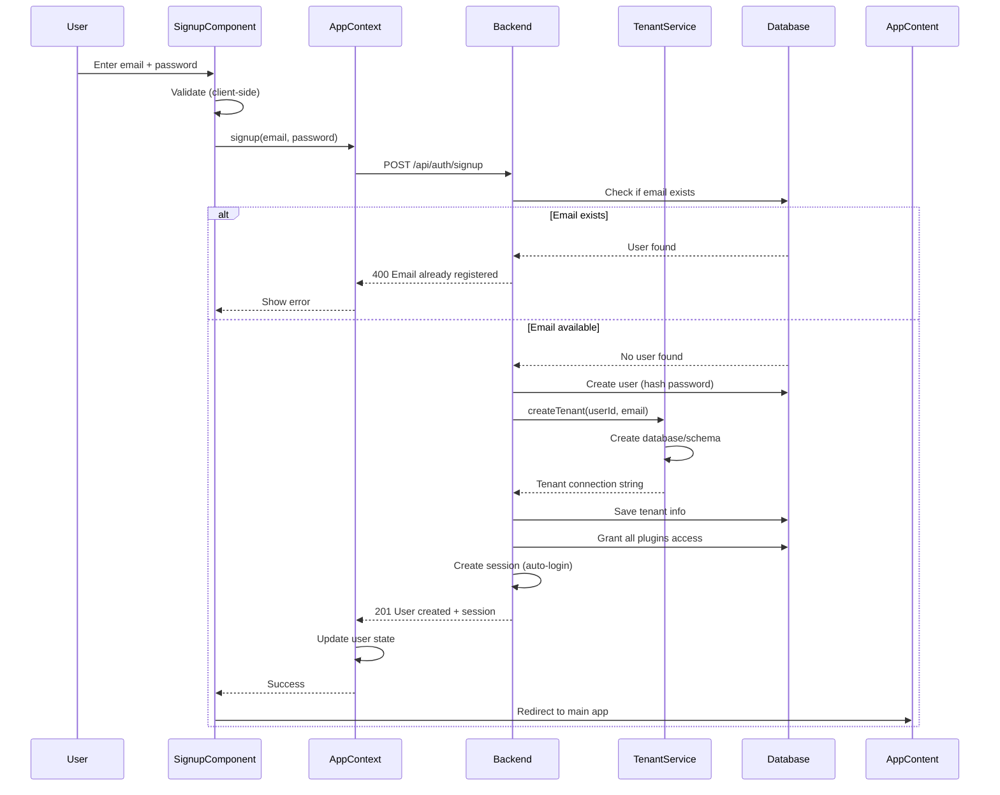

# Signup Functionality Implementation

## Översikt

Implementera komplett signup-funktionalitet där nya användare kan registrera sig, automatiskt få tillgång till alla plugins, och få en egen tenant-databas. UI ska ha toggle mellan Login och Signup på samma sida.

## Backend-ändringar

### 1. Uppdatera Signup Endpoint för Automatisk Plugin-access

**Fil**: `server/core/routes/auth.js`

- Ändra signup-logik för att automatiskt ge alla registrerade plugins
- Istället för hårdkodad lista `['contacts', 'notes']`, hämta plugins dynamiskt från `PLUGIN_REGISTRY` eller konfiguration
- Alternativ: Skapa en konfigurationsvariabel för default plugins i `config/services.js` eller hårdkoda alla registrerade plugins: `['contacts', 'notes', 'tasks', 'estimates', 'invoices', 'files']`

**Kodändring (rad 151)**:

```javascript
// Ersätt:
let selectedPlugins = ['contacts', 'notes'];

// Med:
// Alla registrerade plugins som default
let selectedPlugins = ['contacts', 'notes', 'tasks', 'estimates', 'invoices', 'files'];
```

### 2. Förbättra Validering och Felhantering

**Fil**: `server/core/routes/auth.js`

- Lägg till email-format validering (regex eller bibliotek)
- Förbättra password-requirements meddelanden
- Lägg till rate limiting för signup-endpoint (förhindra brute-force registreringar)
- Lägg till CSRF protection om signup ska vara publikt tillgänglig

## Frontend-ändringar

### 3. Skapa SignupComponent

**Ny fil**: `client/src/core/ui/SignupComponent.tsx`

- Skapa komponent liknande `LoginComponent.tsx`
- Form med fält:
  - Email (type="email", required)
  - Password (type="password", required, minLength 8)
  - Confirm Password (type="password", required, client-side validering)
- Använd samma design tokens och styling som LoginComponent
- Dark mode support
- Loading state vid signup
- Felhantering och visning av felmeddelanden
- Success state och auto-redirect efter signup

### 4. Uppdatera LoginComponent med Toggle

**Fil**: `client/src/core/ui/LoginComponent.tsx`

- Lägg till state för att växla mellan 'login' och 'signup' mode
- Lägg till knapp/länk för att växla till signup: "Don't have an account? Sign up"
- Visa antingen login-form eller signup-form baserat på state
- Eller: Kombinera till en AuthComponent som hanterar båda lägena

**Alternativ struktur**:

- Omfattande refaktoring: Skapa `AuthComponent.tsx` som hanterar både login och signup
- Behåll `LoginComponent.tsx` som wrapper för bakåtkompatibilitet
- Eller: Lägg till signup-mode direkt i LoginComponent med toggle

### 5. Lägg till Signup-funktion i AppContext

**Fil**: `client/src/core/api/AppContext.tsx`

- Lägg till `signup(email: string, password: string): Promise<boolean>` funktion i `api` objektet
- Funktion ska:
  - Anropa `/api/auth/signup` endpoint
  - Hantera success response (201)
  - Uppdatera user state automatiskt (eftersom signup auto-login)
  - Returnera true vid success, false vid failure
  - Hantera felmeddelanden (email already exists, password too short, etc.)

**Kod tillägg (rad 189)**:

```typescript
async signup(email: string, password: string) {
  // Signup doesn't need CSRF token (it's before authentication)
  return this.request('/auth/signup', {
    method: 'POST',
    body: JSON.stringify({ email, password }),
  });
},
```

- Uppdatera `AppContextType` interface för att inkludera signup-funktion om det behövs

### 6. Uppdatera App.tsx för att hantera Signup

**Fil**: `client/src/App.tsx`

- Om vi skapar separat `SignupComponent`: Lägg till conditional rendering för signup
- Om vi använder toggle i LoginComponent: Ingen ändring behövs (LoginComponent hanterar det internt)
- Se till att efter lyckad signup loggas användaren in automatiskt (hanteras redan i backend)

## Data Flow Diagram



## Implementation Details

### Plugin Access Management

**Backend**: `server/core/routes/auth.js` (rad 202-208)

När användare registrerar sig, ska alla plugins från `pluginRegistry.ts` ges automatiskt:

- contacts
- notes  
- tasks
- estimates
- invoices
- files

**Uppdatera kod** (rad 151):

```javascript
// Default plugins för nya användare - alla registrerade plugins
let selectedPlugins = ['contacts', 'notes', 'tasks', 'estimates', 'invoices', 'files'];
```

### Password Validation

**Frontend**: Client-side validering

- Minimum 8 tecken (matchar backend)
- Confirm password match
- Visa tydliga felmeddelanden

**Backend**: Redan implementerat (rad 134-136)

- Minimum 8 tecken kontroll

### Email Validation

**Frontend**: HTML5 `type="email"` + client-side regex

**Backend**: Enkel kontroll (kan förbättras med express-validator senare)

### Error Handling

**Frontend**:

- Visa backend-felmeddelanden tydligt
- Hantera network errors
- Visa loading state

**Backend**:

- Redan implementerat för de flesta fall
- Kanske lägg till mer specifika felmeddelanden

## Testning Checklist

- [ ] Signup med ny email fungerar
- [ ] Signup med existerande email visar fel
- [ ] Password < 8 tecken visar fel
- [ ] Confirm password mismatch visar fel
- [ ] Nya användare får alla plugins automatiskt
- [ ] Tenant-databas skapas korrekt
- [ ] Auto-login fungerar efter signup
- [ ] Toggle mellan login/signup fungerar
- [ ] Dark mode fungerar för signup-form
- [ ] Responsive design fungerar
- [ ] Felhantering fungerar för alla edge cases

## Framtida Förbättringar (Out of Scope)

- Email confirmation (planeras för framtiden)
- Password strength meter
- Terms of service checkbox
- GDPR consent checkbox
- Social login (OAuth)
- Magic link signup
- Email verification before account activation

## Filer som ska ändras

1. `server/core/routes/auth.js` - Uppdatera default plugins
2. `client/src/core/ui/LoginComponent.tsx` - Lägg till signup toggle
3. `client/src/core/api/AppContext.tsx` - Lägg till signup API funktion
4. Ny fil: `client/src/core/ui/SignupComponent.tsx` (om separat komponent)

ELLER

4. Uppdatera: `client/src/core/ui/LoginComponent.tsx` (om samma komponent)

## Uppskattad Komplexitet

- Backend: Låg (endast ändring av default plugins)
- Frontend: Medel (ny komponent + toggle + API integration)
- Testing: Medel (många edge cases att testa)