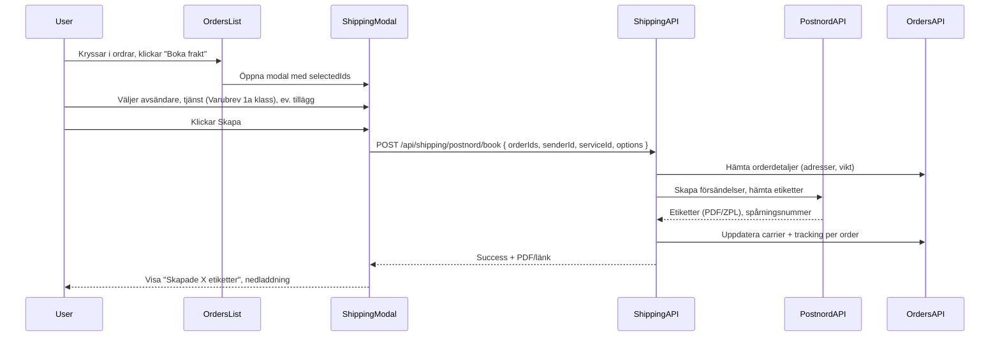

# Plan: Boka frakt hos Postnord för order

## Beslut nu (prioritet)

- Vi kör **Customer Plan** nu för att få igång din egen e-handel så snabbt som möjligt.
- **Partner Plan** hanteras som framtida utbyggnad för multi-tenant och fler företag.
- Nuvarande implementation ska därför optimeras för single-tenant-flöde, men utan att låsa bort framtida partnerstöd.

---

## Rekommendation: separat frakt-plugin

**Ja – det är bäst att bygga ett separat frakt-plugin** av följande skäl:

1. **Separation of concerns**: Orders-plugin hanterar orderdata, lista, status och import. Frakt-plugin äger carrier-integration (Postnord API), avsändaradresser och skapande av etiketter.
2. **Utbyggbarhet**: Senare kan man lägga till fler carriers (DHL, Bring, etc.) i samma plugin eller som undermoduler utan att belasta orders-plugin.
3. **Återanvändning**: Avsändare och Postnord-uppgifter är frakt-specifika; orders behöver inte känna till Postnord API.
4. **UI-flöde**: Orderslistan har redan kryssrutor och batch-knappar. En knapp "Boka frakt" som öppnar en modal (eller sida) från frakt-plugin med valda order-ID:n är en ren koppling.

Alternativet att lägga allt i orders-plugin gör den stor och blandar orderlistning med carrier-logik; det rekommenderas inte.

---

## Arkitektur (högnivå)

- **Orders-plugin**: Lägger bara till knappen "Boka frakt" i [OrdersList.tsx](client/src/plugins/orders/components/OrdersList.tsx) (vid `selectedIds.size > 0`). Vid klick öppnas frakt-pluginets modal med `selectedIds` (t.ex. via context eller en callback/event som frakt-plugin exponerar).
- **Frakt-plugin (nytt)**: Hanterar inställningar (Postnord-credentials, avsändaradresser), listan av tjänster (Varubrev 1a klass, Postpaket, etc.), modalen "Skapa fraktsedlar" (avsändare, tjänst, tilläggstjänster, tabell med Order #, rader, kollin, vikt, värde) och anrop till Postnord Booking API samt uppdatering av orders (carrier + tracking).

---

## 1. Nytt plugin: `shipping`

**Plats**: `plugins/shipping/` (backend), `client/src/plugins/shipping/` (frontend).

**Backend** (efter befintlig plugin-struktur, t.ex. [plugins/orders](plugins/orders)):

- **plugin.config.js**: `name: 'shipping'`, `routeBase: '/api/shipping'`, `requiredRole: 'user'`.
- **model.js**:  
  - Senders: CRUD för avsändaradresser (namn, adress, postnummer, stad, land, org.nr, etc.) per användare.  
  - Inställningar: Spara Postnord API-uppgifter (api-nyckel / integration id) per användare; lagra känsligt i credentials-fält eller separat secrets-tabell.
- **controller.js**:  
  - `getSenders(req, res)` – lista avsändare.  
  - `getPostnordServices(req, res)` – lista tjänster (Varubrev 1a klass, Postpaket, etc.); kan vara statisk lista för SE eller hämtad från Postnord om API finns.  
  - `bookPostnord(req, res)` – tar `orderIds`, `senderId`, `serviceId`, ev. `options` (tilläggstjänster). Hämtar order från orders-modellen/API (adress, vikt, värde), bygger payload till Postnord Booking API, skickar försändelser, får etiketter (PDF/ZPL) och spårningsnummer, sparar PDF (t.ex. till files eller returnerar som base64), anropar orders `updateStatus`/PATCH per order med `shippingCarrier: 'Postnord'` och `shippingTrackingNumber`, returnerar resultat (antal skapade, länkar till etiketter, fel per order).
- **routes.js**: Registrera `GET /senders`, `GET /postnord/services`, `POST /postnord/book` (med auth).

**Frontend**:

- **Context**: ShippingContext med senders, selectedOrderIds (sätts från utsida när modal öppnas), tjänster, loading, error.
- **Komponenter**:  
  - **ShippingBookModal**: Modal som i Sello-skärmen – rubrik "Skapa fraktsedlar", "Visa tidigare filer", Avsändare (dropdown + Ändra), Tilläggstjänster (checkboxes), Tjänst (dropdown, t.ex. Varubrev 1a klass), Pakettyp (dropdown), tabell med Order #, Rader, Kollin, Vikt, Värde för valda ordrar, knappar Avbryt / Skapa.  
  - Vid Skapa: anrop till `POST /api/shipping/postnord/book` med vald avsändare, tjänst, orderIds, options; vid lyckat svar – visa meddelande och erbjud nedladdning av etiketter; uppdatera orders (t.ex. genom att refresha listan eller via orders-API).
- **Inställningar**: En enkel inställningssida för Postnord (API-nyckel/URL om behövs) och hantering av avsändaradresser (CRUD). Kan ligga under samma "Frakt"-plugin i sidomenyn eller under Inställningar.

**Koppling orders → frakt**:

- I [OrdersList.tsx](client/src/plugins/orders/components/OrdersList.tsx): Lägg till knapp "Boka frakt" bredvid "Update X selected" när `selectedIds.size > 0`. Vid klick: öppna frakt-modalen med de valda order-ID:n. Det kräver att frakt-plugin exponerar ett sätt att öppna modalen med `orderIds` – t.ex. via en global context/event (e.g. `ShippingContext.openBookModal(Array.from(selectedIds))`) som OrdersList anropar (OrdersList behöver då antingen importera useShipping eller få en callback från en parent som har ShippingProvider). Enklast: ShippingProvider högst upp (eller under samma layout som Orders), OrdersList använder `useShipping().openBookModal(ids)` och knappen "Boka frakt" anropar det.
- Registrering av shipping-plugin i [pluginRegistry.ts](client/src/core/pluginRegistry.ts) (Provider, navigation till Frakt/Inställningar om du vill ha egen sidomeny för avsändare och Postnord-inställningar).

---

## 2. Postnord Booking API (Customer Plan först)

- Postnord har en **Booking API** för att skapa försändelser och hämta etiketter (ZPL/PDF). Kräver B2B-avtal och API-uppgifter (se t.ex. [PostNord Boknings-API](https://portal.postnord.com/se/sv/resurser/integrationer/api/boknings-api)).
- I denna fas utgår vi från att du redan har **Customer Plan** och konfigurerar credentials i shipping-inställningar för din egen butik. Controller använder dem vid `bookPostnord`.
- Exakt endpoint och payload följer Postnords aktuella dokumentation (create order, get label), utan fallback-gissningar.
- Tjänster som "Varubrev 1a klass" mappas till Postnords serviceId/code; antingen statisk lista (SE) eller hämtning från API om tillgängligt.

---

## 3. Datamodell / orders

- Befintliga fält i [orders](plugins/orders/model.js): `shipping_carrier`, `shipping_tracking_number` – räcker för att spara "Postnord" och spårningsnummer efter lyckad bokning.
- Ingen schemaändring i orders behövs om du bara uppdaterar carrier + tracking via befintlig PATCH/update-status.

---

## 4. Implementeringsordning (förslag)

1. **Plugin-struktur**: Skapa `plugins/shipping` (model, controller, routes, plugin.config) och `client/src/plugins/shipping` (context, ShippingBookModal, inställningsformulär). Registrera plugin på server (PluginLoader) och i client pluginRegistry.
2. **Avsändare och inställningar**: Tabell/CRUD för avsändare, lagring av Postnord-credentials, enkel UI för att hantera avsändare och API-nyckel.
3. **Modalen "Skapa fraktsedlar"**: Layout enligt Sello (avsändare, tjänst, tilläggstjänster, tabell med ordrar), hämta orderdata för valda ID:n (order #, rader, vikt, värde – vikt kan vara default om saknas).
4. **POST /api/shipping/postnord/book**: Hämta order från DB, bygg Postnord-payload, anropa Postnord API, spara/returnera etiketter, uppdatera orders med carrier + tracking.
5. **OrdersList-knapp**: "Boka frakt" som öppnar ShippingBookModal med `selectedIds`, och koppling mellan Orders och Shipping (context/event).

---

## 5. Öppna frågor

- **Postnord-avtal**: Bekräftat för nuvarande spår: Customer Plan för egen e-handel.
- **Partner-spår senare**: Vid framtida multi-tenant, verifiera partnerkrav och credential-modell per tenant innan utrullning till flera företag.
- **Vikt per order**: Orders har idag ingen explicit "vikt"-kolumn; vikt kan sättas som standard (t.ex. 0,5 kg) eller beräknas från orderrader om du senare lägger till vikt per rad. Tabellen i modalen kan visa "Vikt" med ett redigerbart fält per order om du vill.
- **"Visa tidigare filer"**: Om du vill ha historik över skapade etiketter behöver frakt-plugin spara skapade försändelser (t.ex. datum, orderIds, fil-URL eller fil-id) och en enkel lista/sida för att ladda ner tidigare etiketter; kan tas som steg 2 efter första versionen.

Om du bekräftar denna plan kan nästa steg vara att implementera plugin-strukturen och modalen (steg 1–3) först, sedan koppla till Postnord API när uppgifter finns (steg 4).