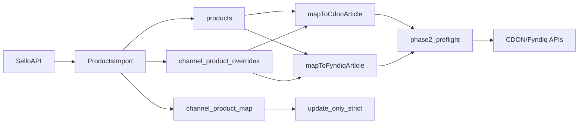

> **ARKIVERAD:** Denna fil är arkiverad och kan användas som referens i sista hand. Den ska inte gälla som aktuellt dokument.

# Products Migration – Handover Plan

## 1) Målbild och icke-förhandlingsbara regler

- **Strikt policy**: inga fallbacks/workarounds i affärslogik; explicit data eller tydligt fel.
- **Pris**: per instans/marknad är source of truth; `0/null` från Sello behandlas som saknat.
- **Kategori**:
  - CDON/Fyndiq kräver explicit kategori för aktiva mål.
  - Woo får ha instansspecifik multi-kategori via override.
- **Aktiv/inaktiv**:
  - Inaktiv styr export-skip, inte databorttagning.
  - Data får inte "nollas bort" bara för att target är pausat.

Referensfiler:

- [plugins/products/controller.js](c:/Users/Fabio/Desktop/Homebase-V3.1/plugins/products/controller.js)
- [plugins/products/model.js](c:/Users/Fabio/Desktop/Homebase-V3.1/plugins/products/model.js)
- [plugins/cdon-products/controller.js](c:/Users/Fabio/Desktop/Homebase-V3.1/plugins/cdon-products/controller.js)
- [plugins/cdon-products/mapToCdonArticle.js](c:/Users/Fabio/Desktop/Homebase-V3.1/plugins/cdon-products/mapToCdonArticle.js)
- [plugins/fyndiq-products/controller.js](c:/Users/Fabio/Desktop/Homebase-V3.1/plugins/fyndiq-products/controller.js)
- [plugins/fyndiq-products/mapToFyndiqArticle.js](c:/Users/Fabio/Desktop/Homebase-V3.1/plugins/fyndiq-products/mapToFyndiqArticle.js)
- [plugins/woocommerce-products/controller.js](c:/Users/Fabio/Desktop/Homebase-V3.1/plugins/woocommerce-products/controller.js)
- [client/src/plugins/products/components/ProductForm.tsx](c:/Users/Fabio/Desktop/Homebase-V3.1/client/src/plugins/products/components/ProductForm.tsx)

## 2) Canonical datamodell (måste hållas stabil)

- **Product basdata**: `products` (`price_amount`, `categories`, `channel_specific`).
- **Per target**: `channel_product_overrides` (`active`, `price_amount`, `currency`, `vat_rate`, `category`).
- **Mapping**: `channel_product_map` styr vad som kan uppdateras i `update_only_strict`.
- **Kanaldata i product**: `channel_specific` används för channel-specifika attribut; kategori per marknad hålls i `markets`-struktur.

## 3) Nuvarande status (baseline)

- Phase 1 (`update_only_strict`) är stabil och verifierad på random-cykler.
- Phase 2 preflight finns och ger strukturerad felbild utan externa skrivningar.
- Kategoriincidenter har dokumenterade fixar + rollback-spår.

Referens:

- [docs/CHANGELOG.md](../CHANGELOG.md)
- [docs/Archive/Plan_products.md](Plan_products.md)
- [docs/Archive/Required_matrix_cdon_fyndiq_phase2.md](Required_matrix_cdon_fyndiq_phase2.md)

## 4) Nästa steg (ordning och acceptanskriterier)

### Steg A – Datakontrakt låsning (ingen ny funktionalitet)

- Lås en enda canonical shape för kategori per kanal/marknad.
- Säkerställ att ProductForm, import, preflight och export läser samma shape.
- Lägg till explicit invariants i kodkommentarer nära mapper/importpunkter.

**Godkänd när**:

- preflight för 20 random produkter: 0 oväntade valideringsfel.
- inga `category='0'` i overrides.
- inga läsningar från utfasade fält i UI/export.

### Steg B – Regressionstestpaket (måste in innan vidare skala)

- Bygg testfall för:
  - aktiv/inaktiv-target med bevarad kategori,
  - CDON: exakt en aktiv kategori,
  - Fyndiq: categories[] från aktiva marknader,
  - Woo: multi-kategori per instans.
- Lägg test för att stoppa återintroduktion av kategori-läckage mellan targets.

**Godkänd när**:

- testsvit täcker minst dessa scenarier och kör grönt lokalt/CI.

### Steg C – Phase 2 pilot (read-only först, sen begränsad write)

- Kör preflight i batch (20/100) och sammanställ felorsaker.
- Endast när preflight är grön: begränsad write-pilot på liten produktmängd.
- Därefter gradvis uppskalning.

**Godkänd när**:

- preflight och write-pilot har förväntad fördelning (`updated`, `expected_skip`, inga oväntade `validation_error/channel_error`).

## 5) Operativ runbook för ny agent

### Dag 1 – Läsordning (obligatorisk)

1. [docs/CHANGELOG.md](../CHANGELOG.md)
2. [docs/Archive/Plan_products.md](Plan_products.md)
3. [docs/Archive/Required_matrix_cdon_fyndiq_phase2.md](Required_matrix_cdon_fyndiq_phase2.md)
4. [plugins/products/controller.js](../../plugins/products/controller.js)
5. [plugins/cdon-products/mapToCdonArticle.js](../../plugins/cdon-products/mapToCdonArticle.js)
6. [plugins/fyndiq-products/mapToFyndiqArticle.js](../../plugins/fyndiq-products/mapToFyndiqArticle.js)
7. [client/src/plugins/products/components/ProductForm.tsx](../../client/src/plugins/products/components/ProductForm.tsx)

### Innan varje ändring

- Bekräfta vilken datakälla som är source of truth för just fältet (produkt, override, map).
- Skriv inte "temporär kompatibilitet"; välj en väg.
- Om oklarhet i API-kontrakt: stoppa och fråga.

### Efter varje ändring

- Kör preflight på ett litet sample.
- Verifiera datainvarians i DB (0/null-regler, aktiv/inaktiv-regler).
- Uppdatera changelog + plan med root cause, fix och rollback.

## 6) Riskregister + motåtgärder

- **Risk: kategori-läckage mellan kanaler**
  - Motåtgärd: test + strikt category source per kanal i mapper.
- **Risk: återintroducerad fallback i UI**
  - Motåtgärd: regelgranskning + explicit kodkommentar + test.
- **Risk: inaktiv target raderar metadata**
  - Motåtgärd: separera state (`active`) från datafält (category/price).
- **Risk: 0/null pris skickas ut**
  - Motåtgärd: strikt preflightvalidering och stop i export.

## 7) Revert-strategi (snabb och säker)

- Revertera i små, kända block med tydlig blast-radius:
  1. kategoriimport-kedja ([plugins/products/controller.js](c:/Users/Fabio/Desktop/Homebase-V3.1/plugins/products/controller.js))
  2. CDON mapper/validator ([plugins/cdon-products/mapToCdonArticle.js](c:/Users/Fabio/Desktop/Homebase-V3.1/plugins/cdon-products/mapToCdonArticle.js))
  3. Fyndiq mapper/validator ([plugins/fyndiq-products/mapToFyndiqArticle.js](c:/Users/Fabio/Desktop/Homebase-V3.1/plugins/fyndiq-products/mapToFyndiqArticle.js))
  4. UI-läsning i ProductForm ([client/src/plugins/products/components/ProductForm.tsx](c:/Users/Fabio/Desktop/Homebase-V3.1/client/src/plugins/products/components/ProductForm.tsx))
- Efter varje revert-block: kör preflight + kontroll av kategori/pris-invarians.

## 8) Definition of Done för "överlämnat och robust"

- Ny agent kan läsa dokumenten och köra preflight utan extra muntlig kontext.
- Alla kritiska flows har test/reproducerbar verifiering.
- Rollback-steg är dokumenterade per komponent.
- Changelog speglar både beteendeförändring och varför.
