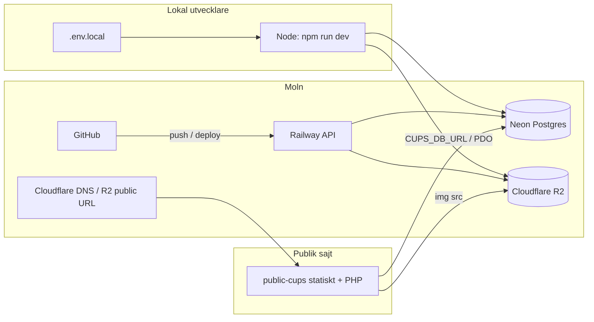

# Cupappen: vägar, miljöer och hjältebilder (R2)

Det här dokumentet beskriver **hur data och filer rör sig** i den typiska Cupappen-uppsättningen: lokal utveckling med Neon, deploy från GitHub till Railway, publik sajt mot PHP/Neon, samt **var** miljövariabler ska ligga så att hjältebilder hamnar i Cloudflare R2 i stället för på lokal disk.

## Översikt (en bild)



- **Lokal app** och **Railway** är två **separata** processer. De delar **inte** miljövariabler automatiskt.
- **Neon** kan användas från både lokal app och Railway (samma `DATABASE_URL`-mönster) — det styr **var raderna** ligger, inte var **filer** sparas.
- **R2** nås med S3-kompatibelt API; publika URL:er styrs av `R2_PUBLIC_URL` (t.ex. `https://pub-....r2.dev` eller egen custom domain under Cloudflare).

## 1. Lokal utveckling (`npm run dev`)

| Vad                                  | Vart går anropet?                                           | Miljö                                                  |
| ------------------------------------ | ----------------------------------------------------------- | ------------------------------------------------------ |
| API + admin-UI                       | `localhost` (t.ex. port 3001/3002 enligt er `package.json`) | Läser **`.env.local`** (och `.env`) — **inte** Railway |
| Databas                              | Ofta **samma Neon** som i produktion via `DATABASE_URL`     | I `.env.local`                                         |
| Filuppladdning (`/api/files/upload`) | Samma lokala Node-process                                   | I `.env.local`                                         |

**Viktigt:** För att uppladdningar från den lokala appen ska gå till **R2** måste **alla** fem `R2_*`-variabler finnas i **`.env.local`**. Annars används lokal disk och URL:er blir `/api/files/raw/...` (endast användbar inloggad, inte för `cuppappen.se`).

Servern laddar `.env` först och sedan **`.env.local` med `override: true`** så att lokala värden vinner över tomma variabler i shell eller i `.env`. Vid start loggas **`📦 File uploads: Cloudflare R2`** om R2 är aktivt, annars **`local disk …`**.

## 2. Produktion (GitHub → Railway)

| Steg           | Beskrivning                                                            |
| -------------- | ---------------------------------------------------------------------- |
| Push           | Kod pushas till den branch Railway är kopplad till                     |
| Build / deploy | Railway bygger och startar Node-servern                                |
| Miljö          | Variabler sätts under **Railway → tjänsten som kör API:t → Variables** |

**Viktigt:** Om ni har **flera** Railway-tjänster (t.ex. statisk frontend + backend) ska **`R2_*` ligga på den tjänst som kör Express och tar emot `POST /api/files/upload`**. En frontend-only-tjänst ser inte dessa variabler.

Deploy efter att R2-variabler ändrats behöver normalt **ny deployment** (Railway gör ofta det automatiskt när variabler sparas).

## 3. Publik Cupappen (`public-cups` / `cuppappen.se`)

| Komponent         | Roll                                                                                                                     |
| ----------------- | ------------------------------------------------------------------------------------------------------------------------ |
| Statiska filer    | `index.html`, `app.js`, `styles.css` (kan ligga på valfri host)                                                          |
| Cup-JSON          | `api/cups.php` (PDO mot Postgres/Neon) — fältet **`featured_image_url`** skickas ut som full URL när bilden ligger på R2 |
| Bilder i browsern | `` — måste vara **https och publikt**                                         |

PHP API:t läser **inte** Railway-miljön; det har egen DB-koppling (`CUPS_DB_URL` / motsvarande enligt `public-cups/api/pdo_env.php`). Själva **bild-URL:en** kommer från kolumnen `featured_image_url` som admin sparat — den ska vara den publika R2-URL:en.

## 4. Hjältebild: kodväg (admin → databas → publik sajt)

1. **CupForm** (`client/src/plugins/cups/components/CupForm.tsx`) anropar **`filesApi.uploadFiles`** → `POST /api/files/upload`.
2. **Files-plugin** (`plugins/files/filesService.js`) väljer lagring via **`StorageProviderRegistry.resolveForUpload`**.
3. Om alla **`R2_*`** är satta → **`R2StorageAdapter`** (`server/core/storage/adapters/R2StorageAdapter.js`) laddar upp till bucket under nyckeln `cups/<filnamn>` och returnerar **`url`** = `R2_PUBLIC_URL` + `/cups/...`.
4. Användaren sparar cupen → **`featured_image_url`** skrivs via cups-API till tenants Postgres.
5. **`public-cups`** hämtar cup-listan och renderar bild från **`featured_image_url`**.

## 5. Obligatoriska miljövariabler för R2 (samma namn överallt)

Sätt dessa **i den miljö där Node-servern kör** (`.env.local` respektive Railway):

| Variabel               | Exempel / anmärkning                                                                   |
| ---------------------- | -------------------------------------------------------------------------------------- |
| `R2_ACCOUNT_ID`        | Cloudflare-konto-ID (R2-sidan)                                                         |
| `R2_ACCESS_KEY_ID`     | Från **R2 → Manage R2 API Tokens**                                                     |
| `R2_SECRET_ACCESS_KEY` | Samma token                                                                            |
| `R2_BUCKET_NAME`       | Exakt bucket-namn i Cloudflare                                                         |
| `R2_PUBLIC_URL`        | Utan avslutande `/`, t.ex. `https://pub-xxxx.r2.dev` eller `https://images.example.se` |

**Bucket:** Under **Cloudflare → R2 → bucket → Settings** ska **public access** vara aktiverad för den URL ni använder i `R2_PUBLIC_URL` (r2.dev-subdomain eller custom domain).

**API-token:** Under **R2 → Manage R2 API Tokens** måste token ha **Object Read & Write** (inte endast Read). Om ni begränsar till en bucket ska det vara **samma namn** som `R2_BUCKET_NAME`. Fel behörighet ger ofta **Access Denied** vid uppladdning.

## 6. Migration?

**Ingen särskild migration krävs för R2.** Kolumnen **`featured_image_url`** finns redan i `cups`. Att byta från lokal `/api/files/raw/...` till R2 är en **om-upload + spara** i admin (ny URL i databasen).

## 7. Felsökning (snabb)

### Inga cuper på cupappen.se (tom lista eller “Laddar…” / fel)

1. **Kolla API direkt** (ska vara JSON, inte HTML):

   ```bash
   curl -sS https://www.cupappen.se/api/health.php
   curl -sS https://www.cupappen.se/api/cups.php | head -c 200
   ```

   - `{"status":"ok"}` → DB OK.
   - `{"status":"unhealthy"}` eller HTTP 500 `Failed to fetch cups` → **`CUPS_DB_URL` saknas/fel** på Cupappen Railway, **eller** PHP kan inte ladda `pdo_pgsql` (deploy-logg: `libpq.so.5: No such file` → rebuild med fixad `public-cups/Dockerfile` som behåller `postgresql-libs`).
   - HTML-sida istället för JSON på `https://cupappen.se/api/cups.php` → Cloudflare redirectar apex `/api/*` till startsidan; använd **www** eller fixa redirect (behåll path `/api/...`).

2. **Sätt `CUPS_DB_URL`** på Cupappen Railway till **samma tenant-Postgres** där Homebase cups-plugin sparar rader (`tenants.neon_connection_string` för den tenant som äger cup-databasen). Det är **inte** Neon main (`DATABASE_URL` på Homebase).

3. Efter variabeländring: **Redeploy** Cupappen. Valfritt: sätt `CUPS_DEBUG_ERRORS=1` tillfälligt för feltext i API-svar.

4. Om API returnerar `"cups":[]` men admin har cuper: kontrollera `visible = true` och `deleted_at IS NULL` i tenant-DB; kör ev. import/cron igen från Homebase.

| Symtom                                                                | Trolig orsak                                                                                                                     |
| --------------------------------------------------------------------- | -------------------------------------------------------------------------------------------------------------------------------- |
| URL i admin är `/api/files/raw/...`                                   | `R2_*` saknas eller är tomma **i den Node-process som tar emot upload**                                                          |
| Fungerar på Railway men inte lokalt                                   | Saknar `R2_*` i `.env.local`                                                                                                     |
| Fungerar lokalt men inte på Railway                                   | Variabler på fel Railway-tjänst eller ingen redeploy                                                                             |
| Objekt saknas i R2-bucket                                             | Upload gick till local adapter (se ovan) eller fel bucket-namn                                                                   |
| Bild visas inte på publik sajt men URL är `https://pub-...r2.dev/...` | Public access / fel `R2_PUBLIC_URL`; testa öppna URL direkt i webbläsaren                                                        |
| **Access Denied** vid upload (logg/API)                               | API-token saknar skrivrättighet eller är begränsad till annan bucket än `R2_BUCKET_NAME`; skapa ny token med Object Read & Write |

## Se även

- `.env.example` — mall med `R2_*`-kommentarer
- `public-cups/README.md` — publik sajt, API, SEO
- `docs/DEPLOYMENT_V2.md` — generell deploy (jämför R2-namn med `.env.example`; files-plugin använder **`R2_BUCKET_NAME`** och **`R2_PUBLIC_URL`**)
