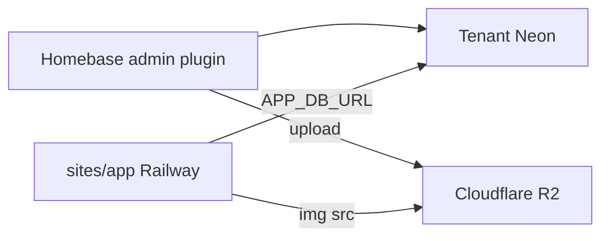

# Public app template — ops & checklist

**Syfte:** Starta nya Cupappen-liknande publika sajter från [`templates/public-app/`](../templates/public-app/) utan att duplicera PHP/Docker-misstag.

**Referens i prod:** [`public-cups/`](../public-cups/) + [`CUPPAPPEN_RAILWAY_OPERATIONS.md`](./CUPPAPPEN_RAILWAY_OPERATIONS.md).

**Design (UI):** [`PUBLIC_APP_DESIGN.md`](./PUBLIC_APP_DESIGN.md) — AppShell, tokens, komponenter. CSS: [`templates/public-app/styles.css`](../templates/public-app/styles.css).

**Scope:** Mall + dokumentation. Ingen ny Railway-tjänst skapas av mallen. `public-cups/` migreras **inte** in i `templates/` — den förblir kanonisk Cupappen-implementation.

**Begränsningar (verifierade):**

- Placeholder-tabell i mallen är `items` (inte en verklig Homebase-migration).
- Lokal listing i `app.js` pekar default mot Homebase Node `/api/public/appname`; prod använder same-origin `/api/items.php` — samma dual-path-mönster som Cupappen (medvetet; synka whitelist JS/PHP vid schemaändring).
- `APP_CACHE_TTL` kräver APCu i runtime; template-Dockerfile installerar **inte** APCu (cache är no-op tills tillagt).
- Formella QA-/Security-grindar för mallen är utanför denna docs-leverans om de inte körts separat.

---

## Arkitektur (per app)

| Del                | Var                                                      | Deploy                         |
| ------------------ | -------------------------------------------------------- | ------------------------------ |
| Admin / backoffice | `plugins/<name>/` + klient-plugin                        | Homebase Railway (Node)        |
| Publik sajt        | kopia av `templates/public-app/` → t.ex. `sites/<name>/` | **Egen** Railway-tjänst        |
| Data               | Tenant Neon (`cups` / din tabell)                        | `APP_DB_URL` på sajt-tjänsten  |
| Media              | R2 via Homebase files-plugin                             | URL:er i DB; sajten läser bara |

Sajten kör **PHP-FPM + Caddy**. Den läser tenant-DB direkt. Homebase `DATABASE_URL` (main) får **inte** användas som `APP_DB_URL`.



---

## Copy checklist

1. `cp -R templates/public-app sites/<name>` (eller `public-<name>/`).
2. Byt `APP_` → ditt prefix i PHP + `railway.env.example`.
3. Uppdatera SQL i `api/db_helpers.php` (mall tabell: `items`).
4. Justera detaljrutt i `docker/Caddyfile` + `router.php` om inte `/item/…`.
5. Ersätt copy/branding i `index.html`, `item.php`, `robots.txt`, `llms.txt`.
6. (Valfritt) Skapa `plugins/public-<name>/` efter `plugins/public-cups/`.
7. Lägg `PUBLIC_<NAME>_URL` + `PUBLIC_<NAME>_USER_ID` i `.env.example` och CORS i `server/index.ts`.
8. npm-script lokalt, t.ex.:

   ```json
   "dev:<name>": "sh -c 'set -a; [ -f .env.local ] && . ./.env.local; set +a; php -S 0.0.0.0:3010 -t sites/<name> sites/<name>/router.php'"
   ```

9. Ny Railway-tjänst: Root Directory = `sites/<name>`, Dockerfile, healthcheck `/api/health.php`.
10. Variabler: `APP_DB_URL`, `APP_PUBLIC_URL`, `APP_ALLOWED_ORIGINS`.
11. Efter deploy:

    ```bash
    curl -sS https://www.example.se/api/health.php
    curl -sS https://www.example.se/api/items.php | head -c 200
    curl -sS -o /dev/null -w "%{content_type}\n" https://www.example.se/sitemap.xml
    ```

---

## Env-kontrakt

| Variabel                | Tjänst      | Värde                                |
| ----------------------- | ----------- | ------------------------------------ |
| `APP_DB_URL`            | Publik sajt | Tenant Postgres connection string    |
| `APP_PUBLIC_URL`        | Publik sajt | `https://www…` (sitemap / canonical) |
| `APP_ALLOWED_ORIGINS`   | Publik sajt | CORS, kommaseparerad                 |
| `APP_CACHE_TTL`         | Publik sajt | Valfri, sekunder                     |
| `APP_DEBUG_ERRORS`      | Publik sajt | `1` endast vid felsökning            |
| `PUBLIC_<NAME>_URL`     | Homebase    | CORS + lokal listing mot Node        |
| `PUBLIC_<NAME>_USER_ID` | Homebase    | Tenant-ägarens `users.id`            |
| `R2_*`                  | Homebase    | Upload; saknas på sajt-tjänsten      |

---

## Vanliga fallgropar

| Misstag                            | Effekt                            | Åtgärd                                        |
| ---------------------------------- | --------------------------------- | --------------------------------------------- |
| `APP_DB_URL` = Homebase main       | Tom lista / fel schema            | Använd `tenants.neon_connection_string`       |
| Root Directory = repo-rot          | Fel build (Node istället för PHP) | Root = `sites/<name>`                         |
| `apk del postgresql-libs`          | `pdo_pgsql` saknar `libpq` → 503  | Behåll `postgresql-libs` i Dockerfile         |
| Apex redirectar `/api/*` till HTML | JS får HTML istället för JSON     | Använd www; fixa Cloudflare path              |
| Schema ändras bara i Homebase      | PHP SQL bryts                     | Synka `db_helpers.php` / whitelist i samma PR |

---

## Docker-regel (pdo_pgsql)

```dockerfile
apk add --no-cache postgresql-libs    # STANNAR kvar
apk add --virtual .php-build-deps postgresql-dev $PHPIZE_DEPS
docker-php-ext-install pdo_pgsql
apk del .php-build-deps              # Ta bara bort build-deps
```

---

## Se även

- [`templates/public-app/README.md`](../templates/public-app/README.md)
- [`PUBLIC_APP_DESIGN.md`](./PUBLIC_APP_DESIGN.md) — designregler, tokens, AppShell
- [`CUPPAPPEN_RAILWAY_OPERATIONS.md`](./CUPPAPPEN_RAILWAY_OPERATIONS.md)
- [`CUPPAPPEN_PATHS_AND_STORAGE.md`](./CUPPAPPEN_PATHS_AND_STORAGE.md)
- [`templates/README.md`](../templates/README.md) — plugin-mallar + denna public-app-mall
