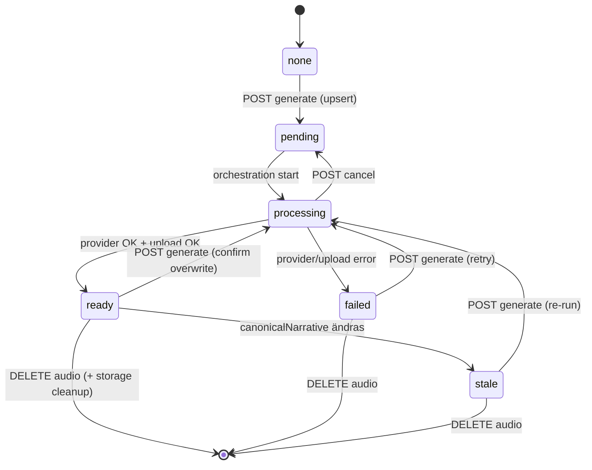

# AI-utvecklingsteam – Changelog

Versionshistorik för design- och specifikationsdokument under `docs/ai/`.

## Generate source audio + safe regenerate (2026-07-22)

Docs-sync efter QA Approved + TPM-accept av Security A1/A2; push `homebase-v3.8`.

- Production-panel: Generate source audio (källspråk).
- Keep previous blob until successful upload; cancel restores stale/ready via `preserveRestoreHint`.
- Overwrite warning + error popup with provider message.
- ADR: [`P-AUDIO_GENERATION_PREP.md`](adr/P-AUDIO_GENERATION_PREP.md) uppdaterad (decisions 9–12).
- Produktchangelog: [`docs/CHANGELOG.md`](../CHANGELOG.md).

**Inaktuellt (historisk Epic 6-notering):** “Regenerering raderar befintlig blob före ny upload” gäller **inte** presentation-scoped prep 2026-07-22 — se ADR decision 10.

## Total cost text + total cost audio (2026-07-22)

- UI: `totalCost` → “Total cost text”; ny `totalCostAudio`.
- `guide_audio.cost` (migration 109); ElevenLabs `calculateTtsCost`; kumulativ merge vid regenerate.
- Production list/get: `placeTotalEstimatedCost` + `placeTotalEstimatedAudioCost`.
- Produktchangelog: [`docs/CHANGELOG.md`](../CHANGELOG.md).

## Audio provider wiring — text-mönster (2026-07-22)

Wiring av audio mot samma ConfigResolver/Router/registry-kedja som text. Security Approved för wiring. **ElevenLabs** tillagd samma dag (se produktchangelog).

**ADR:** [`docs/ai/adr/P-AUDIO_GENERATION_PREP.md`](adr/P-AUDIO_GENERATION_PREP.md) — decision 5: generate använder `AudioProviderConfigResolver` + `guides-audio`.

- `AudioProviderConfigResolver` ↔ `TextProviderConfigResolver` (`guides-audio` / `GUIDES_AUDIO_PROVIDER`)
- Registry `create(key, options)`; orchestration skriver `provider_key`
- Produktchangelog: [`docs/CHANGELOG.md`](../CHANGELOG.md)

## Guides place total cost + breaking listProductionJobs (2026-07-22)

Tillägg efter audio-prep: platsnivå costs och brytande list-svar.

- `GET .../production-jobs` → `{ jobs, placeTotalEstimatedCost, placeTotalEstimatedAudioCost }` (tidigare array).
- Job-detail inkluderar samma fält.
- Text: completed items’ `provider_result.cost` (user-scoped). Audio: `guide_audio.cost` (place-scoped).
- Produktchangelog: [`docs/CHANGELOG.md`](../CHANGELOG.md).
- **Eskalerat:** brytande API — SA/TPM ska bekräfta kontraktet.

## P-AUDIO_GENERATION_PREP — Audiogenerering stub (2026-07-22)

Förberedelsefas: presentation-skopad audio. Security Approved för prep; utökad med ElevenLabs/cost/panel (se poster ovan). **Ej prod-release.**

**ADR:** [`docs/ai/adr/P-AUDIO_GENERATION_PREP.md`](adr/P-AUDIO_GENERATION_PREP.md)

### Docs-sync

- [`P-GUIDES_PLACE_PRESENTATION.md`](adr/P-GUIDES_PLACE_PRESENTATION.md) — punkt 7: audio in-scope via prep-ADR (inte längre OOS).
- [`CONTENT_PRODUCTION_PIPELINE_V2.md`](adr/CONTENT_PRODUCTION_PIPELINE_V2.md) — audio = manuell prep; batch fortfarande reserverad; `guide_audio` presentation-scoped i domäntabell.
- [`P-AI-SETTINGS_PROVIDER_CONFIGURATION.md`](adr/P-AI-SETTINGS_PROVIDER_CONFIGURATION.md) — `audioGenerationCapable`; routing-scope `guides-audio`.
- Produktchangelog: [`docs/CHANGELOG.md`](../CHANGELOG.md).

### Leverans (verifierad mot kod)

- Migration `107`; `plugins/guides/audio/*`; presentations-API audio-endpoints; noop via `GUIDES_AUDIO_PROVIDER`.
- AI Providers: capability + `guides-audio` allowlist/save-gate.
- Frontend: `GuideAudioSection` + AI Providers routing/capability UI.

### Säkerhet (Grind 5)

Security Expert: **godkänt** för prep. Inga Critical/High. Medium defense-in-depth inför TTS (mime-allowlist, R2 prefix, harden objectKey, storageRef-redaktion) — dokumenterade i ADR, kräver inte TPM-beslut för stub.

### Kända begränsningar

- Ingen riktig TTS; generate-path använder `AudioProviderConfigResolver` + noop (routing wired; `audioGenerationCapable` tom tills TTS-adapter).
- Ingen pipeline-fas `audio`; ingen publik playback.

---

## Fix: after_text checkpoint by phase name (2026-07-22)

Bugfix: `_shouldCheckpoint` under `after_text` nycklar på fasnamn `text_derivation` (inte `currentPhaseIndex === 0`). Translation-only jobb auto-completar; text-HITL oförändrad.

Dokumentation: [`docs/CHANGELOG.md`](../CHANGELOG.md) (ny post); P-CHAIN-rad + [`CONTENT_PRODUCTION_PIPELINE_V2.md`](adr/CONTENT_PRODUCTION_PIPELINE_V2.md) fasövergångar korrigerade.

QA + Security: godkända. Inga nya accepterade säkerhetsrisker.

---

## Guides create/produce polish + reliability docs sync (2026-07-22)

Produkt-/beteendeändringar i commit `8a81785` dokumenterade i [`docs/CHANGELOG.md`](../CHANGELOG.md). ADR-sync:

- [`P-GUIDES_PLACE_PRESENTATION.md`](adr/P-GUIDES_PLACE_PRESENTATION.md) — `POST …/presentations`; HITL → `approved`.
- [`CONTENT_PRODUCTION_PIPELINE_V2.md`](adr/CONTENT_PRODUCTION_PIPELINE_V2.md) — korrigerat att `applyProductionPresentationText` sätter `approved` (inte `pending_review`).

QA + Security: godkända för intervallet `783beb9..8a81785`. Inga nya accepterade säkerhetsrisker som kräver TPM-beslut.

---

## P-GUIDES_PLACE_PRESENTATION — One guide per place (2026-07-19)

Place-only Guides: `guide_presentations` (no stops/variants/audio); `full_guide` items use `presentation_id`; single `text_derivation` prompt. ADR: [`docs/ai/adr/P-GUIDES_PLACE_PRESENTATION.md`](adr/P-GUIDES_PLACE_PRESENTATION.md). Docs synced: content sources, P-TEXT, pipeline v2, UX v1/v2.

---

## P-AI-SETTINGS — Provider routing (2026-07-17)

Epic P-AI-SETTINGS — central AI-routing för domänplugins + multi-provider-katalog.

**ADR:** [`docs/ai/adr/P-AI-SETTINGS_PROVIDER_CONFIGURATION.md`](adr/P-AI-SETTINGS_PROVIDER_CONFIGURATION.md)

### Leverans

- `PROVIDER_CATALOG` utökad (9 providers) + `models[]` per typ; FE modell-select från katalog
- `server/migrations/101-ai-provider-routing.sql` — `ai_provider_routing` (global `*` + per-plugin scope); i `migrate:guides`
- `plugins/ai-providers/AIProviderRouter.js` — `resolve(req, { pluginKey, capability? })`
- `plugins/ai-providers/routablePlugins.js` — v1: `guides`
- Routing HTTP: `GET/PUT /routing`, `PUT/DELETE /routing/plugins/:pluginKey`
- Guides: `TextProviderConfigResolver` anropar router (provider-agnostisk)
- Frontend: Routing-vy; dropdown = `enabled && hasApiKey`; reload settings vid öppning
- Tester: router precedence, routing CRUD, Guides resolver (verifierade gröna i berörda suites)

### Bakåtkompatibilitet

Ingen migration av befintliga credentials. Saknas routing-rader → legacy `getPreferredEnabledProviderKey` + env-fallback.

### Säkerhet (Grind 5, 2026-07-17)

Security Expert: **godkänt**. A1 ärvd (ingen ny secret-lagring i routing). Rekommendationer R-ROUT-1 (orphan routing), R-ROUT-2 (fri `model`-text), R2/R3 oförändrade.

### Kända begränsningar (routing / katalog)

- Routing-assignment kräver **sparad** API-nyckel (env-only syns inte i routing-UI och avvisas av PUT).
- Text-adapter + connection test: endast `openai` (+ `noop`) i Guides v1.
- Endast `guides` i routable-plugins allowlist.

---

## Pivot 1 – Subagent Delegation (implementation) (2026-07-17)

Epic `wf-2026-07-17-pivot1-impl-01` — implementation av Task-baserad specialistaktivering.

**ADR:** [`docs/ai/adr/FRAMEWORK_PIVOT1_SUBAGENT_IMPL.md`](adr/FRAMEWORK_PIVOT1_SUBAGENT_IMPL.md)

### Slutsats

| Beslut                             | Motivering                                                                                                                                         |
| ---------------------------------- | -------------------------------------------------------------------------------------------------------------------------------------------------- |
| **Implementerat** (design godkänd) | DelegationPort i Runner; 7 subagent-filer; TPM orchestration protocol dokumenterat. DecisionPort, Handover `1.0`, Orchestration Model oförändrade. |

### Leverans

- `tools/workflow-runner/emissionPort.js` — `delegateHint`, `delegateSubagent` på Start/Continue/Rework
- `tools/workflow-runner/constants.js` — `DelegatorAcceptance` (acceptanstest SA→QA→Docs)
- `.cursor/agents/*.md` — 7 specialist-subagents (SSOT: `docs/ai/roles/*`)
- `npm run test:workflow-runner` — 25 tester gröna
- `docs/ai/cursor-implementation.md` — § TPM subagent orchestration
- `.cursor/rules/role-technical-project-manager.mdc` — § Subagent orchestration mode
- `docs/ai/workflow-runner.md` — additiv DelegationPort-notering (§9)
- Security Grind 5 godkänd (accepterad risk A1 dokumenterad)

### Utanför

- Live E2E Success Criterion (QA, efter TPM-protokoll i `.mdc`)
- Produktionsdeploy
- `DelegatorAcceptance` i orchestration-model SSOT
- Automatisk `@role`-växling (fortfarande PIVOT, ej verifierad)

---

## Pivot 1 – Subagent Role Mapping (2026-07-17)

Epic `wf-2026-07-17-pivot1-subagents-01` — spike: Framework-roller → Cursor Subagents.

**ADR:** [`docs/ai/adr/FRAMEWORK_PIVOT1_SUBAGENT_MAPPING.md`](adr/FRAMEWORK_PIVOT1_SUBAGENT_MAPPING.md)

### Slutsats

| Beslut                       | Motivering                                                                                                                                                         |
| ---------------------------- | ------------------------------------------------------------------------------------------------------------------------------------------------------------------ |
| **Go** (implementation epic) | Subagent-mappning möjlig utan omdesign av låsta SSOTs. TPM = parent orchestrator; 7 specialist-subagents i `.cursor/agents/`. Handover `1.0` + Runner oförändrade. |

### Leverans

- Komplett roll-till-subagent-mappning (8 roller; TPM som parent)
- Påverkan: oförändrat vs aktiveringslager
- Runner → Task-delegering design
- Handover-flöde mellan subagents
- Subagent-begränsningar
- QA-godkännande i ADR §10
- `cursor-implementation.md` — Pivot 1-sektion

### Utanför

- `.cursor/agents/*.md`, `emissionPort.js`, hooks
- Ändringar i Handover Contract, Orchestration Model, Engine, Runner DecisionPort
- Live Task-verifiering (hör till implementation epic)

---

## Automation Feasibility Assessment (2026-07-17)

Epic `wf-2026-07-17-feasibility-01` — utredning av full autonomi med automatisk `@role`-aktivering på Cursor.

**ADR:** [`docs/ai/adr/FRAMEWORK_AUTOMATION_FEASIBILITY.md`](adr/FRAMEWORK_AUTOMATION_FEASIBILITY.md)

### Slutsats

| Beslut                         | Motivering                                                                                                                                                                                                                                   |
| ------------------------------ | -------------------------------------------------------------------------------------------------------------------------------------------------------------------------------------------------------------------------------------------- |
| **PIVOT** (inte Go, inte Stop) | Ingen verifierad officiell mekanism för programmatisk aktivering av `.cursor/rules/role-*.mdc` utan manuell `@role`. Framework v2 engine/Runner förblir giltig; aktiveringslagret måste bytas (subagents, SDK, eller förbättrad manuell UX). |

### Leverans

- Technical Feasibility Report (6 frågor) — ADR §1
- Risk Assessment — ADR §2
- Architecture Impact Analysis — ADR §3
- Rekommendation Go/Pivot/Stop — ADR §4
- QA-godkännande — ADR §6
- `docs/ai/cursor-implementation.md` — hänvisning till ADR

### Utanför

- Implementation av hooks/subagent/SDK-orkestrering
- Ändring av Handover Contract, Orchestration Model, Workflow Engine, Workflow Runner SSOT
- Automatisk `@role`-aktiveringsepic (blockerad tills ny arkitektur spike:ats och godkänts)

---

## v2.4.1 – Workflow Runner (implementation) (2026-07-16)

Runtime för Workflow Runner enligt låst SSOT v2.4. **Inga** ändringar av Stage Gates, Handover `1.0` eller Orchestration Model. Rollaktivering förblir manuell.

**ADR:** [`docs/ai/adr/FRAMEWORK_WORKFLOW_RUNNER_IMPL.md`](adr/FRAMEWORK_WORKFLOW_RUNNER_IMPL.md)

### Leverans

- `tools/workflow-runner/` — Node.js bibliotek + CLI (`start`, `handover`, `resume`, `show`, `cancel`)
- Persistens: `.workflow-runner/instances/<InstanceId>.json` (gitignorerad)
- Tester: `npm run test:workflow-runner` (22 tester)
- `docs/ai/cursor-implementation.md` — Runner-wiring dokumenterad

### Utanför

- Automatisk Cursor agent-/regelaktivering
- Cursor hooks/skills som DecisionPort
- Produktionsdeploy

---

## v2.4 – Workflow Runner (spec) (2026-07-16)

Definierar **Workflow Runner** som automationslager ovanpå låst Workflow Engine: persistens av Workflow Instance, parse av Handover v1.0, deterministisk Orchestration Model §5, emit av Start/Continue/Rework/Pause/Resume/Complete. **Ingen** runtime-implementation och **ingen** automatisk rollaktivering i denna version. Stage Gates, rollansvar och Handover-schema `1.0` oförändrade.

**ADR:** [`docs/ai/adr/FRAMEWORK_WORKFLOW_RUNNER.md`](adr/FRAMEWORK_WORKFLOW_RUNNER.md)

### Dokumentation

- `docs/ai/workflow-runner.md` – **ny** SSOT: lagerplacering, FR/NFR, instance/ports, runtime-algoritm, emission, out-of-scope.
- `docs/ai/workflow-engine.md` – Runner i lager tabell; §12 pekar på Runner-SSOT.
- `docs/ai/orchestration-model.md` / `handover-contract.md` / `cursor-implementation.md` – additiva hänvisningar.
- `docs/ai/roles/technical-project-manager.md` + `role-technical-project-manager.mdc` – hänvisning till Runner (manuell aktivering kvar).

### Låsta beslut (Grind 1)

- **D1:** Spec-only i denna epic; implementation = separat uppdrag efter godkännande.
- **D2:** Runner = endast engine-lager; rollaktivering (`@role` / Cursor) förblir manuell.

### Utanför denna version

- Cursor hooks/skills/subagents eller annan Runner-runtime.
- Automatisk agent-/regelaktivering.
- Val av persistensprodukt eller extern orkestrator.
- Ändring av Stage Gate-tabell, Handover `1.0` eller övriga rollers Output Contracts.

---

## AI Provider Settings – Provider Management UI (2026-07-17)

**Status:** Provider Management UI implementerad (lista, visa, lägg till, redigera, ta bort). UI-justeringar efter QA (detaljvy, panelheader, fullbreddsformulär) verifierade. QA + Security godkända i samma epic. **Ej commit/deployad.**

**ADR:** [`docs/ai/adr/P-AI-SETTINGS_PROVIDER_CONFIGURATION.md`](adr/P-AI-SETTINGS_PROVIDER_CONFIGURATION.md) (uppdaterad)

### Leverans

| Leverans                          | Beskrivning                                                                                                                    |
| --------------------------------- | ------------------------------------------------------------------------------------------------------------------------------ |
| **Provider-lista**                | `AIProvidersList` — ingest-mönster: stat-kort, sök, grid/list, tabell                                                          |
| **Detaljvy**                      | `AIProviderView` — `DetailLayout`, snabbåtgärder (redigera, ta bort, testa)                                                    |
| **Formulär**                      | `AIProvidersSettingsForm` — skapa/redigera; contacts-lik layout med informationssidofält i edit                                |
| **Panel CRUD**                    | `panelMode` create / edit / view; header Edit/Close/Update via shell                                                           |
| **GET /catalog**                  | Tillgängliga provider-typer                                                                                                    |
| **DELETE /settings/:providerKey** | Hard delete tenant-scoped konfiguration                                                                                        |
| **GET /settings**                 | Returnerar endast konfigurerade providers (DB-rader)                                                                           |
| **Core-integration**              | `slugField: providerKey`, `IRREGULAR_CAP` → `AIProvider`, `findCurrentItemForOpenPlugin`, `DetailLayout` enkolumn utan sidebar |

**Tester:** `plugins/ai-providers` (19) + `providerFormHelpers` (4) = **23** gröna (verifierat 2026-07-17).

---

## AI Provider Settings – P-AI-SETTINGS (backend + frontend 2026-07-16)

**Status:** Backend + frontend implementerade. Plattformsgeneralisering (katalog, connection-test-registry, tunn Guides-resolver, datadriven FE) QA + Security godkända 2026-07-16. Dokumentation synkad. **Ej commit/deployad** (väntar explicit begäran). Accepterad säkerhetsrisk A1 väntar formellt TPM-godkännande.

Grindordning (generalisering): TPM → Arkitekt → Backend → Frontend → QA → Security → Dokumentation → TPM-avslut.

**ADR:** [`docs/ai/adr/P-AI-SETTINGS_PROVIDER_CONFIGURATION.md`](adr/P-AI-SETTINGS_PROVIDER_CONFIGURATION.md)

### Omfattning (levererat)

| Leverans                        | Beskrivning                                                              |
| ------------------------------- | ------------------------------------------------------------------------ |
| **Plugin `ai-providers` (API)** | Settings API under `/api/ai-providers`                                   |
| **Migration 100**               | `ai_provider_settings` (tenant-DB); i `migrate:guides`                   |
| **PROVIDER_CATALOG**            | Datadrivna defaults + env-metadata (v1: `openai`)                        |
| **Config-ägande**               | `resolveRuntimeConfig` / `getPreferredEnabledProviderKey` i AI Providers |
| **TextProviderConfigResolver**  | Tunn konsument (ingen OpenAI-gren); DB → env → `noop`                    |
| **ConnectionTestRegistry**      | Controllern testar via kontrakt; ingen adapter-import i `ai-providers`   |
| **Orchestration wiring**        | Async provider-key/options via resolver                                  |
| **Partiell PUT**                | Utelämnade fält behåller befintliga värden                               |
| **Frontend-plugin**             | Tools → AI Providers; `providers.map` + i18n per `providerKey`           |

**Ej inkluderat:** Fler providers, app-level encryption, Railway-deploy, åtgärd av R2/R3.

### API

| Metod | Path                                           | Kommentar                           |
| ----- | ---------------------------------------------- | ----------------------------------- |
| GET   | `/api/ai-providers/settings`                   | Lista providers (maskerad `apiKey`) |
| PUT   | `/api/ai-providers/settings/:providerKey`      | Spara (partiell merge; CSRF)        |
| POST  | `/api/ai-providers/settings/:providerKey/test` | Anslutningstest via registry (CSRF) |

Auth: session + `requirePlugin('ai-providers')`. HTTP-former oförändrade av generaliseringen.

### Backend-filer (huvudsakliga)

| Fil                                                            | Roll                                            |
| -------------------------------------------------------------- | ----------------------------------------------- |
| `server/migrations/100-ai-provider-settings.sql`               | Tabell + index                                  |
| `scripts/run-guides-migration.js`                              | Inkluderar migration 100                        |
| `plugins/ai-providers/providerCatalog.js`                      | Katalog                                         |
| `plugins/ai-providers/ConnectionTestRegistry.js`               | Test-registry                                   |
| `plugins/ai-providers/`                                        | model, controller, routes, plugin.config, index |
| `plugins/guides/providers/text/TextProviderConfigResolver.js`  | Tunn resolve-konsument                          |
| `plugins/guides/providers/text/registerDefaultProviders.js`    | Dubbelregistrering text + connection test       |
| `plugins/guides/production/ProductionOrchestrationService.js`  | Använder resolver                               |
| `plugins/guides/providers/text/adapters/OpenAITextProvider.js` | Options + `testConnection`                      |

### Frontend-filer (huvudsakliga)

| Fil                                          | Roll                                                                                                                   |
| -------------------------------------------- | ---------------------------------------------------------------------------------------------------------------------- |
| `client/src/plugins/ai-providers/`           | types, api, context, hook, View, SettingsForm, form helpers                                                            |
| `client/src/core/pluginRegistry.ts`          | Nav Tools; List/Form/View = `AIProvidersList` / `AIProvidersSettingsForm` / `AIProviderView`; `slugField: providerKey` |
| `client/src/core/routing/routeMap.ts`        | `/ai-providers`                                                                                                        |
| `client/src/i18n/locales/en.json`, `sv.json` | Nav + `aiProviders` / `providers.<key>.*`                                                                              |

### Env (fallback — oförändrade namn)

| Variabel                                                       | Roll efter P-AI-SETTINGS                         |
| -------------------------------------------------------------- | ------------------------------------------------ |
| `GUIDES_TEXT_PROVIDER`                                         | Fallback provider-key om ingen enabled DB-config |
| `OPENAI_API_KEY`                                               | Fallback-nyckel (katalogmetadata)                |
| `GUIDES_TEXT_OPENAI_MODEL`                                     | Fallback-modell (katalogmetadata)                |
| `GUIDES_TEXT_OPENAI_TIMEOUT_MS` / `GUIDES_TEXT_RATE_LIMIT_RPM` | Oförändrade (adapter)                            |

Enabled DB-config **vinner** över env. Föredragen konfiguration: **Tools → AI Providers**.

### Tester

Relevanta suiter (QA 2026-07-16, generalisering): `plugins/ai-providers`, `text-provider-config-resolver`, `openai-text-provider`, `production-orchestration`, `client/.../providerFormHelpers` — **51 tester** gröna i den körningen. TypeScript (`tsc --noEmit`) grönt.

### Säkerhet (godkänd 2026-07-16; omgranskning efter generalisering)

| ID  | Risk                               | Beslut                                                      |
| --- | ---------------------------------- | ----------------------------------------------------------- |
| A1  | Klartext API-nyckel i tenant-DB    | Accepterad (parity mail/pulses) — **TPM-godkännande krävs** |
| R2  | Provider-feltext i test-svar (500) | Rekommendation (icke-blockerande)                           |
| R3  | Ingen dedikerad rate limit på test | Rekommendation (icke-blockerande)                           |

### Kända begränsningar

- Endast provider `openai` i katalog/UI v1.
- Plugin `ai-providers` måste aktiveras per tenant; logga ut/in efteråt.
- Migration 100 måste finnas i tenant-DB innan save/load fungerar.
- Env-fallback kvar för bakåtkompatibilitet (P-TEXT).
- Connection test kräver att Guides registrerat factory i `ConnectionTestRegistry`.

### Operativt (lokal, 2026-07-16)

- Migration 100 applicerad på lokala `tenant_*`-scheman och Neon-tenanter för admin/user@.
- Plugin aktiverat för `admin@homebase.se` och `user@homebase.se`.

### Nästa steg

1. TPM: formellt godkänn A1 + epic-status.
2. Valfritt: FE QA/Security.
3. Commit/deploy endast vid explicit användarbeslut; därefter **P-TRANS**.

---

## Content Production Pipeline – P-TEXT (backend slutförd 2026-07-14, Fas 2)

**Status:** Backend implementerad — QA, Security och Dokumentation godkända. **Ej deployad** (väntar commit/merge). Bygger på P-FRONTEND + P-REGEN-backend (lokal).

Grindordning: Lösningsarkitekt (ADR) → Backend → QA → Security → Dokumentation → TPM-avslut.

**ADR:** [`docs/ai/adr/P-TEXT_TEXT_PROVIDER.md`](adr/P-TEXT_TEXT_PROVIDER.md)

### Omfattning (levererat)

| Leverans                | Beskrivning                                                         |
| ----------------------- | ------------------------------------------------------------------- |
| **OpenAITextProvider**  | Första riktiga adapter (`openai`), utbytbar via registry            |
| **TextPromptLoader**    | Versionerade prompt-resurser i `prompts/` (P2)                      |
| **ProviderRateLimiter** | In-process token bucket + retry vid 429                             |
| **Env wiring**          | `GUIDES_TEXT_PROVIDER`, `OPENAI_API_KEY`, modell-config             |
| **providerResult**      | Full JSONB med `raw`, `usage`, `promptVersion` (P4)                 |
| **Retry i worker**      | `_processItem` hanterar `status: retry` → `pending` + `retry_after` |

**Principer:** P1 utbytbar adapter, P2 filbaserade prompts, P3 fingerprint-version, P4 rå output bevaras, P5 HITL oförändrat.

**Ej inkluderat:** Translation (P-TRANS), audio batch, per-tenant prompts, frontend-ändringar.

### Backend-filer (huvudsakliga)

| Fil                                                            | Roll                                                                       |
| -------------------------------------------------------------- | -------------------------------------------------------------------------- |
| `plugins/guides/providers/text/adapters/OpenAITextProvider.js` | OpenAI Chat Completions-adapter                                            |
| `plugins/guides/providers/text/TextPromptLoader.js`            | Laddar versionerade prompts                                                |
| `plugins/guides/providers/text/prompts/`                       | `manifest.json` + `text_derivation/{quick,normal,deep}/v1.*.md`            |
| `plugins/guides/providers/shared/ProviderRateLimiter.js`       | Token bucket per provider key                                              |
| `plugins/guides/providers/text/registerDefaultProviders.js`    | Registrerar `openai` factory (efter P-AI-SETTINGS: alltid, ej env-gated)   |
| `plugins/guides/production/ProductionOrchestrationService.js`  | Provider via resolver (P-AI-SETTINGS); retry-branch; full `providerResult` |

### Env (lokal / prod)

| Variabel                        | Default       | Beskrivning         |
| ------------------------------- | ------------- | ------------------- |
| `GUIDES_TEXT_PROVIDER`          | `noop`        | `noop` \| `openai`  |
| `OPENAI_API_KEY`                | —             | Krävs för `openai`  |
| `GUIDES_TEXT_OPENAI_MODEL`      | `gpt-4o-mini` | Modell              |
| `GUIDES_TEXT_OPENAI_TIMEOUT_MS` | `60000`       | Request-timeout     |
| `GUIDES_TEXT_RATE_LIMIT_RPM`    | `60`          | Proaktiv rate limit |

### Tester

`npm test -- --testPathPattern='plugins/guides/__tests__'` — **150 tester** gröna (guides-sviten, inkl. 16 P-TEXT-relaterade i `text-prompt-loader`, `provider-rate-limiter`, `openai-text-provider`, utökad `production-orchestration` och `fingerprint`).

`npm run check` — TypeScript grönt.

**Ej i CI:** manuell smoke med riktig `OPENAI_API_KEY` (kostnad + hemlighet). E2E noop-regression (`guides-production-e2e.js`) ej omkörd i P-TEXT-sprinten — rekommenderas före release.

### Säkerhet (godkänd 2026-07-14)

| ID       | Risk                                      | Beslut                                                                                        |
| -------- | ----------------------------------------- | --------------------------------------------------------------------------------------------- |
| S-TEXT-1 | API-nyckel i loggar/fel/DB                | Historisk (P-TEXT): env only. **Uppdaterad av P-AI-SETTINGS:** nyckel kan lagras i DB (se A1) |
| S-TEXT-2 | Prompt injection via `canonicalNarrative` | Accepterad — redaktörskriven input; system-prompt isolerar; HITL före writeback (ADR R3)      |
| S-TEXT-3 | Kostnads-/resursmissbruk (OpenAI)         | Delvis mitigerad — `ProviderRateLimiter` (60 RPM) + token-budgetar; full kostnadstak i P-BULK |
| S-TEXT-4 | Externa felmeddelanden till UI            | Accepterad — låg risk; autentiserad redaktör; sanering rekommenderad (P2)                     |
| S-TEXT-5 | XSS via AI-text/`errorMessage`            | Mitigerad — React text-noder (ärvd S1)                                                        |
| S-TEXT-6 | SSRF via provider-URL                     | Mitigerad — hårdkodad `OPENAI_CHAT_URL`                                                       |
| S-TEXT-7 | Tenant isolation                          | Mitigerad — `user_id`-filter i `ProductionJobModel` (ärvd S7)                                 |
| S-TEXT-8 | Global API-nyckel per deployment          | Delvis ersatt — P-AI-SETTINGS ger per-`user_id` DB-config; env kvar som fallback              |
| S-TEXT-9 | Multi-worker rate-limit bypass            | Accepterad — in-process limiter; delad limiter i P-BULK (ADR R6)                              |

Ärvda risker S6 (narrative-gate före start), S11 (`regenerate` utan endpoint-rate limit) — oförändrade; text-API-anrop begränsas av `ProviderRateLimiter`.

### Kända begränsningar

- Default utan enabled DB-config och utan env: `noop`.
- Translation/audio fortfarande noop/skipped.
- Ingen frontend-ändring i P-TEXT (review-UI läser `presentationText` som tidigare).
- Manuell smoke med riktig OpenAI-nyckel ej i CI.
- Runtime-konfiguration: se **P-AI-SETTINGS** (DB först, env fallback). `openai` är alltid registrerad som factory; saknad nyckel ger misslyckad generation, inte "not registered".

### Nästa epic

**P-AI-SETTINGS** (backend + frontend 2026-07-16) → därefter **P-TRANS**.

---

## Content Production Pipeline – P-FRONTEND (frontend MVP slutförd 2026-07-14, Fas 2)

**Status:** Frontend MVP implementerad — QA och Security godkända. **Ej commit/deployad** (väntar explicit användarbegäran). Backend P-ASYNC + P-CHAIN + P-REGEN krävs (lokal, ej deployad).

Grindordning: UI/UX (trimmat MVP) → Frontend → QA → Security → Dokumentation → TPM-avslut.

**ADR:** [`docs/ai/adr/CONTENT_PRODUCTION_PIPELINE_V2.md`](adr/CONTENT_PRODUCTION_PIPELINE_V2.md)  
**UX-spec:** [`docs/ai/design/GUIDES_CONTENT_PRODUCTION_UX_V2.md`](design/GUIDES_CONTENT_PRODUCTION_UX_V2.md) (MVP-delta: utan estimate, text-review only)

### Omfattning (MVP)

| Leverans             | Beskrivning                                                                    |
| -------------------- | ------------------------------------------------------------------------------ |
| **Produktionspanel** | Sidebar: start hel guide, aktiv status, avbryt, länk till review-kö            |
| **Fas-banner**       | Status, progress, fasindikator Text→Översättning, retry/cancel                 |
| **Start-dialog**     | Enkel start med valfri `force`; scoped start (stopp/variant)                   |
| **Review-kö**        | Textfas (`reviewPhase=text_derivation`): jämförelse, godkänn/avvisa/regenerera |
| **Fasövergång**      | _Fortsätt till översättning_ → `POST approve-phase`                            |
| **Poll**             | 3s vid `pending`/`planning`/`processing`/`awaiting_review`                     |
| **Jobbhistorik**     | Lista tidigare jobb i sidebar                                                  |
| **API-klient**       | Alla P-REGEN production-endpoints utom `bulk-approve` (ej i MVP-UI)            |

**Ej inkluderat:** pre-flight estimate (P-OBS), bulk-godkänn UI, translation/audio-review UI, P2/P5-paneler, PWA.

### Frontend-filer (huvudsakliga)

| Fil                                                                 | Roll                                        |
| ------------------------------------------------------------------- | ------------------------------------------- |
| `client/src/plugins/guides/hooks/useProductionJob.ts`               | State, poll, mutations, `hasActiveJob`-sync |
| `client/src/plugins/guides/api/guidesApi.ts`                        | Production API-metoder                      |
| `client/src/plugins/guides/types/guides.ts`                         | Production-typer                            |
| `client/src/plugins/guides/utils/productionJobHelpers.ts`           | Fas/review/poll-hjälpare                    |
| `client/src/plugins/guides/components/ProductionPhaseBanner.tsx`    | Fas-banner                                  |
| `client/src/plugins/guides/components/ProductionPhaseIndicator.tsx` | Fasindikator                                |
| `client/src/plugins/guides/components/GuideProductionPanel.tsx`     | Sidebar-panel                               |
| `client/src/plugins/guides/components/ProductionJobHistory.tsx`     | Jobbhistorik                                |
| `client/src/plugins/guides/components/StartProductionDialog.tsx`    | Start-dialog                                |
| `client/src/plugins/guides/components/GuideReviewQueue.tsx`         | Review-kö                                   |
| `client/src/plugins/guides/components/GuideReviewItem.tsx`          | Review-rad                                  |
| `client/src/plugins/guides/components/GuideView.tsx`                | Integration                                 |

### Poll och state (klientkontrakt)

- Efter `POST production-jobs`: förvänta `status: pending`, `items: []` — poll tills terminal eller `awaiting_review`.
- Vid `awaiting_review` + `reviewPhase=text_derivation`: visa review-kö.
- Default `checkpoint_mode=after_text`: översättning körs utan review-UI; banner visar `processing` → `completed`.
- `hasActiveJob` härleds från synkad jobblista (`upsertJobInList` + list-refresh vid terminal status).

### Tester

`npm test -- --testPathPattern=productionJobHelpers` — **7 tester** (fas/review/sync-logik).

`npm run check` — TypeScript grönt.

**E2E (2026-07-14):** `node scripts/guides-production-e2e.js` — **16 PASS** (checklista A–G). Worker pumpas via `scripts/run-production-worker-tick.js` när `GUIDES_PRODUCTION_WORKER_ENABLED=false`. Kräver `npm run dev:all`, `migrate:guides`, Puppeteer Chrome (`npm run puppeteer:install-chrome`).

### Säkerhet (godkänd 2026-07-14, inkl. E2E-fixar)

| ID      | Risk                                                   | Beslut                                            |
| ------- | ------------------------------------------------------ | ------------------------------------------------- |
| S1      | XSS via AI-text/errorMessage                           | Mitigerad — React text-noder                      |
| S2      | CSRF på mutations                                      | Mitigerad — `apiFetch` + backend `csrfProtection` |
| S3      | Oautentiserad åtkomst                                  | Mitigerad — plugin-gate + session                 |
| S4      | IDOR via path-ID:n                                     | Backend tenant-scope (ärvd)                       |
| S5      | Poll API-förstärkning                                  | Acceptabel — global rate limit                    |
| S-FIX-1 | `run-production-worker-tick.js` processar alla tenants | Accepterad — local dev only                       |
| S-FIX-3 | `_resumeStalledPlanningJobs` utan lås                  | Accepterad — single worker-process                |

Ärvda backend-risker S6 (narrative-gate före start — ej enforced), S7 (`user_id` på job-läsning) — oförändrade. Text-API rate limit levererad i **P-TEXT** (`ProviderRateLimiter`); gäller inte job-start/regenerate-endpoint.

### Kända begränsningar

- E2E-script finns men ej `npm run`-alias / CI ännu (~5 min körning).
- `bulk-approve` finns i API men ej i UI.
- Narrative-gate före start saknas i backend.

### Nästa epic

**P-TRANS** — translation provider adapter.

---

## Content Production Pipeline – P-TEXT (ADR — historisk planeringssektion)

**Status:** Ersatt av implementeringssektionen ovan. ADR godkänd 2026-07-14; backend levererad och grindad samma dag.

**ADR:** [`docs/ai/adr/P-TEXT_TEXT_PROVIDER.md`](adr/P-TEXT_TEXT_PROVIDER.md) — se även ADR-statusrad (backend implementerad).

---

## Content Production Pipeline – P-REGEN (backend slutförd 2026-07-14, Fas 2)

**Status:** Backend implementerad — QA och Security godkända. **Ej deployad** (väntar commit/merge). Per-item HITL i backend; review-kö-UI i **P-FRONTEND**.

Grindordning: Lösningsarkitekt (ADR v2 A3/A4) → Backend → QA → Security → Dokumentation → TPM-avslut.

**ADR:** [`docs/ai/adr/CONTENT_PRODUCTION_PIPELINE_V2.md`](adr/CONTENT_PRODUCTION_PIPELINE_V2.md) (A3, A4)  
**UX-spec:** [`docs/ai/design/GUIDES_CONTENT_PRODUCTION_UX_V2.md`](design/GUIDES_CONTENT_PRODUCTION_UX_V2.md)

### Omfattning

| Leverans                 | Beskrivning                                                                                         |
| ------------------------ | --------------------------------------------------------------------------------------------------- |
| **Per-item approve**     | `_approveSingleItem` → `applyProductionPresentationText` → `review_status=approved`                 |
| **Per-item reject**      | `review_status=rejected`; domän oförändrad                                                          |
| **Per-item regenerate**  | Gammalt → `superseded`; nytt item `pending` med `regenerateNonce` i fingerprint; job → `processing` |
| **Bulk-approve**         | `POST …/items/bulk-approve` — alla `pending_review` i `currentPhaseIndex`                           |
| **`approve-phase` gate** | Kräver terminal `review_status`; ingen implicit bulk-approve                                        |
| **`retryJob`**           | `failed` → `pending`; `resetFailedItemsInPhase`                                                     |
| **Fingerprint A4**       | `ingestRunId` (text), translation-fält; dedup per `user_id`                                         |
| **`languages` filter**   | `jobOptions.languages` filtrerar varianter i planering                                              |

**Ej inkluderat:** frontend (P-FRONTEND), rate limiting (P-TEXT), `estimate` (P-OBS), riktiga providers.

### Förutsättning

P-CHAIN levererad (migration **099**). Ingen ny migration.

### API (autentiserat, plugin-gate `guides`, CSRF på mutationer)

#### Per-item review (nya)

```
POST /api/guides/:placeId/production-jobs/:jobId/items/:itemId/approve
POST /api/guides/:placeId/production-jobs/:jobId/items/:itemId/reject
  Body: { reason?: string }   // max 5000 tecken
POST /api/guides/:placeId/production-jobs/:jobId/items/:itemId/regenerate
POST /api/guides/:placeId/production-jobs/:jobId/items/bulk-approve
POST /api/guides/:placeId/production-jobs/:jobId/retry
```

**Validering (gemensam):**

- `job.status === 'awaiting_review'` (item-actions) eller `failed` (`retry`)
- Item i `currentPhaseIndex`
- Item `status === 'completed'`
- `approve`/`reject`: `review_status === 'pending_review'` (eller null)
- `regenerate`: `review_status ∈ { pending_review, rejected }`

#### `approve-phase` (refaktorerad semantik)

Gate-only — kräver att alla completed items i fasen har `review_status ∈ { approved, rejected, superseded }`. Blockeras vid `failed` eller in-flight items.

Flöde med HITL (default `after_text`):

1. Worker fas 0 → `awaiting_review`
2. Redaktör: per-item `approve` / `reject` / `regenerate` (eller `bulk-approve`)
3. `POST approve-phase` → advance till fas 1 (endast `approved` targets planeras)
4. Worker fas 1 → auto-advance (`after_text`) → `completed`

#### Skapa jobb (utökad)

```
POST /api/guides/:placeId/production-jobs
Body: { …, languages?: string[] }
```

### Item `review_status` (HITL)

| Status           | Betydelse                                |
| ---------------- | ---------------------------------------- |
| `pending_review` | Väntar redaktörsbeslut (sätts av worker) |
| `approved`       | Godkänd; text applicerad på domän        |
| `rejected`       | Avvisad; domän oförändrad                |
| `superseded`     | Ersatt av regenerate-item                |

### Fingerprint (utökad)

**text_derivation:** `canonicalNarrative`, `ingestRunId`, `variantType`, `language`, `providerKey`, `providerVersion`

**translation:** `sourcePresentationText`, `sourceLanguage`, `targetLanguage`, `variantType`, `providerKey`, `providerVersion`

**regenerate:** `regenerateNonce` (itemId) i fingerprint — undviker dedup-kollision.

**Dedup:** `hasCompletedFingerprint` söker per `user_id` + `fingerprint` + `status=completed` (ignorerar `review_status`).

### Implementation (huvudfiler)

| Fil                                                           | Roll                                                                                                     |
| ------------------------------------------------------------- | -------------------------------------------------------------------------------------------------------- |
| `plugins/guides/production/ProductionOrchestrationService.js` | `approveItem`, `rejectItem`, `regenerateItem`, `bulkApproveItemsInPhase`, `retryJob`; gate-refaktorering |
| `plugins/guides/production/ProductionJobModel.js`             | `getJobItemById`, `resetFailedItemsInPhase`, tenant-scoped dedup                                         |
| `plugins/guides/production/fingerprint.js`                    | Utökad canonical input                                                                                   |
| `plugins/guides/routes.js` / `controller.js`                  | Nya endpoints                                                                                            |

### Tester

`npm test -- --testPathPattern="plugins/guides"` — **134 tester**.

P-REGEN: `production-orchestration.test.js` (+11), `fingerprint.test.js` (+3).

### Säkerhet (godkänd 2026-07-14)

| ID  | Risk                                                  | Beslut                                       |
| --- | ----------------------------------------------------- | -------------------------------------------- |
| S11 | `regenerate` utan rate limit                          | Accepterad — autentiserad redaktör; P-TEXT   |
| S12 | `bulk-approve` utan tak                               | Accepterad — samma trust-modell som approve  |
| S13 | Dedup ignorerar `review_status`                       | Accepterad — `force`/`regenerate` som escape |
| S14 | `getJobById`/`listJobItems` utan `user_id` på läsning | Accepterad — ärvd S2, tenant-pool            |
| S15 | `reject.reason` i events                              | Accepterad — events ej API-exponerade (S3)   |

**Åtgärdad:** S8 (bulk `approve-phase` utan per-item reject) — löst av per-item API.

Ärvda risker S1, S4, S7 från P-ASYNC/P-CHAIN kvarstår.

### Kända begränsningar

- Review-kö-UI levererades i **P-FRONTEND** (se egen sektion).
- Saknar full HITL-kedja-E2E utan mocks (QA F1).
- `_autoAdvancePhase` bulk-godkänner fortfarande vid `after_text` fas 1+ (avsiktligt).

### Frontend

**Levererat:** **P-FRONTEND** (text-review MVP). Se egen sektion.

---

## Content Production Pipeline – P-CHAIN (backend slutförd 2026-07-14, Fas 2)

**Status:** Backend implementerad — QA och Security godkända. **Ej deployad** (väntar commit/merge). Fas-kedja i backend; per-item HITL i **P-REGEN**; frontend i **P-FRONTEND**.

Grindordning: Lösningsarkitekt (ADR v2 A2) → Backend → QA → Security → Dokumentation → TPM-avslut.

**ADR:** [`docs/ai/adr/CONTENT_PRODUCTION_PIPELINE_V2.md`](adr/CONTENT_PRODUCTION_PIPELINE_V2.md) (A2)  
**UX-spec:** [`docs/ai/design/GUIDES_CONTENT_PRODUCTION_UX_V2.md`](design/GUIDES_CONTENT_PRODUCTION_UX_V2.md)

### Omfattning

| Leverans               | Beskrivning                                                                |
| ---------------------- | -------------------------------------------------------------------------- |
| **Fasvis planering**   | `_planJob` planerar endast `phases[currentPhaseIndex]` per worker-tick     |
| **Fasövergång**        | `approvePhase` — fasövergångsgate (semantik skärpt i P-REGEN)              |
| **Checkpoint**         | `checkpoint_mode`: `after_text` (default), `after_each`, `auto`            |
| **Target-filter**      | Fas N+1 planeras endast för varianter med `review_status=approved` i fas N |
| **Fas-scopad eval**    | `summarizeJobItems` / `countInFlightItems` filtrerar på `phase_index`      |
| **Cancel F1**          | `updateJobStatus(…, 'processing', { blockedFrom: ['cancelled'] })`         |
| **Deprecated approve** | `POST …/approve` → `approvePhase({ continue: true })`                      |

**Ej inkluderat vid P-CHAIN-leverans:** per-item HITL (P-REGEN), audio batch (P-AUDIO-BATCH), frontend, riktiga providers.

### Förutsättning

P-ASYNC levererad (migration **099**). Ingen ny migration i P-CHAIN.

### API (autentiserat, plugin-gate `guides`, CSRF på mutationer)

#### Skapa jobb (utökad)

```
POST /api/guides/:placeId/production-jobs
Body: {
  type: "full_guide" | "stop" | "variant",
  phases?: ("text_derivation" | "translation" | "audio")[],  // alias: steps
  checkpointMode?: "after_text" | "after_each" | "auto",
  stopId?, variantId?, force?
}
```

**Application defaults (P-CHAIN):** `phases: ["text_derivation", "translation"]`, `checkpointMode: "after_text"`.

**DB-kolumn default (migration 099):** `phases` default `["text_derivation"]` — application layer sätter nya defaults vid `createJob`.

#### Ny endpoint — godkänn fas

```
POST /api/guides/:placeId/production-jobs/:jobId/approve-phase
Body: { continue?: boolean }   // default true
```

**Validering:** `job.status === 'awaiting_review'`; blockeras om items i aktuell fas har `status=failed`.

**Beteende (vid P-CHAIN-leverans; ändrat i P-REGEN):**

1. ~~Bulk-godkänn~~ → Gate: kräver terminal `review_status` på alla completed items (se § P-REGEN).
2. Om sista fas eller `continue: false` → `job.status = completed`.
3. Annars → `currentPhaseIndex++`, `status = pending`, `queued_at = NOW()`.

#### Deprecated

| Metod | Path                               | Ersättning                             |
| ----- | ---------------------------------- | -------------------------------------- |
| POST  | `…/production-jobs/:jobId/approve` | `…/approve-phase` (loggar deprecation) |

### Checkpoint-beteende

`after_text` avgörs av **fasnamn** (`text_derivation`), inte fasindex. Translation-only (`phases: ['translation']`) under `after_text` → ingen HITL (auto-complete).

| `checkpointMode`       | När fas = `text_derivation` | När fas = `translation` (inkl. enda fas) |
| ---------------------- | --------------------------- | ---------------------------------------- |
| `after_text` (default) | `awaiting_review`           | Auto-advance / complete (ingen HITL)     |
| `after_each`           | `awaiting_review`           | `awaiting_review`                        |
| `auto`                 | Auto-advance                | Auto-advance                             |

### Fasflöde (default `after_text`, 2 faser — med P-REGEN HITL)

1. `POST production-jobs` → `pending`
2. Worker fas 0 → `awaiting_review` (`reviewPhase: text_derivation`)
3. Per-item `approve`/`reject`/`regenerate` (eller `bulk-approve`)
4. `POST approve-phase` → `pending` (fas 1)
5. Worker fas 1 → auto-advance → `completed`

Klient ska polla `GET …/:jobId` mellan steg.

### Implementation (huvudfiler)

| Fil                                                           | Roll                                                                 |
| ------------------------------------------------------------- | -------------------------------------------------------------------- |
| `plugins/guides/production/ProductionOrchestrationService.js` | `approvePhase`, fas-scopad planering/evaluering, `_autoAdvancePhase` |
| `plugins/guides/production/ProductionJobModel.js`             | `requeueJobForNextPhase`, fas-scopade queries, `CHECKPOINT_MODES`    |
| `plugins/guides/routes.js`                                    | `approve-phase` route, validering `phases`/`checkpointMode`          |
| `plugins/guides/controller.js`                                | `approveProductionJobPhase`                                          |

### Tester

`npm test -- --testPathPattern="plugins/guides"` — **123 tester**.

P-CHAIN: `production-orchestration.test.js` (fasövergångar, checkpoint, approve-phase, F1).

### Säkerhet (godkänd 2026-07-14)

| ID  | Risk                                           | Beslut                                       |
| --- | ---------------------------------------------- | -------------------------------------------- |
| S7  | `checkpointMode: auto` kringgår HITL           | Accepterad — dev/test; autentiserad redaktör |
| S8  | Bulk `approve-phase` utan per-item reject      | **Åtgärdad i P-REGEN** — per-item API + gate |
| S9  | `continue` med 0 godkända targets              | Accepterad — integritet, ej dataläckage      |
| S10 | `requeueJobForNextPhase` utan `user_id`-filter | Accepterad — tenant-pool-isolation           |

Ärvda risker S2, S4 från P-ASYNC kvarstår.

### Kända begränsningar

- Per-item HITL tillkom i **P-REGEN** (se egen sektion).
- Audio i `phases` → `skipped` (P-AUDIO-BATCH).
- `after_text` ger ingen HITL på translation-fas (avsiktligt enligt arkitekt).
- Saknar full kedje-E2E-test utan mocks (QA F1).

### Frontend

**Levererat:** **P-FRONTEND** (fas-banner, poll, text-review). Se egen sektion.

---

## Content Production Pipeline – P-ASYNC (backend slutförd 2026-07-13, Fas 2)

**Status:** Backend implementerad — QA och Security godkända. **Ej deployad** (väntar commit/merge). Async grund; fas-kedja i **P-CHAIN**; HITL i **P-REGEN**; frontend poll/review i **P-FRONTEND**.

Grindordning: Lösningsarkitekt (ADR v2) → Backend → QA → Security → Dokumentation → TPM-avslut.

**ADR:** [`docs/ai/adr/CONTENT_PRODUCTION_PIPELINE_V2.md`](adr/CONTENT_PRODUCTION_PIPELINE_V2.md)  
**UX-spec:** [`docs/ai/design/GUIDES_CONTENT_PRODUCTION_UX_V2.md`](design/GUIDES_CONTENT_PRODUCTION_UX_V2.md)

### Omfattning

| Leverans             | Beskrivning                                                                                                     |
| -------------------- | --------------------------------------------------------------------------------------------------------------- |
| **Async enqueue**    | `startJob` skapar jobb med `status: pending`, `queued_at`; returnerar tom `items[]`                             |
| **Worker**           | `WorkerService` itererar tenants, kör `runWorkerTick` per tenant-pool                                           |
| **Claim**            | `claimPendingJob` / `claimPendingItems` med `FOR UPDATE SKIP LOCKED` och `user_id`-scope                        |
| **Supervisor**       | `resetStuckItems` — items i `processing` längre än timeout → `pending` med `retry_count++`; över max → `failed` |
| **Cancel**           | `cancelActiveItemsForJob` stoppar `pending`/`processing`-items; worker hoppar över cancelled jobs               |
| **Terminal status**  | Alla items failed → job `failed`; minst ett reviewable → `awaiting_review`                                      |
| **Tenant-isolation** | `user_id` på `guide_production_job_items`; backfill från job                                                    |

**Ej inkluderat i P-ASYNC:** Multi-fas-kedja (**P-CHAIN**); per-item HITL (**P-REGEN**); riktiga providers, frontend kvarstår.

### Förutsättning

Migrationer **096–098** (v1 pipeline) + **099** (async schema) på alla tenants. `npm run migrate:guides` kör 090, 092–099 per tenant.

### Databas (tenant DB)

| Migration                           | Innehåll                                                                                                                                                                                                                                                                                                                                                 |
| ----------------------------------- | -------------------------------------------------------------------------------------------------------------------------------------------------------------------------------------------------------------------------------------------------------------------------------------------------------------------------------------------------------- |
| `099-guide-production-v2-async.sql` | `phases`, `current_phase_index`, `checkpoint_mode`, `priority`, `queued_at`, `worker_claimed_at`, `review_phase`, `job_options` på jobs; `user_id`, `phase_index`, `retry_count`, `retry_after`, `external_id`, `provider_version`, `review_status`, `reviewed_at`, `worker_claimed_at` på items; index för worker-kö; tabell `guide_production_workers` |

**Default `phases` (DB migration 099):** `["text_derivation"]`. **Application default efter P-CHAIN:** `["text_derivation", "translation"]` — se § P-CHAIN.

### API (autentiserat, plugin-gate `guides`, CSRF på mutationer)

#### Brytande beteende — `POST …/production-jobs`

| Aspekt              | v1 (synkron)                                   | P-ASYNC                                                    |
| ------------------- | ---------------------------------------------- | ---------------------------------------------------------- |
| Svarstid            | Blockerar tills planering + noop-körning klart | Omedelbart                                                 |
| `job.status` i svar | Ofta `awaiting_review` eller `completed`       | `pending`                                                  |
| `items` i svar      | Populerad lista                                | `[]` — skapas av worker                                    |
| Klientkrav          | Ingen poll                                     | Poll `GET …/:jobId` tills terminal eller `awaiting_review` |

#### Oförändrade endpoints (semantik delvis uppdaterad)

| Metod | Path                                                  | Notering                                                       |
| ----- | ----------------------------------------------------- | -------------------------------------------------------------- |
| POST  | `/api/guides/:placeId/production-jobs`                | Enqueue only                                                   |
| GET   | `/api/guides/:placeId/production-jobs`                | Lista jobb                                                     |
| GET   | `/api/guides/:placeId/production-jobs/:jobId`         | Poll-status + items                                            |
| POST  | `/api/guides/:placeId/production-jobs/:jobId/approve` | **Deprecated** — delegerar till `approve-phase` (se § P-CHAIN) |
| POST  | `/api/guides/:placeId/production-jobs/:jobId/cancel`  | Stoppar även aktiva items                                      |

**Jobbstatus (utökad):** `pending` → `planning` → `processing` → `awaiting_review` \| `completed` \| `failed` \| `cancelled`

**Item `review_status` (sätts av worker):** `pending_review` när provider klar — per-item API i **P-REGEN**.

### Konfiguration (miljövariabler)

| Variabel                              | Default                       | Beskrivning                               |
| ------------------------------------- | ----------------------------- | ----------------------------------------- |
| `GUIDES_PRODUCTION_WORKER_ENABLED`    | `true` (utom `NODE_ENV=test`) | Starta/stoppa in-process worker           |
| `GUIDES_PRODUCTION_WORKER_POLL_MS`    | `5000`                        | Bas-tick för in-process loop              |
| `GUIDES_PRODUCTION_WORKER_BATCH_SIZE` | `5`                           | Max items per tick                        |
| `GUIDES_PRODUCTION_ITEM_TIMEOUT_MIN`  | `10`                          | Supervisor timeout för stuck `processing` |
| `GUIDES_PRODUCTION_MAX_RETRIES`       | `5`                           | Max retry innan item → `failed`           |

**Per-tenant (UI, migration 113):** `GET/PUT /api/guides/production-settings` — `workerEnabled` (default **false**) + `pollIntervalMs` (5s/15s/30s/1m/5m). Process-env förblir nödstopp; tenant-settings styr om/hur ofta tenanten pollas.

### Implementation (huvudfiler)

| Fil                                                           | Roll                                                           |
| ------------------------------------------------------------- | -------------------------------------------------------------- |
| `plugins/guides/production/WorkerService.js`                  | Tenant-loop, poll, heartbeat                                   |
| `plugins/guides/production/SupervisorService.js`              | Stuck-item release                                             |
| `plugins/guides/production/workerContext.js`                  | `createWorkerReq` för tenant-scopad worker-session             |
| `plugins/guides/production/ProductionOrchestrationService.js` | `startJob` enqueue, `runWorkerTick`, `_evaluateProcessingJobs` |
| `plugins/guides/production/ProductionJobModel.js`             | Claim, cancel items, summarize, worker heartbeat               |
| `plugins/guides/index.js`                                     | Worker boot + `shutdownGuidesProductionWorker`                 |
| `server/index.ts`                                             | Graceful shutdown                                              |
| `scripts/run-guides-migration.js`                             | Inkluderar migration 099                                       |
| `scripts/run-production-worker-tick.js`                       | Ett worker-tick (local dev / E2E-pump)                         |
| `scripts/guides-production-e2e.js`                            | Automatiserad P-FRONTEND E2E-checklista                        |
| `server/core/services/database/adapters/PostgreSQLAdapter.js` | `_getParamCount` — högsta `$N` (worker SQL-validering)         |

### Worker-stabilitet (åtgärdat 2026-07-14, verifierat via E2E)

| Problem                                                            | Åtgärd                                         |
| ------------------------------------------------------------------ | ---------------------------------------------- |
| Param count mismatch vid återanvänd `$1` i `updateJobStatus`       | `_getParamCount` → `Math.max(…$N)`             |
| PG `inconsistent types deduced for parameter $1` med tenant-filter | `$1::text` i `updateJobStatus` SET/CASE        |
| Jobb fast i `planning` efter misslyckad övergång                   | `_resumeStalledPlanningJobs` i `runWorkerTick` |

### Tester

`npm test -- --testPathPattern="plugins/guides"` — **118 tester**.

Nya/utökade: `production-job-claim.test.js`, `production-orchestration.test.js` (async), `supervisor.test.js`, `worker-context.test.js`.

### Säkerhet (godkänd 2026-07-13)

| ID      | Risk                                                           | Beslut                                                                     |
| ------- | -------------------------------------------------------------- | -------------------------------------------------------------------------- |
| S1      | Worker processar alla tenants in-process utan per-request auth | Accepterad — etablerat cron-mönster; ingen extern endpoint                 |
| S2      | Job/item-läsning filtrerar ej `user_id` på HTTP-path           | Accepterad — tenant-pool-isolation; `getJobItemById` har user_id (P-REGEN) |
| S3      | `guide_production_job_events` saknar `user_id`                 | Accepterad — events ej exponerade i API                                    |
| S4      | `job_options` JSONB utan storleksgräns                         | Accepterad — autentiserad redaktör; begränsas vid behov                    |
| S5      | `getJobByIdInternal` utan `user_id` i worker                   | Accepterad — item-mutationer kräver `user_id`                              |
| S6      | Cancel under `planning` kan race                               | Accepterad — integritet, ej dataläckage (QA F1)                            |
| S-FIX-3 | `_resumeStalledPlanningJobs` utan lås vid multi-worker         | Accepterad — single worker-process idag                                    |

**Förbättring i P-ASYNC:** `user_id` på items + filter i claim/mutation (ADR R3 delvis åtgärdad).

### Kända begränsningar

- Multi-fas och `approve-phase` tillkom i **P-CHAIN** (se egen sektion).
- Async poll och review-kö-UI levererades i **P-FRONTEND** (se egen sektion).
- Prod-migrationer 096–099 måste köras före deploy (blockerande förutsättning ADR R8).

### Frontend

**Levererat:** **P-FRONTEND**. Se egen sektion.

---

## Guide CMS – Epic 7 (slutförd 2026-07-12)

**Status:** Slutförd — Backend, QA, Security, Documentation, TPM godkända. Deployad till `main` / Railway.

Grindordning: Lösningsarkitekt → Backend → QA → Security → Dokumentation → TPM-avslut.

### Omfattning

- Publik **read-only** Guides API utan autentisering (speglar `plugins/public-cups/`).
- Strikt publiceringsfilter (A3): `lifecycle_status = active`, `publication_status = published`, `staleness_status = fresh`, audio `status = ready`.
- Ljud via **proxy stream** — exponerar aldrig `storageRef`, `providerKey`, `canonicalNarrative` eller redaktionella fält.
- Valfritt `?language=` på list- och stops-endpoints.
- **Ej inkluderat:** frontend-konsument, signed URLs, WAF/CDN framför audio.

### Konfiguration

| Variabel                   | Beskrivning                                          |
| -------------------------- | ---------------------------------------------------- |
| `PUBLIC_GUIDES_USER_ID`    | Numeriskt `users.id` vars tenant-DB läses (föredras) |
| `PUBLIC_GUIDES_USER_EMAIL` | E-post som slås upp mot main DB om id saknas         |

Sätt på Railway och lokalt (`.env.local`) för paritet.

| Miljö       | Värde | Användare                     |
| ----------- | ----- | ----------------------------- |
| Prod        | `1`   | `cyanostudios@gmail.com`      |
| Lokal (dev) | `1`   | Samma tenant vid Neon-paritet |

Utan variabel: plugin laddas men alla endpoints svarar `500` med `{ "error": "Public guides service not configured" }`.

### API (publikt, `publicEndpointLimiter`, ingen auth/CSRF)

| Metod | Path                                                                  | Beskrivning                         |
| ----- | --------------------------------------------------------------------- | ----------------------------------- |
| GET   | `/api/public/guides`                                                  | Lista platser med ≥1 public variant |
| GET   | `/api/public/guides/:placeId`                                         | Platsdetalj (404 om ej public)      |
| GET   | `/api/public/guides/:placeId/stops`                                   | Stopp + public varianter            |
| GET   | `/api/public/guides/:placeId/stops/:stopId/variants/:variantId/audio` | Proxy-stream av redo ljud           |

**Query:** `?language=sv` (valfritt) på list- och stops-endpoints. Ogiltigt språk → `400`.

**Path-parametrar:** `placeId`, `stopId`, `variantId` måste vara positiva heltal; annars `400`.

**Svar:**

| Endpoint | 200                                                       | 404                              | 500                           |
| -------- | --------------------------------------------------------- | -------------------------------- | ----------------------------- |
| List     | `{ "guides": Place[] }`                                   | —                                | Ej konfigurerad / DB-fel      |
| Place    | `Place` (objekt)                                          | `{ "error": "Guide not found" }` | Ej konfigurerad / DB-fel      |
| Stops    | `{ "stops": Stop[] }`                                     | `{ "error": "Guide not found" }` | Ej konfigurerad / DB-fel      |
| Audio    | Binary stream (`Content-Type` från `mime_type`, `inline`) | `{ "error": "Audio not found" }` | Ej konfigurerad / storage-fel |

**Public DTO:**

- **Place:** `id`, `displayName`, `shortIntro`, `geographicReference`, `sourceLanguage`
- **Stop:** `id`, `title`, `sequenceOrder`, `variants[]`
- **Variant:** `id`, `variantType`, `language`, `presentationText`, `hasAudio: true`

**Semantik:**

- Endast platser med minst en variant som uppfyller A3 inkluderas i listan.
- Icke-publicerade, arkiverade eller stale resurser returnerar samma `404` som okända id — ingen läckage av redaktionell status.
- Audio kräver `status = ready` **och** icke-tom `storage_ref` i DB.
- `hasAudio` är alltid `true` på varianter som returneras (A3 garanterar redo audio).

### Implementation

| Fil                                      | Roll                                       |
| ---------------------------------------- | ------------------------------------------ |
| `plugins/public-guides/plugin.config.js` | Metadata, `routeBase`                      |
| `plugins/public-guides/index.js`         | Tenant-pool, middleware, routes, shutdown  |
| `plugins/public-guides/model.js`         | Separata public SQL/DTO (ej auth `getAll`) |
| `plugins/public-guides/controller.js`    | HTTP-hantering                             |
| `server/index.ts`                        | `shutdownPublicGuidesPool` vid shutdown    |

Plugin auto-loadas via `plugin-loader.js` (samma mönster som `public-cups`).

### Tester

`plugins/public-guides/__tests__/model.test.js` — DTO, A3-SQL, språkfilter, audio-gate, id-validering.

Kör: `npm test -- plugins/public-guides/__tests__` (11 tester). Guides auth-svit: 110+ tester (inkl. pipeline P1–P7).

### Säkerhet (godkänd 2026-07-12)

| ID  | Risk                                                           | Beslut                                                                                                        |
| --- | -------------------------------------------------------------- | ------------------------------------------------------------------------------------------------------------- |
| S23 | Oautentiserad läsning av publicerat innehåll                   | Accepterad — by design (ADR A2/A3); publication gate = access control                                         |
| S24 | Public audio-proxy förstärker S15 om skadlig `storageRef` i DB | Accepterad v1 — ärvd från S15; P1: blockera klient-`storageRef` före prod-publicering                         |
| S25 | ID-gissning inom publicerad katalog                            | Accepterad — publicerat innehåll ska vara upptäckbart                                                         |
| S26 | DoS mot publika endpoints                                      | Mitigerad — `publicEndpointLimiter` (60 req/15 min/IP, alltid aktiv; `PUBLIC_RATE_LIMIT_MAX`)                 |
| S27 | Path traversal via `storageRef` vid stream                     | Mitigerad — samma kedja som Epic 6 S21 (`parseStorageRef` + `path.basename`)                                  |
| S28 | `presentationText` kan innehålla markup                        | Dokumenterad — API-konsument ska behandla som plain text                                                      |
| S29 | R2-lagring (`r2:`) stödjer ej `download()` stream              | **Åtgärdad i P1** — `R2StorageAdapter.download()` via `GetObjectCommand`; se § Content Production Pipeline P1 |

**Prod-hardening (P1):** Klient-`storageRef` och manuell `ready` blockeras; R2-stream implementerad (S29 åtgärdad).

### Kända begränsningar (vid Epic 7-avslut)

- Ingen frontend-konsument för public API.
- `?language=` filtrerar varianter men inte stopp-listan — stopp kan returneras med `variants: []` om inga varianter matchar språket.

### Frontend

Ej tillämpligt i Epic 7 (backend only).

---

## Content Production Pipeline – P1, P2, P5, P7 (backend slutförd 2026-07-13)

**Status:** Backend implementerad — QA och Security godkända. Frontend UI för P2/P5/P7 ej påbörjad. **Deployad till `main` / Railway 2026-07-13** (`guides-v1.0`).

Grindordning: Lösningsarkitekt (ADR) → Backend → QA → Security → Dokumentation → TPM-avslut.

**ADR:** [`docs/ai/adr/CONTENT_PRODUCTION_PIPELINE.md`](adr/CONTENT_PRODUCTION_PIPELINE.md)  
**UX-spec (frontend nästa):** [`docs/ai/design/GUIDES_CONTENT_PRODUCTION_UX.md`](design/GUIDES_CONTENT_PRODUCTION_UX.md)

### Omfattning per epic

| Epic   | Leverans                                                                                                                    |
| ------ | --------------------------------------------------------------------------------------------------------------------------- |
| **P1** | Blockera klient-`storageRef` och `status: ready` på audio CRUD; `R2StorageAdapter.download()`                               |
| **P2** | `approval_status` på stops/variants; approve-endpoints; publish-gates på POST/PUT variant och place `active`                |
| **P5** | `ingest_source_id` / `ingest_run_id` på place; `GuideIngestBridgeService`; 3 API-routes                                     |
| **P7** | Tabeller `guide_production_jobs` / `_items` / `_events`; `ProductionOrchestrationService`; noop Text/Translation; batch API |

**Ej inkluderat:** P4/P6/P3 (riktiga providers), P8 (PWA), P9 (observability), frontend för approval/ingest/production.

### Databas (tenant DB)

| Migration                       | Innehåll                                                                                             |
| ------------------------------- | ---------------------------------------------------------------------------------------------------- |
| `096-guide-approval-status.sql` | `approval_status` på `guide_stops`, `guide_variant_presentations`; backfill `published` → `approved` |
| `097-guide-ingest-source.sql`   | `ingest_source_id`, `ingest_run_id` FK på `guide_places`                                             |
| `098-guide-production-jobs.sql` | ProductionJob, job items, append-only events                                                         |

**`approval_status`:** `draft` \| `pending_review` \| `approved`

**Operativt:** Migrationerna finns i `server/migrations/`. `npm run migrate:guides` inkluderar **096–098** (och **099** efter P-ASYNC) per tenant.

### API (autentiserat, plugin-gate `guides`, CSRF på mutationer)

#### P2 — Approval

| Metod | Path                                                                     | Beskrivning                               |
| ----- | ------------------------------------------------------------------------ | ----------------------------------------- |
| POST  | `/api/guides/:placeId/stops/:stopId/approve-narrative`                   | Sätter stop `approvalStatus: approved`    |
| POST  | `/api/guides/:placeId/stops/:stopId/variants/:variantId/approve-content` | Sätter variant `approvalStatus: approved` |

**Publish-gates (server):**

- `publicationStatus: published` på variant (POST/PUT) kräver `approvalStatus: approved` och `stalenessStatus: fresh`.
- `lifecycleStatus: active` på place kräver minst en variant som är `published` + `approved` + `fresh`.
- Manuell save av narrative/presentation sätter `approved` direkt (P2-A3).
- Production job approve skriver AI-utkast med `approvalStatus: pending_review` tills redaktör godkänner.

#### P5 — Ingest bridge

| Metod | Path                                          | Body / svar                                                                      |
| ----- | --------------------------------------------- | -------------------------------------------------------------------------------- |
| PUT   | `/api/guides/:placeId/ingest-source`          | `{ ingestSourceId: string \| null }` → place med `ingestSourceId`, `ingestRunId` |
| GET   | `/api/guides/:placeId/source-content`         | `{ source, run, rawExcerpt }` eller `null`                                       |
| POST  | `/api/guides/:placeId/source-content/refresh` | Kör ingest på kopplad källa; uppdaterar `ingestRunId`                            |

#### P7 — ProductionJob

| Metod | Path                                                  | Body / svar                                                                                                                                                  |
| ----- | ----------------------------------------------------- | ------------------------------------------------------------------------------------------------------------------------------------------------------------ |
| POST  | `/api/guides/:placeId/production-jobs`                | `{ type: full_guide \| stop \| variant, stopId?, variantId?, steps?, force? }` → `{ job, items }` — **synkron i v1; async enqueue i P-ASYNC** (se § P-ASYNC) |
| GET   | `/api/guides/:placeId/production-jobs`                | Jobblista                                                                                                                                                    |
| GET   | `/api/guides/:placeId/production-jobs/:jobId`         | `{ job, items }`                                                                                                                                             |
| POST  | `/api/guides/:placeId/production-jobs/:jobId/approve` | Applicerar godkända items till domän                                                                                                                         |
| POST  | `/api/guides/:placeId/production-jobs/:jobId/cancel`  | Avbryter jobb                                                                                                                                                |

**Jobbstatus (v1 synkron, före P-ASYNC):** `pending` → `processing` → `awaiting_review` → `completed` \| `failed` \| `cancelled`

**Jobbstatus (P-ASYNC):** se § Content Production Pipeline – P-ASYNC.

**Steg (items):** `text_derivation` \| `translation` \| `audio` — batch v1 kör text (noop); audio-steg `skipped` i batch (manuell generate via Epic 6 kvarstår).

#### P1 — Audio (befintliga routes, hårdare validering)

- `POST`/`PUT …/audio` nekar `storageRef` från klient och `status: ready` (endast generate-vägen).
- R2 preview/public proxy använder `GetObjectCommand`-stream.

### Nya / utökade DTO-fält

| Entitet | Fält                                       |
| ------- | ------------------------------------------ |
| Place   | `ingestSourceId`, `ingestRunId` (nullable) |
| Stop    | `approvalStatus`                           |
| Variant | `approvalStatus`                           |

### Implementation (huvudfiler)

| Fil                                                           | Roll                                                 |
| ------------------------------------------------------------- | ---------------------------------------------------- |
| `plugins/guides/model.js`                                     | Approval, ingest FK, publish-gates, production apply |
| `plugins/guides/ingest/GuideIngestBridgeService.js`           | P5 tunt lager mot `ingestService`                    |
| `plugins/guides/production/ProductionJobModel.js`             | Job-domän                                            |
| `plugins/guides/production/ProductionOrchestrationService.js` | Batch, fingerprint, noop providers                   |
| `plugins/guides/providers/text/`, `…/translation/`            | Noop-stubbar + registry                              |
| `server/core/storage/adapters/R2StorageAdapter.js`            | `download()`                                         |
| `plugins/guides/routes.js`, `controller.js`, `index.js`       | Nya endpoints                                        |

### Tester

`npm test -- --testPathPattern="plugins/guides|R2StorageAdapter"` — **110 tester** (inkl. approval, fingerprint, noop providers, production orchestration, R2 download).

### Säkerhet (godkänd 2026-07-13)

| ID  | Risk                                                                               | Beslut                                                                                    |
| --- | ---------------------------------------------------------------------------------- | ----------------------------------------------------------------------------------------- |
| R1  | Public API filtrerar ej `approval_status`                                          | Accepterad v1 — ADR oförändrad public gate; publish-gates i auth API + migration-backfill |
| R2  | Legacy/skadlig `storageRef` i DB → R2-nyckel i bucket                              | Mitigerad för ny data (P1-A1); operativ dataverifiering rekommenderas                     |
| R3  | Child-tabeller (`job_items`, `events`) saknar `user_id` — tenant-filter kan ge 500 | Fail-closed; JOIN-hardening rekommenderas vid prod-smoke                                  |
| R5  | Synkron `full_guide` belastar request                                              | Accepterad v1 per ADR                                                                     |
| R6  | `PUT` variant med `presentationText` auto-godkänner                                | Accepterad v1 per P2-A3 (manuell save); frontend ska inte auto-spara oreviewat AI-utkast  |

### Kända begränsningar

- Ingen frontend för approval, ingest-panel eller production-jobb.
- `npm run migrate:guides` kör 096–099 (tidigare: 096–098 saknades i skriptet).
- Public read API (Epic 7) inkluderar inte `approval_status` i SQL — förlitar sig på auth publish-gates.
- Batch audio-steg ej implementerat (manuell `AudioOrchestrationService` i UI).

### Frontend

**Nästa:** P2/P5/P7 enligt [`GUIDES_CONTENT_PRODUCTION_UX.md`](design/GUIDES_CONTENT_PRODUCTION_UX.md).

---

## Guide CMS – Roadmap (uppdaterad 2026-07-16)

### Fas 1 — Plattform + pipeline v1 (slutförd)

**ADR:** [`docs/ai/adr/CONTENT_PRODUCTION_PIPELINE.md`](adr/CONTENT_PRODUCTION_PIPELINE.md)  
**Deploy:** `guides-v1.0` på `main` / Railway (2026-07-13).

| Epic | Namn                                  | Status                                     |
| ---- | ------------------------------------- | ------------------------------------------ |
| 1–7  | Place → Public Read API               | **Slutförd**                               |
| P1   | Prod readiness                        | **Backend klar**                           |
| P2   | Publication workflow + HITL           | **Backend klar** (UI saknas)               |
| P5   | Ingest → Guides bridge                | **Backend klar** (UI saknas)               |
| P7   | ProductionJob orchestration (synkron) | **Backend klar** (ersatt av async i Fas 2) |

### Fas 2 — Async pipeline (pågår)

**ADR:** [`docs/ai/adr/CONTENT_PRODUCTION_PIPELINE_V2.md`](adr/CONTENT_PRODUCTION_PIPELINE_V2.md)

| Epic              | Namn                             | Status                                                                              | Beroende           |
| ----------------- | -------------------------------- | ----------------------------------------------------------------------------------- | ------------------ |
| **Mig**           | Prod-migrationer 096–099         | **Lokal klar**; prod väntar `PROD_MAIN_DATABASE_URL`                                | —                  |
| **P-ASYNC**       | Async worker foundation          | **Backend klar** (ej deployad)                                                      | Mig                |
| **P-CHAIN**       | Fasövergångar, `approve-phase`   | **Backend klar** (ej deployad)                                                      | P-ASYNC            |
| **P-REGEN**       | Reject/regenerate/retry          | **Backend klar** (ej deployad)                                                      | P-CHAIN            |
| **P-FRONTEND**    | UI ovanpå v2 API                 | **Frontend MVP klar** (ej commit/deploy)                                            | P-REGEN            |
| **P-TEXT**        | Text provider adapter            | **Backend klar** (QA, Security, Docs godkända; ej deployad)                         | P-FRONTEND         |
| **P-AI-SETTINGS** | AI provider Settings (DB+API+UI) | **Plattformsklar** (BE+FE; generalisering QA/Security/Docs 2026-07-16; ej deployad) | P-TEXT             |
| **P-TRANS**       | Translation provider             | Planerad                                                                            | P-TEXT             |
| **P-AUDIO-BATCH** | Audio i batch                    | Planerad                                                                            | P-TRANS            |
| **P-OBS**         | Observability & arkivering       | Planerad                                                                            | P-AUDIO-BATCH      |
| **P-BULK**        | Bulk produce, cron stale         | Planerad                                                                            | P-OBS              |
| **P-PWA**         | Konsumentapp                     | **Separat spår**                                                                    | Public API (finns) |

**Implementeringsordning:** `Mig → P-ASYNC → P-CHAIN → P-REGEN → P-FRONTEND → P-TEXT → P-AI-SETTINGS → P-TRANS → P-AUDIO-BATCH → P-OBS → P-BULK`

**Nästa:** TPM-godkänn A1; commit/deploy vid explicit begäran; sedan **P-TRANS**.

### Historisk v1-plan (ersatt av Fas 2 ovan)

**Fas:** Content Production Pipeline (plan låst 2026-07-12).

| Epic | Namn                  | Status                                    |
| ---- | --------------------- | ----------------------------------------- |
| P4   | Text derivation       | **Levererad** — P-TEXT (2026-07-14)       |
| P6   | Translation pipeline  | Planerad → **P-TRANS** i Fas 2            |
| P3   | TTS provider          | Planerad → **P-AUDIO-BATCH** i Fas 2      |
| P8   | Public consumer (PWA) | Planerad → **P-PWA** separat spår         |
| P9   | Observability & cost  | Planerad → **P-OBS** / **P-BULK** i Fas 2 |

**Implementeringsordning v1:** `P1 → P2 → P5 → P7 → P4 → P6 → P3 → P8 → P9`

---

## Guide CMS – Epic 5 (slutförd 2026-07-11, backend)

**Status:** Slutförd — Backend, QA, Security, Documentation, TPM godkända.

Grindordning: Backend → QA → Security → Dokumentation → TPM-avslut.

### Omfattning

- Audio metadata CRUD under VariantPresentation (backend only).
- Fält: `status`, `providerKey`, `storageRef`, `durationMs`, `mimeType`, `errorMessage`.
- Provider-agnostiskt interface (`AudioProvider`) med `noop`-stub och registry.
- Staleness-propagation: audio markeras `stale` när `canonicalNarrative` ändras på stopp (samma trigger som variant-staleness).
- **Ej inkluderat:** extern TTS, faktisk ljudgenerering, public API, frontend UI.

### Databas

Migration **`095-guide-audio.sql`** (tenant DB):

| Kolumn                    | Typ                                | Notering                                |
| ------------------------- | ---------------------------------- | --------------------------------------- |
| `variant_presentation_id` | FK → `guide_variant_presentations` | UNIQUE, ON DELETE CASCADE (1:1)         |
| `status`                  | VARCHAR(50) NOT NULL               | Default `pending`; se statuslista nedan |
| `provider_key`            | VARCHAR(50) NOT NULL               | Default `noop`                          |
| `storage_ref`             | VARCHAR(500)                       | Valfritt; framtida lagringsreferens     |
| `duration_ms`             | INTEGER                            | Valfritt; icke-negativt heltal          |
| `mime_type`               | VARCHAR(100)                       | Valfritt                                |
| `error_message`           | TEXT                               | Valfritt; max 5 000 tecken i API        |

**Statusvärden:** `pending` \| `processing` \| `ready` \| `failed` \| `stale`.

Kör: `npm run migrate:guides` (inkluderar 090, 092, 093, 094, **095** per tenant).

### API (autentiserat, plugin-gate `guides`, CSRF på mutationer)

| Metod  | Path                                                           | Beskrivning                             |
| ------ | -------------------------------------------------------------- | --------------------------------------- |
| GET    | `/api/guides/:placeId/stops/:stopId/variants/:variantId/audio` | Hämta audio för variant (404 om saknas) |
| POST   | `/api/guides/:placeId/stops/:stopId/variants/:variantId/audio` | Skapa audio (409 om redan finns)        |
| PUT    | `/api/guides/:placeId/stops/:stopId/variants/:variantId/audio` | Uppdatera audio (partiell update)       |
| DELETE | `/api/guides/:placeId/stops/:stopId/variants/:variantId/audio` | Ta bort audio                           |

**Request (create):** `{ status?, providerKey?, storageRef?, durationMs?, mimeType?, errorMessage? }` — default `status: pending`, `providerKey: noop`.

**Request (update):** samma fält, alla valfria.

**Response (`Audio`):** `id`, `variantId`, `stopId`, `placeId`, `status`, `providerKey`, `storageRef`, `durationMs`, `mimeType`, `errorMessage`, `createdAt`, `updatedAt`.

**Semantik:**

- 1:1 mot variant — ingen separat `audioId` i URL.
- Audio skapas **inte** automatiskt vid variant-skapande; opt-in via POST.
- Vid **GuideStop update**: om `canonicalNarrative` ändras markeras befintlig audio för stoppets varianter som `status: stale` (parallellt med variant `stalenessStatus`).
- `noop`-provider registreras vid plugin-init men anropas **inte** i CRUD-flödet i v1.

### Provider-lager (`plugins/guides/audio/`)

| Fil                             | Roll                                                                           |
| ------------------------------- | ------------------------------------------------------------------------------ |
| `AudioProvider.js`              | Bas-kontrakt: `generate`, `getStatus`, `cancel`                                |
| `adapters/NoopAudioProvider.js` | Stub i Epic 5; **utökad i Epic 6** — returnerar `audioBuffer` via orkestrering |
| `AudioProviderRegistry.js`      | `register`, `get`, `has`, `listNames`, `resolveDefault`                        |
| `registerDefaultProviders.js`   | Registrerar `noop` vid första anrop                                            |

### Validering (backend: `plugins/guides/validation.js`)

- `AUDIO_STATUSES`, `DEFAULT_AUDIO_STATUS`, `DEFAULT_PROVIDER_KEY`
- `parseAudioStatus()`, `parseProviderKey()` (mot registry)
- Route-regler: `audioStatusBodyRule()`, `providerKeyBodyRule()`

### Tenant-isolering

`guide_audio` joinar `guide_variant_presentations` → `guide_stops` → `guide_master_guides` → `guide_places` för tenant-filter. `createAudio` INSERT efter tenant-scopad `getVariantById`.

### Frontend

Ej tillämpligt i Epic 5 (backend only).

### Tester

78 backend-tester i `plugins/guides/__tests__/` (18 nya/uppdaterade för audio). Inga frontend-enhetstester.

Kör: `npm run check` och `npm test -- plugins/guides/__tests__` (hela sviten: 126 tester).

### Säkerhet (godkänd 2026-07-11)

| ID  | Risk                                            | Beslut                                                     |
| --- | ----------------------------------------------- | ---------------------------------------------------------- |
| S10 | `createAudio` INSERT utan tenant-join           | Accepterad — föregås av `getVariantById` (samma som S2)    |
| S11 | Fri `storageRef` utan format-validering         | Accepterad v1 — provider ej kopplad till filåtkomst        |
| S12 | `status=ready` utan `storageRef`/filverifiering | Accepterad — redaktionell integritet, autentiserad access  |
| S13 | Klientstyrd `errorMessage`                      | Accepterad — max 5 000 tecken; rendera som plain text i UI |
| S14 | `providerKey` begränsad till registry           | Mitigerad — endast `noop` registrerad i v1                 |

### Kända begränsningar (vid Epic 5-avslut)

- Ingen faktisk ljudgenerering eller provider-anrop i CRUD-flödet.
- Audio och variant-staleness uppdateras i separata queries (ej atomisk transaktion).
- `storageRef`-validering krävs innan provider-integration (se S11-rekommendation).
- Frontend för audio-hantering saknas.

**Uppdatering (Epic 6):** noop-orkestrering, generate/preview och `GuideAudioSection` tillagda — se Epic 6 § 3b och § 4c.

### Nästa steg (vid Epic 5-avslut)

- Epic 6 — se sektion nedan (slutförd 2026-07-12).

---

## Guide CMS – Epic 6 (slutförd 2026-07-12)

**Status:** Slutförd — Backend, Frontend, QA, Security, Documentation godkända. Väntar TPM-avslut och commit.

Grindordning: Lösningsarkitekt → UI/UX-designer → Backend → QA → Security → Dokumentation → Frontend → QA → Security → Dokumentation → _(TPM)_.

### Arkitekturbeslut (ADR, 2026-07-11)

| #   | Fråga                       | Beslut                                                                                                                                                                          | Motivering                                                                                             |
| --- | --------------------------- | ------------------------------------------------------------------------------------------------------------------------------------------------------------------------------- | ------------------------------------------------------------------------------------------------------ |
| A1  | Separat generate-endpoint?  | **Ja:** `POST …/audio/generate` (+ valfritt `POST …/audio/cancel`)                                                                                                              | Skiljer metadata-CRUD (Epic 5) från arbetsflödesaction; tydligare state machine och CSRF per action    |
| A2  | Synkront vs async v1?       | **Poll-mönster utan jobbkö:** generate sätter `processing`; noop kan slutföra synkront i samma request; riktiga providers returnerar `processing` → klient pollar `GET …/audio` | Enklast i v1; inget kösystem; kontraktet stödjer async redan                                           |
| A3  | noop simulerar hela flödet? | **Ja:** noop returnerar minimal ljudbuffer + metadata; orkestrering laddar upp via `StorageProvider`                                                                            | E2E i dev utan extern leverantör; verifierar storage-koppling                                          |
| A4  | Förhandsgranskning?         | **Proxy-endpoint:** `GET …/audio/preview` (auth + tenant-scope) streamar via `StorageProvider.download`                                                                         | Samma mönster som `files/:id/download`; exponerar inte rå `storageRef`                                 |
| A5  | DELETE cleanup?             | **Compensating delete:** DB-radering först, sedan best-effort `StorageProvider.delete`; logga vid storage-fel                                                                   | Samma pragmatiska mönster som `filesService.deleteStoredBlob`; atomisk cross-store ej möjlig utan saga |
| A6  | `storageRef`-format?        | **Namespaced sträng:** `{storageProviderKey}:{externalFileId}` (max 500 tecken, validerad i domän)                                                                              | Ingen ny DB-kolumn i v1; mappar till befintlig `StorageProviderRegistry`                               |
| A7  | `ready`-krav?               | **Server enforce:** `storageRef` + `mimeType` obligatoriska vid generate; `PUT` blockerar manuell `ready`                                                                       | `POST` CRUD kan fortfarande sätta `ready` (S16)                                                        |
| A8  | Auto-create audio?          | **`generate` upsertar:** skapar `guide_audio` om saknas (default `pending`/`noop`); **409** om status redan `processing`                                                        | Ett knapptryck i UI; behåller Epic 5 CRUD för manuell metadata                                         |

### Mål

Definiera hur Guide CMS går från metadata-only audio (Epic 5) till ett komplett produktionsflöde där redaktörer kan initiera generering, följa status och använda färdigt ljud — med tydlig separation mellan domän, provider-kontrakt och implementation.

### Scope — ingår

#### 1. Audio Provider-gränssnitt (domänkontrakt)

Utöka/refaktorera befintligt stub-kontrakt i `plugins/guides/audio/AudioProvider.js` till ett **fullständigt domänkontrakt** som beskriver:

| Operation   | Ansvar                                                                     |
| ----------- | -------------------------------------------------------------------------- |
| `generate`  | Initiera ljudgenerering från variantpresentation (text, språk, varianttyp) |
| `getStatus` | Hämta asynkront genereringsstatus                                          |
| `cancel`    | Avbryt pågående generering                                                 |

**Kontraktsregler (låsta):**

- Input: `{ variantPresentationId, presentationText, language, variantType? }` — domänfält only.
- Output: `{ status, audioBuffer?|stream?, durationMs?, mimeType?, errorMessage? }` — **inte** `storageRef` (sätts av orkestrering efter upload).
- Provider väljs via `providerKey` i `guide_audio`; registry från Epic 5.
- `noop` simulerar generate → buffer → upload i dev (A3).

#### 2. Storage Provider-gränssnitt (domän ↔ plattform)

Koppla audio-domänen till befintlig plattformsabstraktion `server/core/storage/StorageProvider.js` via ny **`AudioOrchestrationService`** i `plugins/guides/audio/`:

| StorageProvider (plattform) | Audio-domän (guides)                            |
| --------------------------- | ----------------------------------------------- |
| `upload`                    | Lagra genererad ljudfil efter provider-leverans |
| `download`                  | Hämta för `GET …/audio/preview`                 |
| `delete`                    | Rensa vid regenerering eller DELETE             |

**Kontraktsregler (låsta):**

- `storageRef` = `{storageProviderKey}:{externalFileId}` (A6); valideras i domän före storage-anrop.
- Uppladdning via `StorageProviderRegistry.resolveForUpload(req)` — samma princip som `plugins/files/`.
- Tenant-scope: `req`-kontext + tenant-filter på alla audio-queries (oförändrat från Epic 5).
- **Domän orkestrerar; providers persisterar/genererar inte själva.**

#### 3. Produktionsflöde för audio (backend-orkestrering)

State machine (låst):



**API-yta (utökning av Epic 5):**

| Metod | Path                                   | Beskrivning                                                   |
| ----- | -------------------------------------- | ------------------------------------------------------------- |
| POST  | `…/variants/:variantId/audio/generate` | Upsert audio, validera `presentationText`, kör orkestrering   |
| POST  | `…/variants/:variantId/audio/cancel`   | Avbryt `processing` → `pending`                               |
| GET   | `…/variants/:variantId/audio/preview`  | Streama ljud (endast `ready`)                                 |
| \*    | Epic 5 CRUD                            | Oförändrat; `PUT` får inte sätta `ready` utan blob-validering |

**Orkestreringssekvens (`generate`):**

1. Tenant-scopad variant + audio lookup.
2. Kräv icke-tom `presentationText`.
3. Om `processing` → 409.
4. Om regenerering och befintlig `storageRef` → best-effort storage delete.
5. Sätt `status: processing`.
6. `AudioProvider.generate()` → buffer/stream + metadata.
7. `StorageProvider.upload()` → sätt `storageRef`, `mimeType`, `durationMs`.
8. Sätt `status: ready` eller `failed` + `errorMessage`.

**Ej i v1:** jobbkö, webhooks, batch-generering, auto-trigger vid variant save.

#### 3b. Backend-implementering (klar 2026-07-12)

**Nya filer** (`plugins/guides/audio/`):

| Fil                             | Roll                                                   |
| ------------------------------- | ------------------------------------------------------ |
| `AudioOrchestrationService.js`  | generate, cancel, preview, deleteWithBlob              |
| `storageRef.js`                 | `{providerKey}:{externalFileId}` parse/format/validate |
| `uploadAudioBuffer.js`          | Persistens via `StorageProviderRegistry`               |
| `minimalWav.js`                 | Minimal WAV för noop dev                               |
| `adapters/NoopAudioProvider.js` | Returnerar `audioBuffer` + metadata (synkront `ready`) |

**Utökade filer:** `model.js` (`getAudioIfExists`, `setAudioGenerationState`, `deleteAudioRecord`; `PUT` blockerar `ready`), `controller.js`, `routes.js`, `index.js`, `AudioProvider.js`.

**API (autentiserat, plugin-gate `guides`, CSRF på POST):**

| Metod | Path                                                                    | Beskrivning                                                                           |
| ----- | ----------------------------------------------------------------------- | ------------------------------------------------------------------------------------- |
| POST  | `/api/guides/:placeId/stops/:stopId/variants/:variantId/audio/generate` | Upsert audio, kräver `presentationText`; noop → `ready` i samma request               |
| POST  | `…/audio/cancel`                                                        | Avbryt `processing` → `pending`; 409 annars                                           |
| GET   | `…/audio/preview`                                                       | Streamar ljud (`Content-Disposition: inline`); 404 om ej `ready`; 409 om `processing` |
| \*    | Epic 5 CRUD                                                             | Oförändrat; `PUT` nekar `status: ready`                                               |

**Semantik:**

- `generate` upsertar `guide_audio` om saknas; **409** om redan `processing`.
- Regenerering raderar befintlig blob (best-effort) före ny upload.
  - **Superseded 2026-07-22 (presentation-scoped prep):** blob behålls tills ny upload lyckas — se [`P-AUDIO_GENERATION_PREP.md`](adr/P-AUDIO_GENERATION_PREP.md) decision 10. Denna punkt beskriver äldre variant-skopad Epic 6-semantik.
- `DELETE …/audio` raderar DB-post + best-effort storage cleanup.
- `storageRef` sätts endast av orkestrering vid lyckad upload (format `local:guide-audio-{variantId}-{ts}.wav` i dev).

**Tester:** 91 st i `plugins/guides/__tests__/` (+13 backend Epic 6). Hela sviten: **141 tester** (inkl. `guideAudioFormat.test.js`).

Kör: `npm run check` och `npm test`

**Säkerhet (godkänd 2026-07-12, backend + frontend):**

| ID  | Risk                                                                        | Beslut                                                                                                        |
| --- | --------------------------------------------------------------------------- | ------------------------------------------------------------------------------------------------------------- |
| S15 | Klient-skriven `storageRef` på POST/PUT kan peka på delad lokal upload-mapp | Accepterad v1 — frontend använder inte CRUD-vägen; blockera klient-`storageRef` eller tenant-prefix före prod |
| S16 | `POST …/audio` tillåter `status: ready` utan generate                       | Accepterad v1 — UI anropar endast `generate`                                                                  |
| S17 | `presentationText` till provider (framtida extern integration)              | Dokumenterad — data minimering vid provider-epic                                                              |
| S18 | Orphan blobs vid misslyckad storage delete                                  | Accepterad — files-mönster                                                                                    |
| S19 | `errorMessage` lagras/visas i UI                                            | Mitigerad — React textnoder, max 5 000 tecken server-side                                                     |
| S20 | Preview-proxy IDOR                                                          | Mitigerad — tenant-join före stream; `storageRef` från DB                                                     |
| S21 | Path traversal via `storageRef`                                             | Mitigerad — `parseStorageRef` + `path.basename` i local adapter                                               |
| S22 | Preview nekar `stale` (404) medan UI kan visa spelare                       | Känd avvikelse — funktionell, inte säkerhetslucka; P2-fix valfritt                                            |

**Prod-hardening (P1):** Åtgärdad 2026-07-13 — se § Content Production Pipeline – P1.

#### 4. Frontend-flöde för audio (redaktör)

UX-flöde att definiera (UI/UX-designer involveras vid implementation, men flödet specificeras i Epic 6):

| Steg | Redaktörshandling                   | Förväntat systembeteende                                             |
| ---- | ----------------------------------- | -------------------------------------------------------------------- |
| 1    | Öppnar variant med presentationText | Audio-sektion: status eller "Ingen audio — generera"                 |
| 2    | Klickar "Generera"                  | `POST …/audio/generate` → `processing` (ev. direkt `ready` för noop) |
| 3    | Väntar                              | Poll `GET …/audio` var 2–3 s medan `processing`                      |
| 4    | Lyssnar (ready)                     | `<audio src="…/audio/preview">` via proxy-endpoint                   |
| 5    | Regenererar (stale/failed/ready)    | `ConfirmDialog` → `POST generate`                                    |
| 6    | Tar bort                            | `ConfirmDialog` → `DELETE …/audio`                                   |

**UI-principer (låsta av arkitekt, detaljer av UI/UX):**

- `errorMessage`, `storageRef` som plain text (säkerhet S13).
- Ingen provider-specifik konfiguration i UI v1.
- Staleness synlig efter narrative-ändring (koppling till befintlig variant-staleness).

#### 4b. UI/UX-specifikation (godkänd 2026-07-12)

**Placering:** Ny komponent `GuideAudioSection` inbäddad **inuti varje variant-rad** i `GuideVariantsSection` — under `presentationText`, avgränsad med `border-t border-border/40 mt-2 pt-2`.

**Wireframe (text):**

```
┌─ Variant [quick] [sv] [draft] [stale?]     [edit][delete] ─┐
│  Presentation text preview…                                  │
│  ─────────────────────────────────────────────────────────── │
│  AUDIO                                                       │
│  [pending]  Ingen ljudfil — generera från presentationstext. │
│             [ Generera ljud ]                                │
│  — eller (ready) —                                           │
│  [ready]  ▶ ━━━━━━━━━━━━━━━ 0:45                            │
│           [ Generera om ]  [ Ta bort ]                       │
│  — eller (processing) —                                      │
│  [processing]  Genererar…  [ Avbryt ]                        │
│  — eller (failed) —                                          │
│  [failed]  Generering misslyckades.                          │
│            {errorMessage plain text, max 2 rader}            │
│            [ Försök igen ]  [ Ta bort ]                    │
│  — eller (stale) —                                           │
│  [stale]  Ljudet matchar inte längre källtexten.             │
│           ▶ preview (om storage finns) eller inaktiv         │
│           [ Generera om ]  [ Ta bort ]                       │
└──────────────────────────────────────────────────────────────┘
```

**States och UI-beteende:**

| `status`     | Badge-färg                      | Primär action         | Sekundär | Preview                |
| ------------ | ------------------------------- | --------------------- | -------- | ---------------------- |
| _(saknas)_   | —                               | Generera ljud         | —        | Nej                    |
| `pending`    | muted/outline                   | Generera ljud         | Ta bort  | Nej                    |
| `processing` | blå/outline + spinner           | Avbryt                | —        | Nej                    |
| `ready`      | grön/secondary                  | Generera om (confirm) | Ta bort  | Ja, `<audio controls>` |
| `failed`     | destructive/outline             | Försök igen           | Ta bort  | Nej                    |
| `stale`      | amber (samma som variant stale) | Generera om (confirm) | Ta bort  | Ja om blob finns       |

**Knappregler:**

- **Generera ljud** disabled om: `!presentationText?.trim()`, `processing`, eller `parentBusy`.
- **Generera om / Försök igen** → `ConfirmDialog` med copy som skiljer stale vs failed vs ready-overwrite.
- **Avbryt** endast vid `processing`; anropar `POST …/cancel`.
- **Ta bort** → befintlig `ConfirmDialog`-mönster.

**Polling:** Medan `processing`, poll `GET …/audio` var **3 s**; stoppa vid unmount eller terminal status. Visa diskret `text-xs text-muted-foreground` "Uppdaterar…" — ingen fullsidig loader.

**Preview:** `<audio controls className="w-full h-8">` med `src` = preview-URL (samma origin, cookies skickas). `aria-label` från i18n. Visa `durationMs` formaterat som `m:ss` bredvid spelaren om tillgängligt.

**Fel:** 409 → "Generering pågår redan"; 400 utan text → "Presentationstext krävs för ljudgenerering"; övrigt → generiskt felmeddelande.

**i18n-nycklar (förslag):** `guides.audio.title`, `guides.audio.generate`, `guides.audio.regenerate`, `guides.audio.retry`, `guides.audio.cancel`, `guides.audio.deleteTitle`, `guides.audio.deleteDescription`, `guides.audio.regenerateTitle`, `guides.audio.regenerateDescriptionStale`, `guides.audio.regenerateDescriptionReady`, `guides.audio.status.*` (pending, processing, ready, failed, stale), `guides.audio.emptyHint`, `guides.audio.processingHint`, `guides.audio.staleHint`, `guides.audio.noPresentationText`, `guides.audio.loadFailed`.

**Tillgänglighet:** Status som text i badge (inte bara färg); knappar med `aria-label`; preview med native controls (WCAG 4.1.2); fokusordning: badge → preview → primär knapp → sekundär.

**Responsivitet:** Audio-rad `flex-col` på smal skärm, `flex-row items-center` från `sm:`; knappar wrap med `gap-2`.

#### 4c. Frontend-implementering (klar 2026-07-12)

**Nya/utökade filer** (`client/src/plugins/guides/`):

| Fil                                   | Roll                                                                                              |
| ------------------------------------- | ------------------------------------------------------------------------------------------------- |
| `components/GuideAudioSection.tsx`    | Status-UI, poll, generate/cancel/delete, preview, confirm-dialogs                                 |
| `api/guidesApi.ts`                    | `getAudio`, `getAudioOrNull`, `generateAudio`, `cancelAudio`, `deleteAudio`, `getAudioPreviewUrl` |
| `types/guides.ts`                     | `GuideAudio`, `AudioStatus`, `isAudioStatus`                                                      |
| `utils/guideAudioFormat.ts`           | `formatDurationMs` (m:ss)                                                                         |
| `components/GuideVariantsSection.tsx` | Inbäddar `GuideAudioSection` per variant-rad                                                      |

**Beteende (verifierat mot § 4b):**

- Alla audio-states: saknas, `pending`, `processing`, `ready`, `failed`, `stale`
- Poll var 3 s vid `processing`; diskret "Uppdaterar…"
- Preview via `<audio src="/api/guides/…/audio/preview">` (same-origin, session cookies)
- `ConfirmDialog` för regenerering (stale/ready/failed) och borttagning
- `errorMessage` som plain text (`line-clamp-2`); `storageRef` exponeras inte i UI
- i18n: `guides.audio.*` i `en.json` och `sv.json`

**Kända begränsningar (frontend):**

- Audio-status laddas om vid mount/poll — synkas inte automatiskt vid narrative-ändring på stopp (samma mönster som variant stale-badge).
- Preview för `stale` kan ge 404 från backend (S22) trots att UI visar spelare när `storageRef` finns.
- N× `GET …/audio` vid mount (en per variant-rad).

#### 5. Lagerseparation (domän / provider / implementation)

| Lager                       | Plats (planerat)                                    | Ansvar                                                 | Får inte                      |
| --------------------------- | --------------------------------------------------- | ------------------------------------------------------ | ----------------------------- |
| **Domän**                   | `plugins/guides/model.js`, `validation.js`, routes  | CRUD, state transitions, staleness, delegerar workflow | Känna till leverantörs-API    |
| **Orkestrering**            | `plugins/guides/audio/AudioOrchestrationService.js` | generate/cancel/preview/delete-blob                    | Direkt DB-queries (via model) |
| **Provider-kontrakt**       | `plugins/guides/audio/AudioProvider.js`, registry   | Interface, normaliserat I/O                            | DB-access, storage-upload     |
| **Provider-implementation** | `plugins/guides/audio/adapters/*` (framtida)        | Extern generering                                      | Domänregler, tenant-filter    |
| **Storage-kontrakt**        | `server/core/storage/StorageProvider.js`            | Persistens-abstraktion                                 | Guide-specifik affärslogik    |
| **Storage-implementation**  | `server/core/storage/adapters/*`                    | Fysisk lagring                                         | Audio-generering              |
| **Frontend**                | `client/src/plugins/guides/` (§ 4c)                 | Redaktörsflöde, statusvisning                          | Direkt provider-anrop         |

### Scope — ingår ej

- Konkreta externa leverantörer eller adapter-implementationer (utöver noop).
- API-nycklar, hemligheter, konfiguration per leverantör.
- Public/mobil read-API för slutanvändare.
- Batch-generering, kösystem, webhooks.
- Prod-hardening S15/S16 — åtgärdad i P1 (2026-07-13).

### Rekommenderad grindordning

1. ~~**Lösningsarkitekt**~~ — klar 2026-07-11
2. ~~**UI/UX-designer**~~ — klar 2026-07-12 (§ 4b)
3. ~~**Backend Developer**~~ — klar 2026-07-12
4. ~~**QA → Security → Documentation**~~ — backend klar 2026-07-12
5. ~~**Frontend Developer**~~ — klar 2026-07-12 (§ 4c)
6. ~~**QA → Security → Documentation**~~ — frontend klar 2026-07-12
7. **TPM** — epic-avslut, commit/deploy vid begäran

### Definition of Done

- ~~Arkitektur godkänd (ADR A1–A8).~~
- ~~Backend: orkestrering, noop, preview, 91 guides-tester.~~
- ~~Frontend: `GuideAudioSection` enligt § 4b/§ 4c.~~
- ~~QA, Security, Documentation grindar godkända.~~
- Commit och deploy — vid användarens begäran (parity local/prod).

### Öppna frågor till Lösningsarkitekt

~~Alla besvarade i ADR-tabellen (A1–A8) ovan.~~

### Nästa steg

- TPM: epic-avslut.
- ~~Valfritt före prod: P1-hardening (S15/S16).~~ Åtgärdad i P1 (2026-07-13).
- Commit på `homebase-v3.7` när användaren begär det.

---

## Guide CMS – Epic 4 (klar 2026-07-11)

Grindordning: Backend → QA → Security → Dokumentation → Frontend → QA → Security (godkänd) → Dokumentation.

### Omfattning

- VariantPresentation CRUD under Place/GuideStop (backend + frontend).
- Fält: `variantType`, `language`, `presentationText`, `publicationStatus`, `stalenessStatus`.
- Auto-skapande av tre varianter (quick/normal/deep) för MasterGuides `sourceLanguage` vid GuideStop create.
- Staleness-propagation när `canonicalNarrative` ändras på stopp.
- **Ej inkluderat:** Audio, AI, providers, public API.

### Databas

Migration **`094-guide-variant-presentations.sql`** (tenant DB):

| Kolumn               | Typ                  | Notering                                            |
| -------------------- | -------------------- | --------------------------------------------------- |
| `stop_id`            | FK → `guide_stops`   | ON DELETE CASCADE                                   |
| `variant_type`       | VARCHAR(50) NOT NULL | `quick` \| `normal` \| `deep`                       |
| `language`           | VARCHAR(10) NOT NULL | ISO-liknande kod (samma regex som `sourceLanguage`) |
| `presentation_text`  | TEXT                 | Valfritt; max 50 000 tecken i API                   |
| `publication_status` | VARCHAR(50)          | Default `draft`; `draft` \| `ready` \| `published`  |
| `staleness_status`   | VARCHAR(50)          | Default `fresh`; `fresh` \| `stale`                 |

Unik index: `(stop_id, variant_type, language)`. Backfill för befintliga stopp (`ON CONFLICT DO NOTHING`).

Kör: `npm run migrate:guides` (inkluderar 090, 092, 093, **094** per tenant).

### API (autentiserat, plugin-gate `guides`, CSRF på mutationer)

| Metod  | Path                                                     | Beskrivning                                             |
| ------ | -------------------------------------------------------- | ------------------------------------------------------- |
| GET    | `/api/guides/:placeId/stops/:stopId/variants`            | Lista varianter för stopp                               |
| GET    | `/api/guides/:placeId/stops/:stopId/variants/:variantId` | Hämta variant                                           |
| POST   | `/api/guides/:placeId/stops/:stopId/variants`            | Skapa variant (`variantType`, `language` obligatoriska) |
| PUT    | `/api/guides/:placeId/stops/:stopId/variants/:variantId` | Uppdatera variant (partiell update)                     |
| DELETE | `/api/guides/:placeId/stops/:stopId/variants/:variantId` | Ta bort variant                                         |

**Request (create):** `{ variantType, language, presentationText?, publicationStatus? }`

**Request (update):** `{ presentationText?, publicationStatus? }` — `stalenessStatus` är **ej** klientskrivbar.

**Response (`VariantPresentation`):** `id`, `stopId`, `placeId`, `variantType`, `language`, `presentationText`, `publicationStatus`, `stalenessStatus`, `createdAt`, `updatedAt`.

**Semantik:**

- Vid **GuideStop create** skapas automatiskt tre varianter (`quick`, `normal`, `deep`) för MasterGuides `sourceLanguage`.
- Vid **GuideStop update**: om `canonicalNarrative` faktiskt ändras markeras alla varianter för stoppet som `stalenessStatus: stale`.
- Duplicate `(stopId, variantType, language)` vid POST → **409 Conflict**.

### Validering (backend: `plugins/guides/validation.js`)

- `VARIANT_TYPES`, `PUBLICATION_STATUSES`, `STALENESS_STATUSES`
- `parseVariantType()`, `parsePublicationStatus()`, `parseStalenessStatus()`, `parseLanguage()`
- Route-regler: `variantTypeBodyRule()`, `languageBodyRule()`, `publicationStatusBodyRule()`

### Tenant-isolering

`guide_variant_presentations` joinar `guide_stops` → `guide_master_guides` → `guide_places` för tenant-filter. `createVariant` INSERT efter tenant-scopad `getStopById`.

### Frontend (`client/src/plugins/guides/`)

| Fil / område                          | Ändring                                                                                            |
| ------------------------------------- | -------------------------------------------------------------------------------------------------- |
| `types/guides.ts`                     | `GuideVariantPresentation`, `GuideVariantCreatePayload`, `GuideVariantUpdatePayload`, enum-helpers |
| `api/guidesApi.ts`                    | `getVariants`, `createVariant`, `updateVariant`, `deleteVariant`                                   |
| `components/GuideVariantsSection.tsx` | Variantlista per stopp, create/edit-formulär, delete med `ConfirmDialog`                           |
| `components/GuideStopsSection.tsx`    | Bäddar in `GuideVariantsSection` under varje stopp                                                 |
| `i18n` (`en.json`, `sv.json`)         | `variants`, `variantTypes`, `publication`, `staleness`, felmeddelanden m.m.                        |

**UI-beteende:**

- Varianter visas inline under varje stopp i `GuideView`.
- Create: `variantType`, `language`, `presentationText`, `publicationStatus`.
- Edit: `presentationText`, `publicationStatus`; `variantType`/`language` read-only.
- `stalenessStatus` visas som read-only badge (amber vid `stale`).
- `presentationText` renderas som plain text (React escape).
- Delete kräver bekräftelse (`ConfirmDialog`).

### Tester

60 backend-tester i `plugins/guides/__tests__/`. Inga frontend-enhetstester (konsekvent med övriga plugins).

Kör: `npm run check` och `npm test -- plugins/guides/__tests__`

### Säkerhet (godkänd 2026-07-11)

**Backend:**

| ID  | Risk                                    | Beslut                                  |
| --- | --------------------------------------- | --------------------------------------- |
| S2  | `createVariant` INSERT utan tenant-join | Accepterad — föregås av `getStopById`   |
| S7  | DELETE på default-varianter tillåten    | Accepterad — redaktionell risk          |
| S8  | Stor textpayload (50 000 tecken)        | Accepterad — autentiserad plugin-access |
| S9  | Fri `publicationStatus`                 | Accepterad — v1-scope                   |

**Frontend:**

| ID  | Risk                            | Beslut                                             |
| --- | ------------------------------- | -------------------------------------------------- |
| F1  | Stored XSS i `presentationText` | Mitigerad — React text rendering                   |
| F2  | XSS via i18n-interpolation      | Mitigerad — `language` regex-begränsad server-side |

### Kända begränsningar

- Staleness-markering och stop-update körs i separata queries (ej atomisk transaktion).
- **UI:** variantlistan laddas inte om automatiskt efter `canonicalNarrative`-ändring — stale-badge syns efter sidomladdning eller manuell navigation.
- Default-varianter (quick/normal/deep) kan raderas via API och UI.
- Övriga språk än `sourceLanguage` skapas manuellt via POST (valfria i v1).
- `createStop` kräver migration 094 applicerad.
- En GET variant-request per stopp vid mount (N+1 vid många stopp).

### Nästa steg

- Epic 5 (Audio metadata, backend) — se § Guide CMS – Epic 5 ovan.

---

## Guide CMS – Epic 3 (klar 2026-07-11)

Grindordning: Backend → QA → Security → Frontend → QA → Security (godkänd) → Dokumentation.

### Omfattning

- GuideStop CRUD under Place/MasterGuide (backend + frontend).
- Fält: `title`, `sequenceOrder`, `canonicalNarrative`, `editorialStatus`.
- **Ej inkluderat:** VariantPresentation, Audio, AI, providers, public API.

### Databas

Migration **`093-guide-stops.sql`** (tenant DB):

| Kolumn                | Typ                        | Notering                          |
| --------------------- | -------------------------- | --------------------------------- |
| `master_guide_id`     | FK → `guide_master_guides` | ON DELETE CASCADE                 |
| `title`               | VARCHAR(255) NOT NULL      | Redaktörs-/besökarlabel           |
| `sequence_order`      | INTEGER NOT NULL           | Unik per master guide             |
| `canonical_narrative` | TEXT                       | Valfritt; max 50 000 tecken i API |
| `editorial_status`    | VARCHAR(50)                | Default `draft`                   |

Kör: `npm run migrate:guides` (inkluderar 090, 092, 093 per tenant).

### API (autentiserat, plugin-gate `guides`, CSRF på mutationer)

| Metod  | Path                                 | Beskrivning                               |
| ------ | ------------------------------------ | ----------------------------------------- |
| GET    | `/api/guides/:placeId/stops`         | Lista stopp (sorterad på `sequenceOrder`) |
| GET    | `/api/guides/:placeId/stops/:stopId` | Hämta stopp                               |
| POST   | `/api/guides/:placeId/stops`         | Skapa stopp (`title` obligatoriskt)       |
| PUT    | `/api/guides/:placeId/stops/:stopId` | Uppdatera stopp (partiell update)         |
| DELETE | `/api/guides/:placeId/stops/:stopId` | Ta bort stopp                             |
| PUT    | `/api/guides/:placeId/stops/reorder` | Omordna (`{ stopIds: string[] }`)         |

**Request (create):** `{ title, canonicalNarrative?, editorialStatus? }`

**Request (update):** `{ title?, canonicalNarrative?, editorialStatus? }`

**Response (`GuideStop`):** `id`, `masterGuideId`, `placeId`, `title`, `sequenceOrder`, `canonicalNarrative`, `editorialStatus`, `createdAt`, `updatedAt`.

**Semantik:**

- `sequenceOrder` tilldelas automatiskt (`MAX + 1`) vid create.
- **Epic 4 tillägg:** sedan Epic 4 backend skapas även tre default-varianter (quick/normal/deep) vid create — se Epic 4 backend-avsnitt.
- `reorder` kräver att `stopIds` innehåller **alla** stopp för platsen, utan dubbletter.
- Omordning sker i transaktion (tvåfas för unique constraint på `(master_guide_id, sequence_order)`).

### Validering (`plugins/guides/validation.js`)

- `GUIDE_STOP_EDITORIAL_STATUSES` (samma som MasterGuide)
- `parseGuideStopEditorialStatus()` — 400 vid ogiltigt värde; tom/null → `draft`
- `guideStopEditorialStatusBodyRule()` — delad route/model

### Tenant-isolering

`guide_stops` saknar egen `user_id`-kolumn. Alla queries joinar `guide_master_guides` → `guide_places` så PostgreSQLAdapter:s tenant-filter appliceras.

### Frontend (`client/src/plugins/guides/`)

| Fil / område                       | Ändring                                                                                     |
| ---------------------------------- | ------------------------------------------------------------------------------------------- |
| `types/guides.ts`                  | `GuideStop`, `GuideStopPayload`, `GuideStopEditorialStatus`, `isGuideStopEditorialStatus()` |
| `api/guidesApi.ts`                 | `getStops`, `createStop`, `updateStop`, `deleteStop`, `reorderStops`                        |
| `components/GuideStopsSection.tsx` | Lista, create/edit-formulär, upp/ner-omordning, delete med `ConfirmDialog`                  |
| `components/GuideView.tsx`         | Ersätter placeholder med `GuideStopsSection`                                                |
| `i18n` (`en.json`, `sv.json`)      | `addStop`, `stopTitle`, `canonicalNarrative`, felmeddelanden m.m.                           |

**UI-beteende:**

- Stopp laddas i `GuideView` per plats.
- Redaktör kan lägga till, redigera, ta bort och ordna om stopp (upp/ner).
- `canonicalNarrative` visar källspråk-hint från platsens `sourceLanguage`.
- Delete kräver bekräftelse (`ConfirmDialog`).

### Tester

36 backend-tester i `plugins/guides/__tests__/`. Inga frontend-enhetstester (konsekvent med övriga plugins).

Kör: `npm run check` och `npm test -- plugins/guides/__tests__`

### Kända begränsningar

- Sekvensluckor efter delete kompakteras inte.
- Reorder kräver full `stopIds`-lista (alla stopp för platsen).
- Regel för `sourceLanguage`-ändring när stopp finns — **ej implementerad**; affärsbeslut kvarstår öppet.
- Omordning via upp/ner-knappar (ej drag-and-drop).
- Plain text-lagring av `canonicalNarrative` — säker vid React-rendering; public API (Epic 6) kräver separat granskning.
- Place-delete i `GuideView` saknar fortfarande `ConfirmDialog` (UX, kvar från Epic 1).

### Nästa steg

- Epic 4: se avsnitt **Guide CMS – Epic 4** ovan (klar).

---

## Guide CMS – Epic 2 (klar 2026-07-10)

Grindordning: Backend → QA → Security → Frontend → QA → Security (godkänd) → Dokumentation.

### Omfattning

- MasterGuide redigerbar via utökad `PUT /api/guides/:id` (backend).
- Frontend: visa och redigera MasterGuide-metadata; fullsides vy med tom Guide stops-sektion.
- **Ej inkluderat:** GuideStop, VariantPresentation, Audio, providers, public API.

### API-ändring (backend)

`PUT /api/guides/:id` — nya **valfria** fält (utöver befintliga Place-fält):

| Fält                         | Typ    | Värden                                      |
| ---------------------------- | ------ | ------------------------------------------- |
| `sourceLanguage`             | string | `^[a-z]{2}(-[a-z]{2})?$` (samma som create) |
| `masterGuideEditorialStatus` | string | `draft` \| `in-progress` \| `complete`      |

**Semantik:** Om varken `sourceLanguage` eller `masterGuideEditorialStatus` skickas lämnas MasterGuide oförändrad. Om ett fält skickas mergas det med befintliga värden.

Response oförändrad (`sourceLanguage`, `masterGuideEditorialStatus` i Guide-objektet).

### Validering (`plugins/guides/validation.js`)

- `MASTER_GUIDE_EDITORIAL_STATUSES`
- `parseMasterGuideEditorialStatus()` — 400 vid ogiltigt värde; tom/null → `draft`
- `masterGuideEditorialStatusBodyRule()` — delad route/model

### Tenant-isolering

MasterGuide-UPDATE använder `UPDATE guide_master_guides … FROM guide_places` så PostgreSQLAdapter:s `user_id`-filter appliceras (tabellen saknar egen `user_id`-kolumn).

### Frontend (`client/src/plugins/guides/`)

| Fil / område                  | Ändring                                                                                           |
| ----------------------------- | ------------------------------------------------------------------------------------------------- |
| `types/guides.ts`             | `MasterGuideEditorialStatus`, `MASTER_GUIDE_EDITORIAL_STATUSES`, `isMasterGuideEditorialStatus()` |
| `context/GuidesProvider.tsx`  | Skickar `sourceLanguage` + `masterGuideEditorialStatus` vid update                                |
| `components/GuideForm.tsx`    | Master guide-kort: `sourceLanguage` (create + edit), editorial status (edit only)                 |
| `components/GuideView.tsx`    | Tre sektioner: Place details, Master guide metadata, tom Guide stops-placeholder                  |
| `i18n` (`en.json`, `sv.json`) | `masterGuide`, `masterGuideEditorialStatus`, `guideStops`, `stopsNoYet`, `editorial.*`            |

**UI-beteende:**

- **Create:** `sourceLanguage` redigerbar (default `sv`); editorial status sätts av backend till `draft`.
- **Edit:** båda fälten redigerbara; sparas via `PUT /api/guides/:id`.
- **View:** badges för källspråk och redaktionell status; stopp-sektion visar placeholder-text.

### Leveransfix (git)

`.gitignore` ändrad från `guides/` till `/guides/` så att repo-rootens designreferenser ignoreras utan att `client/src/plugins/guides/` och `plugins/guides/` blockeras från git.

### Tester

23 backend-tester i `plugins/guides/__tests__/` (inkl. editorial status, partiell update, tenant-filter på MasterGuide UPDATE). Inga frontend-enhetstester (konsekvent med övriga plugins).

Kör: `npm run check` och `npm test -- plugins/guides/__tests__`

### Kända begränsningar

- `sourceLanguage: null` i body kan defaulta till `sv` (QA-notering, låg risk).
- Ingen klientvalidering av `sourceLanguage`-format — backend avvisar ogiltiga värden.
- Delete i `GuideView` saknar `ConfirmDialog` (UX, ej säkerhetsblocker; kvar från Epic 1).

### Nästa steg (historiskt)

Epic 3 backend: se avsnitt **Guide CMS – Epic 3 backend** ovan.

---

## Guide CMS – Epic 1 (klar 2026-07-10)

Grindordning: Backend → QA → Security (omarbetning) → QA → Security (godkänd) → Dokumentation.

### Omfattning

- Nytt `guides`-plugin: Place CRUD med atomisk skapelse av MasterGuide vid create.
- **Ej inkluderat i Epic 1:** GuideStop, VariantPresentation, Audio, public API, providers.
- **Affärsregel (låst):** `sourceLanguage` per MasterGuide; endast källspråk obligatoriskt i v1 (default `sv`).

### Backend (`plugins/guides/`)

| Fil                | Syfte                                                     |
| ------------------ | --------------------------------------------------------- |
| `plugin.config.js` | Plugin `guides`, route `/api/guides`                      |
| `routes.js`        | CRUD-routes med `requirePlugin`, CSRF på mutationer       |
| `controller.js`    | HTTP-hantering                                            |
| `model.js`         | Place + MasterGuide, tenant-scope via `Database.get(req)` |
| `validation.js`    | Delad validering för route och model                      |

**API (autentiserat, plugin-gate `guides`):**

| Metod  | Path              | Beskrivning                                   |
| ------ | ----------------- | --------------------------------------------- |
| GET    | `/api/guides`     | Lista places (med master guide-fält)          |
| GET    | `/api/guides/:id` | Hämta place                                   |
| POST   | `/api/guides`     | Skapa place + MasterGuide (transaktion)       |
| PUT    | `/api/guides/:id` | Uppdatera place (MasterGuide-fält: se Epic 2) |
| DELETE | `/api/guides/:id` | Ta bort place (CASCADE master guide)          |

### Frontend (`client/src/plugins/guides/`)

- API: `api/guidesApi.ts`
- Context: `GuidesContext.tsx`, `GuidesProvider.tsx`
- Komponenter: `GuideList`, `GuideForm`, `GuideView`
- Registrering: `client/src/core/pluginRegistry.ts` (kategori Content, prefix GDS)
- Routing: `routeMap.ts`, sidebar `NavPage` `guides`

### Databas och migrationer

| Migration                             | DB                    | Innehåll                                                  |
| ------------------------------------- | --------------------- | --------------------------------------------------------- |
| `090-guides.sql`                      | Tenant                | `guide_places`, `guide_master_guides`                     |
| `092-guide-places-user-id.sql`        | Tenant                | `user_id` på `guide_places` (tenant-isolering)            |
| `093-guide-stops.sql`                 | Tenant                | `guide_stops` (Epic 3; se Epic 3-avsnitt)                 |
| `094-guide-variant-presentations.sql` | Tenant                | `guide_variant_presentations` (Epic 4; se Epic 4-avsnitt) |
| `091-grant-guides-plugin-access.sql`  | Main (`MAIN_DB_ONLY`) | Plugin-access för befintliga tenants                      |

Kör: `npm run migrate:guides` (alla tenants + main DB). Efter plugin-access: **logga ut/in**.

### Säkerhetsåtgärder (2026-07-10)

Efter första Security-underkännande:

1. **R1 – Tenant-isolering:** `guide_places.user_id` via migration 092; sätts vid INSERT från `Database.get(req).getUserId()` (`currentTenantUserId`). PostgreSQLAdapter auto-filter på LIST/GET/UPDATE/DELETE. Master guide-lookup vid UPDATE joinar `guide_places` för scope.
2. **R2 – sourceLanguage:** Delad validering i `validation.js` (`parseSourceLanguage`, `sourceLanguageBodyRule`) — regex `^[a-z]{2}(-[a-z]{2})?$`.
3. **R3 – lifecycleStatus:** Ogiltigt värde ger 400 (`parseLifecycleStatus`); tom/null → `draft`.

### Tester

`plugins/guides/__tests__/`:

- `model.test.js` — transform, create med `user_id`, user context
- `validation.test.js` — parseSourceLanguage, parseLifecycleStatus
- `tenantFilter.test.js` — PostgreSQLAdapter-kompatibilitet för CRUD-SQL

Kör: `npm test -- plugins/guides/__tests__`

### Kända begränsningar (v1)

- Alla användare med plugin-åtkomst har full CRUD inom tenant (tenant-delat CMS-innehåll).
- Delete i UI saknar `ConfirmDialog` (UX, ej säkerhetsblocker).
- Befintliga rader utan `user_id` backfillas med `user_id = 1` i migration 092 (plattformsstandard, samma som cups/requests).

### Nästa steg (historiskt)

Epic 2: se avsnitt **Guide CMS – Epic 2** ovan.

---

## Guide CMS – Epic 1 implementation (2026-07-09)

- Initial leverans: `guides`-plugin med Place CRUD och atomisk MasterGuide.
- Se avsnitt **Guide CMS – Epic 1 (klar 2026-07-10)** ovan för fullständig spec efter säkerhetsgodkännande.

---

## v2.3 – Workflow Engine (spec) (2026-07-16)

Definierar TPM som operativ Workflow Engine: livscykel Start→Complete, kommandon, Workflow State-mappning, omarbete, standardiserade TPM-prompter. Ingen automatisk agentaktivering; Stage Gates och rollansvar oförändrade.

### Dokumentation

- `docs/ai/workflow-engine.md` – **ny** SSOT: lagerindelning, instance state machine, kommandon, aliases, rework, promptmallar.
- `docs/ai/orchestration-model.md` – pekare till engine som runtime.
- `docs/ai/handover-contract.md` / `cursor-implementation.md` / `team-workflow.md` – additiva hänvisningar.
- `docs/ai/roles/technical-project-manager.md` + `role-technical-project-manager.mdc` – TPM kör Workflow Engine.

### Utanför denna version

- Ingen automatisk Cursor-/agentaktivering eller extern integration.
- Ingen ändring av Stage Gate-tabellen eller övriga rollers ansvar.
- Ingen ändring av Handover-schema `1.0` (beslutslogik förblir i Orchestration Model).

---

## v2.2 – Central Orchestration (model) (2026-07-16)

Definierar TPM som central orkestrerare med beslutsmatris utifrån Handover Contract v1.0, Team Workflow och Workflow Types. Ingen automatisk agentaktivering; Stage Gates oförändrade.

### Dokumentation

- `docs/ai/orchestration-model.md` – **ny** SSOT: principer, inputs, beslutsmatris, continue/pause/user-regler, stödda Workflow Types, rework-mål.
- `docs/ai/handover-contract.md` – routing pekar på orchestration model.
- `docs/ai/cursor-implementation.md` – hänvisning till v2.2-modellen.
- `docs/ai/team-workflow.md` – additiv förtydligande under Efter överlämning (TPM orkestrerar; grindtabell oförändrad).
- `docs/ai/roles/technical-project-manager.md` + `role-technical-project-manager.mdc` – ansvar Central orkestrering.

### Utanför denna version

- Ingen automatisk Cursor-/agentaktivering.
- Ingen ändring av Stage Gate-tabellen eller grindägare.
- Ingen ändring av övriga rollers Output Contracts eller Handover-schema `1.0`.

---

## v2.1 – Handover Contract (adoption) (2026-07-16)

Inför det godkända Handover Contract v1.0 i samtliga roller. Output Contracts oförändrade; kuvertet placeras efter Output Contract. Ingen ändring av Team Workflow, Stage Gates, rollansvar eller automatisk orkestrering.

### Dokumentation

- `docs/ai/roles/*.md` – identisk sektion **Handover Contract** i alla åtta roller.
- `.cursor/rules/role-*.mdc` – samma krav i alla åtta Cursor-regler.
- `docs/ai/handover-contract.md` – status uppdaterad till adopted (schema förblir `1.0`).
- `docs/ai/cursor-implementation.md` – notering om v2.1-införande.

### Utanför denna version

- Ingen ändring av grindordning i `team-workflow.md`.
- Ingen auto-aktivering av nästa roll.
- Ingen ändring av rollspecifika Output Contract-fält.

---

## v2.0 – Handover Contract (definition) (2026-07-16)

Definierar ett gemensamt, maskinläsbart Handover Contract för alla roller. Definition only — ingen ändring av Team Workflow, Stage Gates, rollbefogenheter, Cursor-regler eller automatisk orkestrering.

### Dokumentation

- `docs/ai/handover-contract.md` – **ny** SSOT: fält (utan Next Role), Status vs Workflow State, Handover Version `1.0`, routing-princip, serialisering, kompatibilitetsregler.
- `docs/ai/cursor-implementation.md` – additiv sektion **Handover Contract** under Output Contract.

### Utanför denna version

- Ingen uppdatering av `docs/ai/roles/*` eller `.cursor/rules/role-*.mdc` (införande senare).
- Ingen ändring av grindordning i `team-workflow.md`.
- Ingen auto-aktivering av nästa roll.

**Routing:** TPM / framtida orkestrerare läser bl.a. `Current Role`, `Status`, `Workflow State`, `Blocking Decisions`, `Requires User Input` och avgör nästa steg utifrån Team Workflow.

---

## v1.4 – Release Discipline (2026-07-14)

Separerar utveckling/verifiering från release till produktion. Ingen roll driver prod-aktiviteter under pågående implementation utan explicit användarbeslut.

### Dokumentation

- `docs/ai/team-workflow.md` – ny princip i avsnitt 7; nytt avsnitt **9. Release Discipline**; avsnitt 8 förtydligar att färdig leverans ≠ release.
- `docs/ai/engineering-principles.md` – ny princip **Release Discipline**.
- `docs/ai/cursor-implementation.md` – designprincip **Local first, release by user decision**.
- `docs/ai/roles/technical-project-manager.md` – begränsning och avsnitt 9 om release vs utveckling.

### Cursor-regler (.cursor/rules/)

- `engineering-principles.mdc` – **Release Discipline** (alltid aktiv).
- `role-technical-project-manager.mdc` – begränsning mot prod-aktiviteter utan explicit release-beslut.

**Grundprincip:** Local first. Release only by explicit user decision.

---

## v1.3 – Överlämning som verkligt stopp (2026-07-07)

Förstärker rolldisciplin efter överlämning utan att ändra Team Workflow, Stage Gates eller rollbefogenheter.

### Dokumentation

- `docs/ai/team-workflow.md` – princip **Efter överlämning** under Kommunikationsregler och Principer.
- `docs/ai/cursor-implementation.md` – princip under Output Contract: rollen fortsätter inte arbetet efter överlämning om nästa roll inte aktiveras.

### Cursor-regler (.cursor/rules/)

Alla åtta `role-*.mdc` har ny sektion **Efter överlämning**: rollen är klar efter överlämningsrad; svarar endast med påminnelse vid fortsättningsfraser utan rollaktivering; utför inte nästa rolls arbete.

- `role-technical-project-manager.mdc` – tillägg: TPM får inte återta överlämnad uppgift förrän rollen uttryckligen aktiveras igen.

---

## v1.2 – Rollseparation vid övertagande (2026-07-07)

Förstärker rollseparationen utan att ändra Team Workflow, Stage Gates eller rollbefogenheter.

### Dokumentation

- `docs/ai/cursor-implementation.md` – princip under Kontextkomprimering och Output Contract: utgå från föregående rolls Output Contract, inte hela chatthistoriken.

### Cursor-regler (.cursor/rules/)

Alla åtta `role-*.mdc` har ny sektion **Rollseparation** (eget ansvar, referera leverabler, inte återskapa annan rolls arbete).

- `role-technical-project-manager.mdc` – tillägg **Efter specialistleverans**: TPM utvärderar och rapporterar status utan att återge specialistens detaljerade arbete.

---

## v1.1 – Rollidentitet i kommunikationen (2026-07-07)

Förbättring av användbarheten vid praktisk användning av AI Team Framework. Ingen förändring av roller, ansvar eller arbetsflöde — endast tydligare kommunikation.

### Cursor-regler (.cursor/rules/)

Alla åtta `role-*.mdc` har ny sektion **Rollidentitet i kommunikationen**:

- Identitetsrad vid aktivering eller nytt uppdrag (t.ex. `[Solution Architect]`).
- Identitetsraden upprepas inte under samma arbetspass.
- Överlämningsrad vid avslut (t.ex. `Överlämning:\nDocumentation Specialist`).
- Överlämning är kommunikativ markering — aktiverar inte nästa roll automatiskt.

### Dokumentation

- `docs/ai/cursor-implementation.md` – ny undersektion **Rollidentitet och överlämning (kommunikation)** under Output Contract.

---

## v1.0 – AI Team Framework (2026-07-07)

Första fullständiga versionen av AI Team Framework. Ramverket är projektoberoende och redo för produktion.

### Dokumentation

- `docs/ai/engineering-principles.md` – universella engineering-principer för alla roller och projekt.
- `docs/ai/team-workflow.md` – arbetsflöde med stage gates, återkopplingsloopar och kommunikationsregler.
- `docs/ai/cursor-implementation.md` – implementationsprinciper för Cursor, inkl. Output Contract och Kontextkomprimering.

### Roller (docs/ai/roles/)

- `technical-project-manager.md` – koordinerande roll; avgränsar, prioriterar och håller ihop leveransen.
- `solution-architect.md` – äger teknisk lösning och arkitektur.
- `ui-ux-designer.md` – äger användarupplevelse, flöden och gränssnittsdesign.
- `backend-developer.md` – implementerar backend enligt arkitektens design.
- `frontend-developer.md` – implementerar UI enligt design och arkitektur.
- `qa-code-reviewer.md` – teamets kvalitetsgrind; granskar objektivt och godkänner eller underkänner.
- `security-expert.md` – teamets säkerhetsgrind; granskar pragmatiskt och riskbaserat.
- `documentation-specialist.md` – teamets dokumentationsgrind; dokumenterar verifierad implementation.

### Cursor-regler (.cursor/rules/)

- `engineering-principles.mdc` – alltid aktiv (`alwaysApply: true`); universella principer i varje session.
- `role-technical-project-manager.mdc`
- `role-solution-architect.mdc`
- `role-ui-ux-designer.mdc`
- `role-backend-developer.mdc`
- `role-frontend-developer.mdc`
- `role-qa-code-reviewer.mdc`
- `role-security-expert.mdc`
- `role-documentation-specialist.mdc`

### Nyckelkoncept

- **Stage Gates** – sex beslutsgrindar (Grind 1–6) med tydliga ägare och krav för att passera. Grind 2, 3 och 5 är villkorliga och kan markeras N/A av Teknisk Projektledare.
- **Output Contract** – varje roll avslutar sitt arbete med en rollspecifik, strukturerad leverans. Definieras i respektive Cursor-regel.
- **Kontextkomprimering** – princip för att minimera AI-kostnad och säkerställa tydliga överlämningar mellan roller.
- **Single Source of Truth** – `docs/ai/` är alltid primär sanningskälla; Cursor-regler är härledda representationer.
