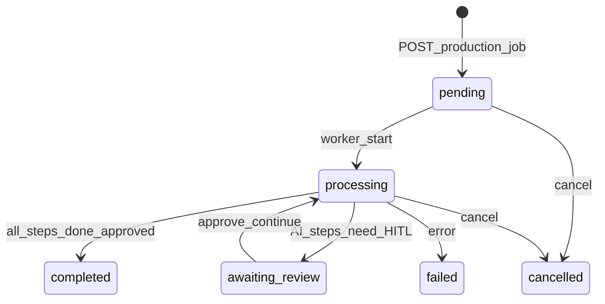
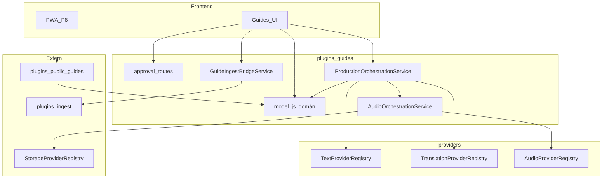

# ADR — Content Production Pipeline (P1, P2, P5, P7 + Providers)

**Status:** Godkänd arkitektur (2026-07-13). **P1, P2, P5, P7 backend implementerad** (2026-07-13) — se `docs/ai/CHANGELOG.md` § Content Production Pipeline.  
**Grund:** Låst TPM-plan [Content Production Pipeline](../../.cursor/plans/content_production_pipeline_d6a9ae16.plan.md)  
**Implementeringsordning:** `P1 → P2 → P5 → P7 → P4 → P6 → P3 → P8 → P9`  
**Senare superseding:** För async fasindelad produce + research-first, se [`CONTENT_PRODUCTION_PIPELINE_V2.md`](CONTENT_PRODUCTION_PIPELINE_V2.md) och [`P-GUIDES_CONTENT_SOURCES.md`](P-GUIDES_CONTENT_SOURCES.md). Krav att narrative måste vara `approved` innan jobbstart gäller **inte** längre.

---

## Sammanfattning

Guide CMS v1 (Epic 1–7) har redaktionell domän, audio-orkestrering (noop), ingest (fristående) och public read API. Nästa fas inför en **Content Production Pipeline** där:

1. **Ingest** samlar dokument kopplat till Place (P5).
2. **HITL** godkänner all AI-text innan publicering (P2).
3. **`ProductionJob`** orkestrerar batch och partiell regenerering (P7).
4. **Tre oberoende providers** (Text, Translation, Audio) producerar innehåll (P4, P6, P3).

---

## Arkitekturbeslut

### P1 — Prod readiness

| #     | Fråga                               | Beslut                                                                                               | Motivering                                                                        |
| ----- | ----------------------------------- | ---------------------------------------------------------------------------------------------------- | --------------------------------------------------------------------------------- |
| P1-A1 | Klient-`storageRef` på audio CRUD?  | **Blockera:** `POST`/`PUT …/audio` nekar `storageRef` från klient; endast orkestrering sätter ref    | S15; public audio-proxy förstärker risken                                         |
| P1-A2 | `POST …/audio` med `status: ready`? | **Blockera:** endast `generate`-vägen får sätta `ready`                                              | S16                                                                               |
| P1-A3 | R2 `download()` för guide audio?    | **Implementera:** `R2StorageAdapter.download()` via `GetObjectCommand` + stream                      | S29; krävs för `/api/public/guides/…/audio` och preview i prod                    |
| P1-A4 | Guide audio storage i prod          | **R2** via befintlig `uploadAudioBuffer` + ny download; `storage_ref` format oförändrat (`r2:{key}`) | Cup-bilder använder redan R2; en adapter fixar både auth preview och public proxy |
| P1-A5 | `PUBLIC_GUIDES_USER_ID`             | **Operativt:** sätt på Railway + `.env.local` paritet                                                | Epic 7 deploy; ej kod                                                             |
| P1-A6 | `storageRef` tenant-prefix          | **Avvaktar:** P1-A1 räcker v1; prefix `{userId}:` som P2+ hardening om behov                         | Minimera scope                                                                    |

### P2 — Publication workflow + HITL

| #     | Fråga                                        | Beslut                                                                                                                                  | Motivering                                                                          |
| ----- | -------------------------------------------- | --------------------------------------------------------------------------------------------------------------------------------------- | ----------------------------------------------------------------------------------- |
| P2-A1 | Hur modellera HITL?                          | **Ny kolumn `approval_status`** på `guide_stops` och `guide_variant_presentations`                                                      | Separera redaktionellt godkännande från `publication_status` och `editorial_status` |
| P2-A2 | `approval_status` värden                     | `draft` \| `pending_review` \| `approved`                                                                                               | `pending_review` = AI-utkast eller ändring som väntar godkännande                   |
| P2-A3 | Vem sätter `approved`?                       | **Endast explicit redaktörs-action** (`POST …/approve`); manuell narrative/presentation utan AI → `approved` direkt vid save            | Human-in-the-loop v1                                                                |
| P2-A4 | Publiceringsgate                             | **`publication_status = published` kräver** `approval_status = approved` AND `staleness_status = fresh` (server enforce på PUT variant) | Utökar befintlig A3 för public API                                                  |
| P2-A5 | Place `active`                               | **`lifecycle_status = active` kräver** minst en variant som uppfyller P2-A4 (eller dedikerad publish-place action med samma validering) | Konsekvent public gate                                                              |
| P2-A6 | AI-derivation skriver inte direkt till domän | Provider-utkast lagras i `ProductionJob` / job items; domän uppdateras **efter** approve                                                | HITL-kedja                                                                          |

**API (auth, plugin-gate `guides`, CSRF på mutationer):**

| Metod | Path                                                                     | Beskrivning                                   |
| ----- | ------------------------------------------------------------------------ | --------------------------------------------- |
| POST  | `/api/guides/:placeId/stops/:stopId/approve-narrative`                   | Sätter stop `approval_status: approved`       |
| POST  | `/api/guides/:placeId/stops/:stopId/variants/:variantId/approve-content` | Sätter variant `approval_status: approved`    |
| PUT   | `/api/guides/:placeId/stops/:stopId/variants/:variantId`                 | Neka `published` om inte `approved` + `fresh` |

### P5 — Ingest → Guides bridge

| #     | Fråga                    | Beslut                                                                                                                               | Motivering                                           |
| ----- | ------------------------ | ------------------------------------------------------------------------------------------------------------------------------------ | ---------------------------------------------------- |
| P5-A1 | Koppling Place ↔ Ingest | **`guide_places.ingest_source_id`** nullable FK → `ingest_sources(id)` ON DELETE SET NULL                                            | Ett dokument per Place; ingen duplicering av excerpt |
| P5-A2 | Pin excerpt-version      | **`guide_places.ingest_run_id`** nullable FK → `ingest_runs(id)` ON DELETE SET NULL; uppdateras när redaktör "uppdaterar från källa" | Spårbarhet; retention behåll allt                    |
| P5-A3 | Auto-split till stopp?   | **Nej i v1.** Redaktör läser excerpt i UI och skapar stopp manuellt                                                                  | TPM-beslut                                           |
| P5-A4 | Ingest-anrop             | **Återanvänd** [`ingestService.js`](../../../plugins/ingest/services/ingestService.js) — `getLatestSourceContent`, `runSourceById`   | Shared entrypoint redan dokumenterad                 |
| P5-A5 | Var bor bridge-logik?    | **`plugins/guides/ingest/`** — `GuideIngestBridgeService.js` (tunt lager); ingen ändring av ingest-plugin domän                      | Rollseparation                                       |

**API:**

| Metod | Path                                          | Beskrivning                                               |
| ----- | --------------------------------------------- | --------------------------------------------------------- |
| PUT   | `/api/guides/:placeId/ingest-source`          | Koppla/lös `{ ingestSourceId }`                           |
| GET   | `/api/guides/:placeId/source-content`         | Returnerar `{ source, run, rawExcerpt }` från senaste run |
| POST  | `/api/guides/:placeId/source-content/refresh` | Kör ingest på kopplad källa; uppdaterar `ingest_run_id`   |

### P7 — ProductionJob (förstaklassigt domänobjekt)

| #      | Fråga               | Beslut                                                                                                                                     | Motivering                                                                            |
| ------ | ------------------- | ------------------------------------------------------------------------------------------------------------------------------------------ | ------------------------------------------------------------------------------------- |
| P7-A1  | Tabeller            | **`guide_production_jobs`**, **`guide_production_job_items`**, **`guide_production_job_events`** (append-only)                             | Job + per-steg/items + historik (retention: allt)                                     |
| P7-A2  | Job `type`          | `full_guide` \| `stop` \| `variant`                                                                                                        | TPM batch + partiell regen                                                            |
| P7-A3  | Job `status`        | `pending` → `processing` → `awaiting_review` → `completed` \| `failed` \| `cancelled`                                                      | HITL-paus i `awaiting_review`                                                         |
| P7-A4  | Job items           | Ett item per `(stopId, variantId, step)` där `step` ∈ `text_derivation` \| `translation` \| `audio`                                        | Granular status, fingerprint, providerResults                                         |
| P7-A5  | Fingerprint         | `SHA-256` av kanonisk JSON: `{ canonicalNarrative, presentationText?, variantType, language, step, providerKey, providerVersion }`         | Dedup; skip om senaste completed item har samma hash                                  |
| P7-A6  | `providerResults`   | JSONB på job item: `{ proposedText?, mimeType?, durationMs?, storageRef?, metadata? }` — **inte** skrivet till guides-domän förrän approve | HITL                                                                                  |
| P7-A7  | Orkestrering        | **`ProductionOrchestrationService`** i `plugins/guides/production/`                                                                        | Separat från `AudioOrchestrationService`; delegerar audio-steg till befintlig service |
| P7-A8  | Manuell UI-generate | **Behåll** `AudioOrchestrationService` för enstaka variant i `GuideAudioSection`                                                           | Ingen regression Epic 6                                                               |
| P7-A9  | Batch start         | `POST /api/guides/:placeId/production-jobs` med `{ type, stopId?, variantId?, steps? }`                                                    | Ett klick = `full_guide`                                                              |
| P7-A10 | Approve job output  | `POST …/production-jobs/:jobId/approve` skriver godkända items till guides-domän + triggar nästa steg                                      | Koppling P2 + P7                                                                      |

**Schema (tenant DB, migration `096-guide-production-jobs.sql`):**

```sql
-- guide_production_jobs
id, user_id, place_id, type, status,
scope_stop_id NULL, scope_variant_id NULL,
error_message NULL, started_at, completed_at, created_at, updated_at

-- guide_production_job_items
id, job_id, stop_id, variant_id NULL, step,
status, fingerprint, provider_key, provider_result JSONB,
error_message NULL, created_at, updated_at

-- guide_production_job_events (append-only)
id, job_id, item_id NULL, event_type, payload JSONB, created_at
```

**State machine (job):**



### Provider-gränssnitt (P4 / P6 / P3 — kontrakt i P7, implementation senare)

| #     | Beslut                                                                                                                                        |
| ----- | --------------------------------------------------------------------------------------------------------------------------------------------- |
| PR-A1 | Tre **oberoende** registry: `TextProviderRegistry`, `TranslationProviderRegistry`, `AudioProviderRegistry` (befintlig)                        |
| PR-A2 | Plats: `plugins/guides/providers/text/`, `…/translation/`, `…/audio/` (audio befintlig)                                                       |
| PR-A3 | **Noop-stub** för Text och Translation i P7 (returnerar input med prefix eller truncation per variantType) — möjliggör E2E utan AI-leverantör |
| PR-A4 | `AudioProvider` — oförändrat kontrakt; leverantör väljs senare (P3)                                                                           |
| PR-A5 | Providers returnerar **utkast** till `ProductionOrchestrationService`; skriver **aldrig** direkt till DB                                      |
| PR-A6 | Provider-version ingår i fingerprint för dedup vid provider-byte                                                                              |

**TextProvider kontrakt:**

```javascript
// generate(req, { canonicalNarrative, variantType, language, sourceLanguage? })
// → { status: 'ready'|'failed', presentationText?, errorMessage? }
```

**TranslationProvider kontrakt:**

```javascript
// translate(req, { presentationText, sourceLanguage, targetLanguage })
// → { status: 'ready'|'failed', translatedText?, errorMessage? }
```

---

## Lagerdiagram



---

## Ansvarsfördelning

| Område                                  | Backend           | Frontend                              |
| --------------------------------------- | ----------------- | ------------------------------------- |
| P1 hardening, R2 download               | Ja                | —                                     |
| P2 approval API + gates                 | Ja                | Approval UI, publish disabled states  |
| P5 ingest bridge API                    | Ja                | Source panel, excerpt viewer, refresh |
| P7 ProductionJob schema + orchestration | Ja                | Job status, batch start, review queue |
| P4/P6/P3 provider adapters              | Ja (senare epics) | —                                     |
| P8 PWA                                  | API konsumtion    | Ja (separat app)                      |

**UI/UX-designer** äger flöden för: dokument→stopp, HITL-review, batch-start, jobb-status — **före** P2/P5/P7 frontend-implementation.

---

## Återanvändning

| Komponent                            | Återanvänds                                       |
| ------------------------------------ | ------------------------------------------------- |
| `ingestService.js`                   | P5 bridge (read + run)                            |
| `AudioOrchestrationService`          | P7 audio-steg + befintlig UI                      |
| `AudioProviderRegistry` + noop       | P3 bas                                            |
| `StorageProviderRegistry` + R2/local | P1 download fix, audio upload                     |
| `public-guides` A3 gate              | Oförändrat; P2 utökar vad som får bli `published` |
| `public-cups` pool-mönster           | Ej relevant                                       |
| Epic 6 `GuideAudioSection`           | Behålls för manuell single-variant generate       |

**Ny kod krävs:** migrations (approval, ingest FK, production jobs), `ProductionOrchestrationService`, bridge service, Text/Translation provider stubs, R2 download, approval routes.

---

## Risker

| ID  | Risk                                                     | Allvar | Åtgärd                                                   |
| --- | -------------------------------------------------------- | ------ | -------------------------------------------------------- |
| R1  | R2 download latency på public audio                      | Medel  | P1; CDN optional senare                                  |
| R2  | `approval_status` + `publication_status` förvirring i UI | Medel  | UI/UX tydliga labels; i18n                               |
| R3  | ProductionJob tabeller växer (retention allt)            | Låg    | P9 observability; arkivering senare                      |
| R4  | Batch jobb blockerar request thread                      | Medel  | P7 v1: synkron noop OK; async worker i P9 om extern TTS  |
| R5  | Fingerprint false skip                                   | Låg    | Inkludera providerVersion; manuell force-regenerate flag |

Alla acceptabla för v1 med dokumenterade mitigeringar.

---

## Avvägningar

- **Synkron vs async jobb v1:** Synkron orkestrering med noop (som Epic 6) tills extern TTS; `ProductionJob` schema stödjer async redan via status.
- **`approval_status` vs överbelasta `publication_status`:** Separat kolumn — tydligare HITL, fler fält i UI.
- **Job items vs flat JSONB på job:** Normaliserade items — bättre fingerprint/dedup per variant-steg.
- **AudioOrchestrationService vs merge into Production:** Behåll båda — minsta regression, tydlig single-variant path.

---

## Epics utanför denna ADR-runda

| Epic               | Notering                                             |
| ------------------ | ---------------------------------------------------- |
| P4 Text derivation | Implementerar `TextProvider`; bygger på P7           |
| P6 Translation     | Implementerar `TranslationProvider`                  |
| P3 TTS             | Implementerar riktig `AudioProvider`; leverantör TBD |
| P8 PWA             | Separat klient mot public API                        |
| P9 Observability   | Metrics, cost, async worker                          |

---

## Definition of Done — per epic (arkitektur)

| Epic | DoD                                                                           |
| ---- | ----------------------------------------------------------------------------- |
| P1   | R2 download, S15/S16 blocks, prod env, public audio smoke                     |
| P2   | Migration, approval API, publish gates, tester                                |
| P5   | Migration FK, bridge service, 3 API routes, UI excerpt                        |
| P7   | Migration jobs, orchestration service, batch API, noop providers, fingerprint |

---

## Referenser

- [`plugins/guides/model.js`](../../../plugins/guides/model.js)
- [`plugins/guides/audio/AudioOrchestrationService.js`](../../../plugins/guides/audio/AudioOrchestrationService.js)
- [`plugins/ingest/services/ingestService.js`](../../../plugins/ingest/services/ingestService.js)
- [`plugins/public-guides/`](../../../plugins/public-guides/)
- [`docs/ai/CHANGELOG.md`](../CHANGELOG.md) § Epic 1–7
