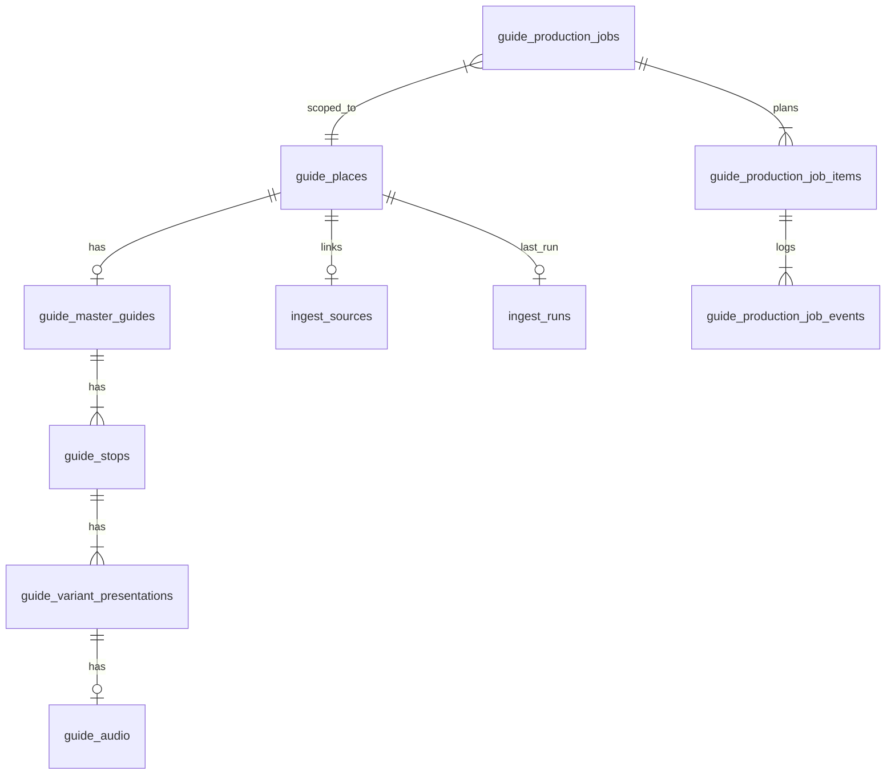
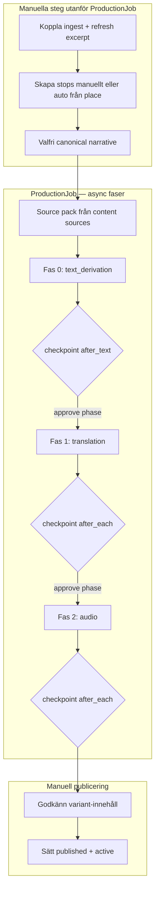
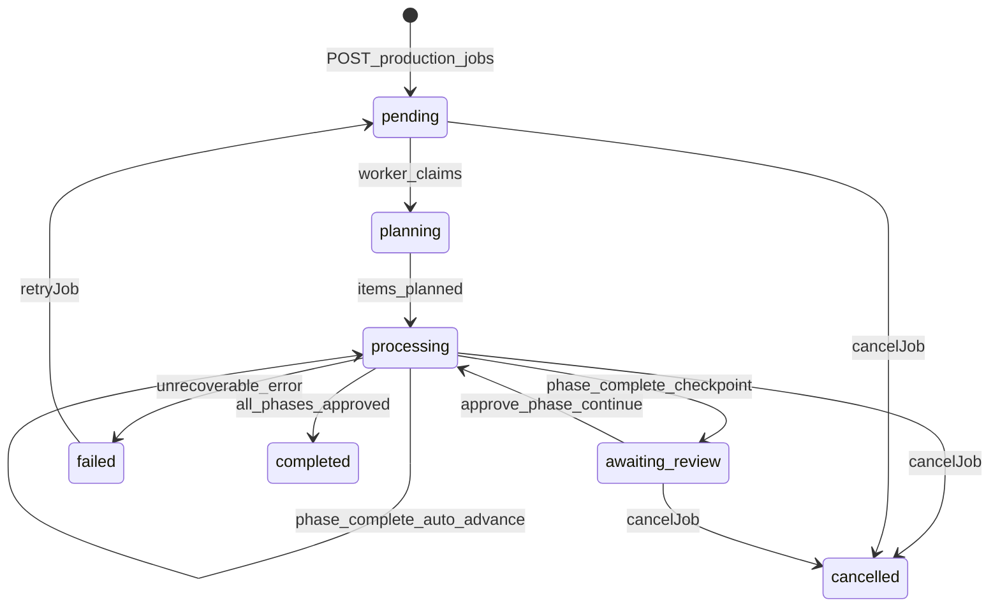
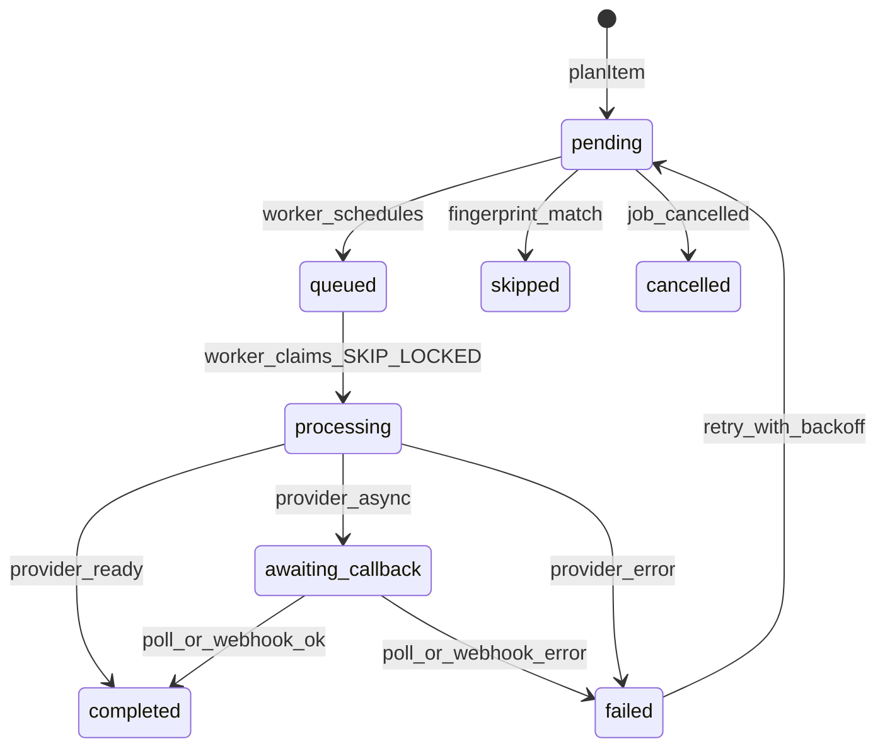
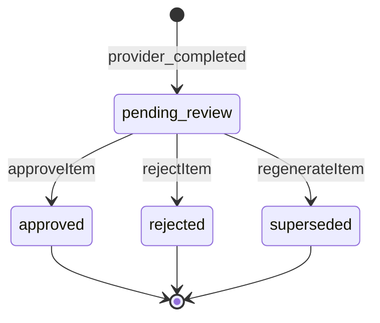
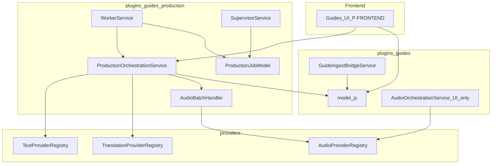
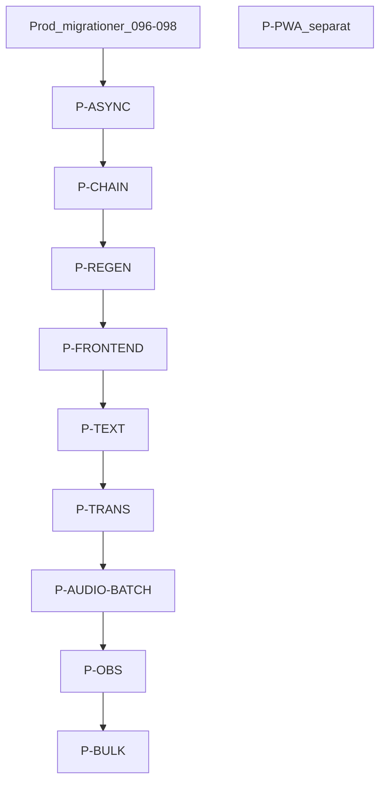

# ADR — Content Production Pipeline v2 (Fas 2)

**Status:** Godkänd arkitektur (2026-07-13)  
**Ersätter delar av:** [`CONTENT_PRODUCTION_PIPELINE.md`](CONTENT_PRODUCTION_PIPELINE.md) (v1) — v1 förblir historisk referens för P1–P7 leverans  
**Grund:** TPM Output Contract Fas 2 med låsta beslut (2026-07-13)  
**Förutsättning före implementation:** Prod-migrationer 096–098 klara på alla tenants

> **Superseded for domain targeting (2026-07-19):** Place-level presentations ([`P-GUIDES_PLACE_PRESENTATION.md`](P-GUIDES_PLACE_PRESENTATION.md)) replace stop × length-variant planning. Job type is **`full_guide` only**. Job items use **`presentation_id`** (not stop/variant). Sections below that describe `guide_stops`, `variant_type` quick/normal/deep, auto-stop, or deep-sibling waits are **historical** for product scope; async worker / HITL / phase machinery remains.

---

## Sammanfattning

Guide CMS v1.0 (`guides-v1.0`) levererade redaktionell domän, noop-baserad `ProductionJob` v1 (synkron, text-only) och HITL-gates. **Fas 2** gör produktionskedjan till en **async, fasindelad pipeline** som bär hundratusentals guider:

1. **Ingest** — koppla källa, läs excerpt (P5, oförändrat).
2. **Research / optional narrative** — place-level source pack; tom narrativ OK när pack har excerpts; se [`P-GUIDES_CONTENT_SOURCES.md`](P-GUIDES_CONTENT_SOURCES.md). Narrativ-`approval_status` är editorial/publish-gate, **inte** Produce-startgate.
3. **Text Derivation** — AI genererar `presentation_text` för **en presentation per språk** (fas 0; `presentation_id`). Length variants borttagna — se [`P-GUIDES_PLACE_PRESENTATION.md`](P-GUIDES_PLACE_PRESENTATION.md).
4. **Translation** — AI översätter godkänd text till andra språkpresentationer (fas 1, efter text-HITL när aktiverad).
5. **Audio** — **historiskt / out of scope** i platsmodellen (TTS ej produktmål).
6. **Publicering** — redaktör sätter `published` + `active` (befintliga gates).

**Låsta TPM-beslut:**

| Beslut           | Värde                                                  |
| ---------------- | ------------------------------------------------------ |
| Epic-prioritet   | P-ASYNC först; frontend byggs ovanpå riktig jobbmodell |
| HITL-default     | `checkpoint_mode: after_text`                          |
| ADR              | Denna fil (v2)                                         |
| P-PWA            | Separat produktspår                                    |
| Prod-migrationer | Förutsättning innan Fas 2-kod                          |
| Reject-flöde     | Godkänn / avvisa / regenerera per item                 |

**Ingen leverantör väljs i denna ADR** — endast abstrakta provider-kontrakt.

---

## Relation till v1

| Område         | v1 (levererat)                                          | v2 (denna ADR)                                           |
| -------------- | ------------------------------------------------------- | -------------------------------------------------------- |
| Jobbexekvering | Synkron i HTTP-request                                  | Async worker med DB-kö                                   |
| Pipeline-kedja | Endast `text_derivation`; job → `completed` vid approve | Fasindelad: text → translation → audio                   |
| HITL           | Job-nivå `awaiting_review`                              | Fas-checkpoint; default stopp efter text                 |
| Audio i batch  | Hoppas över (`skipped`)                                 | Integrerat som fas 2                                     |
| Fingerprint    | Grundläggande SHA-256                                   | Utökad med `ingestRunId`, `providerVersion` från instans |
| Reject         | Saknas                                                  | Förstaklassigt per item                                  |
| Skalning       | Blockerar request                                       | `FOR UPDATE SKIP LOCKED`, supervisor, retry              |

---

## Domänmodell

### Entitetsöversikt



### Domänentiteter (aktuellt vs historiskt)

**Aktuellt (2026-07-19):** `guide_places` → `guide_master_guides` → `guide_presentations` (`master_guide_id` + `language`, unique). Job items reference `presentation_id`. Se [`P-GUIDES_PLACE_PRESENTATION.md`](P-GUIDES_PLACE_PRESENTATION.md).

| Entitet                                                       | Nyckelfält                                                                       | Produktionsroll                                         |
| ------------------------------------------------------------- | -------------------------------------------------------------------------------- | ------------------------------------------------------- |
| `guide_places`                                                | `lifecycle_status`, `ingest_source_id`, `ingest_run_id`                          | Scope för jobb; ingest-invalidering av fingerprint      |
| `guide_presentations`                                         | `presentation_text`, `approval_status`, `publication_status`, `staleness_status` | Output-mål efter HITL; publiceringsgate (ett per språk) |
| `guide_stops` / `guide_variant_presentations` / `guide_audio` | —                                                                                | **Historiskt** — borttaget i platsmodellen              |

ER-diagrammet ovan (stops → variants → audio) är **historisk** v2-design.

### ProductionJob (utökad)

`ProductionJob` är ett **arbetsplan-objekt** med scope, faser och checkpoint-konfiguration.

**Nya/uppdaterade kolumner** (migration `099-guide-production-v2-jobs.sql`):

```sql
-- guide_production_jobs (tillägg)
phases JSONB NOT NULL DEFAULT '["text_derivation","translation","audio"]',
current_phase_index INTEGER NOT NULL DEFAULT 0,
checkpoint_mode VARCHAR(50) NOT NULL DEFAULT 'after_text',
priority INTEGER NOT NULL DEFAULT 50,
queued_at TIMESTAMPTZ,
worker_claimed_at TIMESTAMPTZ,
review_phase VARCHAR(50)  -- vilken fas som väntar HITL, t.ex. 'text_derivation'
```

| Fält                  | Värden / syfte                                                     |
| --------------------- | ------------------------------------------------------------------ |
| `phases`              | Ordad lista av steg: `text_derivation`, `translation`, `audio`     |
| `current_phase_index` | Index i `phases` som körs eller granskas                           |
| `checkpoint_mode`     | `after_text` (default) \| `after_each` \| `auto`                   |
| `review_phase`        | Satt när `status = awaiting_review`; anger vilken fas som granskas |

**Job `status` (utökad):**

| Status            | Betydelse                            |
| ----------------- | ------------------------------------ |
| `pending`         | Skapat, väntar på worker             |
| `planning`        | Worker planerar items (stora guider) |
| `processing`      | Worker exekverar aktuell fas         |
| `awaiting_review` | Fas klar; redaktör ska granska items |
| `completed`       | Alla faser klara och godkända        |
| `failed`          | Oåterkalleligt fel på job-nivå       |
| `cancelled`       | Avbrutet av redaktör                 |

### ProductionJobItem (utökad)

**Nya kolumner** (migration `099` + `100`):

```sql
-- guide_production_job_items (tillägg)
user_id INTEGER NOT NULL,           -- tenant-isolation (R3-fix)
phase_index INTEGER NOT NULL DEFAULT 0,
retry_count INTEGER NOT NULL DEFAULT 0,
retry_after TIMESTAMPTZ,
external_id VARCHAR(255),           -- async provider job id
provider_version VARCHAR(50) NOT NULL DEFAULT '1',
review_status VARCHAR(50),          -- null tills provider klar
reviewed_at TIMESTAMPTZ
```

**Item `status` (produktion):**

| Status              | Betydelse                               |
| ------------------- | --------------------------------------- |
| `pending`           | Planerad, ej påbörjad                   |
| `queued`            | Schemalagd av worker                    |
| `processing`        | Worker/provider arbetar                 |
| `awaiting_callback` | Async provider; väntar webhook/poll     |
| `completed`         | Provider returnerade resultat           |
| `failed`            | Provider- eller infrastrukturfel        |
| `skipped`           | Fingerprint-match; ingen provider-anrop |
| `cancelled`         | Jobb avbrutet                           |

**Item `review_status` (HITL, endast när `status = completed`):**

| Status           | Betydelse                         |
| ---------------- | --------------------------------- |
| `pending_review` | Väntar redaktörsbeslut            |
| `approved`       | Godkänd; text applicerad på domän |
| `rejected`       | Avvisad; domän oförändrad         |
| `superseded`     | Ersatt av regenerate-item         |

### ProductionJobEvent (oförändrad princip)

Append-only audit-log. Nya `event_type`-värden: `phase_started`, `phase_awaiting_review`, `phase_approved`, `item_rejected`, `item_regenerated`, `item_retry`.

### Worker-registrering (ny tabell)

```sql
-- guide_production_workers (migration 099)
id SERIAL PRIMARY KEY,
worker_id VARCHAR(255) UNIQUE NOT NULL,
last_heartbeat_at TIMESTAMPTZ NOT NULL,
items_processing INTEGER NOT NULL DEFAULT 0,
started_at TIMESTAMPTZ NOT NULL DEFAULT NOW()
```

---

## Livscykel — hela kedjan

> Diagrammet nedan inkluderar CreateStops / audio — **historisk** v2-design. Aktuellt: research (source pack) → `text_derivation` på presentation → HITL → optional translation → publish ([`P-GUIDES_PLACE_PRESENTATION.md`](P-GUIDES_PLACE_PRESENTATION.md)).



### Förutsättningar för att starta jobb

| Validering                                                                             | Fel om                |
| -------------------------------------------------------------------------------------- | --------------------- |
| AI-provider ready (konfigurerad + genererbar adapter, t.ex. OpenAI)                    | Provider ej redo      |
| Inga aktiva jobb för samma place i `pending`/`planning`/`processing`/`awaiting_review` | Konflikt              |
| `steps`/`phases` är giltiga                                                            | Ogiltig konfiguration |
| Job type `full_guide` only; items planeras mot `presentation_id`                       | Ogiltig job type      |

> **Superseded:** Kravet “alla stops måste ha `approval_status = approved` innan job startar” gäller **inte**. Auto-stop och deep-sibling-wait är borttagna. Research-first på **place**-nivå (tom narrativ + source pack) är gällande — se [`P-GUIDES_CONTENT_SOURCES.md`](P-GUIDES_CONTENT_SOURCES.md) och [`P-GUIDES_PLACE_PRESENTATION.md`](P-GUIDES_PLACE_PRESENTATION.md). Vid _item_-processing krävs narrativ **eller** source pack.

### Fasövergångar

| Från                                                  | Till                 | Trigger                                                                                                   |
| ----------------------------------------------------- | -------------------- | --------------------------------------------------------------------------------------------------------- |
| Fas N items alla `completed` \| `skipped` \| `failed` | `awaiting_review`    | `checkpoint_mode` kräver stopp (`after_text` = efter `text_derivation`; `after_each` = varje fas)         |
| Fas N items alla `completed` \| `skipped`             | Fas N+1 `processing` | `checkpoint_mode = auto` ELLER efter `approve-phase` (eller auto-advance när `after_text` och fas ≠ text) |
| Sista fas godkänd                                     | `completed`          | `approve-phase` på sista fasen (eller auto-advance)                                                       |
| Item `failed` med retries kvar                        | Item `pending`       | Supervisor/backoff                                                                                        |
| Item `failed` max retries                             | Job `failed`         | Om kritisk andel failed (konfigurerbart)                                                                  |

**Default `checkpoint_mode: after_text`:** När aktuell fas är **`text_derivation`** → job `awaiting_review` → redaktör godkänner/avvisar/regenererar → `approve-phase` startar nästa fas (translation) endast för **godkända** presentations → translation auto-advancerar under `after_text` (ingen separat HITL). Translation-only jobb (`phases: ['translation']`) checkpointar **inte** under `after_text`. Ny review vid `after_each` för translation/audio (rekommenderat om HITL önskas där).

---

## State machines

### Job



### Item (produktion)



### Item (HITL-review)



---

## Reject-, approve- och regenerate-flöde

### Principer

1. Providers skriver **aldrig** direkt till guides-domän.
2. `approveItem` applicerar `provider_result` till domän via `applyProductionPresentationText` (sätter presentation `approval_status = approved` — **uppdaterat 2026-07-22**; tidigare felaktigt dokumenterat som `pending_review`).
3. `rejectItem` lämnar domän oförändrad; item `review_status = rejected`.
4. `regenerateItem` markerar item `superseded`, skapar **nytt** item (`pending`, `force` fingerprint) för samma target + steg.
5. `approve-phase` kräver att alla items i aktuell fas har terminal `review_status` (`approved` \| `rejected` \| `superseded`).
6. Endast `approved` items i fas N inkluderas som input till fas N+1.

### API (nya/uppdaterade endpoints)

| Metod | Path                                                        | Beskrivning                                                     |
| ----- | ----------------------------------------------------------- | --------------------------------------------------------------- |
| POST  | `/api/guides/:placeId/production-jobs`                      | Skapa jobb (utökad: `phases?`, `checkpointMode?`, `languages?`) |
| POST  | `/api/guides/:placeId/production-jobs/:jobId/approve-phase` | Avsluta review-fas; valfritt `{ continue: true }`               |
| POST  | `…/production-jobs/:jobId/items/:itemId/approve`            | Godkänn item → applicera på domän                               |
| POST  | `…/production-jobs/:jobId/items/:itemId/reject`             | Avvisa item                                                     |
| POST  | `…/production-jobs/:jobId/items/:itemId/regenerate`         | Ersätt med nytt item (force)                                    |
| POST  | `…/production-jobs/:jobId/retry`                            | Återuppta `failed` job från aktuell fas                         |
| POST  | `…/production-jobs/:jobId/cancel`                           | Oförändrat                                                      |
| GET   | `…/production-jobs/:jobId`                                  | Job + items (inkl. `review_status`)                             |
| GET   | `…/production-jobs/estimate`                                | Pre-flight: antal items, skips, uppskattad kostnad              |

Befintlig `POST …/approve` **ersätts** av `approve-phase` + per-item `approve`. Behåll alias med deprecation i en release-cykel om nödvändigt.

### Domänintegration efter approve

| Steg                      | Domänaction                                                                                         |
| ------------------------- | --------------------------------------------------------------------------------------------------- |
| `text_derivation` approve | `applyProductionPresentationText` → presentation `approval_status = approved` (HITL = publish-klar) |
| `translation` approve     | Samma                                                                                               |
| `audio` approve           | Skapa/uppdatera `guide_audio` via refaktoriserad batch-handler (ej direkt från provider)            |

> **2026-07-22:** Extra `POST …/approve-content` efter job-item approve krävs **inte** för att nå `approved` — HITL-approve skriver `approved` direkt. Publicering kräver fortfarande `approved` + `fresh` (och övriga gates).

---

## Fingerprint och dedup

### Kanonisk input per steg

**text_derivation (aktuellt):** fingerprint inkluderar presentation/language + source-pack fingerprint (ej `variantType`). Se `plugins/guides/production/fingerprint.js`.

> **Historiskt text_derivation-input:**

```json
{
  "step": "text_derivation",
  "canonicalNarrative": "<stop.canonical_narrative>",
  "variantType": "quick|normal|deep",
  "language": "<sourceLanguage>",
  "ingestRunId": "<place.ingest_run_id>",
  "providerKey": "<key>",
  "providerVersion": "<provider.version>"
}
```

**translation:**

```json
{
  "step": "translation",
  "sourcePresentationText": "<approved text from prior phase>",
  "sourceLanguage": "sv",
  "targetLanguage": "en",
  "variantType": "normal",
  "providerKey": "<key>",
  "providerVersion": "<provider.version>"
}
```

**audio:**

```json
{
  "step": "audio",
  "presentationText": "<approved text>",
  "language": "sv",
  "variantType": "normal",
  "providerKey": "<key>",
  "providerVersion": "<provider.version>"
}
```

### Dedup-regler

| Regel                                         | Beteende                                            |
| --------------------------------------------- | --------------------------------------------------- |
| Exakt fingerprint + `completed` item i tenant | Nytt item → `skipped` (om `force = false`)          |
| `force = true`                                | Hoppa över dedup                                    |
| `ingest_run_id` ändras                        | Text-fingerprint ändras → auto re-run vid nästa job |
| `canonical_narrative` ändras                  | Variants `stale`; fingerprint matchar inte          |
| Provider `.version` bump                      | Fingerprint ändras → implicit re-run                |

**Scope:** Dedup söks per `user_id` (tenant), inte enbart per place.

### Planering (`planning`-fas)

Vid jobbstart skapas **alla** items för aktuell fas upfront:

1. Lös scope → presentations (`presentation_id`) för `full_guide` (**historiskt:** `{ stop, variant }[]`)
2. Per target: beräkna fingerprint
3. `hasCompletedFingerprint` → `skipped` direkt, annars `pending`
4. Batch-insert i transaktion
5. Job → `processing`

Fas N+1 items skapas **först** vid `approve-phase` (endast för godkända targets).

---

## Regenerering

| Scenario                 | `type`               | `phases` / `steps`                           | `force`                       |
| ------------------------ | -------------------- | -------------------------------------------- | ----------------------------- |
| Ny guide                 | `full_guide`         | alla                                         | false                         |
| Narrative ändrat på stop | `stop` + `stopId`    | alla                                         | false                         |
| Ett språk tillagt        | `full_guide`         | `translation`, `audio` + `languages: ['de']` | false                         |
| Byt provider             | `full_guide`         | berörd fas                                   | false (version i fingerprint) |
| Tvinga om-ljud           | `variant`            | `audio`                                      | true                          |
| Avvisat AI-utkast        | `regenerate` på item | samma steg                                   | true                          |
| Job failure              | `retryJob`           | —                                            | —                             |

---

## Provider-abstraktion

### Designprinciper (oförändrade från v1)

- Tre oberoende registry: Text, Translation, Audio
- Providers är tillståndslösa; returnerar resultat till orkestrering
- Providers skriver **aldrig** till guides-DB
- `provider.version` läses från instans (ej hårdkodat)

### Kontrakt (utökade för async)

**TextProvider:**

```javascript
// generate(req, { canonicalNarrative, variantType, language, sourceLanguage })
// → { status: 'ready'|'failed', presentationText?, errorMessage? }
```

**TranslationProvider:**

```javascript
// translate(req, { presentationText, sourceLanguage, targetLanguage, variantType })
// → { status: 'ready'|'failed', translatedText?, errorMessage? }
```

**AudioProvider (utökad):**

```javascript
// generate(req, { presentationText, language, variantType, variantPresentationId })
// → { status: 'ready'|'processing'|'failed',
//     audioBuffer?, durationMs?, mimeType?,
//     externalId?,  // vid processing
//     errorMessage? }
// getStatus(req, externalId) → samma resultatshape
// cancel(req, externalId) → void
```

### Provider-konfiguration

Miljövariabler per deployment (ingen leverantör låst i ADR):

```
GUIDES_TEXT_PROVIDER=<key>
GUIDES_TRANSLATION_PROVIDER=<key>
GUIDES_AUDIO_PROVIDER=<key>
```

Framtida tenant-specifik override: `guide_tenant_provider_config` (P-OBS/P-BULK).

### Rate limiting

In-process `ProviderRateLimiter` (token-bucket **per provider-nyckel**, t.ex. `openai` / `openai-translation` — **inte** per tenant). Worker respekterar `retry_after` och HTTP `Retry-After`.

> **Känd begränsning (S-RATE-1, Security 2026-07-19):** På delad Node-process kan en autentiserad tenant tömma den globala RPM-bucketen och thröttla andra tenants’ text/översättning. Mitigering: tenant-scopad limiter-nyckel (t.ex. `` `${userId}:openai` ``) — ej levererad; kräver TPM-godkännande som accepterad risk eller uppföljning. Se [`P-TEXT_TEXT_PROVIDER.md`](P-TEXT_TEXT_PROVIDER.md) R6/R7.

---

## Async worker-arkitektur (P-ASYNC)

### Komponenter

| Komponent                        | Plats                                            | Ansvar                                                             |
| -------------------------------- | ------------------------------------------------ | ------------------------------------------------------------------ |
| `WorkerService`                  | `plugins/guides/production/WorkerService.js`     | Claim, process, heartbeat                                          |
| `SupervisorService`              | `plugins/guides/production/SupervisorService.js` | Stuck items, dead workers                                          |
| `ProductionOrchestrationService` | befintlig, refaktorerad                          | Planering, fasövergångar, review                                   |
| `AudioBatchHandler`              | `plugins/guides/production/AudioBatchHandler.js` | Audio-steg i batch (separerat från UI `AudioOrchestrationService`) |

### Worker-loop

```
setInterval(WORKER_POLL_MS=5000):
  1. heartbeat()
  2. claimItems(FOR UPDATE SKIP LOCKED, batchSize=5)
  3. per item: processItem() → provider → update status
  4. om fas klar: evaluatePhaseTransition()
```

### Supervisor-loop

```
setInterval(SUPERVISOR_POLL_MS=60000):
  1. items processing > ITEM_TIMEOUT_MIN → pending, retry_count++
  2. retry_count > MAX_RETRIES → failed
  3. workers utan heartbeat > 60s → frigör items
```

### Skalning till 100k+ guider

| Strategi                          | Beskrivning                                                             |
| --------------------------------- | ----------------------------------------------------------------------- |
| DB-backed queue                   | Ingen in-memory-kö; överlever deploy                                    |
| `FOR UPDATE SKIP LOCKED`          | N parallella workers utan extern koordinator                            |
| Fasvis item-skapande              | Items för fas N+1 skapas först efter HITL — begränsar planeringsstorlek |
| `planning`-status                 | Stora guider (1000+ stops) blockerar inte HTTP                          |
| Tenant-fairness (P-BULK)          | `user_id % workerCount` vid hög last                                    |
| Arkivering (P-OBS)                | Flytta `completed` jobs > N månader till arkivtabell                    |
| Separat worker-process (framtida) | Samma API; worker extraheras till egen Railway-tjänst                   |

**v2 start:** In-process worker (setInterval i app-server). Extrahering till separat process är en deploy-beslut, inte schema-ändring.

---

## Lagerdiagram



---

## Arkitekturbeslut

### A1 — Async-first (P-ASYNC)

| Fråga            | Beslut                                             | Motivering                                            |
| ---------------- | -------------------------------------------------- | ----------------------------------------------------- |
| Synkron vs async | **Async worker** ersätter synkron `_runJob` i HTTP | Skalning, externa providers, ingen request-blockering |
| Worker-placering | **In-process** v2; separat process senare          | Enkel deploy; schema/API redo för extraktion          |
| Item-claim       | **`FOR UPDATE SKIP LOCKED`**                       | Beprövat Postgres-mönster; ingen Redis-krav v2        |

### A2 — Fasindelad pipeline (P-CHAIN)

| Fråga                        | Beslut                                            | Motivering                                                 |
| ---------------------------- | ------------------------------------------------- | ---------------------------------------------------------- |
| Kedja text→translation→audio | **Ja**, via `phases` + `current_phase_index`      | TPM mål: minimal manuell hantering                         |
| Default checkpoint           | **`after_text`**                                  | Kostnadskontroll; fel sprids inte till translation/audio   |
| Items per fas                | **Skapas vid fasstart**, inte alla upfront        | Minskar planeringsstorlek; translation kräver godkänd text |
| v1 `approveJob`              | **Ersätts** av `approve-phase` + per-item actions | Stödjer reject/regenerate                                  |

### A3 — Reject-flöde (P-REGEN)

| Fråga              | Beslut                                  | Motivering                              |
| ------------------ | --------------------------------------- | --------------------------------------- |
| Review-lager       | **`review_status` på job item**         | Spårbarhet; domän oförändrad vid reject |
| Regenerate         | **Nytt item** (`superseded` på gammalt) | Audit trail; fingerprint med force      |
| Manuell redigering | **Kvarstår** som alternativ             | Redaktör kan alltid skriva direkt i UI  |

### A4 — Fingerprint (P-REGEN)

| Fråga                            | Beslut                      | Motivering                         |
| -------------------------------- | --------------------------- | ---------------------------------- |
| `ingestRunId` i text-fingerprint | **Ja**                      | Ny ingest → omproduktion           |
| `providerVersion`                | **Från `provider.version`** | Ej hårdkodat                       |
| Dedup-scope                      | **Per tenant (`user_id`)**  | Acceptabel risk; `force` vid behov |

### A5 — Audio i batch (P-AUDIO-BATCH)

| Fråga       | Beslut                                 | Motivering                                          |
| ----------- | -------------------------------------- | --------------------------------------------------- |
| Batch audio | **`AudioBatchHandler`** — ny modul     | Undvik att blanda UI single-variant-flöde med batch |
| UI generate | **Behåll `AudioOrchestrationService`** | Ingen regression Epic 6                             |
| Async TTS   | **`awaiting_callback` + poll/webhook** | Externa providers är asynkrona                      |

### A6 — Tenant-isolation (P-ASYNC)

| Fråga                  | Beslut                           | Motivering                 |
| ---------------------- | -------------------------------- | -------------------------- |
| `user_id` på job_items | **Ja** (migration 099)           | Åtgärdar R3 från v1        |
| Child table queries    | **Alltid filtrera på `user_id`** | Säkerhetsgrind före P-TEXT |

### A7 — P-PWA

| Fråga       | Beslut           | Motivering                       |
| ----------- | ---------------- | -------------------------------- |
| PWA i Fas 2 | **Separat spår** | Blockerar inte produktionskedjan |

---

## Epic-indelning och beroenden



### Epic-definitioner

| Epic              | Scope                                                            | Backend         | Frontend          |
| ----------------- | ---------------------------------------------------------------- | --------------- | ----------------- |
| **P-ASYNC**       | WorkerService, SupervisorService, schema 099, claim/retry        | Ja              | —                 |
| **P-CHAIN**       | phases, checkpoint_mode, approve-phase, planning-status          | Ja              | —                 |
| **P-REGEN**       | Utökad fingerprint, reject/regenerate/retry API, language-filter | Ja              | —                 |
| **P-FRONTEND**    | UI ovanpå v2 API                                                 | —               | Ja                |
| **P-TEXT**        | TextProvider-adapter, rate limiter, kostnadslogg                 | Ja              | —                 |
| **P-TRANS**       | TranslationProvider-adapter                                      | Ja              | —                 |
| **P-AUDIO-BATCH** | AudioBatchHandler, async poll/webhook                            | Ja              | —                 |
| **P-OBS**         | Stats API, estimate, admin workers, arkivering                   | Ja              | Admin UI valfritt |
| **P-BULK**        | bulk-produce, cron stale, tenant-fairness, cost caps             | Ja              | —                 |
| **P-PWA**         | Konsumentapp mot public API                                      | API redan finns | Separat repo      |

> **Implementeringsstatus (2026-07-14):** P-ASYNC, P-CHAIN, P-REGEN, P-FRONTEND och P-TEXT backend levererade och grindade lokalt (ej deployade). Aktuell roadmap: [`docs/ai/CHANGELOG.md`](../CHANGELOG.md) § Guide CMS – Roadmap (Fas 2). P-TEXT ADR: [`P-TEXT_TEXT_PROVIDER.md`](P-TEXT_TEXT_PROVIDER.md).

### Definition of Done per epic

| Epic          | DoD                                                                                                         |
| ------------- | ----------------------------------------------------------------------------------------------------------- |
| P-ASYNC       | Worker claim/release, supervisor reset, migration 099, integrationstester, prod worker startar vid app boot |
| P-CHAIN       | Fasövergångar, `after_text` default, approve-phase, tester för multi-phase noop E2E                         |
| P-REGEN       | reject/approve/regenerate per item, retryJob, utökad fingerprint, tester                                    |
| P-FRONTEND    | Komponenter enligt UX-spec v2, poll mot async job, reject/regenerate-knappar                                |
| P-TEXT        | En text-provider-adapter, rate limit, `provider_result` med token metadata                                  |
| P-TRANS       | En translation-provider-adapter                                                                             |
| P-AUDIO-BATCH | Audio-steg i batch, async callback, behåll UI generate                                                      |
| P-OBS         | Stats + estimate endpoints, dokumenterad arkiveringsstrategi                                                |
| P-BULK        | bulk-produce endpoint, stale-cron dokumenterad                                                              |

---

## Ansvarsfördelning

| Område                              | Backend            | Frontend                |
| ----------------------------------- | ------------------ | ----------------------- |
| Worker, supervisor, schema          | Ja                 | —                       |
| Pipeline chaining, approve-phase    | Ja                 | —                       |
| Reject/regenerate API               | Ja                 | Knappar i review-kö     |
| Fingerprint, dedup, retry           | Ja                 | Force-regenerate i UI   |
| Provider adapters                   | Ja                 | —                       |
| Audio batch + webhook               | Ja                 | —                       |
| GuideSourceSection, approval badges | API finns (P5/P2)  | Ja (P-FRONTEND)         |
| Production panel, review queue      | Async job API      | Ja (P-FRONTEND)         |
| Pre-flight estimate                 | Ja                 | Visa i production panel |
| Admin observability                 | Ja                 | Valfritt senare         |
| P-PWA                               | Public API (finns) | Separat team/spår       |

**UI/UX-designer** ska uppdatera UX-spec för: fas-checkpoints, per-item reject/regenerate, fas-banner ("Text väntar granskning"), estimate-dialog.

**Säkerhetsexpert** aktiveras före P-TEXT (API-nycklar, webhook-signering, tenant isolation).

---

## Återanvändning

| Komponent                         | Återanvänds | Ändring                                  |
| --------------------------------- | ----------- | ---------------------------------------- |
| `ProductionJobModel`              | Ja          | Utökas med nya kolumner/metoder          |
| `ProductionOrchestrationService`  | Ja          | Refaktoreras; synkron `_runJob` tas bort |
| `computeProductionFingerprint`    | Ja          | Utökas                                   |
| `GuideIngestBridgeService`        | Oförändrad  | —                                        |
| `applyProductionPresentationText` | Ja          | Oförändrad                               |
| `AudioOrchestrationService`       | Ja          | Endast UI single-variant                 |
| Provider registries + noop        | Ja          | Kontrakt utökas för audio async          |
| `approval_status` gates (P2)      | Ja          | Oförändrade                              |
| Migrations 096–098                | Ja          | Förutsättning; schema 099+ läggs ovanpå  |

**Ny kod:** `WorkerService`, `SupervisorService`, `AudioBatchHandler`, migration 099–100, reject/regenerate endpoints, provider rate limiter.

---

## Risker

| ID  | Risk                                       | Allvar | Åtgärd                                       |
| --- | ------------------------------------------ | ------ | -------------------------------------------- |
| R1  | Worker-krasch mitt i item                  | Hög    | Supervisor + idempotent processItem          |
| R2  | `after_text` lägger HITL-börda på redaktör | Medel  | `checkpoint_mode: auto` per guide som opt-in |
| R3  | job_items utan `user_id` (v1)              | Hög    | Migration 099; fix i P-ASYNC                 |
| R4  | Provider rate limit vid bulk               | Hög    | Token-bucket + backoff; P-TEXT               |
| R5  | Fingerprint false-skip                     | Låg    | `force` + `provider.version`                 |
| R6  | job_events/items tabellväxt                | Medel  | P-OBS arkivering                             |
| R7  | Webhook spoofing (audio)                   | Hög    | Säkerhetsreview före P-AUDIO-BATCH           |
| R8  | Prod-migrationer ej körda                  | Hög    | Blockerande förutsättning (TPM-beslut)       |

---

## Avvägningar

| Val                                | Alternativ              | Beslut                                              | Motivering                                                   |
| ---------------------------------- | ----------------------- | --------------------------------------------------- | ------------------------------------------------------------ |
| Checkpoint efter translation/audio | `after_text` only       | **`after_text` default + `after_each` för fas 1–2** | Balans kostnad vs kvalitet; TPM låste after_text som minimum |
| Items upfront vs per fas           | Alla vs lazy            | **Per fas**                                         | Mindre planering; translation kräver godkänd input           |
| In-process vs separat worker       | Redis queue vs Postgres | **Postgres SKIP LOCKED, in-process**                | Enklare ops v2; extraktion möjlig senare                     |
| `approveJob` compatibility         | Behåll vs bryt          | **Ersätt med approve-phase**                        | Tydligare semantik; kort deprecation om behov                |
| Audio batch vs merge AORCH         | En service              | **Separat AudioBatchHandler**                       | Minsta regression UI-flöde                                   |

---

## Affärskonsekvenser

- **`after_text`-default** ökar redaktörstid per guide men **minskar AI-kostnad** väsentligt (inga översättningar/ljud på dålig text).
- **P-ASYNC före frontend** fördröjer synlig UI-förbättring men **undviker omskrivning** när jobbmodellen ändras.
- **P-PWA separat** innebär att konsumentlansering inte väntar på produktionskedjan.

---

## Referenser

- [`P-GUIDES_PLACE_PRESENTATION.md`](P-GUIDES_PLACE_PRESENTATION.md) — plats-presentation (supersedes stop/variant targeting)
- [`CONTENT_PRODUCTION_PIPELINE.md`](CONTENT_PRODUCTION_PIPELINE.md) — v1 ADR
- [`GUIDES_CONTENT_PRODUCTION_UX.md`](../design/GUIDES_CONTENT_PRODUCTION_UX.md) — UX-spec (behöver v2-komplettering)
- [`plugins/guides/production/`](../../../plugins/guides/production/) — befintlig implementation
- [`server/migrations/098-guide-production-jobs.sql`](../../../server/migrations/098-guide-production-jobs.sql)
- [`docs/ai/team-workflow.md`](../team-workflow.md)
