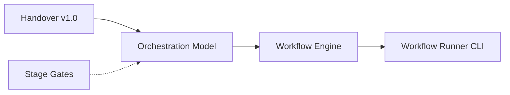
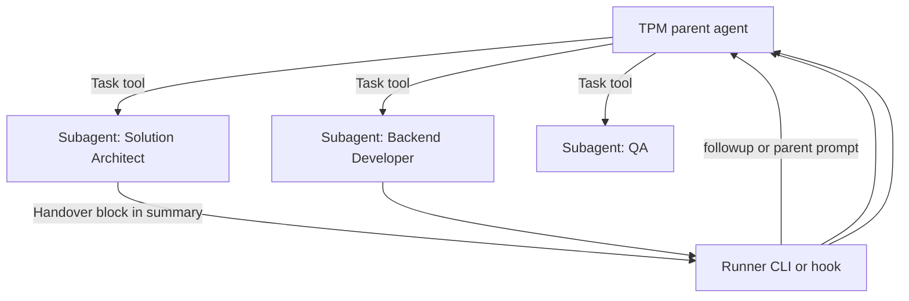

# ADR: Framework Automation Feasibility Assessment

**Status:** Accepted (assessment complete)  
**Date:** 2026-07-17  
**Context:** Epic `wf-2026-07-17-feasibility-01` — Grind 1 Output Contract approved. Framework v2.4 complete (Handover Contract, Orchestration Model, Workflow Engine, Workflow Runner SSOT + implementation). Goal: determine whether full autonomous workflow with automatic `@role` switching is technically achievable on Cursor.

**Related:** [workflow-runner.md](../workflow-runner.md), [cursor-implementation.md](../cursor-implementation.md), [orchestration-model.md](../orchestration-model.md)

---

## Executive summary

| Item                  | Outcome                                                                                                                                                                                                                                       |
| --------------------- | --------------------------------------------------------------------------------------------------------------------------------------------------------------------------------------------------------------------------------------------- |
| **Recommendation**    | **PIVOT** — not Go, not Stop                                                                                                                                                                                                                  |
| **Primary finding**   | No verified official mechanism exists to programmatically activate `.cursor/rules/role-*.mdc` rules (manual `@role`) without user interaction. A **Go** for the current slutmål (automatic `@role` rollväxling) cannot be justified.          |
| **Secondary finding** | Partial autonomy is achievable via officially documented integrations (hooks `followup_message`, custom subagents, Cursor SDK). These require an **alternative activation architecture**, not an extension of today's `@role` + Runner model. |
| **Framework impact**  | Engine/Runner/orchestration layers remain valid. ActivationPort must stay manual for `@role` model, or be replaced by a new activation layer (subagents / SDK / hooks bridge).                                                                |

---

## 1. Technical Feasibility Report

### Assessment method

| Source                                                            | Use                                                |
| ----------------------------------------------------------------- | -------------------------------------------------- |
| [Cursor Hooks](https://cursor.com/docs/hooks)                     | `stop`, `subagentStop`, `sessionStart` behaviour   |
| [Cursor Rules](https://cursor.com/docs/context/rules)             | Rule application modes, `.mdc` frontmatter         |
| [Cursor Subagents](https://cursor.com/docs/agent/subagents)       | Task tool, `.cursor/agents/` custom subagents      |
| [Cursor SDK (TypeScript)](https://cursor.com/docs/sdk/typescript) | Programmatic agent lifecycle                       |
| Repo: `tools/workflow-runner/`, `docs/ai/*`                       | Current Framework integration points               |
| Repo: `.cursor/rules/role-*.mdc`                                  | `alwaysApply: false` — manual activation by design |

No live hook experiments were run in this epic (no `hooks.json` in repo; assessment is documentation- and architecture-based per evidence requirements). Conclusions are drawn from official docs and existing integration code, not speculation.

---

### Q1. Can the next role be activated automatically without manual `@role`?

**Answer: No — not via the Framework's current `@role` activation model.**

| Evidence                                             | Finding                                                                                                                                                                                                                                                                     |
| ---------------------------------------------------- | --------------------------------------------------------------------------------------------------------------------------------------------------------------------------------------------------------------------------------------------------------------------------- |
| [Rules docs](https://cursor.com/docs/context/rules)  | Role rules with `alwaysApply: false` are included **only when `@`-mentioned in chat** (Apply Manually). No documented auto-activation on handover or engine command.                                                                                                        |
| `tools/workflow-runner/emissionPort.js`              | `ActivationPort` returns hint string only: `Activate: @.cursor/rules/role-<slug>.mdc (manual)`. Never invokes Cursor APIs.                                                                                                                                                  |
| Framework SSOTs (v2.2–v2.4)                          | Explicitly out of scope: automatic Cursor agent / rule activation.                                                                                                                                                                                                          |
| [Hooks `stop`](https://cursor.com/docs/hooks)        | `followup_message` auto-submits the **next user message** in the **same** composer session. This is message continuation, not a documented rule-activation API. Whether `@role` in `followup_message` reliably attaches the rule is **not documented** — cannot support Go. |
| [Subagents](https://cursor.com/docs/agent/subagents) | Parent agent can launch subagents via Task tool without user click — but subagents are `.cursor/agents/*.md`, not `.mdc` role rules. Different activation surface.                                                                                                          |

**Conclusion:** Automatic progression to the **next Framework role persona via `@role`** is **not verified**. Semi-autonomous continuation within one chat (hooks) or delegation to subagents/SDK is possible but changes the activation model (see §4 Pivot options).

---

### Q2. Can Cursor rules (`.mdc`) or equivalent be switched programmatically?

**Answer: No official programmatic rule-switch API.**

| Mechanism                                     | Documented?   | Programmatic switch?                                                                                                                |
| --------------------------------------------- | ------------- | ----------------------------------------------------------------------------------------------------------------------------------- |
| `alwaysApply: true`                           | Yes           | Rule always in context — not a per-step switch; only 2 rules use this in this repo (`engineering-principles`, `local-prod-parity`). |
| `globs` / Apply to Specific Files             | Yes           | Auto-attaches when matching files in context — file-driven, not orchestration-driven.                                               |
| Apply Intelligently (`description`)           | Yes           | Agent decides relevance — non-deterministic; unsuitable for Stage Gate role sequencing.                                             |
| Apply Manually (`@`-mention)                  | Yes           | User (or auto-submitted message?) must reference rule — no API to set "active role rule" as state.                                  |
| Edit `.mdc` on disk (e.g. flip `alwaysApply`) | Possible hack | **Not official**; race-prone; violates Framework principle that docs are SSOT; not acceptable for Go.                               |
| `sessionStart` → `additional_context`         | Yes           | Injects context at session start — does not select which `.mdc` rules apply.                                                        |

**Conclusion:** Cursor exposes **how rules are included in context**, not a **runtime rule selector** API. Programmatic `.mdc` switching for orchestrated role handover is **not supported** in official documentation.

---

### Q3. Do API, CLI, MCP, hooks, skills, or other official integration points enable autonomous continuation?

**Answer: Partially — several integration surfaces exist, none equivalent to automatic `@role` activation.**

| Integration                                         | Autonomous continuation? | Relevance to Framework                                                                                                                                                                               |
| --------------------------------------------------- | ------------------------ | ---------------------------------------------------------------------------------------------------------------------------------------------------------------------------------------------------- |
| **Workflow Runner CLI** (`npm run workflow-runner`) | Engine loop only         | Parses Handover → Orchestration Model → emits Continue/Rework/Pause. **Activation manual** (FR-8).                                                                                                   |
| **Hooks — `stop`**                                  | Yes (limited)            | `followup_message` auto-submits next user message; default `loop_limit` 5 per script. Loop-style flows within one agent session.                                                                     |
| **Hooks — `subagentStop`**                          | Yes (limited)            | Same `followup_message` pattern when subagent completes.                                                                                                                                             |
| **Hooks — `sessionStart`**                          | Context injection only   | `additional_context` / `env` at session start; fire-and-forget; does not switch rules.                                                                                                               |
| **Subagents (Task tool)**                           | Yes                      | Parent launches `.cursor/agents/*` subagents; built-in (`explore`, `bash`, `browser`) or custom. Parent must have Task access; hooks can gate via `subagentStart`.                                   |
| **Cursor SDK** (`@cursor/sdk`, `cursor-sdk`)        | Yes (external)           | `Agent.create` / `Agent.prompt` / `Agent.resume` run agents outside IDE chat. Respects hooks; does not manage `@role` rules. `local.settingSources` loads project settings — not per-role switching. |
| **MCP**                                             | Tool access only         | No documented role/rule activation.                                                                                                                                                                  |
| **Skills**                                          | Agent-invoked on demand  | Repeatable actions; not a workflow orchestrator.                                                                                                                                                     |
| **Cursor Automations**                              | Event/schedule triggered | Separate product surface (Agents Window); not in-chat multi-role Stage Gate workflow.                                                                                                                |
| **Cloud Agents API**                                | External agent runs      | `/v1/agents/*` — programmatic agents on cloud VM; orthogonal to IDE `@role` model.                                                                                                                   |

**Conclusion:** Official integrations support **auto-continue messages**, **subagent delegation**, and **external agent runs** — not **deterministic automatic `@role` rule activation** tied to Handover Contract + Stage Gates.

---

### Q4. Can an agent start the next agent without user interaction?

**Answer: Yes — with important caveats.**

| Path                                                   | User interaction required?    | Caveat                                                                                                  |
| ------------------------------------------------------ | ----------------------------- | ------------------------------------------------------------------------------------------------------- |
| **Task tool → subagent**                               | No (parent decides)           | Subagent types ≠ Framework role rules; no Handover Contract / Stage Gate enforcement in subagent layer. |
| **SDK `Agent.create` + `send`**                        | No (caller is script/service) | Runs outside current IDE chat; separate session; TPM/user not in loop unless Pause.                     |
| **Hooks `stop` / `subagentStop` → `followup_message`** | No (after hook fires)         | Same composer session; loop cap; not documented as role activation.                                     |
| **Runner `Continue` emission**                         | Yes (manual `Activate:`)\*\*  | Human must `@role` or start new chat with rule.                                                         |

**Conclusion:** Multi-agent execution without per-step user clicks **is possible** on Cursor. It does **not** map 1:1 to Framework's eight role personas + Stage Gates + `@role` rules without architectural pivot.

---

### Q5. Platform limitations

| Limitation                                               | Impact on full `@role` autonomy                                                                                            |
| -------------------------------------------------------- | -------------------------------------------------------------------------------------------------------------------------- |
| No rule-switch API                                       | Cannot deterministically activate next role `.mdc` from Runner/Handover.                                                   |
| `alwaysApply: false` on all role rules                   | Role personas excluded from context until manual `@` or intelligent apply (non-deterministic).                             |
| Hook `loop_limit` (default 5) on `stop` / `subagentStop` | Long Framework workflows exceed cap unless raised or chained across sessions.                                              |
| `followup_message` semantics                             | Documented as auto-submit user message — not as rule activation; behaviour with `@rule` in body unverified.                |
| Subagent vs role rule split                              | `.cursor/agents/` and `.cursor/rules/` are separate systems; no doc linking them for orchestration.                        |
| SDK vs IDE session boundary                              | SDK agents ≠ IDE composer session; Handover/Runner state in `.workflow-runner/` not automatically wired to SDK runs.       |
| Cloud agent hook gaps                                    | `sessionStart`, user-level hooks unavailable in cloud; early read-only turns skip hooks.                                   |
| Mode / tool policy                                       | Subagent nesting requires Task tool access; Ask/Plan modes may block spawning.                                             |
| User pause points                                        | Business decisions, scope changes, release (Release Discipline) still require explicit user input per Orchestration Model. |
| No `Next Role` in Handover                               | By design — routing is TPM/Runner; activation is separate unsolved layer on Cursor.                                        |

---

### Q6. Officially supported workaround paths

| Workaround                                                                                                                         | Official support                                  | Fits Framework slutmål?                                                                                                     |
| ---------------------------------------------------------------------------------------------------------------------------------- | ------------------------------------------------- | --------------------------------------------------------------------------------------------------------------------------- |
| **A. Manual `@role` + Runner hints** (current v2.4)                                                                                | Yes — documented in Framework + `emissionPort.js` | Partial automation (engine only). Status quo.                                                                               |
| **B. Hooks bridge** — Runner/hook reads Handover, `stop` returns `followup_message` with next assignment (+ optional `@rule`)      | `stop` / `followup_message` documented            | Semi-autonomous single-chat loop; `@role` in message **unverified**; loop_limit; fragile.                                   |
| **C. Subagent role mapping** — map each Framework role to `.cursor/agents/<role>.md`; TPM/parent delegates via Task                | Subagents documented                              | **Best fit** for in-IDE autonomy without `@role`; requires duplicating/migrating role prompts from `.mdc` to agents format. |
| **D. SDK orchestrator** — external process: Runner → SDK `Agent.prompt` per role with scoped prompt + `docs/ai/roles/*` as context | SDK documented                                    | Full autonomy outside IDE; user observes via SDK/dashboard; different UX.                                                   |
| **E. Cursor Automations** — trigger-based single-purpose agents                                                                    | Automations product                               | Not multi-role Stage Gate pipeline; complementary only.                                                                     |
| **F. Intelligent rule apply**                                                                                                      | Documented                                        | Non-deterministic; **unsuitable** for gate-ordered workflow.                                                                |

---

## 2. Risk Assessment

| ID  | Risk                                                                                | Likelihood           | Impact                              | Mitigation                                                                                           |
| --- | ----------------------------------------------------------------------------------- | -------------------- | ----------------------------------- | ---------------------------------------------------------------------------------------------------- |
| R1  | **False Go** — implement auto-activation that Cursor does not support               | Medium if unchecked  | High — wasted epic, broken workflow | This assessment; Go blocked without verified `@role` API                                             |
| R2  | **Hooks bridge unreliable** — `@role` in `followup_message` ignored or inconsistent | High if attempted    | Medium — stuck workflow             | Spike before any hooks epic; fallback to manual or subagents                                         |
| R3  | **loop_limit exhaustion** on long workflows                                         | High for hooks-only  | Medium — workflow stops mid-epic    | Chain instances; SDK; or accept manual resume                                                        |
| R4  | **Role drift** — `.mdc` rules and `.cursor/agents/` diverge                         | Medium under Pivot C | High — wrong behaviour per gate     | Single SSOT in `docs/ai/roles/`; generate or sync agent files                                        |
| R5  | **Stage Gate bypass** — subagent parent skips QA/Security                           | Medium               | High — quality/safety               | Orchestration logic in parent prompt or external Runner; don't rely on subagent good behaviour alone |
| R6  | **SDK cost / ops** — unattended multi-role runs                                     | Medium               | Medium                              | Budget caps; Pause on `Requires User Input`                                                          |
| R7  | **Cloud vs local hook differences**                                                 | Medium               | Low–Medium                          | Document environment matrix; test target runtime                                                     |
| R8  | **Continued investment toward impossible slutmål**                                  | Low after this ADR   | High                                | **PIVOT** decision; no auto-activation epic on `@role` model                                         |

---

## 3. Architecture Impact Analysis

### What remains valid (no change required)

- Handover Contract schema `1.0`
- Orchestration Model decision matrix
- Workflow Engine lifecycle and §10 prompts
- Workflow Runner (`tools/workflow-runner/`) as deterministic engine operator
- TPM as orchestrator of **routing policy** (human or Runner)
- Stage Gates and Release Discipline

### What cannot proceed as originally envisioned

| Original slutmål                                | Blocker                               |
| ----------------------------------------------- | ------------------------------------- |
| Runner auto-invokes `@.cursor/rules/role-*.mdc` | No official activation API            |
| User never `@role` between gates                | Not verified on Cursor IDE            |
| Single chat, eight personas, zero manual steps  | Requires pivot to subagents/hooks/SDK |

### Recommended pivot architectures

**Pivot 1 — Subagent-native roles (in-IDE, recommended for further spike)**

- Map Framework roles → `.cursor/agents/<slug>.md` sourced from `docs/ai/roles/`
- Runner continues to own routing; parent agent owns Task delegation
- ActivationPort becomes **DelegationPort** (canonical subagent name, not `@role`)

**Pivot 2 — SDK external orchestrator (maximum autonomy)**

- Runner (or wrapper) calls `Agent.prompt` / `Agent.create` per Continue emission
- Role content from `docs/ai/roles/*.md` injected in prompt
- User monitors via dashboard; IDE optional

**Pivot 3 — Enhanced manual (minimum change)**

- Keep v2.4 as-is
- Improve UX: Runner output copy-paste templates, checklist, optional editor notifications
- No autonomy epic

### Framework document impact (if Pivot 1 or 2 pursued later)

| Document                   | Change                                                        |
| -------------------------- | ------------------------------------------------------------- |
| `workflow-runner.md`       | New optional ActivationPort mode (only after spike + Grind 1) |
| `cursor-implementation.md` | Document subagent/SDK wiring                                  |
| `handover-contract.md`     | No change                                                     |
| `orchestration-model.md`   | No change                                                     |
| `.cursor/rules/role-*.mdc` | Remain for **manual** use; or deprecated in favour of agents  |

---

## 4. Recommendation

### Decision: **PIVOT**

| Option                         | Verdict      | Rationale                                                                                                                                                                                                  |
| ------------------------------ | ------------ | ---------------------------------------------------------------------------------------------------------------------------------------------------------------------------------------------------------- |
| **Go** (full `@role` autonomy) | **Rejected** | No verified evidence that Cursor programmatically activates `.mdc` role rules without user interaction. Evidenskrav not met.                                                                               |
| **Stop** (abandon automation)  | **Rejected** | Engine automation works; partial autonomy via subagents/SDK/hooks is documented and valuable.                                                                                                              |
| **Pivot**                      | **Accepted** | Retain Framework v2 engine stack; replace **activation layer** with subagent mapping (in-IDE) and/or SDK orchestrator (external). Do **not** start an implementation epic for automatic `@role` switching. |

### Next steps (not in this epic's scope)

1. **TPM / user:** Accept PIVOT; choose Pivot 1, 2, or 3 for a follow-up **spike epic** (not full implementation).
2. **If Pivot 1:** Spike — one gate transition (e.g. Docs → QA) using Task + custom subagent + Runner handover; document verified behaviour.
3. **If Pivot 2:** Spike — SDK script calling Runner Continue output; one role transition end-to-end.
4. **If Pivot 3:** Close automation track; document "manual activation permanent" in Framework CHANGELOG.

### Explicit non-decisions

- No change to Handover Contract `1.0`
- No change to Stage Gates
- No production deploy
- No `hooks.json` committed without separate security-reviewed epic

---

## 5. Evidence log

| #   | Claim                                                                                 | Source                                                                                   |
| --- | ------------------------------------------------------------------------------------- | ---------------------------------------------------------------------------------------- |
| E1  | Rules with `alwaysApply: false` require `@`-mention for manual apply                  | [cursor.com/docs/context/rules](https://cursor.com/docs/context/rules)                   |
| E2  | `stop` hook `followup_message` auto-submits next user message; `loop_limit` default 5 | [cursor.com/docs/hooks](https://cursor.com/docs/hooks)                                   |
| E3  | Subagents launched via Task tool; custom agents in `.cursor/agents/`                  | [cursor.com/docs/agent/subagents](https://cursor.com/docs/agent/subagents)               |
| E4  | SDK `Agent.create` / `prompt` for programmatic agents                                 | [cursor.com/docs/sdk/typescript](https://cursor.com/docs/sdk/typescript)                 |
| E5  | Runner ActivationPort manual only                                                     | `tools/workflow-runner/emissionPort.js`; `workflow-runner.md` FR-8                       |
| E6  | Framework v2.2–v2.4 excludes auto activation                                          | `orchestration-model.md` §10; `workflow-engine.md` §11; ADR FRAMEWORK_WORKFLOW_RUNNER B4 |

---

## 6. QA review (Grind 4)

**Reviewer:** QA / Code Reviewer  
**Date:** 2026-07-17  
**Verdict:** **Approved**

| Check                                                | Result                                                |
| ---------------------------------------------------- | ----------------------------------------------------- |
| All six utredningsfrågor answered                    | Pass — §1 Q1–Q6                                       |
| Evidenskrav: Go requires verified `@role` activation | Pass — Go explicitly rejected; no unsupported Go      |
| Claims traceable to official docs or repo            | Pass — §5 Evidence log                                |
| No speculation presented as fact                     | Pass — `followup_message` + `@role` marked unverified |
| Risk Assessment present                              | Pass — §2                                             |
| Architecture Impact Analysis present                 | Pass — §3                                             |
| Clear Go / Pivot / Stop recommendation               | Pass — **PIVOT** §4                                   |
| Scope respected (no implementation)                  | Pass                                                  |
| Framework SSOTs unchanged                            | Pass                                                  |

**Notes:** Live hook spike was out of scope; assessment correctly relies on official documentation. Recommend any future Pivot 1 spike explicitly test `followup_message` with `@rule` before relying on hooks bridge (R2).

---

## 7. Sign-off

| Role                      | Status   | Notes                                  |
| ------------------------- | -------- | -------------------------------------- |
| Solution Architect        | Complete | This ADR                               |
| QA / Code Reviewer        | Approved | §6                                     |
| Documentation Specialist  | Complete | CHANGELOG + `cursor-implementation.md` |
| Technical Project Manager | Complete | Epic closed — user report issued       |
