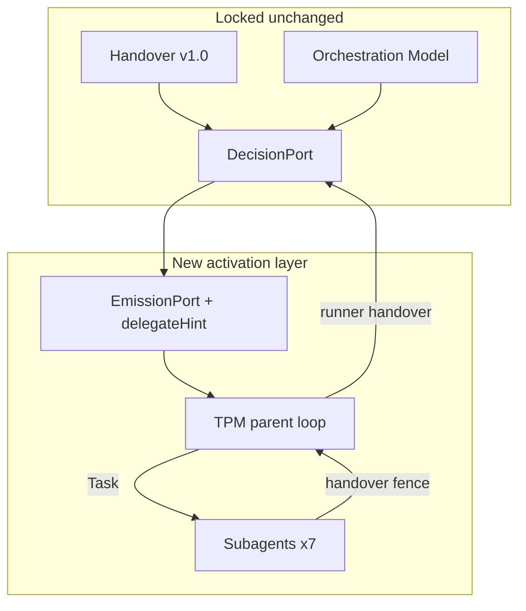

# ADR: Pivot 1 Subagent Delegation — Implementation

**Status:** Accepted (design)  
**Date:** 2026-07-17  
**Context:** Implementation epic `wf-2026-07-17-pivot1-impl-01`. Grind 2 Solution Architect. Builds on [FRAMEWORK_PIVOT1_SUBAGENT_MAPPING.md](FRAMEWORK_PIVOT1_SUBAGENT_MAPPING.md) (spike Go). TPM Output Contract includes **Success Criterion**: workflow TPM → Solution Architect → QA → Documentation without manual `@role` between specialist steps.

**Related:** [FRAMEWORK_PIVOT1_SUBAGENT_MAPPING.md](FRAMEWORK_PIVOT1_SUBAGENT_MAPPING.md), [workflow-runner.md](../workflow-runner.md), [cursor-implementation.md](../cursor-implementation.md)

---

## Problem

Framework v2.4 automates routing (Runner) but requires manual `@role` for each specialist. Pivot 1 spike confirmed subagents can replace activation without changing Handover, Orchestration Model, Engine, or DecisionPort. Implementation must realize automatic TPM → Task → subagent delegation driven by Runner emissions.

---

## Decision

### D1 — Activation architecture (three components)

| Component                                                          | Responsibility                                                                       | Owner                                                 |
| ------------------------------------------------------------------ | ------------------------------------------------------------------------------------ | ----------------------------------------------------- |
| **Workflow Runner** (unchanged DecisionPort)                       | Parse Handover → emit Start/Continue/Rework/Pause/Complete + **DelegationPort hint** | Backend                                               |
| **TPM parent agent** (composer, `@role-technical-project-manager`) | Orchestration loop: Runner CLI → Task delegate → extract handover → repeat           | Cursor rule + cursor-implementation                   |
| **Specialist subagents** (`.cursor/agents/<slug>.md`)              | Execute role mandate; return Output Contract + `handover` fence                      | Backend creates files; content from `docs/ai/roles/*` |



### D2 — DelegationPort (additive emission)

Extend `emissionPort.js` only. **Do not** modify `decisionPort.js`, `handoverParser.js`, or `runner.js` control flow.

```javascript
// New — parallel to activateHint (kept for manual fallback)
function delegateHint(role) {
  const slug = ROLE_SLUGS[role];
  if (!slug) return 'Delegate: (unknown role)';
  return `Delegate: ${slug}`;
}
```

| Emission field     | Type              | Example                                                         |
| ------------------ | ----------------- | --------------------------------------------------------------- |
| `activateHint`     | string (existing) | `Activate: @.cursor/rules/role-solution-architect.mdc (manual)` |
| `delegateSubagent` | string (new)      | `solution-architect`                                            |
| `delegateHint`     | string (new)      | `Delegate: solution-architect`                                  |

Include `delegateHint` line in `emitStart`, `emitContinue`, `emitRework` text bodies (after `activateHint`). Pause/Resume/Complete unchanged.

**Tests:** Add cases in `runner.test.js` asserting `delegateSubagent` and `delegateHint` for Continue emission.

### D3 — Role → subagent mapping (unchanged from spike)

Reuse `ROLE_SLUGS` in `constants.js` — subagent `name` equals slug. No second mapping table.

| Canonical role           | Subagent file                                | `readonly` |
| ------------------------ | -------------------------------------------- | ---------- |
| Solution Architect       | `.cursor/agents/solution-architect.md`       | true       |
| UI/UX Designer           | `.cursor/agents/ui-ux-designer.md`           | true       |
| Backend Developer        | `.cursor/agents/backend-developer.md`        | false      |
| Frontend Developer       | `.cursor/agents/frontend-developer.md`       | false      |
| QA / Code Reviewer       | `.cursor/agents/qa-code-reviewer.md`         | true       |
| Security Expert          | `.cursor/agents/security-expert.md`          | true       |
| Documentation Specialist | `.cursor/agents/documentation-specialist.md` | false      |

TPM is **not** a subagent file.

### D4 — Subagent file template (normative)

Each file under `.cursor/agents/`:

```markdown
---
name: <slug>
description: <one line from docs/ai/roles/<slug>.md §1>
model: inherit
readonly: <per mapping table>
---

You are <Canonical Role Name> in the AI development team.

Role SSOT: docs/ai/roles/<slug>.md
Team workflow: docs/ai/team-workflow.md
Handover schema: docs/ai/handover-contract.md

## Mandate

<compressed: responsibilities, limits, Output Contract fields from role doc>

## Inputs (mandatory)

Use ONLY: Assignment Brief, prior Output Contract, prior Handover Contract from the Task prompt.
Do NOT use parent chat history.

## Required output (in this order)

1. Role Output Contract (fields per role SSOT)
2. Fenced block with language tag `handover` (Handover Version 1.0, all mandatory fields)
3. Line: Överlämning:\n<role> (non-authoritative)

Never set Next Role in Handover. Never choose the next role.
```

Subagent body **references** `docs/ai/roles/*` — does not duplicate full role doc.

### D5 — TPM orchestration protocol (normative)

Document in `cursor-implementation.md` § _TPM subagent orchestration_. Update `role-technical-project-manager.mdc` with additive section **Subagent orchestration mode**.

**Preconditions:**

- Agent mode (Task tool available)
- User started TPM and approved Grind 1 (only manual specialist selection allowed before loop)
- `InstanceId` known

**Loop:**

| Step | TPM action                                                                                                                               |
| ---- | ---------------------------------------------------------------------------------------------------------------------------------------- |
| 1    | `npm run workflow-runner -- start --id <id> --type <type> --gate-na ... --dod "..."`                                                     |
| 2    | Read emission: `command`, `Role`, `delegateSubagent`, `Brief`                                                                            |
| 3    | If `command` ∈ {Start, Continue, Rework}: **immediately** `Task(subagent=delegateSubagent, prompt=buildPrompt(...))` — **no user @role** |
| 4    | From subagent result: extract `handover` fence verbatim                                                                                  |
| 5    | Write to `.workflow-runner/handovers/<InstanceId>-<n>.md`                                                                                |
| 6    | `npm run workflow-runner -- handover --id <id> --file <path>`                                                                            |
| 7    | If emission `command` = Continue/Rework/Start → go to step 2                                                                             |
| 8    | If Pause → present question; on user answer: `resume --decision "..."` then step 2                                                       |
| 9    | If Complete → report to user                                                                                                             |

**`buildTaskPrompt` structure:**

```text
[Framework Assignment]
InstanceId: <id>
Engine command: <Start|Continue|Rework>
Role: <canonical role name>
Brief: <from emission>

[Prior Output Contract]
<compressed output from previous specialist only>

[Prior Handover]
<verbatim handover fence from previous specialist>
```

Store last Output Contract in TPM session notes (or `.workflow-runner/artifacts/<id>/step-<n>-output.md`) for next prompt.

**Automatic delegation rule (critical for Success Criterion):** After step 6, if next emission is Start/Continue/Rework, TPM **must** invoke Task in the **same turn** without asking user to pick the next role.

### D6 — Acceptance test workflow type

Success Criterion requires sequence **SA → QA → Documentation**. No existing `WorkflowType` matches exactly without extra roles.

**Decision:** Add **`DelegatorAcceptance`** to `WORKFLOW_SEQUENCES` in `constants.js` only:

```javascript
DelegatorAcceptance: [
  ROLES.TPM,
  ROLES.ARCHITECT,
  ROLES.QA,
  ROLES.DOCS,
  ROLES.TPM,
],
```

- **Not** added to `orchestration-model.md` §7 in this epic (test-only constant).
- QA live test command:

```bash
npm run workflow-runner -- start --id wf-accept-delegator-01 \
  --type DelegatorAcceptance \
  --dod "SA→QA→Docs without manual @role"
```

### D7 — Handover artifact storage

| Path                          | Purpose                                    | Git        |
| ----------------------------- | ------------------------------------------ | ---------- |
| `.workflow-runner/instances/` | Instance JSON (existing)                   | gitignored |
| `.workflow-runner/handovers/` | Handover fences per step                   | gitignored |
| `.workflow-runner/artifacts/` | Output Contract snapshots for Task prompts | gitignored |

Extend `.gitignore` comment if needed; path already under `.workflow-runner/`.

### D8 — What stays unchanged

| Artifact                                                 | Change                                                                             |
| -------------------------------------------------------- | ---------------------------------------------------------------------------------- |
| `handover-contract.md`                                   | None                                                                               |
| `orchestration-model.md`                                 | None                                                                               |
| `workflow-engine.md`                                     | None                                                                               |
| `workflow-runner.md`                                     | Optional additive §7 note for DelegationPort (Documentation epic, separate commit) |
| `decisionPort.js`                                        | None                                                                               |
| `handoverParser.js`                                      | None                                                                               |
| `runner.js`                                              | None                                                                               |
| `.cursor/rules/role-*.mdc` (except TPM additive section) | Unchanged                                                                          |

---

## Backend / Frontend responsibility

| Layer                        | Deliverable                                                                                                                          |
| ---------------------------- | ------------------------------------------------------------------------------------------------------------------------------------ |
| **Backend**                  | `delegateHint` + emission fields in `emissionPort.js`; `DelegatorAcceptance` in `constants.js`; tests; 7 `.cursor/agents/*.md` files |
| **Frontend**                 | **N/A**                                                                                                                              |
| **Documentation Specialist** | `cursor-implementation.md` TPM protocol; TPM `.mdc` additive section; CHANGELOG; optional `workflow-runner.md` DelegationPort note   |
| **QA**                       | Execute Success Criterion live; sign off                                                                                             |
| **Security**                 | Review `.cursor/agents/` content and delegation trust boundary                                                                       |

---

## Success Criterion verification (QA)

| Step | Role                | Manual user action?                                      |
| ---- | ------------------- | -------------------------------------------------------- |
| 0    | User                | Start `@role-technical-project-manager`; approve Grind 1 |
| 1    | TPM → SA subagent   | No `@role`                                               |
| 2    | TPM → QA subagent   | No `@role`                                               |
| 3    | TPM → Docs subagent | No `@role`                                               |
| 4    | TPM → Complete      | Report                                                   |

**Pass:** User did not `@role` any specialist between steps 1–3. TPM delegated per Runner `delegateSubagent`.

**Fail triggers:** TPM asks user to pick next role; Task blocked; handover parse error without recovery.

---

## Risks

| ID  | Risk                                          | Severity | Mitigation                                                          |
| --- | --------------------------------------------- | -------- | ------------------------------------------------------------------- |
| R1  | TPM does not auto-Task in same turn           | High     | Normative protocol in `.mdc` + cursor-implementation; QA tests live |
| R2  | Subagent omits handover fence                 | Medium   | Parser → Pause; subagent template mandates fence                    |
| R3  | Task tool blocked in mode/policy              | Medium   | Document Agent-mode requirement                                     |
| R4  | `DelegatorAcceptance` drifts from prod types  | Low      | Test-only; document not promoted to OM §7                           |
| R5  | Role content drift `.mdc` vs `.cursor/agents` | Medium   | SSOT `docs/ai/roles/*`; agents reference only                       |

---

## Alternatives considered

1. **Hooks `stop` + `followup_message`** — Rejected: unverified `@role` in message; loop_limit; not deterministic delegation.
2. **New WorkflowType in Orchestration Model SSOT** — Rejected for epic scope; constants-only test type sufficient.
3. **Remove `activateHint`** — Rejected: keep manual fallback per spike.

---

## Consequences

- Backend implements D2, D3, D6, D7.
- Documentation updates TPM rule and cursor-implementation before QA live test.
- Security reviews new agent files.
- No production deploy in this epic.
