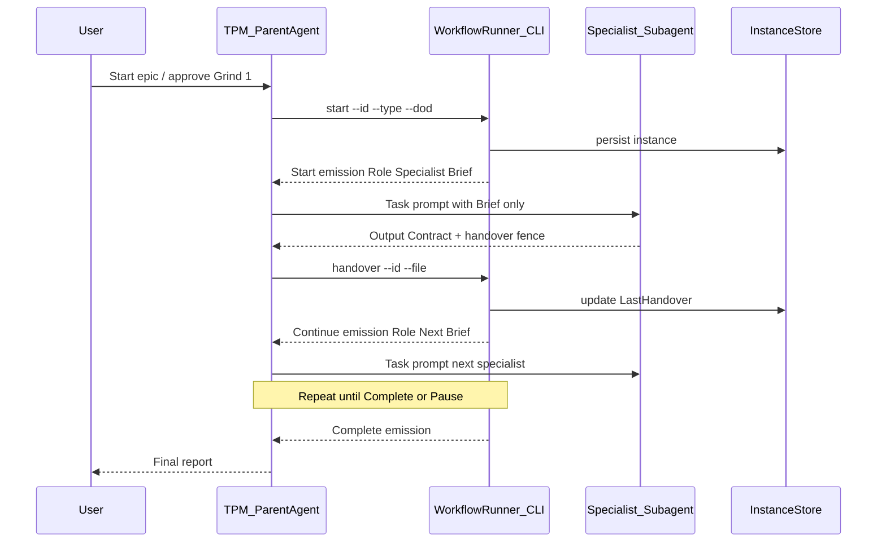
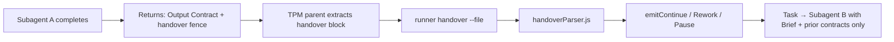

# ADR: Pivot 1 – Framework Role Mapping to Cursor Subagents

**Status:** Accepted (spike complete)  
**Date:** 2026-07-17  
**Context:** Epic `wf-2026-07-17-pivot1-subagents-01` — Grind 1 approved. Follows [FRAMEWORK_AUTOMATION_FEASIBILITY.md](FRAMEWORK_AUTOMATION_FEASIBILITY.md) (**PIVOT** → Pivot 1 subagent-native). Goal: verify Framework roles can be represented as Cursor Subagents with minimal change to locked SSOTs.

**Related:** [handover-contract.md](../handover-contract.md), [workflow-runner.md](../workflow-runner.md), [cursor-implementation.md](../cursor-implementation.md), [FRAMEWORK_AUTOMATION_FEASIBILITY.md](FRAMEWORK_AUTOMATION_FEASIBILITY.md)

---

## Executive summary

| Item                                      | Outcome                                                                                                                                                                                               |
| ----------------------------------------- | ----------------------------------------------------------------------------------------------------------------------------------------------------------------------------------------------------- |
| **Recommendation**                        | **Go** — for a bounded **implementation epic** (not this spike)                                                                                                                                       |
| **Migration without major redesign?**     | **Yes** — locked layers (Handover `1.0`, Orchestration Model, Workflow Engine, Runner DecisionPort) remain unchanged. Only the **activation layer** (`@role` → Task/subagent delegation) is replaced. |
| **TPM role**                              | **Parent orchestrator** in the composer session — not a subagent. Specialist roles map to `.cursor/agents/*.md`.                                                                                      |
| **Locked SSOT changes in implementation** | **None required** to core Framework docs. Additive: `cursor-implementation.md`, optional `DelegationPort` hint in Runner emission (ADR-gated).                                                        |

---

## 1. Role-to-subagent mapping

Canonical role names from [handover-contract.md](../handover-contract.md) §7. Slugs align with `ROLE_SLUGS` in [`tools/workflow-runner/constants.js`](../../../tools/workflow-runner/constants.js).

| #   | Framework role (`Current Role`) | Subagent file (proposed)                     | `name` (frontmatter)       | SSOT source                                  | Existing `.mdc`                      | Subagent mode                                                 |
| --- | ------------------------------- | -------------------------------------------- | -------------------------- | -------------------------------------------- | ------------------------------------ | ------------------------------------------------------------- |
| 1   | Technical Project Manager       | _(none — parent orchestrator)_               | —                          | `docs/ai/roles/technical-project-manager.md` | `role-technical-project-manager.mdc` | Parent agent in composer; runs Runner CLI; delegates via Task |
| 2   | Solution Architect              | `.cursor/agents/solution-architect.md`       | `solution-architect`       | `docs/ai/roles/solution-architect.md`        | `role-solution-architect.mdc`        | `readonly: true`                                              |
| 3   | UI/UX Designer                  | `.cursor/agents/ui-ux-designer.md`           | `ui-ux-designer`           | `docs/ai/roles/ui-ux-designer.md`            | `role-ui-ux-designer.mdc`            | `readonly: true`                                              |
| 4   | Backend Developer               | `.cursor/agents/backend-developer.md`        | `backend-developer`        | `docs/ai/roles/backend-developer.md`         | `role-backend-developer.mdc`         | `readonly: false`                                             |
| 5   | Frontend Developer              | `.cursor/agents/frontend-developer.md`       | `frontend-developer`       | `docs/ai/roles/frontend-developer.md`        | `role-frontend-developer.mdc`        | `readonly: false`                                             |
| 6   | QA / Code Reviewer              | `.cursor/agents/qa-code-reviewer.md`         | `qa-code-reviewer`         | `docs/ai/roles/qa-code-reviewer.md`          | `role-qa-code-reviewer.mdc`          | `readonly: true`                                              |
| 7   | Security Expert                 | `.cursor/agents/security-expert.md`          | `security-expert`          | `docs/ai/roles/security-expert.md`           | `role-security-expert.mdc`           | `readonly: true`                                              |
| 8   | Documentation Specialist        | `.cursor/agents/documentation-specialist.md` | `documentation-specialist` | `docs/ai/roles/documentation-specialist.md`  | `role-documentation-specialist.mdc`  | `readonly: false`                                             |

### Mapping rules (normative for implementation)

1. **SSOT for role content:** `docs/ai/roles/*.md` — subagent body references role doc; does not duplicate Output Contract fields.
2. **Subagent frontmatter** (per [Cursor Subagents](https://cursor.com/docs/agent/subagents)):
   - `name`: kebab-case slug (matches table).
   - `description`: one line for Task tool routing hints (derived from role doc §1 Syfte).
   - `model: inherit` unless role requires specific model.
   - `readonly`: `true` for roles that must not write code (Architect, Designer, QA, Security); `false` for implementers and Docs.
3. **`.mdc` rules:** remain for **manual** `@role` activation during transition. Not removed in implementation epic v1.
4. **TPM is not a subagent:** Orchestration (Runner invoke, Task delegation, Pause/Resume) requires a persistent parent with full session context. Subagents start with clean context ([Cursor docs](https://cursor.com/docs/agent/subagents) — "Subagents start with a clean context").

### Subagent prompt template (informative — implementation epic)

Each `.cursor/agents/<slug>.md` should include:

```markdown
---
name: <slug>
description: <one-line from role doc>
model: inherit
readonly: <true|false per table>
---

You are <Canonical Role Name> in the AI development team.

Full role description (SSOT): docs/ai/roles/<slug>.md
Team workflow: docs/ai/team-workflow.md

## Mandate

<compressed from role doc — responsibilities, limits, Output Contract fields>

## Inputs

Use ONLY the assignment brief, prior Output Contract, and Handover Contract provided in the Task prompt. Do not rely on parent chat history.

## Required output

1. Role-specific Output Contract (fields per role doc / .mdc)
2. Fenced Handover Contract (Handover Version 1.0) — schema in docs/ai/handover-contract.md
3. Communicative line: Överlämning:\n<role> (non-authoritative)

Do NOT choose the next role. Do NOT set Next Role in Handover.
```

---

## 2. Framework reuse vs required changes

### 2.1 Unchanged (locked)

| Layer       | Document / code                                                                                  | Why unchanged                                                 |
| ----------- | ------------------------------------------------------------------------------------------------ | ------------------------------------------------------------- |
| Signal      | [handover-contract.md](../handover-contract.md) v1.0                                             | Subagents emit same `handover` fence; Runner parses unchanged |
| Policy      | [orchestration-model.md](../orchestration-model.md)                                              | TPM/Runner routing logic identical                            |
| Engine      | [workflow-engine.md](../workflow-engine.md)                                                      | Lifecycle, commands, §10 templates unchanged                  |
| Runner core | [workflow-runner.md](../workflow-runner.md), `decisionPort.js`, `handoverParser.js`, `runner.js` | DecisionPort and Orchestration Model §5 untouched             |
| Gates       | [team-workflow.md](../team-workflow.md)                                                          | Stage Gates and rework loops unchanged                        |
| Role SSOT   | `docs/ai/roles/*`                                                                                | Content source for subagent prompts                           |

### 2.2 Activation layer only (replace)

| Today                                                                  | Pivot 1 target                                                                   |
| ---------------------------------------------------------------------- | -------------------------------------------------------------------------------- |
| `ActivationPort` → `Activate: @.cursor/rules/role-<slug>.mdc (manual)` | **DelegationPort** → `Delegate: <subagent-name>` + Task invocation by TPM parent |
| User manually `@role`                                                  | TPM parent runs `Task` with `subagent_type` / custom agent name                  |
| Specialist in main chat                                                | Specialist in isolated subagent context; returns summary + Handover              |

### 2.3 Additive changes (implementation epic — ADR-gated, not locked SSOT edits)

| Artifact                                                | Change                                                                               | Necessity                                                          |
| ------------------------------------------------------- | ------------------------------------------------------------------------------------ | ------------------------------------------------------------------ |
| `.cursor/agents/*.md` (7 files)                         | Create specialist subagents                                                          | **Required** for activation                                        |
| `tools/workflow-runner/emissionPort.js`                 | Add `delegateHint(role)` alongside `activateHint`; emission field `delegateSubagent` | **Recommended** — parallel hint, no DecisionPort change            |
| [cursor-implementation.md](../cursor-implementation.md) | Subagent orchestration protocol                                                      | **Required**                                                       |
| Optional Cursor skill                                   | Thin wrapper: parse emission → suggest Task prompt                                   | **Optional** — UX only                                             |
| `workflow-runner.md`                                    | Document optional DelegationPort in §7 (minor additive SSOT)                         | **Only if implementation adopts delegate hint** — separate Grind 1 |

**No change required** to Handover Contract, Orchestration Model, or Workflow Engine SSOT prose for Go.

---

## 3. Runner → subagent delegation design

### 3.1 Architecture



### 3.2 Per engine command

| Command    | Runner output (unchanged semantics)       | TPM parent action                                                             |
| ---------- | ----------------------------------------- | ----------------------------------------------------------------------------- |
| `Start`    | First specialist role + brief             | `Task` → mapped subagent with brief                                           |
| `Continue` | Next role + brief + last handover summary | `Task` → next subagent; prompt includes prior Output Contract + Handover only |
| `Rework`   | Rework target + reasons                   | `Task` → rework subagent; cite rejection                                      |
| `Pause`    | Question for user                         | Present to user; wait; `resume` CLI on answer                                 |
| `Resume`   | Next command                              | Follow resulting branch                                                       |
| `Complete` | DoD summary                               | Report to user; close instance                                                |

### 3.3 Workflow State → delegation (verification)

Runner already maps Handover `Workflow State` via Orchestration Model §5 → engine command. **No Runner change** needed for this mapping.

| Handover `Workflow State` + matrix row | Engine command | Subagent delegation                                          |
| -------------------------------------- | -------------- | ------------------------------------------------------------ |
| `Passed` + Approved (row 7)            | `Continue`     | TPM delegates to **next** subagent in Workflow Type sequence |
| `Blocked` / Rejected (row 4)           | `Rework`       | TPM delegates to **rework target** subagent                  |
| `Awaiting User Decision` (row 1)       | `Pause`        | No delegation — user decision                                |
| `Complete` (row 3)                     | `Complete`     | No delegation — TPM closes                                   |

**Verified:** DecisionPort logic in `decisionPort.js` is product-agnostic; delegation is **downstream of EmissionPort**, consistent with v2.4 port design (ActivationPort was always hint-only).

### 3.4 Parallel Backend + Frontend (Grind 1 allowed)

When Orchestration Model §8 allows parallel implementation:

- TPM may issue **two Task calls in one message** (documented: [Cursor Subagents — parallel execution](https://cursor.com/docs/agent/subagents)).
- Runner `ActiveRole` tracks one role at a time — implementation epic must define instance extension or sequential handovers per developer before QA.
- **Spike note:** Parallel path needs implementation-epic ADR for instance fields; not a blocker for Go on sequential workflow.

---

## 4. Handover flow between subagents

### 4.1 Problem

Subagents have **isolated context** — they do not see parent chat or prior subagent transcripts. Handover Contract v1.0 must still be produced and consumed by Runner without NLP.

### 4.2 Design (preserves Handover `1.0`)



| Step | Owner               | Requirement                                                                                       |
| ---- | ------------------- | ------------------------------------------------------------------------------------------------- |
| 1    | Specialist subagent | Emit `handover` fence with all mandatory fields; `Current Role` = canonical name                  |
| 2    | TPM parent          | Extract fenced block verbatim from subagent return (no rewriting of fields)                       |
| 3    | TPM parent          | `npm run workflow-runner -- handover --id <InstanceId> --file <path>`                             |
| 4    | Runner              | Parse v1.0; apply matrix; emit next assignment                                                    |
| 5    | TPM parent          | Build Task prompt: Engine brief + **only** prior Output Contract + Handover (Kontextkomprimering) |
| 6    | Next subagent       | Treat prompt as sole context; produce new Output + Handover                                       |

### 4.3 Handover Contract invariants (unchanged)

- No `Next Role` field.
- `Status` vs `Workflow State` both mandatory.
- `Överlämning:\n<role>` remains non-authoritative.
- Runner remains sole routing authority after handover ingress.

### 4.4 Risk: subagent omits or malforms handover

| Mitigation                                                         |
| ------------------------------------------------------------------ |
| Subagent prompt mandates handover fence (template §1)              |
| `handoverParser.js` rejects invalid handover → Pause — TPM (row 8) |
| QA checklist in implementation epic for each role subagent         |

---

## 5. Cursor Subagent limitations and Framework impact

| Limitation                             | Source                                                 | Framework impact                                                         | Mitigation                                                               |
| -------------------------------------- | ------------------------------------------------------ | ------------------------------------------------------------------------ | ------------------------------------------------------------------------ |
| **Clean context per subagent**         | Cursor subagents docs                                  | Prior chat not visible; Kontextkomprimering **mandatory** in Task prompt | TPM injects Output Contract + Handover only                              |
| **TPM cannot be subagent**             | Orchestration needs persistent Runner + user Pause     | TPM = parent agent, not `.cursor/agents/tpm.md` for orchestration loop   | User starts `@role-technical-project-manager` or equivalent parent setup |
| **Task tool required**                 | Subagent invocation                                    | Ask/Plan modes may block delegation                                      | Document: Framework workflows run in **Agent mode**                      |
| **Nesting limit**                      | Cursor 2.5: subagent-of-subagent cannot launch further | Specialist subagents must not delegate to other role subagents           | All role-to-role transitions via TPM parent + Runner                     |
| **`subagentStart` hooks**              | Hooks docs                                             | Can deny spawning                                                        | Implementation epic: project hooks policy                                |
| **`readonly` flag**                    | Subagents docs                                         | QA/Security/Architect cannot write files                                 | Set `readonly: true` per mapping table                                   |
| **No built-in Handover parse in Task** | Platform                                               | Parent must extract fence and call Runner                                | TPM protocol in cursor-implementation                                    |
| **Parallel subagents**                 | Documented                                             | Backend+Frontend parallel needs explicit coordination                    | Instance extension in implementation ADR                                 |
| **User Pause**                         | Orchestration Model §6                                 | `Requires User Input: Yes` still stops automation                        | Unchanged — by design                                                    |
| **Release Discipline**                 | team-workflow §9                                       | Subagents do not bypass prod rules                                       | engineering-principles alwaysApply + role prompts                        |

---

## 6. Migration assessment — major redesign required?

| Question                      | Answer                                                                             |
| ----------------------------- | ---------------------------------------------------------------------------------- |
| Redesign Handover Contract?   | **No**                                                                             |
| Redesign Orchestration Model? | **No**                                                                             |
| Redesign Workflow Engine?     | **No**                                                                             |
| Redesign Runner DecisionPort? | **No**                                                                             |
| Redesign Stage Gates?         | **No**                                                                             |
| Replace activation mechanism? | **Yes** — `@role` → TPM + Task + subagent                                          |
| New artifacts?                | **Yes** — 7 subagent files, cursor-implementation protocol, optional emission hint |
| Deprecate `.mdc` rules?       | **Not in v1** — keep for manual fallback                                           |

**Verdict:** Migration to subagent model is **incremental** — activation swap on top of existing v2.4 stack. Not a major Framework redesign.

---

## 7. Recommendation

### Decision: **Go** (for bounded implementation epic)

| Option                               | Verdict      | Rationale                                                                                                                                                                                                                               |
| ------------------------------------ | ------------ | --------------------------------------------------------------------------------------------------------------------------------------------------------------------------------------------------------------------------------------- |
| **Go**                               | **Accepted** | Official Cursor subagents + Task delegation support custom role agents. Locked Framework layers reuse without change. Handover `1.0` preserved via parent-mediated Runner ingress. Design is traceable parent → Runner → next subagent. |
| **Pivot** (alternative architecture) | Not needed   | Would apply if subagents could not represent role mandates — not the case.                                                                                                                                                              |
| **Stop**                             | Rejected     | Would abandon viable path confirmed by feasibility ADR.                                                                                                                                                                                 |

### Conditions for implementation epic Go

1. **Scope:** Sequential workflow first (one Workflow Type end-to-end, e.g. `Framework` or `DocsOnly`).
2. **Live verification:** At least one gate transition (e.g. Documentation Specialist → QA) with Task + Runner + Handover parse — documents **verified** behaviour.
3. **No locked SSOT edits** without separate Grind 1; `workflow-runner.md` DelegationPort note only if delegate hint shipped.
4. **Security review** when `.cursor/agents/` and any hooks are committed.
5. **TPM parent protocol** documented before subagent files.

### Explicit non-decisions (this spike)

- No `.cursor/agents/` files created
- No `emissionPort.js` changes
- No hooks.json
- No parallel Backend+Frontend instance model (deferred to implementation ADR)

---

## 8. Implementation epic outline (informative — not started)

| Phase | Deliverable                                                |
| ----- | ---------------------------------------------------------- |
| 1     | TPM orchestration protocol in `cursor-implementation.md`   |
| 2     | Create 7 `.cursor/agents/*.md` from role SSOT              |
| 3     | Add `delegateHint` to `emissionPort.js` (additive)         |
| 4     | Live test: `Framework` workflow type, Docs → QA transition |
| 5     | QA + Security + Docs + TPM close                           |

---

## 9. Evidence log

| #   | Claim                                                                 | Source                                                                     |
| --- | --------------------------------------------------------------------- | -------------------------------------------------------------------------- |
| E1  | Custom subagents in `.cursor/agents/*.md` with YAML frontmatter       | [cursor.com/docs/agent/subagents](https://cursor.com/docs/agent/subagents) |
| E2  | Subagents start with clean context; parent includes context in prompt | Same                                                                       |
| E3  | Parallel Task calls supported                                         | Same                                                                       |
| E4  | `readonly` restricts writes                                           | Same                                                                       |
| E5  | Nesting limit on subagent-of-subagent                                 | Same (Cursor 2.5)                                                          |
| E6  | Runner ActivationPort manual only; emission hint pattern              | `emissionPort.js`, `workflow-runner.md` FR-8                               |
| E7  | ROLE_SLUGS align role names to slugs                                  | `tools/workflow-runner/constants.js`                                       |
| E8  | Handover v1.0 schema and no Next Role                                 | `handover-contract.md`                                                     |

---

## 10. QA review (Grind 4)

**Reviewer:** QA / Code Reviewer  
**Date:** 2026-07-17  
**Verdict:** **Approved**

| Check                                            | Result                               |
| ------------------------------------------------ | ------------------------------------ |
| All eight canonical roles mapped                 | Pass — §1 (TPM as parent documented) |
| Reuse vs change analysis                         | Pass — §2                            |
| Runner → subagent delegation design              | Pass — §3                            |
| Handover `1.0` preservation                      | Pass — §4                            |
| Subagent limitations documented                  | Pass — §5                            |
| Go / Pivot / Stop with rationale                 | Pass — **Go** §7 with conditions     |
| No implementation in spike                       | Pass — D1 respected                  |
| Locked SSOTs not modified                        | Pass                                 |
| Consistent with FRAMEWORK_AUTOMATION_FEASIBILITY | Pass                                 |

**Note:** Live Task verification correctly deferred to implementation epic per Grind 1 D1. Go is conditional on implementation epic live test.

---

## 11. Sign-off

| Role                      | Status   |
| ------------------------- | -------- |
| Solution Architect        | Complete |
| QA / Code Reviewer        | Approved |
| Documentation Specialist  | Complete |
| Technical Project Manager | Complete |
