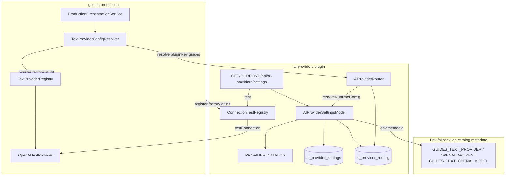

# ADR — P-AI-SETTINGS: AI Provider Configuration (Settings + DB)

**Status:** Backend + frontend implementerade. Provider Management UI (lista/visa/lägg till/redigera/ta bort) implementerad 2026-07-17. Multi-provider-katalog + modellistor i katalog. **Provider routing** (global default + per-plugin override, `AIProviderRouter`) implementerad 2026-07-17; migration `101` lokal körd; **Security Grind 5 godkänd 2026-07-17**. Plattformsgeneralisering QA + Security godkända 2026-07-16. Provider Management QA + Security godkända 2026-07-17. **Ej commit/deployad.**  
**Epic:** P-AI-SETTINGS  
**Relaterad:** [`P-TEXT_TEXT_PROVIDER.md`](P-TEXT_TEXT_PROVIDER.md) (text-adapter; denna ADR äger runtime-konfiguration)  
**Datum:** 2026-07-16 (uppdaterad 2026-07-17: multi-katalog, routing, modellistor, Security routing)

---

## Sammanfattning

P-AI-SETTINGS flyttar AI-provider-konfiguration (aktivera/avaktivera, API-nyckel, standardmodell, anslutningstest) från enbart miljövariabler till **tenant-/användarscoped Settings i databasen**, med env som bakåtkompatibel fallback.

**Värde:** Redaktören kan konfigurera AI-provider utan att ändra `.env` / Railway-variabler. Pluginet är en **plattformskapabilitet**: katalog + credentials-upplösning + connection-test-registry + **routing** ägs av `ai-providers`; domänplugins (t.ex. Guides) konsumerar resolved config utan leverantörsspecifika grenar.

**Katalog (settings/routing):** flera providers (t.ex. `openai`, `anthropic`, `google`, `xai`, `mistral`, `cohere`, `deepseek`, `openrouter`, `azure-openai`) med `models[]` per typ.  
**Text-runtime (Guides):** endast `openai` (+ `noop`) har registrerad text-adapter och connection test i v1.

---

## Beslut

| Beslut                 | Val                                                                       | Motivering                                                                                      |
| ---------------------- | ------------------------------------------------------------------------- | ----------------------------------------------------------------------------------------------- |
| Lagring                | Tabell `ai_provider_settings` i tenant-DB                                 | Per `user_id` + `provider_key`; samma mönster som mail/pulses-settings                          |
| Plugin                 | Plugin `ai-providers` (`/api/ai-providers`)                               | Isolerad settings-yta; plugin-gate via `requirePlugin`                                          |
| Provider-metadata      | `PROVIDER_CATALOG` i `ai-providers`                                       | Datadrivna defaults + env-namn; ingen `if (providerKey === 'openai')` i modell                  |
| Credentials-upplösning | `AIProviderSettingsModel.resolveRuntimeConfig`                            | DB/env credentials per `provider_key`                                                           |
| Provider routing       | `AIProviderRouter.resolve(req, { pluginKey })`                            | Plugin → routing → credentials; precedence: plugin override → global → legacy                   |
| Guides-resolver        | Tunn `TextProviderConfigResolver`                                         | Anropar `AIProviderRouter` med `pluginKey: 'guides'`; mappar till `TextProviderRegistry.create` |
| Connection test        | `ConnectionTestRegistry` + valfri `testConnection()` på provider-kontrakt | Controllern importerar/instansierar aldrig en specifik adapter                                  |
| Registrering           | Guides `ensureTextProvidersRegistered`                                    | Registrerar factory i både `TextProviderRegistry` och `ConnectionTestRegistry`                  |
| Hemligheter i API      | Maskerad `apiKey` (`••••••••`); rå nyckel endast server-side              | Paritet med mail/pulses                                                                         |
| Hemligheter i DB       | Klartext i `api_key`                                                      | Paritet med mail/pulses; Neon at-rest; se accepterad risk A1                                    |
| Frontend-UI            | Tools → AI Providers; lista + detaljvy + panel (skapa/redigera)           | Ingest/contacts-mönster: listvy, `view`-läge, slide-over panel                                  |

---

## Arkitekturöversikt



**Prioritetsordning (plugin routing — `AIProviderRouter.resolve`):**

1. Per-plugin assignment i `ai_provider_routing` (`scope = pluginKey`, t.ex. `guides`).
2. Global default i `ai_provider_routing` (`scope = '*'`).
3. Legacy: första enabled DB-provider i katalogordning (`getPreferredEnabledProviderKey`).
4. Guides env-fallback: `GUIDES_TEXT_PROVIDER` → default `noop`.

**Prioritetsordning (credentials per provider — `resolveRuntimeConfig`):**

1. Rad i `ai_provider_settings` med `enabled = true` **och** lagrad `api_key` → DB-nyckel + `default_model`.
2. Annars: env via katalogmetadata (`OPENAI_API_KEY`, `GUIDES_TEXT_OPENAI_MODEL` för `openai`).

Routing-modell i steg 1–2 kan åsidosätta `default_model` från credentials-raden.

---

## Datamodell

Migration: `server/migrations/100-ai-provider-settings.sql`

| Kolumn                      | Typ                            | Kommentar                                   |
| --------------------------- | ------------------------------ | ------------------------------------------- |
| `id`                        | SERIAL PK                      |                                             |
| `user_id`                   | INT NOT NULL                   | Tenant-användare                            |
| `provider_key`              | VARCHAR(50) NOT NULL           | Whitelist = katalognycklar (multi-provider) |
| `enabled`                   | BOOLEAN NOT NULL DEFAULT FALSE |                                             |
| `api_key`                   | TEXT                           | Klartext; nullable                          |
| `default_model`             | VARCHAR(255)                   | Katalogdefault för `openai`: `gpt-4o-mini`  |
| `created_at` / `updated_at` | TIMESTAMP                      |                                             |
| UNIQUE                      | `(user_id, provider_key)`      |                                             |

Migration: `server/migrations/101-ai-provider-routing.sql`

| Kolumn                      | Typ                   | Kommentar                                                |
| --------------------------- | --------------------- | -------------------------------------------------------- |
| `id`                        | SERIAL PK             |                                                          |
| `user_id`                   | INT NOT NULL          | Tenant-användare                                         |
| `scope`                     | VARCHAR(100) NOT NULL | `*` = global default; annars plugin key (t.ex. `guides`) |
| `provider_key`              | VARCHAR(50) NOT NULL  | Whitelist = katalognycklar                               |
| `model`                     | VARCHAR(255)          | NULL = använd providerns konfigurerade default           |
| `created_at` / `updated_at` | TIMESTAMP             |                                                          |
| UNIQUE                      | `(user_id, scope)`    |                                                          |

---

## API-kontrakt (backend, verifierat)

Plugin: `ai-providers` — `routeBase: /api/ai-providers`, `requiredRole: user`.  
Auth: session + `requirePlugin('ai-providers')`. CSRF på muterande routes.

HTTP-former **oförändrade** av plattformsgeneraliseringen.

### `GET /api/ai-providers/settings`

**Svar:** `{ providers: ProviderSettings[] }` — **endast konfigurerade** providers (rader i `ai_provider_settings` för aktuell tenant-användare).

_Tidigare:_ en post per katalog-provider även utan DB-rad. Efter Provider Management UI returneras endast sparade konfigurationer.

`ProviderSettings` (maskerad):

| Fält                      | Typ               | Kommentar                               |
| ------------------------- | ----------------- | --------------------------------------- |
| `id`                      | string \| null    | null om ingen rad                       |
| `userId`                  | string \| null    |                                         |
| `providerKey`             | string            | t.ex. `openai`                          |
| `enabled`                 | boolean           |                                         |
| `defaultModel`            | string            |                                         |
| `apiKey`                  | string            | `••••••••` om nyckel finns, annars `''` |
| `hasApiKey`               | boolean           |                                         |
| `createdAt` / `updatedAt` | timestamp \| null |                                         |

### `PUT /api/ai-providers/settings/:providerKey`

**Body (alla fält optional — partiell uppdatering):**

| Fält           | Validering                                                             |
| -------------- | ---------------------------------------------------------------------- |
| `enabled`      | boolean                                                                |
| `apiKey`       | string \| null (`null` rensar; maskerad sträng behåller sparad nyckel) |
| `defaultModel` | string, 1–255 tecken                                                   |

**Svar:** `{ provider: ProviderSettings }` (maskerad).

### `GET /api/ai-providers/catalog`

**Svar:** `{ providers: CatalogEntry[] }` — tillgängliga provider-typer från `PROVIDER_CATALOG`.

| Fält           | Typ               | Kommentar                    |
| -------------- | ----------------- | ---------------------------- |
| `providerKey`  | string            | t.ex. `openai`               |
| `defaultModel` | string            | Katalogdefault               |
| `models`       | `{ id, label }[]` | Modellista per provider (UI) |

### `GET /api/ai-providers/routing`

**Svar:** `{ global, plugins, routablePlugins }`

| Fält              | Typ                                          | Kommentar                                     |
| ----------------- | -------------------------------------------- | --------------------------------------------- |
| `global`          | `{ providerKey, model } \| null`             | Global default                                |
| `plugins`         | `{ pluginKey, label, providerKey, model }[]` | Per-plugin overrides (null = använder global) |
| `routablePlugins` | `{ key, label }[]`                           | Allowlist från `routablePlugins.js`           |

### `PUT /api/ai-providers/routing`

Sparar global default. Body: `{ providerKey, model? }`.  
**Krav (backend):** provider måste ha enabled DB-rad **och** lagrad `api_key` (`getResolvedProviderConfig`). Env-only räcker **inte** för att tilldela routing.

### `PUT /api/ai-providers/routing/plugins/:pluginKey`

Sparar plugin-override. Body: `{ providerKey, model? }`. Samma krav på enabled + lagrad API-nyckel.

### `DELETE /api/ai-providers/routing/plugins/:pluginKey`

Tar bort plugin-override (återgår till global default).

### Plugin integration API (server-side)

```js
const { AIProviderRouter } = require('../ai-providers/AIProviderRouter');
const router = new AIProviderRouter();
const resolved = await router.resolve(req, { pluginKey: 'guides', capability?: string });
// { providerKey, model, apiKey, source: 'plugin'|'global'|'legacy' } | null
```

Domänplugins ska **inte** välja provider direkt — endast anropa `resolve` med `pluginKey`.

### `DELETE /api/ai-providers/settings/:providerKey`

Raderar konfigurationen (hard delete) för `(user_id, provider_key)`. CSRF + plugin-gate.  
Guides runtime faller tillbaka till env om ingen DB-rad finns kvar.

### `POST /api/ai-providers/settings/:providerKey/test`

**Body:** `apiKey?`, `defaultModel?`, `useSaved?` (boolean).

Använder body-nyckel om den inte är maskerad; annars sparad nyckel vid `useSaved` eller maskerad `apiKey`.  
Controller: `ConnectionTestRegistry.create(providerKey, options)` → `testConnection()`.  
v1-adapter (`OpenAITextProvider`): GET `https://api.openai.com/v1/models/:model` (fasta URL:er; ingen användarstyrd base-URL).

**Svar vid OK:** `{ ok: true, provider, model }`.  
Saknad API-nyckel: `400` med generiskt meddelande. Saknad tester i registry: `400`.

---

## Backend-moduler (verifierat)

| Fil                                                            | Roll                                                    |
| -------------------------------------------------------------- | ------------------------------------------------------- |
| `plugins/ai-providers/providerCatalog.js`                      | `PROVIDER_CATALOG`, defaults, env-metadata, modellistor |
| `plugins/ai-providers/routablePlugins.js`                      | Allowlist för AI-konsumerande plugins                   |
| `plugins/ai-providers/AIProviderRouter.js`                     | Routing precedence + credentials merge                  |
| `plugins/ai-providers/model.js`                                | CRUD settings + routing + runtime resolve               |
| `plugins/ai-providers/ConnectionTestRegistry.js`               | Provider-agnostisk test-registry                        |
| `plugins/ai-providers/controller.js`                           | Settings + routing + test via registry                  |
| `plugins/ai-providers/routes.js`                               | CSRF + validation + plugin-gate                         |
| `plugins/guides/providers/text/TextProviderConfigResolver.js`  | Konsument av `AIProviderRouter` (`pluginKey: guides`)   |
| `plugins/guides/providers/text/registerDefaultProviders.js`    | Dubbelregistrering text + connection test               |
| `plugins/guides/providers/text/TextProvider.js`                | Valfri `testConnection` i kontraktet                    |
| `plugins/guides/providers/text/adapters/OpenAITextProvider.js` | Implementerar `testConnection` + `generate`             |

---

## Frontend (verifierat 2026-07-17, Provider Management UI)

Eget frontend-plugin. Nav: **Tools → AI Providers** (`/ai-providers`).

| Fil / yta                                                                | Roll                                                                          |
| ------------------------------------------------------------------------ | ----------------------------------------------------------------------------- |
| `client/src/plugins/ai-providers/components/AIProvidersList.tsx`         | Provider-översikt + Routing-knapp                                             |
| `client/src/plugins/ai-providers/components/AIProvidersRouting.tsx`      | Global default + per-plugin overrides                                         |
| `client/src/plugins/ai-providers/components/AIProviderView.tsx`          | Detaljvy: `DetailLayout`, snabbåtgärder (redigera, ta bort, testa)            |
| `client/src/plugins/ai-providers/components/AIProvidersSettingsForm.tsx` | Panel för skapa/redigera; contacts-lik layout med informationssidofält i edit |
| `client/src/plugins/ai-providers/context/AIProvidersProvider.tsx`        | Context: providers, catalog, routing, `aiProvidersContentView` list/routing   |
| `client/src/plugins/ai-providers/utils/providerFormHelpers.ts`           | Draft/save-payload helpers                                                    |
| `client/src/i18n/locales/en.json`, `sv.json`                             | Lista/panel/copy + `aiProviders.providers.<providerKey>.*`                    |

### Core-integration (verifierat)

| Fil                                            | Ändring                                                                                                                         |
| ---------------------------------------------- | ------------------------------------------------------------------------------------------------------------------------------- |
| `client/src/core/pluginRegistry.ts`            | `List` / `Form` / `View`; `slugField: 'providerKey'`; `noPrimaryAction: true` (Add i list-toolbar)                              |
| `client/src/core/pluginSingular.ts`            | `IRREGULAR_CAP['ai-providers'] = 'AIProvider'` (matchar `currentAIProvider`, `closeAIProviderPanel`)                            |
| `client/src/core/app/AppContent.tsx`           | `findCurrentItemForOpenPlugin` — prioriterar öppet panels `current{SingularCap}` för header/titlar; slug-match på `providerKey` |
| `client/src/core/rendering/panelRendering.tsx` | Skickar `current{SingularCap}` / `item` till View och Form                                                                      |
| `client/src/core/ui/PanelTitles.tsx`           | `getPanelTitle` för `ai-providers` (visar providernamn, t.ex. OpenAI)                                                           |
| `client/src/core/ui/DetailLayout.tsx`          | Enkolumnsgrid när ingen sidebar — add-läge får full bredd; edit med informationssidofält                                        |

**UI-beteende:**

- Lista visar endast konfigurerade providers (DB-rader).
- **Lägg till:** panel i create-läge → välj från katalog → konfigurera → `PUT` skapar rad → navigerar till view.
- **Visa:** klick på kort/rad → detaljpanel (`view`) med information och snabbåtgärder; panelheader Edit/Close.
- **Redigera:** från detaljvy eller header Edit → form (`edit`); informationssidofält i edit (contacts-mönster).
- **Ta bort:** bekräftelsedialog i detaljvy → `DELETE`.
- **Routing:** list-toolbar → Routing-vy; global default + plugin-tabell (Guides v1).
- **Routing-dropdown:** visar endast providers med `enabled === true` **och** `hasApiKey === true`. Providers utan sparad nyckel syns i provider-listan men **inte** i routing-valet. Routing-vyn laddar om settings vid öppning så nyligen aktiverade providers syns.
- Formulär: modellväljare från katalogens `models[]` per `providerKey` (sparad modell utanför listan visas ändå).
- Bakåtkompatibilitet: befintliga OpenAI-rader och legacy resolve fungerar när routing saknas.

---

## Relation till P-TEXT

| P-TEXT (ursprungligt)                  | P-AI-SETTINGS                                                               |
| -------------------------------------- | --------------------------------------------------------------------------- |
| Provider-val via env                   | DB först, env fallback via katalog                                          |
| `OPENAI_API_KEY` global per deployment | Per `user_id` i tenant-DB (env kvar som fallback)                           |
| Registrering gated på env-nyckel       | Factory alltid registrerad; credentials via options                         |
| OpenAI-grenar i config-wiring          | Config ägs av `ai-providers`; Guides utan leverantörsspecifik resolve-logik |

P-TEXT ADR:s sektioner om env-only runtime gäller som **historisk design**; runtime följer denna ADR.

---

## Säkerhet

**Initial granskning (2026-07-16)** + **omgranskning efter plattformsgeneralisering (2026-07-16)** — Security Expert: **godkänt**.

**Routing-increment (2026-07-17)** — Security Expert: **godkänt**. Inga oacceptabla fynd. Samma kontroller som settings (CSRF, plugin-gate, tenant `user_id`, parametriserad SQL, katalog-/allowlist). `ai_provider_routing` lagrar **inga** hemligheter.

| ID       | Risk                                                                                                                                                                                                       | Beslut                                                                                                        |
| -------- | ---------------------------------------------------------------------------------------------------------------------------------------------------------------------------------------------------------- | ------------------------------------------------------------------------------------------------------------- |
| A1       | Klartext API-nyckel i tenant-DB (`ai_provider_settings`)                                                                                                                                                   | **Accepterad risk** — parity mail/pulses; routing utökar inte secret-lagring; kräver formellt TPM-godkännande |
| R-ROUT-1 | Orphan routing-rad om provider tas bort/disabled; resolve kan falla till env                                                                                                                               | Rekommendation — framtida cleanup/validering (icke-blockerande)                                               |
| R-ROUT-2 | `model` fri text (max 255), ej katalogwhitelist                                                                                                                                                            | Rekommendation — parity med settings `defaultModel` (icke-blockerande)                                        |
| R2       | Externa felmeddelanden i test-svar (`error.message` vid 500)                                                                                                                                               | Rekommendation — generiskt klientfel (ärvd; ej ny i routing)                                                  |
| R3       | Ingen dedikerad rate limit på muterande settings/routing-endpoints                                                                                                                                         | Rekommendation — parity mail test (ärvd)                                                                      |
| —        | CSRF, plugin-gate, tenant-scope, parametriserad SQL, maskering, whitelistad `providerKey`, allowlistad `pluginKey`, process-lokal registry (ingen HTTP-registrering), fasta adapter-URL:er (ingen SSRF v1) | Mitigerat                                                                                                     |

**Framtida providers:** nya adapters får inte ta användarstyrd base-URL (SSRF).

---

## Utanför scope (ej levererat)

- Text-adapters / connection tests för icke-`openai` katalogproviders (settings + routing kan lagra dem; Guides text-runtime + test saknar factory)
- Capability-baserad / cost / failover / load-balancing routing (`capability` accepteras men ignoreras i v1)
- Platform-wide eller tenant-delad default (routing är per `user_id`)
- Fler routable plugins än `guides` i allowlist
- Bulk-hantering av providers
- App-level encryption av secrets
- Kostnadstak / observability (P-OBS)
- Commit/deploy till Railway (kräver explicit användarbeslut)
- Generiskt klientfel för R2 (rekommendation, ej åtgärdat)
- Cleanup av orphan routing-rader (R-ROUT-1)
- Katalogwhitelist för routing-`model` (R-ROUT-2)

---

## Operativt

1. Kör migration `100-ai-provider-settings.sql` och `101-ai-provider-routing.sql` per tenant — ingår i `npm run migrate:guides` (`scripts/run-guides-migration.js`).
2. Aktivera plugin: `npm run set:tenant-plugins -- --email=... --enable=ai-providers` (sedan **logga ut/in**).
3. Env-fallback fungerar utan DB-rad för credentials resolve (bakåtkompatibilitet med P-TEXT); **routing-assignment** kräver enabled + lagrad API-nyckel.
4. Connection test kräver att Guides (eller annan registrerare) laddats så att factory finns i `ConnectionTestRegistry` (v1: endast `openai`).
5. **Lokal (2026-07-17):** migration 100 + 101 applicerade via `migrate:guides` på lokala tenants; routing-tabell verifierad.
