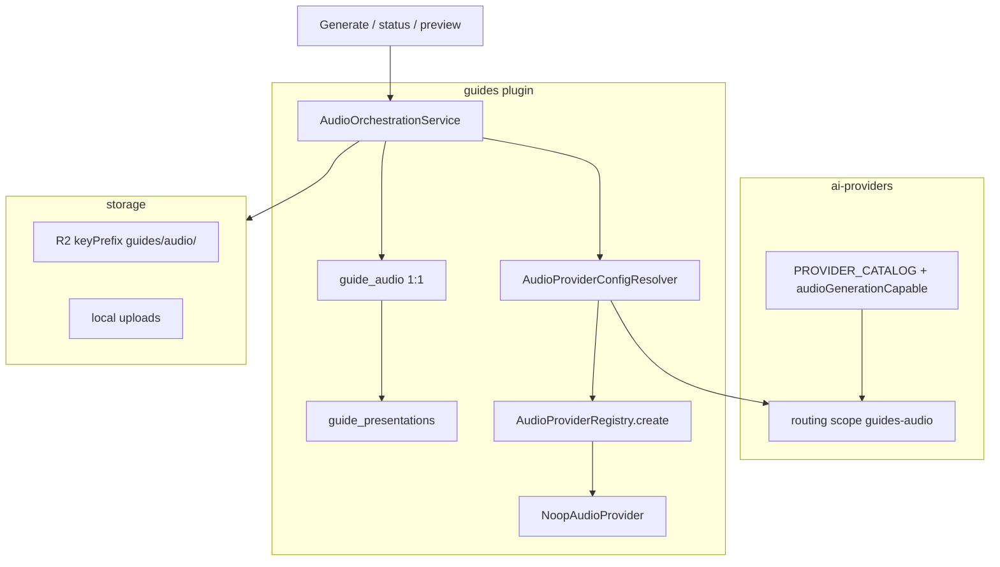

# ADR: P-AUDIO_GENERATION_PREP — Audiogenerering (förberedelsefas)

**Status:** Accepted (implementerat lokalt; Security Approved 2026-07-22 för audio-prep + **wiring Approved 2026-07-22**). **QA:** wiring-tester gröna; branchen som helhet (inkl. place cost) fortfarande under separat QA. **Ej merge till `main` / Railway** utan explicit releasebeslut.  
**Date:** 2026-07-22  
**Epic:** Audio generation prep (Guides) + provider wiring (text-mönster)  
**Relaterad:** [`P-GUIDES_PLACE_PRESENTATION.md`](P-GUIDES_PLACE_PRESENTATION.md), [`P-AI-SETTINGS_PROVIDER_CONFIGURATION.md`](P-AI-SETTINGS_PROVIDER_CONFIGURATION.md), [`P-TEXT_TEXT_PROVIDER.md`](P-TEXT_TEXT_PROVIDER.md)  
**Reserverar (senare):** riktig TTS-vendor; pipeline-fas `audio` / P-AUDIO-BATCH; publik consumer-playback

## Context

Efter platsmodellen ([`P-GUIDES_PLACE_PRESENTATION`](P-GUIDES_PLACE_PRESENTATION.md)) togs variant-skopad `guide_audio` bort. Produktet behöver återigen ljud under **en presentation per språk**, speglat mot textgenereringens provider-/settings-mönster, men utan att binda en TTS-leverantör ännu.

## Decision

1. **Domän:** `guide_audio` är **1:1** med `guide_presentations` (`presentation_id` UNIQUE, `ON DELETE CASCADE`). Status: `pending | processing | ready | failed | stale`. Migration: `server/migrations/107-guide-audio-presentations.sql` (DROP legacy + CREATE).
2. **AI Providers (samma katalog):** capability `audioGenerationCapable` (intersection katalog ∩ Guides audio-registry, **exklusive** `noop`). Separat routing-scope **`guides-audio`** (parallell med `guides` för text). Credentials-tabellen oförändrad.
3. **Generate-läge (prep):** Endast **manuell** orkestrering via UI/API. `audio` läggs **inte** in i `ITEM_STEPS` / production worker i denna fas.
4. **Lagring:** `StorageProviderRegistry` (R2 → local). Object keys under prefix **`guides/audio/`**. `storage_ref` = `{storageProviderKey}:{externalFileId}`. Preview = autentiserad server-proxy (ingen publik CDN-URL i prep). R2/local-adapters stödjer valfri `keyPrefix` / `objectKey` (Cups behåller default `cups/`).
5. **Provider-wiring (text-mönster, 2026-07-22):** `AudioProviderConfigResolver` speglar `TextProviderConfigResolver`: `AIProviderRouter` med `pluginKey: 'guides-audio'` → env-fallback `GUIDES_AUDIO_PROVIDER` (default `noop`) → `AudioProviderRegistry.create(key, options)`. Registry stödjer instance eller factory (som text). Generate skriver `provider_key` från preferred key. **TTS:** `ElevenLabsAudioProvider` (`elevenlabs`) + `noop`; connection test via `GET /v1/user`.
6. **Klientskydd:** Klienten får **inte** sätta `storageRef` eller forcerad `status: ready` via create; endast orkestrering skriver blob-ref och `ready`.
7. **Generate-gate:** Icke-tom `presentationText` **och** `approval_status === 'approved'`.
8. **Staleness:** När `presentation_text` uppdateras (redaktör eller production writeback) och audio är `ready` → `stale`.
9. **ElevenLabs (2026-07-22):** Default model `eleven_multilingual_v2`; voice via `GUIDES_AUDIO_ELEVENLABS_VOICE_ID` (default demo-röst). Output `audio/mpeg`. Credentials: AI Providers / `ELEVENLABS_API_KEY`.

## Architecture (verified)

### API (under presentations)

Bas: `/api/guides/:placeId/presentations/:language`

| Metod  | Path              | Roll                                |
| ------ | ----------------- | ----------------------------------- |
| GET    | `/audio`          | Metadata                            |
| DELETE | `/audio`          | Metadata + blob delete              |
| POST   | `/audio/generate` | Orkestrerad generate                |
| POST   | `/audio/cancel`   | Avbryt om `processing`              |
| GET    | `/audio/preview`  | Auth stream (`Content-Type` = mime) |

### Backend-moduler (verifierat)

| Yta          | Filer                                                                                                                                                                                                      |
| ------------ | ---------------------------------------------------------------------------------------------------------------------------------------------------------------------------------------------------------- |
| Provider     | `AudioProvider.js`, `AudioProviderRegistry.js` (factory/`create`), `AudioProviderConfigResolver.js`, `adapters/NoopAudioProvider.js`, `adapters/ElevenLabsAudioProvider.js`, `registerDefaultProviders.js` |
| Orkestrering | `AudioOrchestrationService.js`, `storageRef.js`, `uploadAudioBuffer.js`, `minimalWav.js`                                                                                                                   |
| HTTP         | `plugins/guides/routes.js`, `controller.js` (audio-handlers)                                                                                                                                               |
| Domän        | `plugins/guides/model.js` (`getAudio*`, `createAudio`, `setAudioGenerationState` inkl. `provider_key`, `_markAudioStaleForPresentation`)                                                                   |
| AI Providers | `audioGenerationCapable` i katalogsvar; `routablePlugins` inkluderar `guides-audio`; save-routing kräver audio-capable keys för den scopen                                                                 |

### Frontend (verifierat)

- `GuideAudioSection` monterad i presentationskort (full strip + kompakt statusbadge).
- `guidesApi` audio-metoder + typer; i18n `guides.audio.*`.
- AI Providers: audio-capability i katalog/form; routing-rad **Guides (audio)** (`guides-audio`).

## Consequences

- Redaktör kan köra stub-flödet (generate → preview → regenerate/delete) på godkänd presentationstext utan riktig TTS.
- Generate resolvar provider/credentials via samma kedja som text (`guides-audio` / env); UI routing-raden förblir tom tills en icke-noop-adapter registreras (`audioGenerationCapable`).
- Batch-audio i production jobs och publik playback förblir **utanför** denna ADR.
- Security (2026-07-22 prep + wiring): **Approved**. Medium defense-in-depth inför TTS: mime-allowlist på preview, R2 prefix-check vid download/delete, harden `objectKey`, överväg att utelämna/redaktera `storageRef` i API; runtime `checkReadiness` innan outbound TTS.

## Out of scope

- Ytterligare TTS-adapters (OpenAI TTS, m.m.)
- Röstväljare i Guides-UI (voice styrs via env/default tills vidare)
- `audio` i `ITEM_STEPS` / P-AUDIO-BATCH
- Publik audioguide-playback / CDN-URL
- Prod-deploy utan explicit releasebeslut
