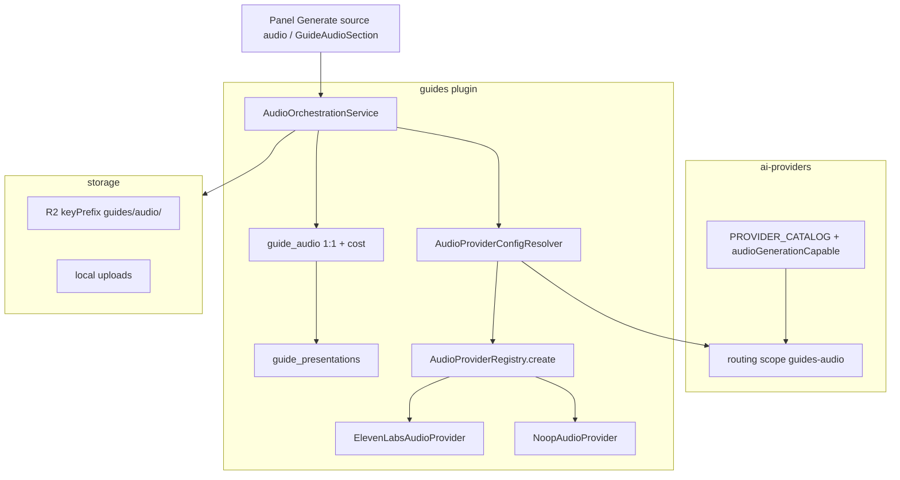

# ADR: P-AUDIO_GENERATION_PREP — Audiogenerering (förberedelsefas)

**Status:** Accepted (implementerat och pushat till `homebase-v3.8`; Security Approved för prep/wiring; **A1/A2 accepterade av TPM 2026-07-22**; QA Approved för keep-blob/cancel-restore). **Ej merge till `main` / Railway** utan explicit releasebeslut.  
**Date:** 2026-07-22  
**Epic:** Audio generation prep (Guides) + provider wiring + ElevenLabs + cost ledger + panel generate  
**Relaterad:** [`P-GUIDES_PLACE_PRESENTATION.md`](P-GUIDES_PLACE_PRESENTATION.md), [`P-AI-SETTINGS_PROVIDER_CONFIGURATION.md`](P-AI-SETTINGS_PROVIDER_CONFIGURATION.md), [`P-TEXT_TEXT_PROVIDER.md`](P-TEXT_TEXT_PROVIDER.md)  
**Reserverar (senare):** fler TTS-vendors; pipeline-fas `audio` / P-AUDIO-BATCH; publik consumer-playback; dedikerad TTS rate limit (A2)

## Context

Efter platsmodellen ([`P-GUIDES_PLACE_PRESENTATION`](P-GUIDES_PLACE_PRESENTATION.md)) togs variant-skopad `guide_audio` bort. Produktet behöver återigen ljud under **en presentation per språk**, speglat mot textgenereringens provider-/settings-mönster.

## Decision

1. **Domän:** `guide_audio` är **1:1** med `guide_presentations` (`presentation_id` UNIQUE, `ON DELETE CASCADE`). Status: `pending | processing | ready | failed | stale`. Migration: `server/migrations/107-guide-audio-presentations.sql` (DROP legacy + CREATE). Cost JSONB: migration `109-guide-audio-cost.sql`.
2. **AI Providers (samma katalog):** capability `audioGenerationCapable` (intersection katalog ∩ Guides audio-registry, **exklusive** `noop`). Separat routing-scope **`guides-audio`** (parallell med `guides` för text). Credentials-tabellen oförändrad; `options` JSONB (migration 108) för t.ex. `voiceId`.
3. **Generate-läge (prep):** Endast **manuell** orkestrering via UI/API. `audio` läggs **inte** in i `ITEM_STEPS` / production worker i denna fas.
4. **Lagring:** `StorageProviderRegistry` (R2 → local). Object keys under prefix **`guides/audio/`**. `storage_ref` = `{storageProviderKey}:{externalFileId}`. Preview = autentiserad server-proxy (ingen publik CDN-URL i prep). Preview tillåter stream medan `processing` **om** tidigare blob finns.
5. **Provider-wiring (text-mönster, 2026-07-22):** `AudioProviderConfigResolver` speglar `TextProviderConfigResolver`: `AIProviderRouter` med `pluginKey: 'guides-audio'` → env-fallback `GUIDES_AUDIO_PROVIDER` (default `noop`) → `AudioProviderRegistry.create(key, options)`. Generate skriver `provider_key` från preferred key. **TTS:** `ElevenLabsAudioProvider` (`elevenlabs`) + `noop`.
6. **Klientskydd:** Klienten får **inte** sätta `storageRef` eller forcerad `status: ready` via create; endast orkestrering skriver blob-ref och `ready`.
7. **Generate-gate:** Icke-tom `presentationText` **och** `approval_status === 'approved'`.
8. **Staleness:** När `presentation_text` uppdateras (redaktör eller production writeback) och audio är `ready` → `stale`.
9. **ElevenLabs (2026-07-22):** Default model `eleven_multilingual_v2`; voice via settings `options.voiceId` eller `GUIDES_AUDIO_ELEVENLABS_VOICE_ID` (default demo-röst). Output `audio/mpeg`. Credentials: AI Providers / `ELEVENLABS_API_KEY`. Connection test = **minimal TTS-probe** (inte `GET /v1/user`). Voice list: `POST …/settings/elevenlabs/voices` (kräver `voices_read`; manuell id fungerar utan).
10. **Safe regenerate (2026-07-22):** Under generate behålls föregående `storage_ref` tills ny upload lyckas; först därefter raderas gammal blob. Vid provider-/upload-fel återställs ready/stale. Intern restore-hint (`__hb_restore__:…` i `error_message`) under `processing`; API strippar hinten; `cancel` läser via `preserveRestoreHint`.
11. **Place costs (2026-07-22):** UI “Total cost text” = `placeTotalEstimatedCost` (user-scoped job items). “Total cost audio” = `placeTotalEstimatedAudioCost` (summa `guide_audio.cost` per plats). List/get production-jobs returnerar båda.
12. **Production-panel generate (2026-07-22):** Knapp **Generate source audio** anropar samma generate-API för källspråk; overwrite-varning om ready/stale finns; fel-popup med provider-meddelande.

## Architecture (verified)

### API (under presentations)

Bas: `/api/guides/:placeId/presentations/:language`

| Metod  | Path              | Roll                                        |
| ------ | ----------------- | ------------------------------------------- |
| GET    | `/audio`          | Metadata (restore-hint strippas)            |
| DELETE | `/audio`          | Metadata + blob delete                      |
| POST   | `/audio/generate` | Orkestrerad generate                        |
| POST   | `/audio/cancel`   | Avbryt om `processing` → restore            |
| GET    | `/audio/preview`  | Auth stream; tillåter blob under processing |

### Backend-moduler (verifierat)

| Yta          | Filer                                                                                                                                                                                                      |
| ------------ | ---------------------------------------------------------------------------------------------------------------------------------------------------------------------------------------------------------- |
| Provider     | `AudioProvider.js`, `AudioProviderRegistry.js` (factory/`create`), `AudioProviderConfigResolver.js`, `adapters/NoopAudioProvider.js`, `adapters/ElevenLabsAudioProvider.js`, `registerDefaultProviders.js` |
| Orkestrering | `AudioOrchestrationService.js`, `storageRef.js`, `uploadAudioBuffer.js`, `minimalWav.js`                                                                                                                   |
| HTTP         | `plugins/guides/routes.js`, `controller.js` (audio-handlers)                                                                                                                                               |
| Domän        | `plugins/guides/model.js` (`getAudio*` + `preserveRestoreHint`, `createAudio`, `setAudioGenerationState`, `sumPlaceEstimatedAudioCost`, `_markAudioStaleForPresentation`)                                  |
| AI Providers | `audioGenerationCapable`; `guides-audio`; voices endpoint; `options.voiceId`; `calculateTtsCost`                                                                                                           |

### Frontend (verifierat)

- `GuideAudioSection` i presentationskort (full strip + kompakt badge); regenerate-confirm + error dialog.
- Production-panel: **Generate source audio** (`GuideProductionPanel` / `GuideView`).
- Information: Total cost text / Total cost audio.
- `guidesApi` audio-metoder + typer; i18n `guides.audio.*`, `guides.production.generateSourceAudio`.
- AI Providers: audio-capability; routing **Guides (audio)**; ElevenLabs voice select.

## Consequences

- Redaktör kan generera TTS från godkänd presentation (panel eller audio-sektion) utan pipeline-fas.
- Misslyckad regenerate lämnar föregående fil spelbar; cancel behåller stale/ready.
- Batch-audio i production jobs och publik playback förblir **utanför** denna ADR.
- Security A1/A2 (TPM Accepted 2026-07-22): rå provider-fel till operatör; ingen dedikerad TTS rate limit.

## Out of scope

- Ytterligare TTS-adapters (OpenAI TTS, m.m.)
- Röstväljare inne i Guides-redaktör (röst styrs via AI Providers settings / env)
- `audio` i `ITEM_STEPS` / P-AUDIO-BATCH
- Publik audioguide-playback / CDN-URL
- Prod-deploy utan explicit releasebeslut
- Dedikerad rate limit på `POST …/audio/generate` (A2 — accepterad tills vidare)
