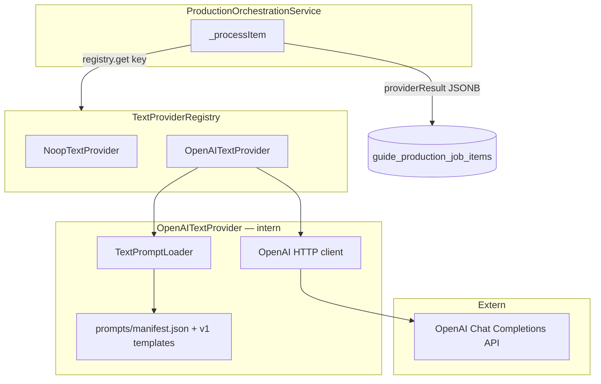

# ADR — P-TEXT: Text Provider (första AI-integrationen)

**Status:** Godkänd arkitektur (2026-07-14); backend implementerad och grindad (QA, Security, Dokumentation godkända 2026-07-14). Ej deployad.  
**Epic:** P-TEXT (Fas 2, steg 5 i implementationsordning)  
**Överordnad:** [`CONTENT_PRODUCTION_PIPELINE_V2.md`](CONTENT_PRODUCTION_PIPELINE_V2.md)  
**Grund:** TPM funktionsgenomgång + låsta designprinciper P1–P5 (2026-07-14)  
**Förutsättning:** P-ASYNC, P-CHAIN, P-REGEN, P-FRONTEND levererade och verifierade lokalt

---

## Sammanfattning

P-TEXT introducerar den **första riktiga externa AI-integrationen** i produktionskedjan: en utbytbar `TextProvider`-adapter som omvandlar `canonical_narrative` till `presentation_text` per variant (`quick` / `normal` / `deep`).

**Värde:** Redaktören skriver ett narrativ per stopp; pipelinen genererar tre presentationsvar på källspråket — det första meningsfulla steget från noop-plattform till riktig guideproduktion.

**Första konkreta adapter:** OpenAI Chat Completions (`openai`). Registry-mönstret gör att fler adapters (Anthropic, Azure OpenAI) kan läggas till utan domänändring.

**Låsta principer (bindande):**

| ID  | Princip                              | Arkitekturellt uttryck                                                  |
| --- | ------------------------------------ | ----------------------------------------------------------------------- |
| P1  | Ingen leverantörslogik i domänen     | `ProductionOrchestrationService` känner endast registry + kontrakt      |
| P2  | Promptar är inte hårdkodade          | Versionerade prompt-resurser i filsystem, laddas via `TextPromptLoader` |
| P3  | Provider-version ingår i fingerprint | Sammansatt `provider.version` = adapter + modell + prompt-set           |
| P4  | All rå AI-output sparas              | Full `providerResult` JSONB på job item, oförändrad efter approve       |
| P5  | Human-in-the-loop kvarstår           | `checkpoint_mode: after_text` default; ingen auto-publicering           |

---

## Relation till v2 ADR

| Område                 | v2 ADR (levererat)               | P-TEXT (denna ADR)                         |
| ---------------------- | -------------------------------- | ------------------------------------------ |
| TextProvider           | Abstrakt kontrakt, noop          | Riktig adapter + prompt-resurser           |
| `GUIDES_TEXT_PROVIDER` | Specad, ej wired                 | Wired i `_providerKeyForStep`              |
| `provider_result`      | `{ presentationText }`           | Utökad med `raw`, `usage`, `promptVersion` |
| Rate limiting          | `ProviderRateLimiter` (planerad) | Minimal in-process limiter + retry         |
| ProviderRateLimiter    | Ej implementerad                 | Levereras i P-TEXT (minimal)               |

---

## Arkitekturöversikt



**Dataflöde:**

1. Worker kör `_processItem` för `text_derivation`.
2. Orchestration hämtar provider via `TextProviderRegistry.get(providerKey)`.
3. Adapter laddar prompt för `variantType`, bygger meddelanden, anropar OpenAI.
4. Adapter returnerar normaliserat svar + full `providerResult`-blob.
5. Orchestration sparar blob i `provider_result` (JSONB), sätter `review_status: pending_review`.
6. Redaktör granskar i `GuideReviewQueue` (befintlig P-FRONTEND UI).
7. Vid approve: `presentationText` skrivs till domän; `provider_result` på item **ändras inte**.

---

## TextProvider-kontrakt (formaliserat)

Ny fil: `plugins/guides/providers/text/TextProvider.js` (JSDoc-interface, ingen runtime-klass).

```javascript
/**
 * @typedef {Object} TextGenerateInput
 * @property {string|null|undefined} canonicalNarrative
 * @property {'quick'|'normal'|'deep'} variantType
 * @property {string} language — ISO 639-1, t.ex. 'sv'
 * @property {string} [sourceLanguage] — från master guide
 */

/**
 * @typedef {Object} TextProviderResult
 * @property {'ready'|'failed'|'retry'} status
 * @property {string} [presentationText] — normaliserad text för review-UI
 * @property {string} [errorMessage]
 * @property {number} [retryAfterMs] — vid status 'retry' (rate limit)
 * @property {Object} [providerResult] — full blob för DB (P4); om utelämnad
 *   använder orchestration { presentationText } för bakåtkompatibilitet
 */

/**
 * @typedef {Object} TextProvider
 * @property {string} key — registry-nyckel, t.ex. 'openai'
 * @property {string} version — fingerprint-version (P3), sammansatt sträng
 * @property {(req, input: TextGenerateInput) => Promise<TextProviderResult>} generate
 */
```

**Regel:** Adaptern skriver aldrig till guides-DB. Den returnerar endast data till orchestration.

---

## Prompt-resurser (P2)

### Placering

```
plugins/guides/providers/text/prompts/
  manifest.json
  text_derivation/
    quick/v1.system.md
    quick/v1.user.md
    normal/v1.system.md
    normal/v1.user.md
    deep/v1.system.md
    deep/v1.user.md
```

### `manifest.json`

```json
{
  "promptSetVersion": "v1",
  "variants": {
    "quick": {
      "system": "text_derivation/quick/v1.system.md",
      "user": "text_derivation/quick/v1.user.md"
    },
    "normal": {
      "system": "text_derivation/normal/v1.system.md",
      "user": "text_derivation/normal/v1.user.md"
    },
    "deep": {
      "system": "text_derivation/deep/v1.system.md",
      "user": "text_derivation/deep/v1.user.md"
    }
  },
  "tokenBudgets": {
    "quick": { "maxCompletionTokens": 150 },
    "normal": { "maxCompletionTokens": 400 },
    "deep": { "maxCompletionTokens": 800 }
  }
}
```

### `TextPromptLoader`

Ny modul: `plugins/guides/providers/text/TextPromptLoader.js`

| Ansvar                      | Detalj                                                                      |
| --------------------------- | --------------------------------------------------------------------------- |
| Ladda manifest              | Vid första anrop; cache i minnet                                            |
| Ladda prompt-filer          | `fs.readFileSync` relativt `prompts/`                                       |
| Interpolera variabler       | `{{canonicalNarrative}}`, `{{language}}`, `{{variantType}}` i user-template |
| Exponera `promptSetVersion` | Läses av adapter för `provider.version`                                     |

**Versionsbump:** Ny prompt → ny fil `v2.*.md` + uppdatera manifest `promptSetVersion: v2`. Ingen ändring i affärslogik eller adapter-kod (endast config).

**Framtida utökning (ej P-TEXT):** Per-tenant prompt override via DB (`guide_tenant_provider_config`, P-OBS).

---

## Provider-version och fingerprint (P3)

### Sammansatt version

```javascript
// OpenAITextProvider constructor / init
this.key = 'openai';
this.version = `openai@${model}@prompts-${promptSetVersion}`;
// Exempel: "openai@gpt-4o-mini@prompts-v1"
```

Fingerprint inkluderar redan `providerKey` + `providerVersion` via `_providerVersionForStep()` → `computeProductionFingerprint()`.

| Händelse                           | Fingerprint-effekt                                 |
| ---------------------------------- | -------------------------------------------------- |
| Prompt förbättras (v1 → v2)        | Ny version → ny fingerprint → re-produktion möjlig |
| Modell byts (gpt-4o-mini → gpt-4o) | Ny version → ny fingerprint                        |
| `regenerateItem`                   | `regenerateNonce` → alltid unik fingerprint        |
| `force: true` på jobb              | Hoppar över dedup oavsett fingerprint              |

---

## `providerResult`-schema (P4)

Ingen migration krävs — `provider_result JSONB` är redan flexibel.

### Struktur vid `text_derivation`

```json
{
  "presentationText": "Normaliserad text som visas i review-UI",
  "raw": {
    "text": "Exakt modell-output före eventuell trimning",
    "model": "gpt-4o-mini",
    "promptVersion": "v1",
    "promptSetVersion": "v1",
    "variantType": "normal",
    "language": "sv",
    "finishReason": "stop"
  },
  "usage": {
    "promptTokens": 420,
    "completionTokens": 180,
    "totalTokens": 600
  },
  "requestedAt": "2026-07-14T12:00:00.000Z",
  "latencyMs": 2340
}
```

### Regler

| Regel                               | Implementation                                                                               |
| ----------------------------------- | -------------------------------------------------------------------------------------------- |
| Rå output bevaras                   | `raw.text` = modellens `choices[0].message.content`                                          |
| Approve ändrar inte item            | `approveItem` skriver till domän, **inte** `provider_result`                                 |
| Redaktör redigerar variant manuellt | Domän uppdateras; item `provider_result` oförändrad                                          |
| Review-UI                           | Läser `presentationText` (befintlig `getProposedItemText`) — ingen frontend-ändring i P-TEXT |

---

## Första adapter: OpenAI (P1)

### Fil

`plugins/guides/providers/text/adapters/OpenAITextProvider.js`

### Ansvar (endast adapter-internt)

1. Läs `OPENAI_API_KEY` från env (krävs när `GUIDES_TEXT_PROVIDER=openai`).
2. Läs `GUIDES_TEXT_OPENAI_MODEL` (default `gpt-4o-mini`).
3. Anropa `TextPromptLoader` för prompts + token budget.
4. HTTP POST till `https://api.openai.com/v1/chat/completions`.
5. Mappa svar till `TextProviderResult` inkl. full `providerResult`-blob.
6. Hantera fel: timeout, 401, 429, 5xx.

### Vad adaptern **inte** gör

- Validera business rules (narrative gate, approval) — tillhör domän/orchestration.
- Skriva till `guide_variant_presentations`.
- Välja checkpoint eller publicera.

### Registrering

```javascript
// registerDefaultProviders.js
TextProviderRegistry.register('noop', new NoopTextProvider());
if (process.env.OPENAI_API_KEY) {
  TextProviderRegistry.register('openai', new OpenAITextProvider());
}
```

`noop` behålls alltid som fallback för test och offline dev.

---

## Provider-val (env)

| Variabel                        | Default       | Beskrivning                             |
| ------------------------------- | ------------- | --------------------------------------- |
| `GUIDES_TEXT_PROVIDER`          | `noop`        | Registry-nyckel: `noop` \| `openai`     |
| `OPENAI_API_KEY`                | —             | Krävs för `openai`; aldrig logga        |
| `GUIDES_TEXT_OPENAI_MODEL`      | `gpt-4o-mini` | Modell för Chat Completions             |
| `GUIDES_TEXT_OPENAI_TIMEOUT_MS` | `60000`       | Request-timeout                         |
| `GUIDES_TEXT_RATE_LIMIT_RPM`    | `60`          | Requests per minut (in-process limiter) |

### Wiring i orchestration

Ändra `_providerKeyForStep` i `ProductionOrchestrationService`:

```javascript
_providerKeyForStep(step) {
  if (step === 'text_derivation') {
    return process.env.GUIDES_TEXT_PROVIDER || DEFAULT_TEXT_PROVIDER;
  }
  // ...
}
```

En rad-logik — inga leverantörsspecifika grenar i orchestration.

---

## Rate limiting och retry

### Strategi (v1 P-TEXT)

**Synkron retry i worker-tick** — inte `awaiting_callback` (reserverat för audio batch).

| Lager         | Mekanism                                                                                  |
| ------------- | ----------------------------------------------------------------------------------------- |
| Proaktiv      | `ProviderRateLimiter` — in-memory token bucket per `providerKey`, checked före HTTP-anrop |
| Reaktiv       | OpenAI 429 → adapter returnerar `{ status: 'retry', retryAfterMs }`                       |
| Orchestration | `_processItem` hanterar `retry`: sätter item `pending` + `retry_after`, **inte** `failed` |
| Supervisor    | Befintlig stuck-item-logik oförändrad                                                     |

### Ny modul

`plugins/guides/providers/shared/ProviderRateLimiter.js` — minimal token-bucket, delbar med P-TRANS senare.

### Utökning av `_processItem` (orchestration)

```javascript
if (result.status === 'retry') {
  await this.jobModel.updateJobItem(req, item.id, {
    status: 'pending',
    retryAfter: new Date(Date.now() + (result.retryAfterMs ?? 30000)).toISOString(),
    errorMessage: result.errorMessage ?? 'Rate limited — retry scheduled',
  });
  return;
}
```

---

## Human-in-the-loop (P5)

Oförändrat från v2:

| Gate              | Beteende                                                                         |
| ----------------- | -------------------------------------------------------------------------------- |
| `checkpoint_mode` | Default `after_text` — paus efter textfas                                        |
| Review-UI         | `GuideReviewQueue` — godkänn / avvisa / regenerera                               |
| Writeback         | Endast vid explicit `approveItem`                                                |
| Publicering       | Kräver manuell `publicationStatus` + `lifecycleStatus` — AI kan aldrig publicera |

Ingen frontend-ändring krävs för P-TEXT MVP.

---

## API-nyckelhantering

| Beslut          | v1 P-TEXT                                                         |
| --------------- | ----------------------------------------------------------------- |
| Scope           | Global per deployment (`OPENAI_API_KEY` i Railway / `.env.local`) |
| Per-tenant      | Utelämnat — delegeras till P-OBS (`guide_tenant_provider_config`) |
| Lagring         | Env only; aldrig i DB, loggar eller `provider_result`             |
| Dev utan nyckel | `GUIDES_TEXT_PROVIDER=noop` (default) — befintligt beteende       |
| Prod            | `GUIDES_TEXT_PROVIDER=openai` + `OPENAI_API_KEY` satt             |

---

## Token-budgetar per varianttyp

| Variant  | `maxCompletionTokens` | Mål (ord)                           |
| -------- | --------------------- | ----------------------------------- |
| `quick`  | 150                   | ~80–120 ord, turist-snapshot        |
| `normal` | 400                   | ~200–300 ord, standard presentation |
| `deep`   | 800                   | ~400–600 ord, fördjupad kontext     |

Budgetar konfigureras i `manifest.json`, inte i kod. Prompt-texterna instruerar modellen om längd och ton.

---

## Ansvarsfördelning

| Område                             | Backend           | Frontend                                              |
| ---------------------------------- | ----------------- | ----------------------------------------------------- |
| `TextProvider.js` (JSDoc-kontrakt) | Ja                | —                                                     |
| `TextPromptLoader` + prompt-filer  | Ja                | —                                                     |
| `OpenAITextProvider`               | Ja                | —                                                     |
| `ProviderRateLimiter`              | Ja                | —                                                     |
| Wire `GUIDES_TEXT_PROVIDER`        | Ja                | —                                                     |
| `_processItem` retry-hantering     | Ja                | —                                                     |
| `providerResult`-schema i types    | Ja (utöka TS-typ) | Ja (typ-sync, valfritt visa metadata)                 |
| Review-UI                          | —                 | **Ingen ändring** (visar `presentationText` som idag) |
| Prompt-redigering UI               | —                 | Utelämnat (filer i repo)                              |

---

## Återanvändning

| Komponent                                     | Återanvänds | Ändring                                  |
| --------------------------------------------- | ----------- | ---------------------------------------- |
| `TextProviderRegistry`                        | Ja          | Oförändrat mönster                       |
| `NoopTextProvider`                            | Ja          | Oförändrad fallback                      |
| `registerDefaultProviders.js`                 | Ja          | Registrera `openai`                      |
| `ProductionOrchestrationService._processItem` | Ja          | Retry-gren + spara full `providerResult` |
| `_providerKeyForStep`                         | Ja          | Läs env                                  |
| `computeProductionFingerprint`                | Ja          | Oförändrad — version ingår redan         |
| `GuideReviewQueue` / `GuideReviewItem`        | Ja          | Oförändrad                               |
| `applyProductionPresentationText`             | Ja          | Oförändrad                               |
| DB schema                                     | Ja          | Ingen migration                          |

**Ny kod:** `TextProvider.js`, `TextPromptLoader.js`, `OpenAITextProvider.js`, `ProviderRateLimiter.js`, prompt-filer, tester.

---

## Tester (Definition of Done)

| Test                                                  | Typ       | Täcker                  |
| ----------------------------------------------------- | --------- | ----------------------- |
| `TextPromptLoader` laddar manifest + interpolerar     | Unit      | P2                      |
| `OpenAITextProvider` med mockad HTTP                  | Unit      | Adapter, fel, 429→retry |
| `provider.version` format                             | Unit      | P3                      |
| `providerResult` innehåller `raw` + `usage`           | Unit      | P4                      |
| `_processItem` retry sätter `pending` + `retry_after` | Unit      | Rate limit              |
| `_providerKeyForStep` läser env                       | Unit      | Wiring                  |
| Fingerprint ändras vid prompt version bump            | Unit      | P3                      |
| E2E med `GUIDES_TEXT_PROVIDER=noop`                   | Befintlig | Regression              |
| Manuell smoke med `openai` + riktig nyckel            | Manuell   | Verifiering (ej CI)     |

**Ej i P-TEXT:** CI med riktig OpenAI-nyckel (kostnad + hemlighet).

---

## Risker och beroenden

| ID  | Risk                                          | Allvarlighet | Åtgärd                                                               |
| --- | --------------------------------------------- | ------------ | -------------------------------------------------------------------- |
| R1  | OpenAI-kostnad vid bulk-produktion            | Medel        | Rate limiter + token budgets; cost caps i P-BULK                     |
| R2  | API-nyckel exponeras i loggar                 | Hög          | Aldrig logga key; Security-granskning                                |
| R3  | Prompt injection via `canonicalNarrative`     | Medel        | Narrative är redaktörskriven; system-prompt isolerar; ingen tool use |
| R4  | `_processItem` markerar 429 som `failed` idag | Hög          | Retry-gren (denna ADR)                                               |
| R5  | Låg textkvalitet vid första prompt-set        | Medel        | Iterera `v2` prompts utan kodändring (P2)                            |
| R6  | Single-process rate limiter vid multi-worker  | Låg          | Accepterad i v1; delad limiter i P-BULK                              |

| Beroende                | Status                     |
| ----------------------- | -------------------------- |
| P-ASYNC worker          | Levererad                  |
| P-CHAIN faser           | Levererad                  |
| P-REGEN HITL            | Levererad                  |
| P-FRONTEND review-UI    | Levererad                  |
| `OPENAI_API_KEY` i prod | Användarbeslut vid release |

---

## Avvägningar

| Val                    | Alternativ                   | Motivering                                                 |
| ---------------------- | ---------------------------- | ---------------------------------------------------------- |
| OpenAI först           | Anthropic / Azure            | Bredast dokumentation; enklast HTTP; adapter utbytbar (P1) |
| Filsystem-prompts      | DB-prompts                   | Enklare versionering i git; P2 uppfylls utan migration     |
| Synkron retry          | `awaiting_callback`          | Text är snabb (<60s); enklare; async reserverat för audio  |
| Global API-nyckel      | Per-tenant                   | En tenant i prod idag; per-tenant i P-OBS                  |
| Ingen frontend-ändring | Visa token metadata i review | Backend-first; UI kan utökas senare                        |
| `gpt-4o-mini` default  | Större modell                | Kostnadseffektivt för MVP; modell via env                  |

---

## Utelämnat (medvetet)

- Translation-adapter (P-TRANS)
- Audio i batch (P-AUDIO-BATCH)
- Per-tenant prompt override
- Provider-admin UI (P-OBS)
- Bulk-produktion / cost caps (P-BULK)
- Narrative-gate före job start (ärvd backend-gap)
- Approval-UI för domän `approve-content` (separat frontend-fix)
- CI med live OpenAI

---

## Implementeringsordning (Backend)

1. `TextProvider.js` — JSDoc-kontrakt
2. `prompts/manifest.json` + v1 prompt-filer (quick/normal/deep)
3. `TextPromptLoader.js` + tester
4. `ProviderRateLimiter.js` + tester
5. `OpenAITextProvider.js` + mock-tester
6. Uppdatera `registerDefaultProviders.js`
7. Wire `GUIDES_TEXT_PROVIDER` i `_providerKeyForStep`
8. Utöka `_processItem`: retry-gren + spara full `providerResult`
9. Utöka `ProductionJobItemProviderResult` TypeScript-typ (sync)
10. Manuell smoke + uppdatera E2E (noop regression oförändrad)
11. Dokumentation (`CHANGELOG`, env i `.env.example`)

---

## Referenser

- [`CONTENT_PRODUCTION_PIPELINE_V2.md`](CONTENT_PRODUCTION_PIPELINE_V2.md) — övergripande pipeline
- [`GUIDES_CONTENT_PRODUCTION_UX_V2.md`](../design/GUIDES_CONTENT_PRODUCTION_UX_V2.md) §8 — E2E-verifiering
- [`docs/ai/CHANGELOG.md`](../CHANGELOG.md) — epic-status
