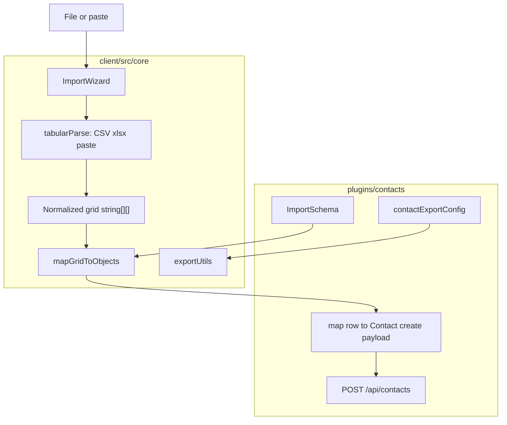

# ADR — Tabular Import/Export (core + plugin adapters)

**Status:** Implementerad (v1). QA Approved; Security Approved (accepterad residualrisk A1 — se nedan). **Ej prod-release** utan explicit beslut.  
**Epic:** Tabular Import/Export  
**Datum:** 2026-07-23  
**Relaterad:** `ImportWizard`, `importUtils`, `exportUtils`; UX [`docs/ai/design/TABULAR_IMPORT_WIZARD_UX.md`](../design/TABULAR_IMPORT_WIZARD_UX.md); domänimporter (FOGIS, cups/ingest) utanför scope

---

## Sammanfattning

Tabellär import/export (CSV, Excel, inklistrad text) är en **plattformskapabilitet i core**, inte ett eget produktplugin. Core äger parsers, wizard och exportmotor. Varje domänplugin äger fältschema, mappning till create-payload och persistens via sitt eget API.

Referenskonsumenter v1: **contacts**, **notes**, **tasks** (samma `ImportWizard`).

---

## Kontext (före v1)

- CSV-import fanns i core; Excel och paste saknades.
- Persistens: rad-för-rad `create*` (oförändrat i v1).
- Domänimporter (FOGIS, cups←ingest) är separat plugin-ägda pipelines.

---

## Beslut

| Beslut             | Val                                                                                             | Motivering                                                                 |
| ------------------ | ----------------------------------------------------------------------------------------------- | -------------------------------------------------------------------------- |
| Placering          | **Core** (client utils + UI); plugin-adapters                                                   | Följer exportmönstret; ingen egen domän för “import”                       |
| Eget import-plugin | **Nej**                                                                                         | Skulle bli navigationsyta utan affärsdomän; tvingar plugin→plugin-koppling |
| Domän/API-import   | **Plugin-ägt** (oförändrat)                                                                     | Annan kontraktsyta (extern API, credentials, upsert)                       |
| Parser-lager       | Core normaliserar till `string[][]` (headers + rows)                                            | Wizard och mappning blir formatoberoende                                   |
| Format v1          | CSV, Excel `.xlsx` (första sheet), paste (TSV/CSV-text)                                         | Matchar användarbehov; `.xls` legacy utelämnas                             |
| Excel-bibliotek    | SheetJS **`xlsx@0.20.3`** via `https://cdn.sheetjs.com/xlsx-0.20.3/xlsx-0.20.3.tgz` (lazy-load) | npm `0.18.5` hade kända PP/ReDoS; patchad CE finns endast via SheetJS CDN  |
| Soft limits v1     | 5 MB filstorlek (**före** filläsning); max 2000 datarader                                       | Skyddar UI/minne                                                           |
| Persistens v1      | Rad-för-rad `create*`; `import*` returnerar `{ successCount, failureCount }`                    | Minimal risk; resultatsteg i wizard                                        |
| Persistens fas 2   | Valfritt `POST /api/<plugin>/batch` create                                                      | När volym kräver det                                                       |
| Upsert / dedupe v1 | **Nej** — endast create                                                                         | Undvik affärsregler kring “samma post”                                     |
| Export             | Oförändrad arkitektur; `exportUtils` + `*ExportConfig`                                          | Redan kanoniskt                                                            |

---

## Avvisade alternativ

| Alternativ                                       | Varför avvisat                                               |
| ------------------------------------------------ | ------------------------------------------------------------ |
| Plugin `import-export` som andra plugins anropar | Ingen domän; cross-plugin require; opt-in gate utan värde    |
| All parsing per plugin                           | Duplicerar wizard/CSV/Excel                                  |
| Server-side parse + jobkö i v1                   | Ingen generell jobplattform; överbyggt för typisk volym      |
| En gemensam `/api/import` i core                 | Core skulle behöva känna till varje plugins fält/validering  |
| npm `xlsx@0.18.5`                                | Kända sårbarheter (GHSA-4r6h-8v6p-xvw6, GHSA-5pgg-2g8v-p4x9) |

---

## Arkitektur

### Kontrakt: Core vs plugin

**Core äger:** `ImportWizard` (source → mapping → preview → result), parsers, `ImportSchema`-typer, `exportItems`.

**Plugin äger:** `get*ImportSchema()`, `import*(rows)` → create + `{ successCount, failureCount }`, settings-yta, `*ExportConfig`.

### Verifierade nyckelfiler

| Del              | Sökväg                                                |
| ---------------- | ----------------------------------------------------- |
| Wizard           | `client/src/core/ui/ImportWizard.tsx`                 |
| Parsers / limits | `client/src/core/utils/importUtils.ts`                |
| Tester           | `client/src/core/utils/__tests__/importUtils.test.ts` |
| Beroende         | `package.json` → SheetJS CDN `xlsx@0.20.3`            |

---

## Accepterad residualrisk (Security)

| ID     | Risk                                                                      | Mitigering                                     | TPM                                 |
| ------ | ------------------------------------------------------------------------- | ---------------------------------------------- | ----------------------------------- |
| **A1** | Tredjeparts-tarball från `cdn.sheetjs.com` (supply chain vs npm registry) | Pinnad URL + `integrity` i `package-lock.json` | **Kräver medvetet TPM-godkännande** |

---

## Implementation checklista

- [x] Core: tabular parsers (CSV, xlsx, paste) → `string[][]`
- [x] Core: ImportWizard multi-source (file + paste) + result
- [x] Contacts/notes/tasks: import-resultat `{ successCount, failureCount }`
- [x] Soft limit filstorlek före filläsning
- [x] SheetJS 0.20.3 CDN (ersätter sårbar 0.18.5)
- [x] Standards + CHANGELOG (Documentation)
- [x] CSV-importmall per plugin (`downloadImportCsvTemplate`)
- [ ] Fas 2 (valfritt): `POST .../batch` create

---

## Överlämning

v1 levererad genom grindar 2–6. Prod-release endast efter explicit användarbeslut. TPM ska godkänna residualrisk A1.
