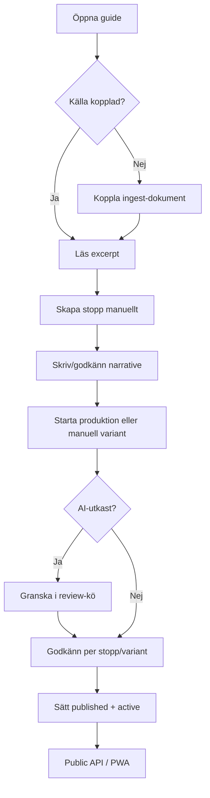

# UX-spec — Guide CMS Content Production Pipeline (P2, P5, P7)

**Status:** Godkänd design (2026-07-13) — **delvis historisk**  
**ADR:** [`docs/ai/adr/CONTENT_PRODUCTION_PIPELINE.md`](../adr/CONTENT_PRODUCTION_PIPELINE.md)  
**Epics:** P2 (HITL), P5 (Ingest bridge), P7 (ProductionJob)  
**Plats:** [`client/src/plugins/guides/`](../../../client/src/plugins/guides/)

> **Aktuellt produktflöde (2026-07-19):** Place-only model — [`P-GUIDES_PLACE_PRESENTATION.md`](../adr/P-GUIDES_PLACE_PRESENTATION.md). Research → one guide text per language presentation → review (optional translate). CreateStops / narrative-before-produce / length variants / audio i denna spec är **historiska**. Research-first kvarstår på place-nivå (`P-GUIDES_CONTENT_SOURCES`). Se även UX v2 callout. Flödesdiagrammet nedan ska **inte** tolkas som gällande produktflöde.

---

## 1. Användarflöde

### Primär persona: Redaktör

Redaktören ska kunna ta en guide från tom Place till publicerbar produkt med tydliga godkännandesteg och valfri batch-produktion.



### Flöde A — Ingest + manuella stopp (P5)

1. Redaktör öppnar guide i `GuideView`.
2. I **Källmaterial**-sektionen: väljer befintlig ingest-källa eller skapar ny via länk till Ingest-plugin.
3. Klickar **Hämta / uppdatera** → excerpt visas i readonly-panel.
4. Redaktör skapar stopp i befintlig `GuideStopsSection` (copy/paste eller manuell avskrift från excerpt).
5. Ingen auto-split i v1.

### Flöde B — HITL godkännande (P2)

1. **Manuell text** sparad av redaktör → `approval_status: approved` direkt (ingen extra knapp).
2. **AI-utkast** från ProductionJob → `pending_review` → visas i review-kö + badge på stopp/variant.
3. Redaktör granskar utkast → **Godkänn** skriver till domän + sätter `approved`.
4. **Publicera** (`publication_status: published`) är disabled tills `approved` + `fresh`.
5. **Aktivera plats** (`lifecycle_status: active`) kräver minst en publicerbar variant (sammanfattning visas före confirm).

### Flöde C — Batch-produktion (P7)

1. Redaktör klickar **Producera hel guide** (sidebar eller produktionskort).
2. System validerar: alla stopp har godkänd narrative.
3. Jobb körs → banner visar `processing` / `awaiting_review`.
4. Vid `awaiting_review`: review-kö listar AI-utkast per stopp/variant/steg.
5. Redaktör godkänner (enskilt eller **Godkänn alla** för samma typ).
6. Jobb slutförs → `completed`; fel → `failed` med åtgärdsbar text.

### Flöde D — Partiell regenerering

- Per stopp: meny **Regenerera stopp** → `ProductionJob type: stop`.
- Per variant: i variant-rad **Regenerera** → `type: variant`.
- `ConfirmDialog` vid publicerat innehåll (editorial lock).

---

## 2. Gränssnittsunderlag

### 2.1 Ny komponent: `GuideSourceSection` (P5)

**Placering:** `GuideView` — nytt `Card` mellan **Detaljer** och **Master guide** (eller mellan Master guide och Stopp).

```
┌─ Källmaterial ─────────────────────────────────────┐
│ Källa: [ NativeSelect: ingest sources ▼ ]  [Länka]│
│ Senast hämtad: 2026-07-13 14:02  [Uppdatera ↻]   │
│ ─────────────────────────────────────────────────│
│ ┌ excerpt (readonly, max-h-64 overflow-y-auto) ┐ │
│ │ Lorem ipsum från ingest run #42…              │ │
│ └───────────────────────────────────────────────┘ │
│ ℹ Dela upp innehållet i stopp manuellt nedan.     │
└──────────────────────────────────────────────────┘
```

| Element        | Beteende                                                              |
| -------------- | --------------------------------------------------------------------- |
| Källa-dropdown | Lista `ingest_sources` (återanvänd ingest API eller guides bridge)    |
| Länka          | `PUT …/ingest-source`                                                 |
| Uppdatera      | `POST …/source-content/refresh`; spinner på knapp                     |
| Excerpt        | `white-space: pre-wrap`, `font-mono text-xs`, scrollbar vid lång text |
| Tom state      | "Ingen källa kopplad" + CTA länka                                     |

### 2.2 Utökning: `GuideStopsSection` (P2)

Per stopp-rad, lägg till badge + godkännande:

```
┌ Stop 1: Entré                    [editorial] [approval] [stale?]
│  canonicalNarrative preview…
│  [Redigera] [Godkänn narrative ✓]  ← synlig om pending_review
└─ GuideVariantsSection …
```

| `approval_status` | Badge             | Färg (befintligt mönster)                  |
| ----------------- | ----------------- | ------------------------------------------ |
| `draft`           | Utkast            | `secondary`                                |
| `pending_review`  | Väntar granskning | `outline` + amber accent (samma som stale) |
| `approved`        | Godkänd           | `secondary` + grön text eller check-ikon   |

**Godkänn narrative:** primär-outline knapp; `ConfirmDialog` om narrative ändrats sedan AI-utkast.

### 2.3 Utökning: `GuideVariantsSection` (P2)

Per variant-rad:

```
[quick] [sv] [draft] [pending_review] [stale]
presentationText preview…
[Redigera] [Godkänn innehåll ✓]
```

- **Publication dropdown:** alternativet `published` **disabled** om `approval_status !== 'approved'` eller `staleness_status === 'stale'`.
- Tooltip på disabled: `guides.approval.publishBlockedHint`.
- Visa **både** `approval_status` och `publication_status` — olika badges, inte samma.

### 2.4 AI-utkast i review (P2 + P7)

När job item har `providerResults.proposedText` och stop/variant fortfarande `pending_review`:

```
┌─ Granska AI-utkast ──────────────────────────────┐
│ Stopp: Entré · Variant: normal · sv               │
│ ┌ Nuvarande ─────┐  ┌ Föreslaget ────────────────┐ │
│ │ (tom eller     │  │ Kort museivisning…         │ │
│ │  gammal text)  │  │                            │ │
│ └────────────────┘  └────────────────────────────┘ │
│ [Godkänn] [Redigera manuellt] [Avvisa]             │
└────────────────────────────────────────────────────┘
```

- Mobil: stapla kolumner (nuvarande ovan, föreslaget under).
- **Godkänn** → `approve-content` / `approve-narrative` + job approve API.
- **Avvisa** → behåll draft, markera item cancelled (API TBD i backend).

### 2.5 Ny komponent: `GuideProductionPanel` (P7)

**Placering:** `GuideView` sidebar — under Quick actions (samma `Card` + `DetailSection`-mönster).

```
┌─ Produktion ──────────────────────────────────────┐
│ [ ▶ Producera hel guide ]                        │
│ ─────────────────────────────────────────────── │
│ Senaste jobb: #12  ● Väntar granskning           │
│ Startad: 14:02 · 3/9 steg klara                  │
│ [Visa review-kö (4)]                             │
│ [Avbryt jobb]                                    │
└──────────────────────────────────────────────────┘
```

**Jobbstatus-banner** (top of main column när aktivt jobb):

| Status            | Banner                                                    |
| ----------------- | --------------------------------------------------------- |
| `processing`      | Info blå + `Loader2` + "Producerar…"                      |
| `awaiting_review` | Amber + "Nya AI-utkast väntar godkännande" + länk till kö |
| `failed`          | Destructive + felmeddelande + "Försök igen"               |
| `completed`       | Grön/discrete success, auto-dismiss efter 5s              |

**Review-kö:** expanderbar lista eller slide-over (v1: inline Card under banner):

```
Review-kö (4)
├ Entré / normal / sv — presentationText  [Godkänn]
├ Entré / quick / sv — presentationText     [Godkänn]
├ Hall / normal / sv — presentationText     [Godkänn]
└ …
[ Godkänn alla presentationText ]
```

Poll jobbstatus var 3s vid `processing` (samma intervall som `GuideAudioSection`).

### 2.6 Place publicering (P2)

I sidebar Quick actions, ny knapp:

```
[ Publicera guide ]  ← disabled om gates ej uppfyllda
```

Disabled tooltip/lista:

- ✗ 2 stopp saknar godkänd narrative
- ✗ 3 varianter ej godkända
- ✗ 1 variant stale

Vid klick (allt grönt): `ConfirmDialog` → sätter variants `published` + place `active`.

---

## 3. Återanvändning

| Mönster                                             | Källa                                                                                                |
| --------------------------------------------------- | ---------------------------------------------------------------------------------------------------- |
| `DetailLayout` + sidebar + `DetailSection` + `Card` | [`GuideView.tsx`](../../../client/src/plugins/guides/components/GuideView.tsx)                       |
| Inline list + expand form                           | [`GuideStopsSection.tsx`](../../../client/src/plugins/guides/components/GuideStopsSection.tsx)       |
| Variant badges + nested audio                       | [`GuideVariantsSection.tsx`](../../../client/src/plugins/guides/components/GuideVariantsSection.tsx) |
| Poll + status + `ConfirmDialog`                     | [`GuideAudioSection.tsx`](../../../client/src/plugins/guides/components/GuideAudioSection.tsx)       |
| Excerpt / run history                               | [`IngestSourceView.tsx`](../../../client/src/plugins/ingest/components/IngestSourceView.tsx)         |
| `Badge`, `Button`, `Textarea`, `NativeSelect`       | `@/components/ui/*`                                                                                  |
| i18n `guides.*`                                     | `en.json` / `sv.json`                                                                                |

**Nya komponenter (minsta set):**

- `GuideSourceSection.tsx` (P5)
- `GuideProductionPanel.tsx` (P7)
- `GuideReviewQueue.tsx` (P7, kan börja inline i panel)
- `ApprovalStatusBadge.tsx` (delt, P2)

---

## 4. Tillgänglighet och responsivitet

| Krav             | Implementation                                                                                  |
| ---------------- | ----------------------------------------------------------------------------------------------- |
| Badges           | Text + ikon (inte enbart färg): `Check` approved, `Clock` pending, `AlertTriangle` stale        |
| Jobb-banner      | `role="status"` + `aria-live="polite"` vid statusändring                                        |
| Godkänn-knappar  | Tydliga `aria-label`: "Godkänn narrative för stopp Entré"                                       |
| Excerpt-panel    | `tabindex=0`, scrollbar keyboard-accessible                                                     |
| Disabled publish | `aria-disabled` + `title`/tooltip med orsak                                                     |
| Mobil            | Sidebar produktion flyttas under main content (`order`); review-kö staplad; touch targets ≥44px |
| Kontrast         | Amber stale/pending använder befintliga `text-amber-600` tokens (WCAG AA mot bakgrund)          |

---

## 5. Teknisk genomförbarhet

Avstämt med ADR:

| UX-beslut                        | ADR-stöd                       |
| -------------------------------- | ------------------------------ |
| Separat `approval_status` badge  | P2-A1, P2-A2                   |
| Excerpt readonly, manuella stopp | P5-A3                          |
| Review-kö från job items         | P7-A6, P7-A10                  |
| Batch-knapp                      | P7-A9                          |
| Disabled published               | P2-A4                          |
| Behåll `GuideAudioSection`       | P7-A8 (manuell single-variant) |

**Öppen fråga till Backend:** "Avvisa" AI-utkast — behöver endpoint eller räcker `pending_review` → manuell redigering?

---

## 6. Angränsande förbättringsmöjligheter

- **GuideList:** visa aggregate status (t.ex. "3 väntar granskning") på listkortet (`GuideListItem`; äldre namn `GuideCard` avser samma listyta — komponenten `GuideCard` finns inte längre).
- **Ingest plugin:** djup-länk "Öppna i Ingest" från `GuideSourceSection`.
- **404 audio log:** sänk loggnivå när audio saknas (redan diskuterat, ej P2-scope).

---

## 7. i18n-nycklar (prefix `guides.`)

| Nyckel                        | EN (förslag)                                              |
| ----------------------------- | --------------------------------------------------------- |
| `source.title`                | Source material                                           |
| `source.link`                 | Link source                                               |
| `source.refresh`              | Refresh from source                                       |
| `source.hint`                 | Split content into stops manually below.                  |
| `approval.pending`            | Pending review                                            |
| `approval.approved`           | Approved                                                  |
| `approval.approveNarrative`   | Approve narrative                                         |
| `approval.approveContent`     | Approve content                                           |
| `approval.publishBlockedHint` | Approve content and ensure it is fresh before publishing. |
| `production.runFull`          | Produce full guide                                        |
| `production.awaitingReview`   | AI drafts awaiting your review                            |
| `production.reviewQueue`      | Review queue                                              |
| `production.approveAll`       | Approve all                                               |
| `publish.place`               | Publish guide                                             |

---

## 8. Implementeringsordning (Frontend)

1. **P2:** `ApprovalStatusBadge`, stop/variant godkännande, disabled publish (efter backend API).
2. **P5:** `GuideSourceSection` i `GuideView`.
3. **P7:** `GuideProductionPanel` + banner + review-kö (efter job API).

P1 (R2/hardening) har ingen frontend-del.
