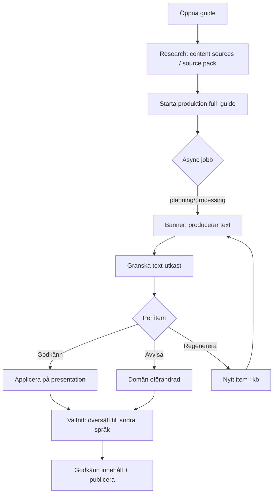

# UX-spec — Guide CMS Content Production Pipeline v2 (Fas 2)

**Status:** Godkänd design (2026-07-13) — uppdaterad kontext 2026-07-19  
**ADR:** [`docs/ai/adr/CONTENT_PRODUCTION_PIPELINE_V2.md`](../adr/CONTENT_PRODUCTION_PIPELINE_V2.md)  
**Ersätter delar av:** [`GUIDES_CONTENT_PRODUCTION_UX.md`](GUIDES_CONTENT_PRODUCTION_UX.md) (v1) — v1 förblir referens för P2/P5/P7 v1-koncept  
**Epics:** P-FRONTEND (efter P-ASYNC, P-CHAIN, P-REGEN backend)  
**Plats:** [`client/src/plugins/guides/`](../../../client/src/plugins/guides/)

> **Aktuellt produktflöde (2026-07-19):** Place-only — research → generate **one** guide text per language presentation → review (optional translate). Job type `full_guide` only; items use `presentation_id`. No stop creation, length variants (`quick`/`normal`/`deep`), or audio as current product. See [`P-GUIDES_PLACE_PRESENTATION.md`](../adr/P-GUIDES_PLACE_PRESENTATION.md) + [`P-GUIDES_CONTENT_SOURCES.md`](../adr/P-GUIDES_CONTENT_SOURCES.md). Sections below that describe stops, length variants, or audio UI are **historical**.

---

## 1. Användarflöde

### Primär persona: Redaktör

Redaktören ska kunna ta en guide från tom Place till publicerbar produkt: **research → one guide text → review** (optional translation by language). Async job + HITL kvarstår; stop/variant/audio-kedjan är borttagen från produkten.



### Flöde A / B — Ingest + stopp / narrative-HITL (**historiskt**)

Stoppskapande, length variants och krav på godkänd narrativ före Produce gäller **inte** längre. Se v1-spec och äldre stycken nedan endast som historik. Aktuell modell: [`P-GUIDES_PLACE_PRESENTATION.md`](../adr/P-GUIDES_PLACE_PRESENTATION.md).

### Flöde C — Place-level produktion (aktuellt)

1. Redaktör kör research (content sources) och klickar **Producera** (`full_guide`).
2. Jobb planerar **en** `text_derivation` per språkpresentation (`presentation_id`).
3. Banner visar fas/status (`planning` / `processing` / `awaiting_review`).
4. Redaktör granskar items med **Godkänn / Avvisa / Regenerera**.
5. Valfritt: translation-fas till andra språkpresentationer efter text-HITL.
6. Jobb `completed` → godkänn innehåll + publicera.

**Default checkpoint:** `after_text`. Audio-fas är **inte** aktuellt produktflöde.

### Flöde D — Per-item review (nytt i v2)

| Handling              | Användarens avsikt    | API                           | UI-feedback                                     |
| --------------------- | --------------------- | ----------------------------- | ----------------------------------------------- |
| **Godkänn**           | Acceptera AI-utkast   | `POST …/items/:id/approve`    | Rad → grön check; presentation `pending_review` |
| **Avvisa**            | Behåll befintlig text | `POST …/items/:id/reject`     | Rad → grå "Avvisad"; domän oförändrad           |
| **Regenerera**        | Nytt försök           | `POST …/items/:id/regenerate` | Gammal rad → "Ersatt"; ny rad med spinner       |
| **Redigera manuellt** | Skippa AI             | Öppna presentation-editor     | Stäng review-rad (ingen API)                    |

**Godkänn alla** (bulk): godkänner alla `pending_review` i aktuell fas. Kräver `ConfirmDialog` om >5 items.

**Fortsätt till nästa fas:** `POST …/approve-phase` med `{ continue: true }`. Disabled tills alla items har terminal `review_status`. Tooltip listar kvarvarande obesvarade items.

### Flöde E — Fel och återupptagning

| Jobbstatus              | Användaråtgärd                                                  |
| ----------------------- | --------------------------------------------------------------- |
| `failed`                | **Försök igen** → `POST …/retry`                                |
| `cancelled`             | Visa info; **Starta ny produktion**                             |
| Item `failed` (retries) | Visa i kö med feltext; **Regenerera** eller vänta på auto-retry |

Poll var **3s** vid `pending`, `planning`, `processing`, `awaiting_review` (samma mönster som tidigare `GuideAudioSection`).

### Flöde F — Partiell regenerering

- **Aktuellt:** Force på `full_guide`; språkfilter för translation när aktiverad.
- **Historiskt:** Per stop/variant-start och force-regenerera ljud.

---

## 2. Gränssnittsunderlag

> **Obs:** §2.1–2.3 wireframes (stopp · variant · ljud) är **historiska**. Aktuell UI: place presentation + text review (+ optional translation).

### 2.1 Pre-flight-dialog (ny) — historisk wireframe

**Trigger:** Klick på **Producera hel guide** / **Regenerera stopp**.

```
┌─ Starta produktion ──────────────────────────────┐
│ Uppskattad omfattning                             │
│ ──────────────────────────────────────────────── │
│ • 9 varianter × text                              │
│ • 6 översättningar (efter textgranskning)         │
│ • 9 ljudfiler (efter översättningsgranskning)     │
│ • 3 hoppas över (oförändrat innehåll)             │
│ ──────────────────────────────────────────────── │
│ Faser: Text → Översättning → Ljud                 │
│ Granskning: Efter text (standard)                 │
│                                                   │
│ ☐ Tvinga omkörning (ignorera cache)              │
│ Språk: [alla ▼]  eller  ☑ en  ☑ de               │
│                                                   │
│              [Avbryt]  [Starta produktion]        │
└───────────────────────────────────────────────────┘
```

| Element          | Beteende                                             |
| ---------------- | ---------------------------------------------------- |
| Uppskattning     | `GET …/production-jobs/estimate`                     |
| Tvinga omkörning | `force: true`                                        |
| Språkfilter      | `languages: ['en','de']` — endast translation/audio  |
| Starta           | Disabled om validering failar (narrative ej godkänd) |

### 2.2 Fas-banner (utökad)

**Placering:** Top of main column i `GuideView`, ovanför stops.

```
┌──────────────────────────────────────────────────────────────┐
│ ⟳ Producerar text…  Jobb #12  ·  6/9 klara  ·  [Avbryt]     │
└──────────────────────────────────────────────────────────────┘
```

**Fas-specifika texter:**

| `status` + `review_phase`             | Banner                                                  |
| ------------------------------------- | ------------------------------------------------------- |
| `pending`                             | Grå + Clock — "Produktion köad…"                        |
| `planning`                            | Blå + Loader2 — "Planerar produktion…"                  |
| `processing` + `text_derivation`      | Blå + Loader2 — "Producerar text…"                      |
| `processing` + `translation`          | Blå + Loader2 — "Översätter…"                           |
| `processing` + `audio`                | Blå + Loader2 — "Genererar ljud…"                       |
| `awaiting_review` + `text_derivation` | Amber — "Granska textutkast (4 kvar)" + länk            |
| `awaiting_review` + `translation`     | Amber — "Granska översättningar (2 kvar)"               |
| `awaiting_review` + `audio`           | Amber — "Granska ljud (1 kvar)" — preview-knapp per rad |
| `failed`                              | Röd + fel + **Försök igen**                             |
| `completed`                           | Grön, auto-dismiss 5s                                   |

**Fasindikator** (under banner, kompakt):

```
Text ● ─── Översättning ○ ─── Ljud ○
     ↑ aktiv/granskas
```

- ● = aktiv eller awaiting_review
- ✓ = fas godkänd
- ○ = ej påbörjad

### 2.3 Review-kö (utökad)

**Placering:** Expanderbar `Card` under fas-banner (inline v1; slide-over valfritt senare).

```
┌─ Granska textutkast (4) ─────────────────────────────────────┐
│ Entré · normal · sv                                              │
│ ┌ Nuvarande ──────┐  ┌ Föreslaget ─────────────────────────┐   │
│ │ (tom)           │  │ Kort introduktion till museet…      │   │
│ └─────────────────┘  └────────────────────────────────────┘   │
│ [Godkänn] [Avvisa] [Regenerera] [Redigera manuellt]            │
├─────────────────────────────────────────────────────────────────┤
│ Hall · quick · sv                              ✓ Godkänd        │
│ Café · normal · sv                             ✗ Avvisad        │
│ …                                                               │
│ [Godkänn alla (2)]     [Fortsätt till översättning →]           │
└─────────────────────────────────────────────────────────────────┘
```

| `review_status`   | Radvisning                                   |
| ----------------- | -------------------------------------------- |
| `pending_review`  | Full jämförelse + alla knappar               |
| `approved`        | Kompakt rad + grön check; knappar dolda      |
| `rejected`        | Kompakt rad + grå "Avvisad"                  |
| `superseded`      | Dold eller collapsed "Ersatt av nytt försök" |
| Item `processing` | Spinner + "Genererar om…"                    |

**Audio-fas review:** Ersätt textjämförelse med **Ljudförhandsgranskning** (samma preview-mönster som `GuideAudioSection`) + Godkänn/Avvisa/Regenerera.

**Fortsätt-knapp:**

- Label varierar: "Fortsätt till översättning →" / "Fortsätt till ljud →" / "Slutför produktion"
- **Disabled** om något item fortfarande `pending_review`
- Tooltip: "4 utkast väntar beslut"

### 2.4 `GuideProductionPanel` (sidebar, utökad)

```
┌─ Produktion ──────────────────────────────────────┐
│ [ ▶ Producera hel guide ]                        │
│ ─────────────────────────────────────────────── │
│ Fas: Text (granskning)                           │
│ Jobb #12 · 6/9 · Väntar dig                      │
│ [Visa review-kö (4)]                             │
│ [Avbryt jobb]                                    │
└──────────────────────────────────────────────────┘
```

Synkar med fas-banner; **Visa review-kö** scrollar/fokuserar review-kortet.

### 2.5 Övriga komponenter

- Content sources / research UI — aktuellt
- `GuidePresentationSection` — plats-presentation (ersätter stop/variant-sektioner)
- Place **Publicera guide** — oförändrat i princip
- **Historiskt:** `GuideStopsSection`, `GuideVariantsSection`, `GuideAudioSection` (borttagna från aktuellt produkt-UI)

### 2.6 Nya/uppdaterade komponenter

| Komponent                       | Syfte                            |
| ------------------------------- | -------------------------------- |
| `ProductionPhaseBanner.tsx`     | Fas-banner + fasindikator        |
| `GuideReviewQueue.tsx`          | Review-kö med per-item actions   |
| `GuideReviewItem.tsx`           | En review-rad (text eller audio) |
| `ProductionPreflightDialog.tsx` | Estimate + start                 |
| `ProductionPhaseIndicator.tsx`  | Text → Översättning → Ljud-steg  |
| `GuideProductionPanel.tsx`      | Sidebar (v1 design, v2 fas-fält) |
| `GuideSourceSection.tsx`        | P5 (oförändrat)                  |
| `ApprovalStatusBadge.tsx`       | P2 (oförändrat)                  |

---

## 3. Återanvändning

| Mönster                   | Källa                                  |
| ------------------------- | -------------------------------------- |
| `DetailLayout` + sidebar  | `GuideView.tsx`                        |
| Poll 3s + `Loader2`       | `GuideAudioSection.tsx`                |
| `ConfirmDialog`           | `@/core/ui/ConfirmDialog`              |
| Side-by-side jämförelse   | v1 review-wireframe                    |
| Audio preview stream      | `GuideAudioSection` previewUrl-mönster |
| `Badge`, `Button`, `Card` | `@/components/ui/*`                    |
| i18n `guides.*`           | `en.json` / `sv.json`                  |

**Nya komponenter** motiveras av fasindelad pipeline och per-item reject/regenerate — befintliga komponenter har inte fas-state eller item-level review.

---

## 4. Tillgänglighet och responsivitet

| Krav              | Implementation                                                         |
| ----------------- | ---------------------------------------------------------------------- |
| Fas-banner        | `role="status"` + `aria-live="polite"`; inkludera fasnamn i meddelande |
| Fasindikator      | `aria-label="Produktionsfaser: text pågår, översättning väntar"`       |
| Review-knappar    | Unika `aria-label`: "Godkänn textutkast för Entré, normal, svenska"    |
| Avvisa/Regenerera | `ConfirmDialog` vid bulk; enskilt avvisa utan dialog                   |
| Disabled Fortsätt | `aria-disabled` + tooltip med antal kvar                               |
| Pre-flight        | Fokus trap i dialog; `Escape` stänger                                  |
| Mobil             | Review-kö staplad; fasindikator horisontell scroll; touch ≥44px        |
| Audio review      | Preview-kontroller keyboard-accessible (samma som GuideAudioSection)   |
| Kontrast          | Amber/grön/röd via befintliga design tokens                            |

---

## 5. Teknisk genomförbarhet

Avstämd med ADR v2:

| UX-beslut                          | ADR-stöd                                                  |
| ---------------------------------- | --------------------------------------------------------- |
| Fas-banner med `review_phase`      | A2, job `review_phase`                                    |
| Stopp efter text                   | `checkpoint_mode: after_text` (TPM-låst)                  |
| Per-item approve/reject/regenerate | A3, reject API                                            |
| Fortsätt till nästa fas            | `approve-phase`                                           |
| Pre-flight estimate                | P-OBS `GET …/estimate` (kan levereras i P-REGEN med stub) |
| Async poll                         | P-ASYNC job statuses                                      |
| Audio review i kö                  | P-AUDIO-BATCH                                             |
| Manuell `GuideAudioSection` kvar   | A5                                                        |

**Implementeringsordning (Frontend):**

1. Vänta på backend **P-ASYNC + P-CHAIN + P-REGEN** (API:er för faser, review, reject/regenerate).
2. **P-FRONTEND:** `ProductionPhaseBanner`, `GuideReviewQueue`, `ProductionPreflightDialog`.
3. P2/P5-komponenter kan byggas parallellt om backend P2/P5 redan deployad.

**Öppna frågor:** Inga — reject/regenerate löst i ADR v2 (TPM-beslut).

---

## 6. Angränsande förbättringsmöjligheter

- **GuideList:** visa "Produktion pågår" / "Väntar granskning" på listkortet (`GuideListItem`; äldre namn `GuideCard` — komponenten `GuideCard` finns inte längre).
- **Notifikationer:** browser-notis när async jobb går till `awaiting_review` (ej Fas 2-scope).
- **Slide-over review-kö:** bättre för guider med 50+ items (P-OBS).
- **GuideList aggregate:** antal guides som väntar HITL (redan noterat i v1).

---

## 7. i18n-nycklar (nya/uppdaterade, prefix `guides.`)

| Nyckel                                   | SV (förslag)                   |
| ---------------------------------------- | ------------------------------ |
| `production.preflight.title`             | Starta produktion              |
| `production.preflight.estimate`          | Uppskattad omfattning          |
| `production.preflight.force`             | Tvinga omkörning               |
| `production.preflight.start`             | Starta produktion              |
| `production.phase.text`                  | Text                           |
| `production.phase.translation`           | Översättning                   |
| `production.phase.audio`                 | Ljud                           |
| `production.phase.planning`              | Planerar produktion…           |
| `production.phase.processingText`        | Producerar text…               |
| `production.phase.processingTranslation` | Översätter…                    |
| `production.phase.processingAudio`       | Genererar ljud…                |
| `production.phase.reviewText`            | Granska textutkast             |
| `production.phase.reviewTranslation`     | Granska översättningar         |
| `production.phase.reviewAudio`           | Granska ljud                   |
| `production.continueToTranslation`       | Fortsätt till översättning     |
| `production.continueToAudio`             | Fortsätt till ljud             |
| `production.finish`                      | Slutför produktion             |
| `production.reject`                      | Avvisa                         |
| `production.regenerate`                  | Regenerera                     |
| `production.rejected`                    | Avvisad                        |
| `production.superseded`                  | Ersatt                         |
| `production.pendingDecisions`            | {{count}} utkast väntar beslut |
| `production.retry`                       | Försök igen                    |
| `production.queued`                      | Produktion köad…               |

(v1-nycklar i `GUIDES_CONTENT_PRODUCTION_UX.md` §7 gäller fortfarande.)

---

## 8. Implementeringsordning (Frontend, P-FRONTEND)

**Status (2026-07-14):** MVP levererad enligt trimmat scope nedan. Full UX v2 (estimate, bulk, audio-review) återstår.

### Levererat (MVP)

1. ✅ Typer + API-klient för v2 job/items (`guidesApi`, `types/guides.ts`).
2. ✅ `ProductionPhaseBanner` + `ProductionPhaseIndicator`.
3. ✅ `GuideReviewQueue` + `GuideReviewItem` (text-fas; `reviewPhase=text_derivation` only).
4. ✅ `StartProductionDialog` (enkel start + `force`; **ej** `ProductionPreflightDialog`/estimate).
5. ✅ `GuideProductionPanel` + `ProductionJobHistory` (sidebar).
6. ✅ `useProductionJob` — 3s poll; state-sync vid terminal status.
7. ✅ Scoped start (**historiskt** stopp/variant; **aktuellt** place presentation).
8. ✅ i18n `guides.production.*` (sv/en).

### E2E-verifiering (2026-07-14)

Automatiserad checklista: `node scripts/guides-production-e2e.js` (16 PASS lokalt).

| Sektion | Verifierat                                                                       |
| ------- | -------------------------------------------------------------------------------- |
| A       | Start hel guide, aktivt jobb-guard                                               |
| B       | `awaiting_review`, banner, approve/reject/regenerate                             |
| C       | `approve-phase` → translation → `completed`; B1 (`hasActiveJob` efter completed) |
| D       | Scoped start + cancel (**historiskt** stop-scope)                                |
| F       | Jobbhistorik (≥2 jobb)                                                           |
| G       | 409 vid dubbelstart                                                              |

**Förutsättningar:** `npm run dev:all`, `npm run migrate:guides`, Puppeteer Chrome. Vid `GUIDES_PRODUCTION_WORKER_ENABLED=false` pumpas worker via `node scripts/run-production-worker-tick.js`. E2E använder **force** i start-dialogen.

### Återstår (efter MVP)

1. `ProductionPreflightDialog` / estimate (P-OBS).
2. Bulk _Godkänn alla_ i UI.
3. P2 `ApprovalStatusBadge` + publish gates.
4. `GuideSourceSection` (P5).
5. Audio-fas review (efter P-AUDIO-BATCH backend).
6. Translation-review UI (om `checkpoint_mode` ändras från default `after_text`).
