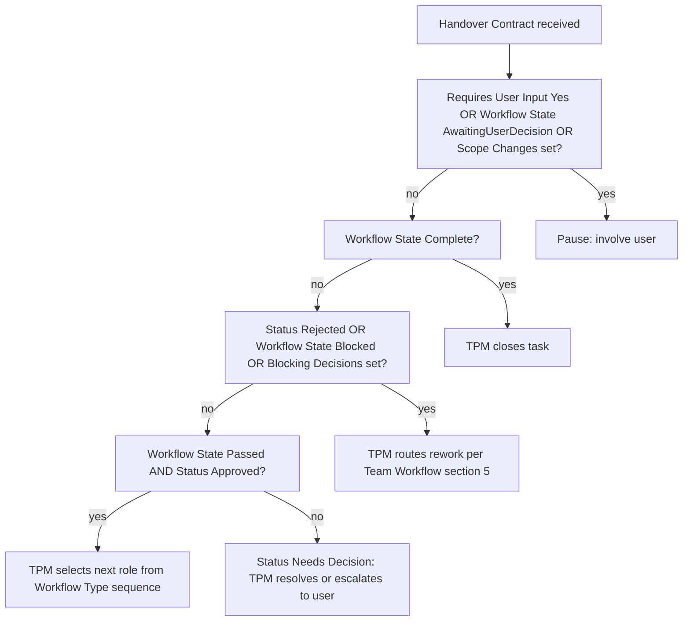

# Orchestration Model

Single source of truth for **central orchestration** of the AI Team Framework.

**Framework:** AI Team Framework v2.2 – Central Orchestration (model)  
**Handover schema:** [handover-contract.md](handover-contract.md) Version `1.0`  
**Workflow / gates:** [team-workflow.md](team-workflow.md) (unchanged Stage Gates)  
**Status:** Model defined — **no** automatic agent activation in this version

**Runtime operator:** TPM runs this policy via the [Workflow Engine](workflow-engine.md) (Framework v2.3).

This document defines how the **Technical Project Manager (TPM)** decides the next step after a role emits a Handover Contract. It does **not** change Stage Gates, role authorities, or Handover schema. It is written so that a future automated orchestrator can implement the same rules without changing roles again.

## 1. Purpose

- Make TPM the **sole orchestrator** of role sequencing.
- Keep workflow defined in **one place** (Team Workflow + this model’s Workflow Types).
- Use Handover Contract v1.0 as the machine-readable signal of _outcome_, not of _next role_.
- Involve the user only when a business decision, gate rejection requiring prioritization, scope change, or explicit release request demands it.

## 2. Principles (normative)

1. **Individual roles never choose the next role.** There is no `Next Role` in Handover Contract.
2. **Workflow is defined once** — Stage Gates in [team-workflow.md](team-workflow.md); which gates apply is fixed at Grind 1 via Workflow Type + N/A list.
3. **TPM owns all orchestration** — reads Handover + task context, announces the next role (or pause / complete).
4. **User involvement is exceptional** — see §6.
5. **No automatic agent activation** in v2.2 — TPM (or a human following this model) states the next role; Cursor does not auto-switch agents.
6. **Release Discipline** remains absolute — production actions only on explicit user release request ([team-workflow.md](team-workflow.md) §9).

## 3. Orchestrator inputs

### 3.1 From Handover Contract (required)

| Field                             | Role in orchestration                                                     |
| --------------------------------- | ------------------------------------------------------------------------- |
| `Current Role`                    | Who just finished                                                         |
| `Status`                          | Role outcome: `Approved` / `Rejected` / `Needs Decision`                  |
| `Workflow State`                  | Flow signal: `Passed` / `Blocked` / `Awaiting User Decision` / `Complete` |
| `Blocking Decisions`              | Hard stops if not `None`                                                  |
| `Requires User Input`             | `Yes` forces user path unless already resolved in `User Decision`         |
| `Scope Changes`                   | Non-`None` → pause for user / TPM scope handling                          |
| `Reason`, `Deliverables`, `Risks` | Context for TPM; not primary routing keys                                 |

### 3.2 From Grind 1 (task context — required)

| Input                       | Role in orchestration                 |
| --------------------------- | ------------------------------------- |
| **Workflow Type**           | Which supported sequence applies (§7) |
| **Involvement / N/A gates** | Which of Grind 2, 3, 5 are in scope   |
| **Definition of Done**      | Used for `Complete` checks            |

### 3.3 Explicitly not an input

- Any `Next Role` field (forbidden in Handover).
- The communicative `Överlämning:\n<roll>` line — **non-authoritative** hint only; TPM decision per this model wins if they differ.

## 4. High-level decision flow

## 5. Decision matrix (Handover → orchestrator action)

Evaluate **top to bottom**; first matching row wins.

| #   | Conditions                                                                                                                   | Orchestrator action                                                                                                             |
| --- | ---------------------------------------------------------------------------------------------------------------------------- | ------------------------------------------------------------------------------------------------------------------------------- |
| 1   | `Requires User Input = Yes` **or** `Workflow State = Awaiting User Decision`                                                 | **Pause — User.** Present question/decision; do not advance roles until answered.                                               |
| 2   | `Scope Changes` ≠ `None`                                                                                                     | **Pause — User** (or TPM re-scopes with user approval). Do not advance until scope re-locked.                                   |
| 3   | `Workflow State = Complete`                                                                                                  | **Complete.** TPM verifies DoD / remaining gates; close task and report to user.                                                |
| 4   | `Status = Rejected` **or** `Workflow State = Blocked` **or** `Blocking Decisions` ≠ `None`                                   | **Rework.** Route to the producing role (or Architect/Designer) per [team-workflow.md](team-workflow.md) §5. Do not skip gates. |
| 5   | `Status = Needs Decision` **and** decision is business/scope/release                                                         | **Pause — User.**                                                                                                               |
| 6   | `Status = Needs Decision` **and** decision is internal process (e.g. N/A confirmation already in Grind 1)                    | **TPM decides** within mandate; then re-enter matrix with updated context.                                                      |
| 7   | `Status = Approved` **and** `Workflow State = Passed` **and** `Requires User Input = No` **and** `Blocking Decisions = None` | **Continue.** Select next role = next non-N/A step in active Workflow Type (§7–§8).                                             |
| 8   | Else                                                                                                                         | **Pause — TPM.** Do not invent a path; clarify with emitting role or user.                                                      |

### 5.1 Continue vs pause (summary)

| Mode             | When         | User involved?                                             |
| ---------------- | ------------ | ---------------------------------------------------------- |
| **Continue**     | Row 7        | No — TPM announces next role                               |
| **Rework**       | Row 4        | No — unless repeated loops need prioritization (then User) |
| **Pause — User** | Rows 1, 2, 5 | Yes                                                        |
| **Complete**     | Row 3        | Informational report to user                               |
| **Pause — TPM**  | Row 8        | Only if TPM cannot resolve                                 |

“Continue” means _orchestration advances the workflow_; it does **not** mean Cursor auto-activates an agent (v2.2).

## 6. When the user must be involved

User involvement is required when **any** of the following hold:

1. A **business decision** is needed (`Needs Decision` / `Awaiting User Decision` / `Requires User Input = Yes`).
2. A **gate is rejected** and the path is not a routine rework (e.g. scope cut, drop feature, accept risk beyond TPM mandate).
3. **Scope must change** (`Scope Changes` ≠ `None`, or Grind 1 must be reopened).
4. A **release** is requested or proposed — only proceed with production actions on **explicit** user release decision (Release Discipline).

Routine approved handovers with `Workflow State = Passed` do **not** require user approval to activate the next role (TPM announces it).

## 7. Supported Workflow Types

Chosen by TPM at Grind 1. Stage Gate **definitions** stay in [team-workflow.md](team-workflow.md); types only select which gates/roles are in the path (`?` = optional / N/A per Grind 1).

| Workflow Type      | Typical sequence                                                                                                                   |
| ------------------ | ---------------------------------------------------------------------------------------------------------------------------------- |
| `FullFeature`      | TPM → Solution Architect → UI/UX? → Backend and/or Frontend → QA → Security? → Documentation → TPM                                 |
| `BackendOnly`      | TPM → Solution Architect? → Backend → QA → Security? → Documentation → TPM                                                         |
| `FrontendOnly`     | TPM → Solution Architect? → UI/UX? → Frontend → QA → Security? → Documentation → TPM                                               |
| `ArchitectureOnly` | TPM → Solution Architect → TPM                                                                                                     |
| `Framework`        | TPM → Documentation → QA → TPM                                                                                                     |
| `Bugfix`           | TPM → Backend and/or Frontend (affected) → QA → Security? → Documentation? → TPM                                                   |
| `Hotfix`           | TPM → Backend and/or Frontend → QA → TPM (Documentation/Security N/A only if Grind 1 marked N/A; Release Discipline still applies) |
| `DocsOnly`         | TPM → Documentation → QA? → TPM                                                                                                    |

Canonical role names: see [handover-contract.md](handover-contract.md) §7.

## 8. Selecting the next role on Continue

When matrix row 7 applies:

1. Load the active **Workflow Type** sequence.
2. Find `Current Role` in that sequence (the step that just completed).
3. Walk **forward** to the next role whose gate is **not** N/A for this task.
4. If Backend and Frontend are both in scope and parallel work was planned at Grind 1, TPM may activate the peer developer before QA only if Grind 1 allowed it; **QA still waits** until planned implementation handovers are done (no gate skip).
5. If no further role remains, treat as ready for TPM close (`Complete` path) once DoD items for this type are satisfied.
6. **Announce** the next role to the user (communicative). Do not rely on the previous role’s `Överlämning:` line as authority.

### 8.1 Rework targets (Blocked / Rejected)

Follow [team-workflow.md](team-workflow.md) §5:

| Emitting role (typical)   | Default rework target                                    |
| ------------------------- | -------------------------------------------------------- |
| QA rejects implementation | Backend and/or Frontend (as cited)                       |
| Security rejects          | Backend/Frontend, or Solution Architect if architectural |
| Documentation rejects     | Role that owns the undocumented behavior                 |
| Late architecture issue   | Solution Architect                                       |
| Late design issue         | UI/UX Designer                                           |

## 9. Relation to other documents

| Document                                             | Relationship                                                                  |
| ---------------------------------------------------- | ----------------------------------------------------------------------------- |
| [team-workflow.md](team-workflow.md)                 | Stage Gates, feedback loops, Release Discipline — **unchanged** by this model |
| [handover-contract.md](handover-contract.md)         | Envelope schema; routing _policy_ lives here                                  |
| [cursor-implementation.md](cursor-implementation.md) | How Cursor realizes docs; orchestration not auto-wired yet                    |
| [workflow-engine.md](workflow-engine.md)             | How TPM operates Start/Continue/Rework/Pause/Resume/Complete                  |
| [workflow-runner.md](workflow-runner.md)             | Automated operator of Engine + this model (Framework v2.4)                    |
| Role docs / `role-*.mdc`                             | Unchanged Output Contracts; TPM references this model for orchestration duty  |

## 10. Out of scope (v2.2)

- Automatic Cursor agent / rule activation.
- Changing Stage Gate table or gate owners.
- Changing role authorities or Handover Version `1.0` fields.
- Implementing an external orchestrator service.

## 11. Future automation note

Automated application of this model (via the Workflow Engine) is specified in [workflow-runner.md](workflow-runner.md) (Framework v2.4). A Runner should:

1. Parse the `handover` fenced block (Handover Version `1.0`).
2. Load task context (Workflow Type, N/A set).
3. Apply §5 matrix deterministically.
4. Emit the same announcements TPM would (next role / pause / complete).
5. Keep role activation manual unless Grind 1 explicitly changes that boundary.

No role-rule changes should be required for that step if this SSOT and Handover Contract remain stable.
