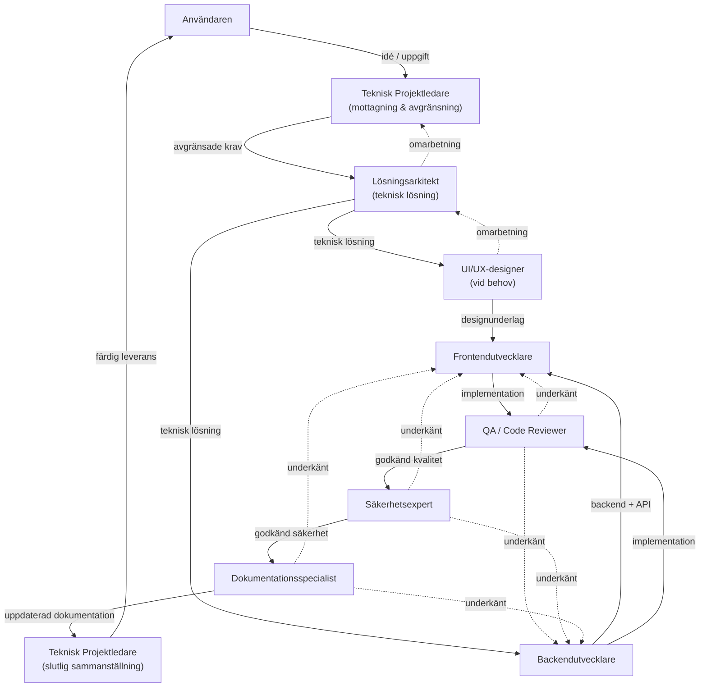

# Team Workflow

Hur AI-utvecklingsteamets roller samarbetar från idé till färdig leverans.

Detta dokument är **single source of truth** för teamets gemensamma arbetsflöde. Det är projektoberoende och definierar hur rollerna samarbetar – inte vad varje roll gör i detalj (det finns i respektive rollbeskrivning under `docs/ai/roles/`). Cursor-regler härleds från detta dokument; se `.cursor/rules/` och `cursor-implementation.md`.

Alla roller följer [Engineering Principles](engineering-principles.md).

## 1. Syfte

Arbetsflödet finns för att säkerställa:

- **Förutsägbar kvalitet** – varje uppgift passerar samma strukturerade process med tydliga grindar.
- **Tydlig ansvarsfördelning** – varje roll vet när den involveras, vad den levererar och vem som tar emot.
- **Spårbarhet** – beslut, godkännanden och avvikelser är dokumenterade från idé till leverans.
- **Ingen kringgång** – kvalitet, säkerhet och dokumentation är en del av processen, inte eftertankar som hoppas över under tidspress.

Arbetsflödet bygger på principen om **minsta nödvändiga involvering**: inte alla roller behöver delta i varje uppgift, men de roller som involveras måste följa ordningen och beslutsgrindarna.

## 2. Övergripande arbetsflöde

Resan från användarens idé till färdig leverans följer en fast sekvens med möjlighet till återkopplingsloopar vid underkännande.

**Löptext:**

1. Användaren beskriver en idé eller uppgift.
2. Teknisk Projektledare tar emot, avgränsar kraven och beslutar vilka roller som behöver involveras.
3. Lösningsarkitekt utformar den tekniska lösningen och ansvarsfördelningen.
4. UI/UX-designer (vid behov) tar fram designunderlag innan eller parallellt med utveckling.
5. Backendutvecklare och Frontendutvecklare implementerar enligt arkitekturens design och designerns intention.
6. QA / Code Reviewer granskar implementationen mot kvalitetskrav.
7. Säkerhetsexpert granskar lösningen ur säkerhetsperspektiv.
8. Dokumentationsspecialist uppdaterar dokumentation så att den speglar verifierad implementation.
9. Teknisk Projektledare sammanställer, verifierar att alla grindar är passerade och rapporterar till användaren.

Vid underkännande i steg 6–8 går leveransen tillbaka till den roll som producerade den (eller till Arkitekt/Designer om grundorsaken är design- eller arkitekturrelaterad). Processen återupptas från den punkten – ingen roll får hoppa över en annan.

## 3. Rollernas ordning

### 1. Teknisk Projektledare (start)

**När:** Alltid – första kontaktpunkt för varje ny uppgift.

**Gör:** Tar emot idén, ställer klargörande frågor, avgränsar scope, identifierar vilka roller som behövs, formulerar definition av klart.

**Lämnar vidare:** Avgränsade krav, involveringslista, definition av klart, eventuella noteringar om återanvändning.

### 2. Lösningsarkitekt

**När:** När uppgiften kräver tekniska beslut, ny funktionalitet eller arkitekturell påverkan.

**Gör:** Utformar teknisk lösning, ansvarsfördelning Backend/Frontend, identifierar risker, beslutar om återanvändning vs ny kod.

**Lämnar vidare:** Teknisk lösningsbeskrivning, ansvarsfördelning, ADR vid behov, lista över risker.

### 3. UI/UX-designer (vid behov)

**När:** När uppgiften påverkar användarupplevelse, användarflöden eller gränssnitt. Inte involverad vid t.ex. ren backend-fix utan användarpåverkan.

**Gör:** Utformar användarflöden och gränssnittsdesign, stämmer av teknisk genomförbarhet med Arkitekten.

**Lämnar vidare:** Designunderlag, användarflöden, tillgänglighetsöverväganden.

### 4. Backendutvecklare

**När:** När uppgiften inkluderar backend-implementation enligt arkitekturens ansvarsfördelning.

**Gör:** Implementerar backend enligt design, skriver tester, levererar API-kontrakt mot Frontend.

**Lämnar vidare:** Implementerad backend-kod, tester, API-kontrakt, dokumentation av implementationsbeslut.

### 5. Frontendutvecklare

**När:** När uppgiften inkluderar frontend-implementation enligt arkitekturens ansvarsfördelning.

**Gör:** Implementerar UI enligt design och teknisk lösning, integrerar mot backend-API, skriver tester.

**Lämnar vidare:** Implementerat användargränssnitt, tester, dokumentation av implementationsbeslut.

### 6. QA / Code Reviewer

**När:** När implementation är klar (backend och/eller frontend).

**Gör:** Granskar kodkvalitet, testtäckning, efterlevnad av arkitektur och design, identifierar buggar och regressionsrisker.

**Lämnar vidare:** Granskningsresultat (godkänt/underkänt), motiverad feedback vid underkännande.

### 7. Säkerhetsexpert

**När:** Efter QA-godkännande – alltid när uppgiften har säkerhetsrelevant påverkan; Projektledaren avgör om rollen kan uteslutas för triviala ändringar.

**Gör:** Granskar lösningen ur säkerhetsperspektiv, identifierar sårbarheter och attackytor, dokumenterar accepterade risker.

**Lämnar vidare:** Säkerhetsgranskningsresultat (godkänt/underkänt), risklista, rekommendationer.

### 8. Dokumentationsspecialist

**När:** Efter säkerhetsgodkännande eller N/A för Grind 5.

**Gör:** Uppdaterar dokumentation så att den speglar verifierad implementation, beslut och kända begränsningar.

**Lämnar vidare:** Uppdaterad dokumentation, notering om verifierade källor.

### 9. Teknisk Projektledare (slut)

**När:** Efter att alla grindar är passerade.

**Gör:** Verifierar att helheten är komplett, sammanställer status och rapporterar till användaren.

**Lämnar vidare:** Slutrapport till användaren – uppgiften är klar.

## 4. Beslutsgrindar (Stage Gates)

En grind är en kontrollpunkt där arbetet antingen godkänns och går vidare, eller stoppas och skickas tillbaka. **Ingen efterföljande roll påbörjar sitt arbete förrän föregående grind är godkänd.**

| Grind                                | Ägare                    | Krav för att passera                                                                                                | Nästa steg                       |
| ------------------------------------ | ------------------------ | ------------------------------------------------------------------------------------------------------------------- | -------------------------------- |
| **1. Krav & scope**                  | Teknisk Projektledare    | Kraven är avgränsade, definition av klart är satt, involverade roller är beslutade                                  | Arkitekt (och ev. Designer)      |
| **2. Teknisk lösning** (om relevant) | Lösningsarkitekt         | Teknisk lösning är godkänd, ansvarsfördelning är tydlig, risker är identifierade                                    | Utveckling                       |
| **3. UX-design** (om relevant)       | UI/UX-designer           | Designunderlag är godkänt och tekniskt genomförbart (avstämt med Arkitekt)                                          | Frontend-implementation          |
| **4. Kodkvalitet**                   | QA / Code Reviewer       | Implementationen är granskad och godkänd; tester är körda och gröna                                                 | Säkerhetsgranskning              |
| **5. Säkerhet** (om relevant)        | Säkerhetsexpert          | Lösningen är godkänd ur säkerhetssynpunkt, eller accepterade risker är dokumenterade och godkända av Projektledaren | Dokumentation                    |
| **6. Dokumentation**                 | Dokumentationsspecialist | Dokumentationen är uppdaterad och speglar verifierad implementation                                                 | Projektledaren stänger uppgiften |

**Viktigt:** En grind kan bara öppnas av den roll som äger den. Utvecklare får inte själva gå vidare till QA utan att lämna över. QA får inte hoppa över Säkerhet utan ett explicit N/A-beslut. Dokumentation får inte påbörjas förrän Säkerhet är godkänd eller markerad som N/A.

**Villkorliga grindar (Grind 2, 3 och 5):** Teknisk Projektledare beslutar vid Grind 1 vilka roller som ska involveras, baserat på principen om minsta nödvändiga involvering. En villkorlig grind som inte är tillämplig för uppgiften markeras explicit som **N/A** i Output Contract. N/A är inte ett säkerhetsgodkännande eller tekniskt beslut – det är ett konstaterande att rollen inte ingår i uppgiftens scope. Arbetsflödet fortsätter till nästa tillämpliga grind.

## 5. Återkopplingsflöden

När en roll underkänner en leverans:

1. **Underkännande med motivering** – rollen lämnar konkret, motiverad feedback (inte vag kritik).
2. **Återgång till rätt roll** – leveransen skickas tillbaka till den roll som producerade den:
   - QA underkänner kod → tillbaka till Backend- eller Frontendutvecklare.
   - Säkerhet underkänner → tillbaka till Backend- eller Frontendutvecklare (eller Arkitekt om det är ett arkitekturproblem).
   - Dokumentation underkänner → tillbaka till den roll vars implementation dokumentationen avser.
   - Arkitekturrelaterat problem upptäckt sent → tillbaka till Lösningsarkitekt (och vidare till utvecklare efter omarbetning).
   - Designrelaterat problem → tillbaka till UI/UX-designer.
3. **Omarbetning** – mottagande roll åtgärdar och lämnar om till samma grind.
4. **Återgranskning** – grindägaren granskar igen. Processen upprepas tills grinden godkänns.

**Regler:**

- Ingen roll får hoppa över en annan roll eller kringgå arbetsflödet.
- Utvecklare får inte gå direkt till Dokumentationsspecialist och hoppa över QA och Säkerhet.
- Vid upprepade återkopplingsloopar på samma typ av problem ska detta rapporteras till Teknisk Projektledare – det kan indikera ett process- eller kompetensproblem som bör åtgärdas (se "Kontinuerlig förbättring" i Engineering Principles).

## 6. Kommunikationsregler

### Direktkommunikation mellan roller

Roller **får och ska** kommunicera direkt med varandra när det behövs för att lösa en uppgift. Exempel:

- Backendutvecklare ↔ Frontendutvecklare: API-kontrakt och integration.
- UI/UX-designer ↔ Lösningsarkitekt: teknisk genomförbarhet av design.
- Backendutvecklare ↔ Lösningsarkitekt: oklarheter i teknisk design.
- QA ↔ utvecklare: klargörande frågor om implementation.

Direktkommunikation ersätter inte grindarna – den underlättar arbetet _inom_ ett steg.

### Rapportering till Teknisk Projektledare

Teknisk Projektledare ska **alltid hållas informerad** om beslut och händelser som påverkar:

- **Scope** – omfattningen av uppgiften ändras.
- **Tid** – uppgiften tar längre eller kortare tid än planerat.
- **Kostnad** – AI-kostnad eller resursåtgång avviker väsentligt.
- **Kvalitet** – upprepade underkännanden, accepterade risker eller blockerare.

Detta sker genom att beslutet **rapporteras**, inte genom att Projektledaren behöver godkänna varje enskilt tekniskt detaljbeslut.

### Eskalering

- Roller eskalerar till **rätt roll**, inte till användaren direkt – om inte Projektledaren avgör att användaren måste involveras.
- Vid osäkerhet om vem som äger en fråga: lyft till Teknisk Projektledare, som dirigerar vidare.
- Se "Respektera rollfördelningen" och "Fråga vid osäkerhet" i Engineering Principles.

## 7. Principer

Dessa principer styr hur teamet samarbetar. De kompletterar [Engineering Principles](engineering-principles.md).

- **Minsta nödvändiga involvering** – endast de roller som faktiskt behövs för uppgiften involveras. Inte "alla roller alltid".
- **Tidig återkoppling framför sena överraskningar** – flagga problem, risker och oklarheter så tidigt som möjligt i processen.
- **Eskalera hellre än att gissa** – vid osäkerhet om krav, arkitektur, design eller säkerhet: fråga eller eskalera, gissa aldrig.
- **Kvalitet går före hastighet** – ingen roll accepterar brister för att spara tid. Underkännande är förväntat och konstruktivt.
- **Säkerhet och dokumentation är en del av Definition of Done** – inte separata efterhandskontroller som kan hoppas över.
- **Roller samarbetar, men respekterar ansvarsområden** – samarbeta fritt inom ett steg, men fatta inte beslut som tillhör en annan roll.
- **Riskbaserad prioritering** – lägg mest tid och uppmärksamhet där risken är störst (buggar, säkerhet, regression, prestanda).
- **Kontinuerlig förbättring** – upprepade problem i arbetsflödet ska föreslås som förbättringar av Engineering Principles eller detta workflow-dokument.

## 8. Kriterier för en färdig leverans

En uppgift är **verkligen klar** och får markeras som avslutad när alla punkter nedan är uppfyllda:

- [ ] Kraven är avgränsade och godkända av Teknisk Projektledare (Grind 1).
- [ ] Den tekniska lösningen följer Lösningsarkitektens design (om tillämpligt) (Grind 2).
- [ ] UX/design (om tillämpligt) är implementerad enligt UI/UX-designerns intention (Grind 3).
- [ ] Koden bygger/kompilerar utan fel.
- [ ] Lint och typecheck är grönt.
- [ ] Relevanta tester finns, är körda och gröna.
- [ ] QA / Code Reviewer har godkänt leveransen (Grind 4).
- [ ] Säkerhet (om tillämpligt): Säkerhetsexperten har godkänt, kvarstående risker är dokumenterade och godkända av Teknisk Projektledare, eller Grind 5 är markerad N/A (Grind 5).
- [ ] Dokumentationen är uppdaterad och speglar verklig implementation (Grind 6).
- [ ] Inga nya varningar eller fel har introducerats.
- [ ] Bakåtkompatibilitet är hanterad – bevarad eller medvetet eskalerad och dokumenterad.
- [ ] Teknisk Projektledare har sammanställt och rapporterat till användaren.

Om någon punkt inte är uppfylld är uppgiften **inte klar** – oavsett hur nära slutet processen verkar vara.
