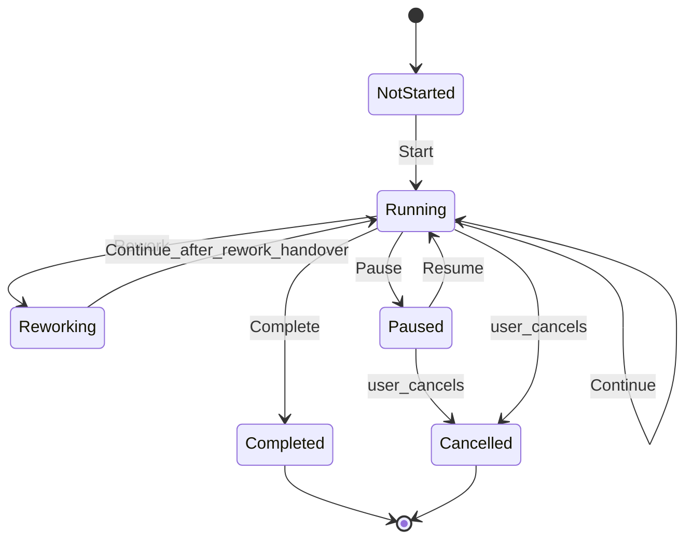

# Workflow Engine Specification

Single source of truth for the **Workflow Engine** operated by the Technical Project Manager (TPM).

**Framework:** AI Team Framework v2.3 – Workflow Engine (spec)  
**Depends on:**

- [handover-contract.md](handover-contract.md) (Handover Version `1.0`) — signal format
- [orchestration-model.md](orchestration-model.md) — _what_ happens next (decision matrix)
- [team-workflow.md](team-workflow.md) — Stage Gates (unchanged)

**Status:** Spec defined — **no** automatic agent activation, **no** Cursor/tool integration in this version

This document defines _how_ TPM runs a workflow instance end-to-end: lifecycle, commands, state handling, rework, and standardized prompts. It does **not** change Stage Gates, role authorities, or Handover schema. Future automation should implement this engine without changing specialist roles.

## 1. Purpose

- Make TPM a **central workflow engine** that can drive the AI team from Start to Complete.
- Read each Handover Contract, apply the Orchestration Model, and emit the next **role assignment** (or pause / complete).
- Keep roles **workflow-agnostic**: specialists do not know Workflow Types, engine state, or next-role logic.
- Drive development until a **real user decision** is required; then pause cleanly and resume after the decision.

## 2. Layering (normative — do not duplicate)

| Layer  | Document                                         | Responsibility                                              |
| ------ | ------------------------------------------------ | ----------------------------------------------------------- |
| Signal | [handover-contract.md](handover-contract.md)     | Envelope fields (`Status`, `Workflow State`, …)             |
| Policy | [orchestration-model.md](orchestration-model.md) | Decision matrix: Continue / Rework / Pause / Complete       |
| Engine | **This document**                                | Instance lifecycle, commands, prompts, assignment templates |
| Runner | [workflow-runner.md](workflow-runner.md)         | Automated operator of this engine (Framework v2.4)          |
| Gates  | [team-workflow.md](team-workflow.md)             | Stage Gate definitions and feedback loops                   |

**Rule:** Business/routing logic lives in Orchestration Model + Team Workflow. The engine **invokes** that policy; it must not invent alternate gate order or next-role rules. Automated execution of this engine is defined in [workflow-runner.md](workflow-runner.md) (does not change this document’s command semantics).

## 3. Principles

1. **TPM is the only orchestrator / engine operator.**
2. **Roles do not know the workflow** — they receive a scoped assignment and return Output Contract + Handover.
3. **Roles never choose the next role** — no `Next Role` in Handover.
4. **No business logic duplicated into roles** — specialists follow their role docs only.
5. **Engine drives until user pause** — routine `Passed` handovers do not require user approval to continue.
6. **No automatic agent activation** in v2.3 — TPM announces the next role; humans (or future automation) activate it.
7. **Release Discipline** unchanged — production actions only on explicit user release request.

## 4. Workflow instance

Each task/epic run is one **Workflow Instance** with durable context (logical record; may be chat notes until automation exists):

| Field          | Description                                                                        |
| -------------- | ---------------------------------------------------------------------------------- |
| `InstanceId`   | Stable id for the run                                                              |
| `WorkflowType` | Canonical type (§8)                                                                |
| `EngineState`  | `NotStarted` \| `Running` \| `Paused` \| `Reworking` \| `Completed` \| `Cancelled` |
| `ActiveRole`   | Role currently assigned (or `None`)                                                |
| `GateN/A`      | Which of Grind 2, 3, 5 are N/A                                                     |
| `DoD`          | Definition of Done from Grind 1                                                    |
| `LastHandover` | Latest Handover Contract block                                                     |
| `PauseReason`  | Set when `Paused`                                                                  |
| `ReworkTarget` | Role to re-enter when `Reworking`                                                  |

### 4.1 Engine state machine



## 5. Engine commands

| Command    | Meaning                                                                                       | Typical trigger                                       |
| ---------- | --------------------------------------------------------------------------------------------- | ----------------------------------------------------- |
| `Start`    | Create instance; lock Workflow Type, N/A, DoD; assign first specialist (or close if TPM-only) | User accepts Grind 1                                  |
| `Continue` | Apply Orchestration Model row 7; assign next non-N/A role                                     | Handover: `Approved` + `Passed`                       |
| `Rework`   | Apply row 4; assign rework target per Team Workflow §5                                        | Handover: `Rejected` / `Blocked` / blocking decisions |
| `Pause`    | Stop advancement; ask user                                                                    | User-input / scope / business decision                |
| `Resume`   | Clear pause; re-enter matrix with updated context                                             | User answered                                         |
| `Complete` | Verify DoD; close instance; report to user                                                    | Handover `Complete` or sequence exhausted + DoD met   |

## 6. Handover Workflow State → engine action

Primary mapping (always combined with full Orchestration Model §5 matrix — first matching row wins):

| Handover `Workflow State` | Default engine command | Notes                                                                                |
| ------------------------- | ---------------------- | ------------------------------------------------------------------------------------ |
| `Passed`                  | `Continue`             | Only if matrix row 7 conditions hold (`Status=Approved`, no user input, no blockers) |
| `Blocked`                 | `Rework`               | Also if `Status=Rejected` or `Blocking Decisions` ≠ `None`                           |
| `Awaiting User Decision`  | `Pause`                | Also if `Requires User Input=Yes` or scope changes                                   |
| `Complete`                | `Complete`             | After DoD / remaining-gate check                                                     |

`Status = Needs Decision` is handled by Orchestration Model rows 5–6 (Pause — User vs TPM-internal), then `Resume` or `Continue` as appropriate.

## 7. Lifecycle: Start → Complete

1. **Start** — TPM Output Contract (Grind 1) approved → `EngineState=Running` → emit first role assignment (§10).
2. Specialist delivers Output Contract + Handover.
3. TPM runs Orchestration Model matrix on `LastHandover`.
4. Branch:
   - **Continue** → next role assignment → step 2
   - **Rework** → `EngineState=Reworking` → rework assignment → step 2 → then `Running`
   - **Pause** → `EngineState=Paused` → user prompt (§10) → wait
   - **Complete** → DoD check → `EngineState=Completed` → final report
5. **Resume** (from Pause) — apply user decision to instance context → return to step 3.

The engine may loop steps 2–4 for an entire feature/epic without user contact when every handover is routine `Passed`.

## 8. Workflow Types and aliases

Canonical types are defined in [orchestration-model.md](orchestration-model.md) §7. User-facing aliases:

| User term         | Canonical `WorkflowType` | Notes                                                                     |
| ----------------- | ------------------------ | ------------------------------------------------------------------------- |
| Feature           | `FullFeature`            | Standard product feature                                                  |
| Epic              | `FullFeature`            | Same sequence; Grind 1 encodes multi-deliverable / phased DoD             |
| Bugfix            | `BugFix`                 |                                                                           |
| Framework         | `Framework`              | Framework/docs process work                                               |
| Documentation     | `DocsOnly`               |                                                                           |
| Hotfix            | `Hotfix`                 | Docs/Sec N/A only if Grind 1 marked N/A; Release Discipline still applies |
| Backend-only      | `BackendOnly`            |                                                                           |
| Frontend-only     | `FrontendOnly`           |                                                                           |
| Architecture-only | `ArchitectureOnly`       |                                                                           |

## 9. Rework and gate return

On `Rework`:

1. Set `EngineState=Reworking`, `ReworkTarget` from [orchestration-model.md](orchestration-model.md) §8.1 / [team-workflow.md](team-workflow.md) §5.
2. Emit rework assignment (§10) citing rejection reasons from Handover `Reason` / Output Contract.
3. Do **not** skip gates — after rework handover with `Passed`, `Continue` returns to the **same reviewing gate** (e.g. QA again), not past it.
4. Repeated rework loops of the same class → TPM may `Pause` for user prioritization (Orchestration Model §6).

## 10. Standardized TPM prompts

Use these templates. Fill bracketed fields. Do not ask specialists to choose the next role.

### 10.1 Start

```text
[Workflow Engine: Start]
InstanceId: <id>
WorkflowType: <canonical type>
Gate N/A: <Grind 2/3/5 or none>
Definition of Done: <bullets>
First assignment → Role: <canonical role name>
Brief: <scoped task for that role only>
Activate: @.cursor/rules/role-<slug>.mdc (manual)
```

### 10.2 Continue (next role assignment)

```text
[Workflow Engine: Continue]
InstanceId: <id>
EngineState: Running
Last Handover: Status=<...>; Workflow State=Passed; Current Role=<...>
Next assignment → Role: <canonical role name>
Inputs to use: prior Output Contract + Handover only (not full chat)
Brief: <scoped task>
Activate: @.cursor/rules/role-<slug>.mdc (manual)
```

### 10.3 Rework

```text
[Workflow Engine: Rework]
InstanceId: <id>
EngineState: Reworking
Rejected by: <Current Role from Handover>
Reason: <from Handover>
Rework target → Role: <canonical role name>
Required fixes: <from QA/Security/Docs feedback>
Return gate after fix: <same reviewing role>
Activate: @.cursor/rules/role-<slug>.mdc (manual)
```

### 10.4 Pause (user decision)

```text
[Workflow Engine: Pause]
InstanceId: <id>
EngineState: Paused
PauseReason: <business | scope | release | prioritization>
Question for user: <single clear question>
Blocked until: User Decision recorded
```

### 10.5 Resume

```text
[Workflow Engine: Resume]
InstanceId: <id>
User Decision: <summary>
EngineState: Running
Next engine command: <Continue | Rework | Complete | Pause>
```

### 10.6 Complete

```text
[Workflow Engine: Complete]
InstanceId: <id>
EngineState: Completed
WorkflowType: <...>
Gates passed / N/A: <summary>
DoD: met
Report to user: <short outcome>
Release: not started (requires explicit user request)
```

## 11. Out of scope (v2.3)

- Automatic Cursor agent / rule activation
- Integration with external orchestrators, queues, or APIs
- Changing Stage Gate tables or role authorities
- Changing Handover Version `1.0` fields
- Duplicating Orchestration Model decision rows (reference only)

## 12. Future automation note

Automated operation of this engine is specified in [workflow-runner.md](workflow-runner.md) (Framework v2.4). A Runner implementation should:

1. Persist Workflow Instance fields (§4).
2. Parse `handover` fences (Handover Version `1.0`).
3. Execute Orchestration Model §5 deterministically.
4. Emit the prompts in §10 (or equivalent structured events).
5. Keep role activation **manual** unless a later Grind 1 explicitly changes that boundary.

Specialist role rules should remain unchanged if this SSOT and Handover Contract stay stable.

## 13. Related documents

- [workflow-runner.md](workflow-runner.md) — automated engine operator (Framework v2.4)
- [orchestration-model.md](orchestration-model.md) — routing policy
- [handover-contract.md](handover-contract.md) — envelope schema
- [team-workflow.md](team-workflow.md) — Stage Gates and rework loops
- [cursor-implementation.md](cursor-implementation.md) — Cursor realization (no Runner wiring yet)
- [CHANGELOG.md](CHANGELOG.md) — Framework history
