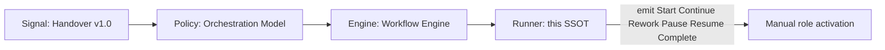
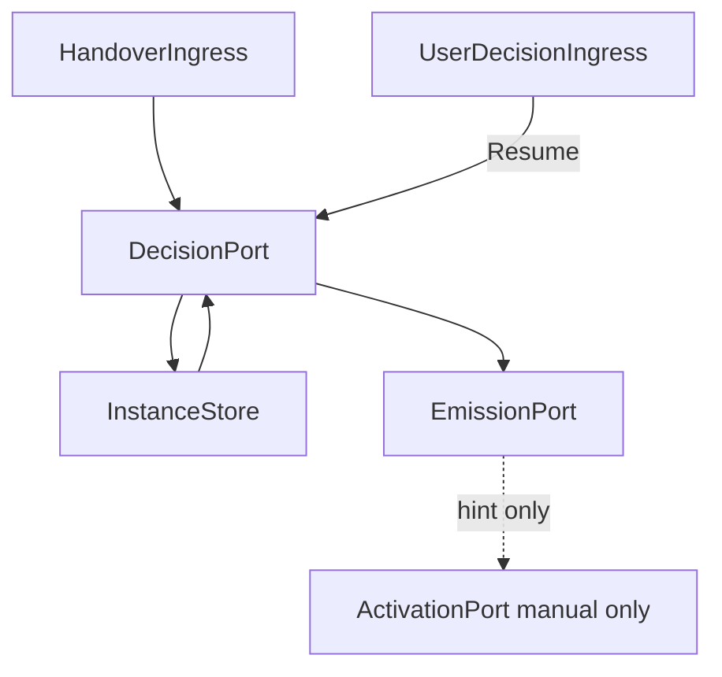

# Workflow Runner Specification

Single source of truth for the **Workflow Runner** — the automation operator of the Workflow Engine.

**Framework:** AI Team Framework v2.4 – Workflow Runner (spec)  
**Depends on (locked — do not change in this version):**

- [handover-contract.md](handover-contract.md) (Handover Version `1.0`) — signal format
- [orchestration-model.md](orchestration-model.md) — decision matrix (policy)
- [workflow-engine.md](workflow-engine.md) — lifecycle, commands, prompts (engine)
- [team-workflow.md](team-workflow.md) — Stage Gates (unchanged)

**Design ADR:** [adr/FRAMEWORK_WORKFLOW_RUNNER.md](adr/FRAMEWORK_WORKFLOW_RUNNER.md)

**Status:** Spec defined — **no** runtime implementation, **no** automatic role / Cursor agent activation in this version

This document defines _how_ the Workflow Engine can be **run automatically** (parse → decide → emit) without changing Stage Gates, role authorities, Handover schema, or the Orchestration Model. A future implementation epic must implement this Runner; it must not invent alternate routing.

## 1. Purpose

- Automate the **engine-layer loop** that TPM performs manually under [workflow-engine.md](workflow-engine.md).
- Keep routing policy in [orchestration-model.md](orchestration-model.md) and gate definitions in [team-workflow.md](team-workflow.md).
- Emit the same engine commands and assignment shapes as Engine §5 and §10.
- Stop cleanly for user decisions; resume only after a recorded User Decision.
- Leave **role activation** to a human (manual `@role` / rule activation). Runner never activates agents.

## 2. Layering (normative)

| Layer      | Document                                         | Responsibility                                                        |
| ---------- | ------------------------------------------------ | --------------------------------------------------------------------- |
| Signal     | [handover-contract.md](handover-contract.md)     | Envelope fields                                                       |
| Policy     | [orchestration-model.md](orchestration-model.md) | Decision matrix: Continue / Rework / Pause / Complete                 |
| Engine     | [workflow-engine.md](workflow-engine.md)         | Instance lifecycle, commands, prompt templates                        |
| **Runner** | **This document**                                | Persist instance, parse handover, invoke policy, emit engine commands |
| Gates      | [team-workflow.md](team-workflow.md)             | Stage Gate definitions and feedback loops                             |

**Rules:**

1. Runner **invokes** Engine + Orchestration Model; it does **not** redefine them.
2. Runner must **not** duplicate Stage Gate tables or decision-matrix rows (reference only).
3. Business/routing logic stays in Orchestration Model + Team Workflow.



## 3. Principles

1. **Determinism** — same Workflow Instance + same valid Handover → same engine command and next assignment.
2. **No alternate routing** — Orchestration Model §5, first matching row wins.
3. **No role activation** — Runner emits assignment / pause / complete only; humans activate the next role (Grind 1 D2).
4. **No schema drift** — Handover Version `1.0` fields unchanged; Stage Gates unchanged.
5. **Drive until real user pause** — routine `Approved` + `Passed` handovers Continue without user approval to _advance orchestration_ (activation still manual).
6. **Release Discipline** — production actions only on explicit user release request ([team-workflow.md](team-workflow.md) §9).
7. **Spec before runtime** — v2.4 is documentation only; implementation is a separate epic (Grind 1 D1).

## 4. Functional requirements

| ID   | Requirement                                                                                                                                                                                 |
| ---- | ------------------------------------------------------------------------------------------------------------------------------------------------------------------------------------------- |
| FR-1 | Runner SHALL create and update a Workflow Instance using the fields in [workflow-engine.md](workflow-engine.md) §4.                                                                         |
| FR-2 | Runner SHALL parse a fenced `handover` block per Handover Version `1.0` ([handover-contract.md](handover-contract.md) §5–§8). Parsing SHALL NOT rely on NLP of free-form chat.              |
| FR-3 | Runner SHALL apply [orchestration-model.md](orchestration-model.md) §5 deterministically (top to bottom; first match wins). Runner SHALL NOT add routing rules.                             |
| FR-4 | Runner SHALL map matrix outcomes to engine commands `Start` / `Continue` / `Rework` / `Pause` / `Resume` / `Complete` per [workflow-engine.md](workflow-engine.md) §5–§6.                   |
| FR-5 | Runner SHALL emit standardized output equivalent to [workflow-engine.md](workflow-engine.md) §10 (text templates or structured events with the same fields).                                |
| FR-6 | On Pause, Runner SHALL set `EngineState=Paused`, record `PauseReason`, and SHALL NOT advance until User Decision is recorded; then `Resume`.                                                |
| FR-7 | On Rework, Runner SHALL set `ReworkTarget` per Orchestration Model §8.1 / Team Workflow §5 and SHALL NOT skip the return reviewing gate ([workflow-engine.md](workflow-engine.md) §9).      |
| FR-8 | Runner SHALL NOT activate the next role (no agent/rule switch). Emission may include a manual activate hint only.                                                                           |
| FR-9 | Invalid, incomplete, or unparseable Handover SHALL NOT produce `Continue`. Runner SHALL follow Orchestration Model §5 row 8 (**Pause — TPM**) or the error behavior in §8 of this document. |

## 5. Non-functional requirements

| ID    | Requirement                                                                                                                                                                                                 |
| ----- | ----------------------------------------------------------------------------------------------------------------------------------------------------------------------------------------------------------- |
| NFR-1 | **Determinism** — identical inputs yield identical command and assignment.                                                                                                                                  |
| NFR-2 | **Duplicate handover** — if the same Handover content is presented again for an unchanged instance step, Runner SHALL be idempotent: no second advancement; may re-emit the last command for observability. |
| NFR-3 | **Auditability** — at least `InstanceId`, `LastHandover` (or hash/reference), and last emitted command MUST be reconstructable.                                                                             |
| NFR-4 | **No logic duplication** — Stage Gates and matrix rows are referenced, not copied as a second source of truth.                                                                                              |
| NFR-5 | **Compatibility** — specialist role docs, Output Contracts, and Handover `1.0` remain valid without change.                                                                                                 |
| NFR-6 | **Implementation readiness** — this SSOT plus locked dependencies MUST be sufficient for a later implementation epic without hidden assumptions about routing.                                              |

## 6. Workflow Instance (persistence)

### 6.1 Normative fields

Reuse [workflow-engine.md](workflow-engine.md) §4 exactly:

| Field          | Description                                                                        |
| -------------- | ---------------------------------------------------------------------------------- |
| `InstanceId`   | Stable id for the run                                                              |
| `WorkflowType` | Canonical type (Orchestration Model §7 / Engine §8)                                |
| `EngineState`  | `NotStarted` \| `Running` \| `Paused` \| `Reworking` \| `Completed` \| `Cancelled` |
| `ActiveRole`   | Role currently assigned (or `None`)                                                |
| `GateN/A`      | Which of Grind 2, 3, 5 are N/A                                                     |
| `DoD`          | Definition of Done from Grind 1                                                    |
| `LastHandover` | Latest Handover Contract block (or durable reference)                              |
| `PauseReason`  | Set when `Paused`                                                                  |
| `ReworkTarget` | Role to re-enter when `Reworking`                                                  |

Optional audit extensions (informative for implementers; not required to change Engine SSOT):

| Field                 | Description                                          |
| --------------------- | ---------------------------------------------------- |
| `LastCommand`         | Last emitted engine command                          |
| `LastEmissionAt`      | Timestamp of last emission                           |
| `HandoverFingerprint` | Hash of last accepted handover body (supports NFR-2) |

### 6.2 Persistence medium (non-normative)

v2.4 does **not** mandate file, database, chat notes, or API storage. Any medium is allowed if FR-1 and NFR-3 hold. Choice of medium belongs to the **implementation epic**.

## 7. Abstract ports (normative interfaces; no product binding)

Runner is described as ports so an implementation can wire them without this SSOT naming Cursor (or other) products.

| Port                    | Direction | Responsibility                                                                                                                          |
| ----------------------- | --------- | --------------------------------------------------------------------------------------------------------------------------------------- |
| **InstanceStore**       | R/W       | Load/save Workflow Instance (§6)                                                                                                        |
| **HandoverIngress**     | In        | Accept a raw `handover` fenced block (or already-parsed field map) for an `InstanceId`                                                  |
| **DecisionPort**        | Internal  | Apply Orchestration Model §5 + Engine §6 mapping; return engine command + updated instance fields                                       |
| **EmissionPort**        | Out       | Emit Engine §10-equivalent payload to the operator/user channel                                                                         |
| **UserDecisionIngress** | In        | Accept User Decision text/structured answer when `Paused`                                                                               |
| **ActivationPort**      | Out       | **Manual only in v2.4** — MUST NOT auto-invoke agents. MAY surface a human-readable activate hint (as in Engine §10 `Activate:` lines). |



## 8. Runtime algorithm (normative)

### 8.1 Start

Preconditions: Grind 1 Output Contract approved; `WorkflowType`, `GateN/A`, `DoD` locked.

1. Create instance: `EngineState=Running`, assign fields from Grind 1.
2. Select first non-N/A specialist (or TPM-only close) per Workflow Type sequence.
3. Emit Engine §10.1 (`Start`) via EmissionPort.
4. Set `ActiveRole` to that role. Do **not** auto-activate.

### 8.2 On Handover

1. Load instance from InstanceStore.
2. Reject if `EngineState` is `Completed` or `Cancelled` (emit diagnostic; no advancement).
3. Parse Handover via FR-2. On parse failure → §8.5.
4. If NFR-2 duplicate of last accepted handover → re-emit last command only; return.
5. Store as `LastHandover`.
6. Evaluate Orchestration Model §5 (FR-3).
7. Map to engine command (FR-4); update `EngineState` / `ReworkTarget` / `PauseReason` / `ActiveRole` as Engine §7–§9 require.
8. Emit corresponding §10 template (FR-5).
9. Persist instance. ActivationPort remains manual.

### 8.3 Pause / Resume

- **Pause** (matrix rows 1, 2, 5, or row 8 when TPM cannot resolve): `EngineState=Paused`; emit §10.4; wait.
- **Resume**: UserDecisionIngress records decision; clear pause; re-enter §8.2 step 6 with updated context; emit §10.5 then follow resulting command.

### 8.4 Rework

Follow Engine §9 and Orchestration Model §8.1. After a successful rework handover with `Passed`, Continue returns to the **same reviewing gate**, not past it.

### 8.5 Invalid Handover / ambiguous outcome

| Case                                                                      | Behavior                                                                                          |
| ------------------------------------------------------------------------- | ------------------------------------------------------------------------------------------------- |
| Missing required Handover fields / bad enum / wrong `Handover Version`    | Do not Continue. Emit Pause — TPM (matrix row 8) with Reason describing parse/validation failure. |
| `Status=Needs Decision` and classification business vs process is unclear | Pause — User (prefer row 5 over inventing Continue).                                              |
| Matrix row 8 (else)                                                       | Pause — TPM; do not invent a path.                                                                |

## 9. Emission contract

Emissions MUST carry at least:

- `InstanceId`
- Engine command name
- `EngineState` after the command
- For Continue / Rework / Start: canonical **Role** name ([handover-contract.md](handover-contract.md) §7)
- For Pause: question / blocking decision
- For Complete: DoD met summary; Release not started unless user explicitly requested release

Text form MAY match Engine §10 exactly. Structured JSON/YAML events with the same fields are allowed if EmissionPort consumers agree in the implementation epic.

### 9.1 DelegationPort (Pivot 1, additive)

Implementation epic [`adr/FRAMEWORK_PIVOT1_SUBAGENT_IMPL.md`](adr/FRAMEWORK_PIVOT1_SUBAGENT_IMPL.md) adds optional delegation hints on Start / Continue / Rework emissions. Runner still does **not** invoke Cursor agents.

| Field              | Example                                                         | Consumer                                                |
| ------------------ | --------------------------------------------------------------- | ------------------------------------------------------- |
| `activateHint`     | `Activate: @.cursor/rules/role-solution-architect.mdc (manual)` | User manual `@role` fallback                            |
| `delegateSubagent` | `solution-architect`                                            | TPM parent `Task(subagent_type=…)`                      |
| `delegateHint`     | `Delegate: solution-architect`                                  | Human-readable; same mapping as `ROLE_SLUGS` in runtime |

Subagent `name` in `.cursor/agents/<slug>.md` MUST equal `delegateSubagent`. TPM orchestration protocol: [cursor-implementation.md](cursor-implementation.md) § _TPM subagent orchestration_.

## 10. Out of scope (v2.4)

- Implementing Runner in Cursor (hooks, skills, rules, subagents) or any other runtime
- Automatic Cursor agent / rule activation
- Choosing a specific persistence product or external orchestrator/queue/API
- Changing Stage Gate tables or gate owners
- Changing role authorities or Output Contracts
- Changing Handover Version `1.0` fields
- Duplicating Orchestration Model decision rows as a second SSOT
- Production migration, deploy, or use of production secrets

## 11. Relation to other documents

| Document                                                             | Relationship                                                                  |
| -------------------------------------------------------------------- | ----------------------------------------------------------------------------- |
| [workflow-engine.md](workflow-engine.md)                             | Engine semantics Runner executes; v2.3 remains valid for manual TPM operation |
| [orchestration-model.md](orchestration-model.md)                     | Sole routing policy                                                           |
| [handover-contract.md](handover-contract.md)                         | Sole handover schema                                                          |
| [team-workflow.md](team-workflow.md)                                 | Stage Gates and rework loops — unchanged                                      |
| [cursor-implementation.md](cursor-implementation.md)                 | Cursor realization; TPM subagent orchestration protocol (Pivot 1)             |
| [adr/FRAMEWORK_WORKFLOW_RUNNER.md](adr/FRAMEWORK_WORKFLOW_RUNNER.md) | Architecture decisions B1–B4                                                  |
| [CHANGELOG.md](CHANGELOG.md)                                         | Framework version history                                                     |

## 12. Implementation epic (informative)

A later epic SHOULD:

1. Implement InstanceStore + ports in a chosen medium.
2. Parse `handover` fences (v1.0).
3. Execute DecisionPort against Orchestration Model §5.
4. Emit via EmissionPort (§9 / Engine §10).
5. Keep ActivationPort manual unless a **new** Grind 1 explicitly changes D2.
6. Involve Security when runtime, persistence, or tooling can affect trust boundaries.

Specialist role rules should remain unchanged if Handover Contract and this layering stay stable.

## 13. Normative example (Continue path)

1. Instance `wf-2026-07-16-01`, `WorkflowType=Framework`, `EngineState=Running`, `ActiveRole=Documentation Specialist`.
2. Ingress receives:

```handover
Status: Approved
Workflow State: Passed
Current Role: Documentation Specialist
Reason: Runner SSOT published; CHANGELOG and cross-links updated.
Blocking Decisions: None
Deliverables:
  - docs/ai/workflow-runner.md
  - CHANGELOG v2.4 entry
Risks: None
Scope Changes: None
Requires User Input: No
User Decision: N/A
Handover Version: 1.0
```

3. DecisionPort → matrix row 7 → engine command `Continue`.
4. Next role = QA / Code Reviewer (Framework sequence).
5. EmissionPort emits Engine §10.2 with that role; ActivationPort hint only.
6. Instance: `ActiveRole=QA / Code Reviewer`, `LastCommand=Continue`.
